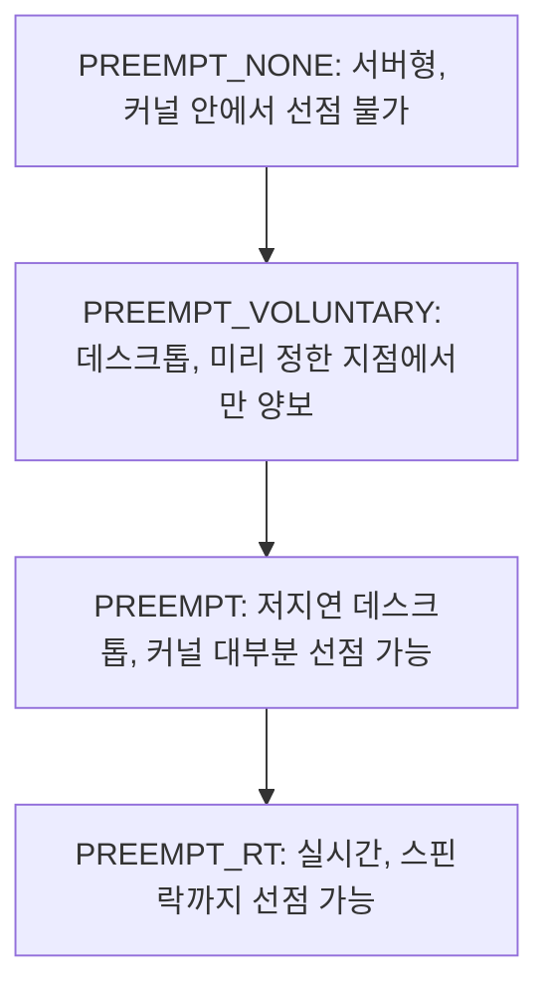
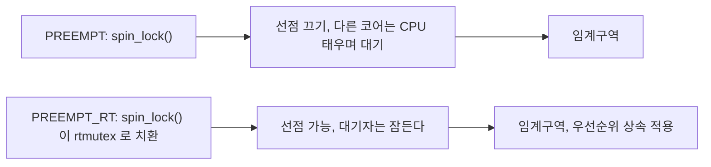
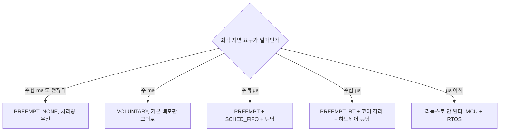

> **기준 출처:** [Linux Foundation RT Preemption models](https://wiki.linuxfoundation.org/realtime/documentation/technical_basics/preemption_models) · [Linux kernel Scheduler docs](https://www.kernel.org/doc/html/latest/scheduler/index.html) · [kernel parameters](https://docs.kernel.org/admin-guide/kernel-parameters.html) / 확인일 2026-08-07
> **시리즈:** [목차](/posts/00-rtos-series/) | 이전 → [01. 리눅스는 왜 실시간이 아닌가](/posts/01-why-linux-not-realtime/) | 다음 → [03. PREEMPT_RT가 하는 일](/posts/03-what-preempt-rt-does/)

## 1. 선점 가능에 네 단계가 있다

[01편](/posts/01-why-linux-not-realtime/)에서 커널 안에 선점 불가 구간이 있다고 했다. 그 구간을 얼마나 줄일지가 커널 빌드 옵션으로 정해진다.



| 모델 | 커널 안에서 선점 | 전형적 최악 지연 | 처리량 | 용도 |
| --- | --- | --- | --- | --- |
| `PREEMPT_NONE` | 시스템콜이 끝나야 된다 | 수십 ms | 최고 | 서버, 배치, HPC |
| `PREEMPT_VOLUNTARY` | `might_sleep()` 지점에서만 | 수 ms | 좋다 | 일반 데스크톱 배포판 |
| `PREEMPT` | 대부분의 커널 코드 | 수백 µs에서 수 ms | 조금 손해 | 저지연 데스크톱, 오디오 |
| `PREEMPT_RT` | 스핀락 구간까지 | 수십 µs | 가장 손해 | 실시간 제어 |

아래로 갈수록 최악 지연이 줄고 처리량이 떨어진다. [이론 01편](/posts/01-what-is-realtime/)에서 말한 RTOS가 처리량을 포기하고 예측 가능성을 산다는 맞바꿈이 커널 빌드 옵션 하나로 구현돼 있다.

구체적 수치는 하드웨어에 크게 좌우된다. 위 표는 순서를 보이기 위한 것이지 보증값이 아니고, 실제 값은 그 장비에서 [`cyclictest`](/posts/09-latency-measurement-cyclictest/)로 재야 한다.

## 2. 각 단계가 실제로 무엇을 하나

`PREEMPT_NONE`에서는 프로세스가 시스템 콜로 커널에 들어가면 그 시스템 콜이 끝나거나 스스로 블록할 때까지 다른 프로세스로 바뀌지 않는다.

```text
 사용자 태스크 A --[ write() 시스템콜 진입 ]------------[ 반환 ]-- 계속
 실시간 태스크 B         ^ 깨어남                        ^ 이제야 실행
                         +------ 시스템콜 전체 시간 대기 ------+
```

큰 파일 쓰기 하나가 수십 ms를 잡아먹을 수 있다. 대신 스위치가 적으니 처리량은 최고다.

`PREEMPT_VOLUNTARY`는 커널 코드 곳곳에 여기서는 양보해도 안전하다는 지점(`might_sleep()`, `cond_resched()`)을 넣어 뒀다. 긴 루프 안에 그런 지점이 있으면 거기서 스케줄러가 돈다.

```c
/* 커널 코드 안의 양보 지점, 개념 */
for (i = 0; i < huge; i++) {
    do_work(i);
    cond_resched();      /* 더 높은 태스크가 있으면 여기서 양보한다 */
}
```

한계는 명확하다. 양보 지점이 없는 긴 구간은 여전히 자르지 못하고, 어디에 지점이 있는지는 커널 개발자가 정한 것이라 응용에서 어쩔 수 없다.

`PREEMPT`는 커널 코드 자체를 선점 가능하게 만든다. 단 스핀락을 쥔 구간과 인터럽트 문맥은 여전히 선점 불가다.

```c
/* 이 구간은 PREEMPT 에서도 선점되지 않는다 */
spin_lock(&lock);
/* ... 여기 있는 동안 선점이 안 된다 ... */
spin_unlock(&lock);
```

여기가 `PREEMPT`의 천장이다. 커널에는 스핀락이 수만 개 있고 그중 어떤 것이 얼마나 오래 잡혀 있는지 아무도 보장하지 않는다. 드라이버 하나가 스핀락을 쥐고 하드웨어 응답을 폴링하면 수백 µs가 그냥 지나간다.

`PREEMPT_RT`의 발상은 단순하다. 스핀락이 문제라면 스핀락을 스핀락이 아니게 만든다.



[03편](/posts/03-what-preempt-rt-does/)에서 자세히 본다.

## 3. 커널 6.12 이후 PREEMPT_RT가 메인라인에 들어왔다

오랫동안 PREEMPT_RT는 별도 패치로 관리됐다. 원하는 커널 버전에 패치를 얹어 직접 빌드해야 했다. 커널 6.12(2024년 11월)에서 PREEMPT_RT가 메인라인 커널에 병합됐고, 이제 x86_64와 arm64 등 주요 아키텍처에서 표준 커널 설정으로 `CONFIG_PREEMPT_RT=y`를 켤 수 있다.

| 시기 | 상황 |
| --- | --- |
| 2024년 이전 | 별도 `-rt` 패치셋에 직접 빌드. 커널 버전마다 패치 존재 여부를 확인해야 했다 |
| 6.12 이후 | 메인라인에 포함. 배포판이 RT 변형을 제공하기 쉬워졌다 |

실무적으로 의미가 크다. 예전에는 커널을 올리면 RT 패치가 아직 없어서 못 올린다는 상황이 흔했다. 이제는 보안 업데이트를 따라가면서 RT를 유지하기가 훨씬 쉽다.

다만 배포판이 RT 커널 패키지를 제공하는지는 별개다. Ubuntu는 Ubuntu Pro로 RT 커널을 제공하고 Debian은 `linux-image-rt-*`를 제공한다. 배포판 문서를 확인한다.

## 4. 지금 커널이 어느 단계인지 확인

```bash
# uname
uname -v
# #1 SMP PREEMPT_RT Thu Jan 11 10:00:00 UTC 2026     <- PREEMPT_RT
# #1 SMP PREEMPT_DYNAMIC Thu ...                     <- VOLUNTARY 또는 PREEMPT, 런타임 전환 가능
# #1 SMP Thu ...                                     <- NONE

# 커널 설정 파일
grep -E "CONFIG_PREEMPT" /boot/config-$(uname -r)
# CONFIG_PREEMPT_BUILD=y
# CONFIG_PREEMPT_RT=y            <- 이것이 RT 커널의 표시
# CONFIG_PREEMPT_DYNAMIC=y

# 런타임 확인, PREEMPT_DYNAMIC 인 경우의 현재 모드
cat /sys/kernel/debug/sched/preempt
# none (voluntary) full
#       ^^^^^^^^^ 괄호가 현재 모드다
```

`PREEMPT_DYNAMIC`은 커널 5.12부터 `none`과 `voluntary`와 `full`을 재부팅 없이 전환할 수 있게 해 준다. 부팅 파라미터 `preempt=full`이나 위 debugfs 파일로 바꾼다. 단 `PREEMPT_RT`는 여기 포함되지 않고 빌드 시점에 정해진다.

## 5. 어느 단계를 고를 것인가



RT 커널을 켠다고 자동으로 실시간이 되지 않는다. PREEMPT_RT는 필요조건이지 충분조건이 아니다. 이것 말고도 `SCHED_FIFO`로 정책을 바꾸고([04편](/posts/04-posix-realtime-scheduling/)), `mlockall`로 페이지 폴트를 없애고([06편](/posts/06-lock-memory-mlockall/)), CPU 격리와 IRQ 배치를 하고([07편](/posts/07-cpu-isolation-irq-affinity/)), 전원관리와 SMI에 대응해야 한다([12편](/posts/12-what-breaks-realtime/)).

순서대로 하고 매 단계마다 `cyclictest`로 확인하는 것이 정석이다. 한꺼번에 다 바꾸면 무엇이 효과 있었는지 알 수 없다.

처리량 손해도 짚어 둔다. PREEMPT_RT는 스핀락을 뮤텍스로 바꾸므로 락 연산 하나하나가 비싸진다. 락을 자주 잡는 워크로드인 네트워크 처리나 파일시스템에서 손해가 크고 계산 위주 워크로드에서는 거의 차이가 없다.

그래서 코어를 나누는 것이 답이 된다([이론 15편](/posts/15-multicore-realtime/)). 실시간 코어에서는 RT의 이점만 취하고 처리량이 필요한 일은 다른 코어에서 돌린다. 커널은 하나지만 부담은 나뉜다.

## 정리

- 프리엠션 모델은 `NONE`, `VOLUNTARY`, `PREEMPT`, `PREEMPT_RT` 네 단계다.
- 아래로 갈수록 최악 지연이 줄고 처리량이 떨어진다. 같은 맞바꿈이 커널 옵션으로 구현돼 있다.
- `PREEMPT`의 천장은 스핀락 구간이다. 커널에 스핀락이 수만 개이고 길이를 보장하지 못한다.
- `PREEMPT_RT`는 스핀락을 잠들 수 있는 rtmutex로 치환해 그 천장을 없앤다.
- 커널 6.12부터 PREEMPT_RT가 메인라인에 병합됐다. 별도 패치가 필요 없어졌다.
- `PREEMPT_DYNAMIC`으로 앞의 셋은 재부팅 없이 전환된다. RT는 빌드 시점에 결정된다.
- RT 커널은 필요조건이지 충분조건이 아니다. 정책과 메모리와 코어 격리와 전원관리를 순서대로 하고 매번 측정한다.

## 참고

- [Linux Foundation RT — Preemption models](https://wiki.linuxfoundation.org/realtime/documentation/technical_basics/preemption_models)
- [Linux kernel — Scheduler docs](https://www.kernel.org/doc/html/latest/scheduler/index.html)
- [Linux kernel — kernel parameters](https://docs.kernel.org/admin-guide/kernel-parameters.html)