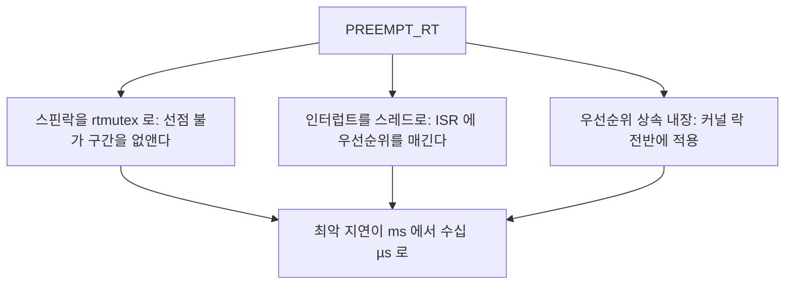
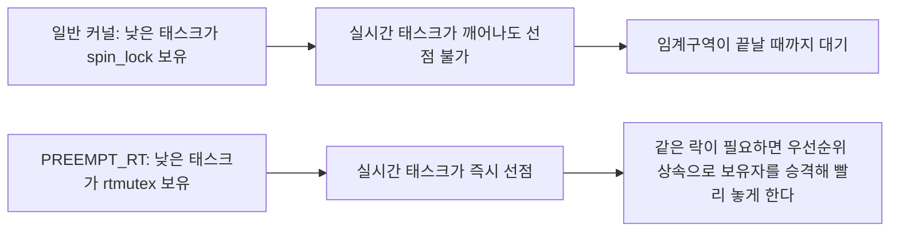
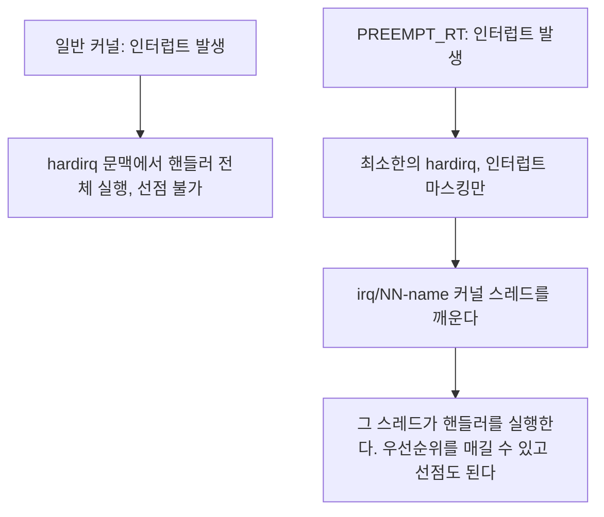
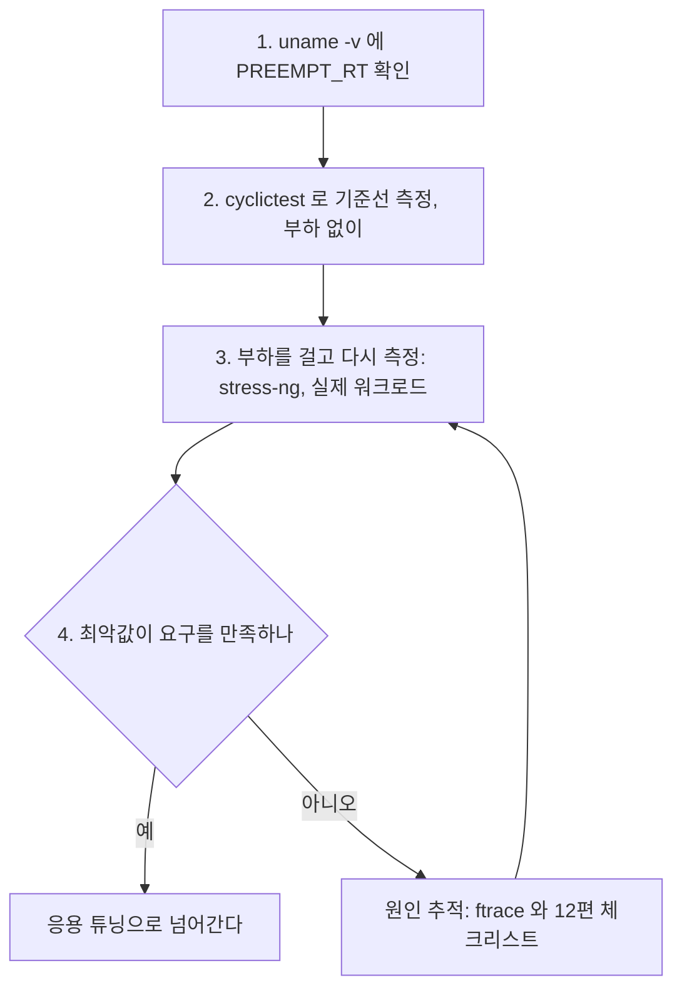

> **기준 출처:** [Linux Foundation RT Technical details](https://wiki.linuxfoundation.org/realtime/documentation/technical_details/start) · [Linux kernel Lock types and their rules](https://www.kernel.org/doc/html/latest/locking/locktypes.html) · [Generic IRQ](https://www.kernel.org/doc/html/latest/core-api/genericirq.html) / 확인일 2026-08-07
> **시리즈:** [목차](/posts/00-rtos-series/) | 이전 → [02. 커널 프리엠션 모델](/posts/02-kernel-preemption-models/) | 다음 → [04. POSIX 실시간 스케줄링 정책](/posts/04-posix-realtime-scheduling/)

## 1. 바꾸는 것은 크게 셋



## 2. 스핀락을 rtmutex로 치환

기존 스핀락의 문제는 이렇다.

```c
spin_lock(&lock);          /* 선점 끄기, 다른 코어는 CPU 태우며 대기 */
   /* ... 이 구간 동안 이 코어에서는 아무도 선점하지 못한다 ... */
spin_unlock(&lock);
```

커널에 스핀락이 수만 개 있고 각각이 얼마나 오래 잡히는지 아무도 보장하지 않으니 최악 지연을 계산할 수 없다. `PREEMPT_RT`를 켜면 대부분의 `spinlock_t`가 `rt_mutex`로 바뀐다.

| | 일반 커널의 `spinlock_t` | RT의 `spinlock_t` |
| --- | --- | --- |
| 대기 방식 | CPU를 태우며 스핀한다 | 잠든다 |
| 선점 | 불가능하다 | 가능하다 |
| 우선순위 상속 | 없다 | 적용된다 |
| 인터럽트 | 대개 끈다 | 끄지 않는다 |



[이론 09편](/posts/09-priority-inheritance-ceiling/)의 PIP가 커널 전체에 적용된 것이다. 응용에서 뮤텍스에 `PTHREAD_PRIO_INHERIT`를 켜는 것과 같은 일을 커널이 자기 락에 대해 한다.

전부 바꿀 수는 없다. 정말로 잠들면 안 되는 곳은 남는다.

| RT에서의 이름 | 언제 쓰나 | 성질 |
| --- | --- | --- |
| `raw_spinlock_t` | 스케줄러 내부, 인터럽트 진입 경로 | 진짜 스핀락이다. 여기가 남은 지연원이다 |
| `spinlock_t` | 대부분의 드라이버와 서브시스템 | rtmutex로 치환된다 |
| `local_lock_t` | per-CPU 데이터 보호 | RT에서 별도로 처리된다 |

그래서 RT 커널에서도 최악 지연이 0이 아니다. 남은 `raw_spinlock_t` 구간과 하드웨어 요인이 바닥을 만든다. 전형적으로 수십 µs 수준이고 그 값을 재는 것이 [`cyclictest`](/posts/09-latency-measurement-cyclictest/)다.

## 3. 인터럽트의 스레드화

[이론 10편](/posts/10-interrupts-and-tasks/)에서 ISR은 모든 태스크보다 높다고 했다. RT는 그 전제를 깬다.



```bash
# RT 커널에서 보이는 IRQ 스레드
ps -eo pid,cls,rtprio,comm | grep irq/
#  95 FF     50 irq/16-ehci_hcd
#  98 FF     50 irq/24-eth0
# 101 FF     50 irq/31-i2c
#         ^ SCHED_FIFO 우선순위 50, 조절할 수 있다
```

여기서 얻는 것은 인터럽트에 우선순위를 매길 수 있다는 점이다. 내 제어 태스크를 우선순위 80으로 두고 관심 없는 네트워크 IRQ 스레드를 30으로 낮추면 네트워크 폭주가 제어 루프를 막지 못한다. 이론 10편의 인터럽트 폭풍 문제가 스케줄링 문제로 바뀌고, 스케줄러가 다룰 수 있는 문제가 된다.

실무 요령은 이렇다. 내 실시간 루프가 쓰는 장치의 IRQ 스레드는 제어 태스크보다 살짝 높게 두고 나머지는 한참 낮게 둔다.

```bash
# 특정 IRQ 스레드의 우선순위 조정
chrt -f -p 85 $(pgrep -f "irq/24-eth0")   # 필드버스 NIC 은 높게
chrt -f -p 30 $(pgrep -f "irq/16-ehci")   # USB 는 낮게
```

일부 인터럽트는 스레드화되지 않는다. 타이머 인터럽트, per-CPU 인터럽트, `IRQF_NO_THREAD`로 등록된 것들은 여전히 hardirq이고 이것도 남은 지연의 일부다.

## 4. 그 밖에 바뀌는 것들

| 항목 | 일반 커널 | PREEMPT_RT |
| --- | --- | --- |
| softirq | hardirq 복귀 시 실행되고 선점 불가다 | 스레드 문맥에서 실행되고 선점 가능하다 |
| RCU | 일부 구간이 선점 불가다 | 선점 가능한 RCU를 쓴다 |
| per-CPU 데이터 | `preempt_disable()`로 보호한다 | `local_lock`으로 치환된다 |
| `printk` | 콘솔 출력 중 오래 잡는다 | 지연 출력으로 오프로드한다 |
| 메모리 할당 | 임의 문맥에서 가능하다 | atomic 문맥 제약이 더 엄격하다 |

`printk`가 실시간의 적이라는 것은 커널에서도 마찬가지다. 일반 커널에서 커널 로그를 시리얼 콘솔로 내보내면 수 ms씩 시스템이 멈춘다. RT는 이것을 지연 처리로 바꿨지만 운용 중에는 시리얼 콘솔 로깅을 끄는 것이 여전히 정석이다.

## 5. RT 커널을 얻는 법

배포판 패키지를 쓰는 쪽이 권장된다.

```bash
# Debian 과 Ubuntu 계열에서 RT 커널 패키지 검색
apt search linux-image-rt

# Debian
sudo apt install linux-image-rt-amd64

# Ubuntu, Ubuntu Pro 에서 RT 커널을 제공한다 (구독 필요)
sudo pro enable realtime-kernel
```

직접 빌드하는 경우 메인라인 병합 이후에는 별도 패치 없이 설정만 켜면 된다.

```bash
make menuconfig
#   General setup
#     -> Preemption Model
#       -> Fully Preemptible Kernel (Real-Time)     = CONFIG_PREEMPT_RT=y

# 함께 확인할 설정
#   CONFIG_HIGH_RES_TIMERS=y       고해상도 타이머, 필수
#   CONFIG_NO_HZ_FULL=y            틱리스, 코어 격리용
#   CONFIG_RCU_NOCB_CPU=y          RCU 콜백 오프로드
#   CONFIG_DEBUG_PREEMPT=n         운용 시에는 끈다, 오버헤드가 크다
#   CONFIG_LATENCYTOP=n            운용 시에는 끈다
```

디버그 옵션을 켠 채로 측정하면 안 된다. `CONFIG_DEBUG_PREEMPT`와 `CONFIG_PROVE_LOCKING`과 `CONFIG_LATENCYTOP` 등은 지연을 크게 늘린다. RT 커널인데 왜 느리냐는 질문의 흔한 원인이다. 측정과 운용은 디버그 옵션을 끈 커널로 한다.

## 6. RT 커널을 켠 뒤 확인 순서



부하 없이 잰 값은 의미가 없다. RT 커널의 가치는 부하가 걸렸을 때도 최악값이 늘어나지 않는다는 것이다. 아무것도 안 돌 때는 일반 커널도 좋은 값이 나온다. 반드시 부하를 걸고 잰다. [09편](/posts/09-latency-measurement-cyclictest/)에서 다룬다.

## 정리

- PREEMPT_RT가 바꾸는 것은 스핀락을 rtmutex로, 인터럽트를 스레드로, 우선순위 상속을 내장으로 셋이다.
- 첫째가 중심이다. 대부분의 `spinlock_t`가 잠들 수 있는 락이 되어 선점 불가 구간이 사라진다.
- `raw_spinlock_t`는 남는다. 스케줄러 내부 등이고 이것이 RT 커널의 최악 지연 바닥을 만든다.
- 인터럽트가 `irq/NN-name` 커널 스레드가 되어 우선순위를 매기고 선점할 수 있다.
- 실무에서는 내 장치 IRQ를 높게 나머지를 낮게 둔다. 인터럽트 폭풍이 스케줄링 문제로 바뀐다.
- 타이머 등 일부 IRQ는 스레드화되지 않는다.
- `printk`와 softirq와 RCU도 손봤다. 운용 중 시리얼 콘솔 로깅은 끈다.
- 커널 6.12 이후 설정만 켜면 된다.
- 디버그 옵션을 끈 커널로 측정한다. `DEBUG_PREEMPT`와 `PROVE_LOCKING`은 지연을 크게 늘린다.
- 측정은 반드시 부하를 걸고 한다. 무부하 값은 아무것도 증명하지 않는다.

## 참고

- [Linux Foundation RT — Technical details](https://wiki.linuxfoundation.org/realtime/documentation/technical_details/start)
- [Linux kernel — Lock types and their rules](https://www.kernel.org/doc/html/latest/locking/locktypes.html)
- [Linux kernel — Generic IRQ](https://www.kernel.org/doc/html/latest/core-api/genericirq.html)