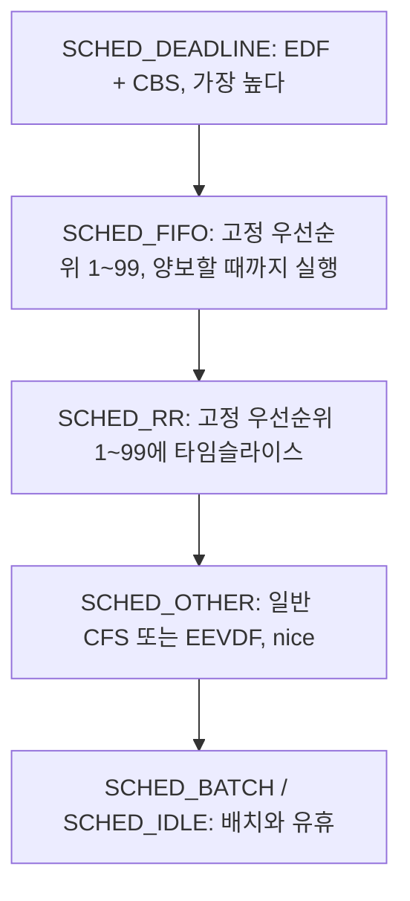
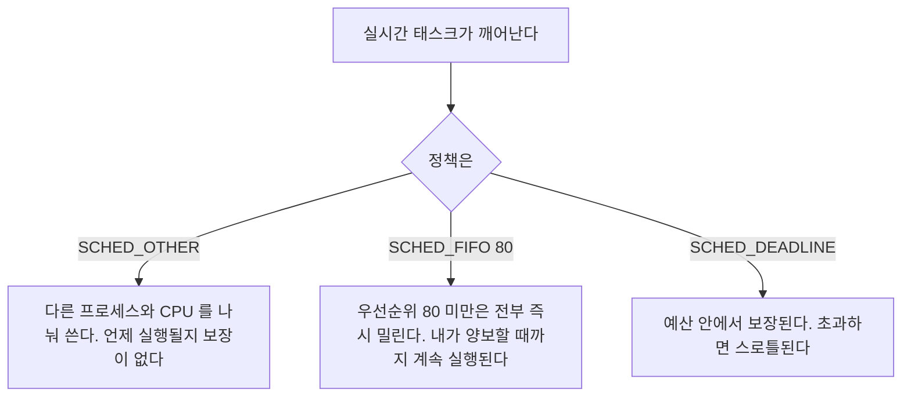

> **기준 출처:** [man 7 sched](https://man7.org/linux/man-pages/man7/sched.7.html) · [man 1 chrt](https://man7.org/linux/man-pages/man1/chrt.1.html) · [man 3 pthread_setschedparam](https://man7.org/linux/man-pages/man3/pthread_setschedparam.3.html) · [Linux kernel SCHED_DEADLINE](https://www.kernel.org/doc/html/latest/scheduler/sched-deadline.html) / 확인일 2026-08-07
> **시리즈:** [목차](/posts/00-rtos-series/) | 이전 → [03. PREEMPT_RT가 하는 일](/posts/03-what-preempt-rt-does/) | 다음 → [05. 우선순위 설계와 권한](/posts/05-priority-design-permissions/)

## 1. 정책 다섯 가지



| 정책 | 우선순위 | 성질 | 언제 쓰나 |
| --- | --- | --- | --- |
| `SCHED_DEADLINE` | T, D, C로 지정한다 | EDF에 예산 강제 | 격리된 주기 태스크 하나 |
| `SCHED_FIFO` | 1 ~ 99 | 같은 순위끼리 먼저 온 게 끝까지 | 제어 루프의 표준 |
| `SCHED_RR` | 1 ~ 99 | 같은 순위끼리 타임슬라이스로 번갈아 | 같은 순위 여럿을 공평하게 |
| `SCHED_OTHER` | 0, nice -20~+19 | 공평 분배 | 일반 프로세스 |
| `SCHED_IDLE` | 0 | 아무도 안 쓸 때만 | 백그라운드 정리 작업 |

제어 루프에는 `SCHED_FIFO`를 쓴다. `SCHED_RR`은 같은 우선순위 태스크끼리 타임슬라이스마다 컨텍스트 스위치를 만들고 그만큼 지터가 생긴다([이론 04편](/posts/04-scheduling-preemption-priority/)). 실시간 루프는 시작했으면 끝까지 도는 쪽이 맞다.

## 2. 명령줄로

```bash
# 새 프로그램을 SCHED_FIFO 우선순위 80 으로 실행
sudo chrt -f 80 ./control_app

# 이미 도는 프로세스의 정책 변경
sudo chrt -f -p 80 1234

# 현재 정책 조회
chrt -p 1234
# pid 1234's current scheduling policy: SCHED_FIFO
# pid 1234's current scheduling priority: 80

# 정책별 우선순위 범위 확인
chrt -m
# SCHED_OTHER min/max priority : 0/0
# SCHED_FIFO  min/max priority : 1/99
# SCHED_RR    min/max priority : 1/99
```

| 옵션 | 정책 |
| --- | --- |
| `-f` | `SCHED_FIFO` |
| `-r` | `SCHED_RR` |
| `-o` | `SCHED_OTHER` |
| `-d` | `SCHED_DEADLINE` |
| `-i` | `SCHED_IDLE` |

전체 태스크의 정책은 한 번에 볼 수 있다.

```bash
ps -eo pid,cls,rtprio,ni,pri,comm --sort=-rtprio | head -20
#   PID CLS RTPRIO  NI PRI COMMAND
#    12 FF      99   - 139 migration/0      <- 커널 스레드, 건드리지 않는다
#  2431 FF      80   - 120 control_app      <- 내 실시간 태스크
#   955 FF      50   -  90 irq/24-eth0      <- IRQ 스레드, RT 커널
#     1 TS       -   0  19 systemd
```

`CLS` 열은 `FF`가 `SCHED_FIFO`, `RR`이 `SCHED_RR`, `TS`가 `SCHED_OTHER`, `DLN`이 `SCHED_DEADLINE`, `IDL`이 `SCHED_IDLE`을 뜻한다.

## 3. 코드에서는 스레드 단위로 설정한다

프로세스 전체가 아니라 스레드마다 정책을 다르게 준다. 제어 스레드만 `SCHED_FIFO`로 올리고 로깅 스레드는 `SCHED_OTHER`로 둔다.

```c
#define _GNU_SOURCE
#include <pthread.h>
#include <sched.h>
#include <string.h>
#include <errno.h>

/* 방법 A, 스레드를 만들 때 속성으로 지정한다 (권장) */
int spawn_rt_thread(pthread_t *tid, void *(*fn)(void *), void *arg, int prio)
{
    pthread_attr_t attr;
    struct sched_param sp = { .sched_priority = prio };

    pthread_attr_init(&attr);
    pthread_attr_setinheritsched(&attr, PTHREAD_EXPLICIT_SCHED);  /* 필수 */
    pthread_attr_setschedpolicy(&attr, SCHED_FIFO);
    pthread_attr_setschedparam(&attr, &sp);
    pthread_attr_setstacksize(&attr, 512 * 1024);                 /* 스택도 여기서 */

    int rc = pthread_create(tid, &attr, fn, arg);
    pthread_attr_destroy(&attr);
    return rc;
}

/* 방법 B, 이미 도는 스레드의 정책 변경 */
void make_me_rt(int prio)
{
    struct sched_param sp = { .sched_priority = prio };
    if (pthread_setschedparam(pthread_self(), SCHED_FIFO, &sp) != 0) {
        /* 실패를 반드시 확인한다. 권한이 없으면 조용히 일반 태스크로 남는다 */
        fprintf(stderr, "SCHED_FIFO 설정 실패: %s\n", strerror(errno));
        exit(1);
    }
}
```

`PTHREAD_EXPLICIT_SCHED`를 빼먹는 것이 가장 흔한 실수다. 기본값은 `PTHREAD_INHERIT_SCHED`이고, 이 경우 속성에 적어 둔 정책이 무시되고 부모 스레드의 정책을 그대로 물려받는다. 에러도 나지 않는다. 설정한 줄 알았는데 일반 태스크로 도는 상태가 된다.

그래서 설정 후 확인한다.

```c
int pol; struct sched_param sp;
pthread_getschedparam(pthread_self(), &pol, &sp);
printf("policy=%d prio=%d\n", pol, sp.sched_priority);   /* SCHED_FIFO=1 */
```

## 4. SCHED_DEADLINE은 예산까지 지정한다

[이론 06편](/posts/06-edf-dynamic-priority/)에서 본 EDF와 CBS다. glibc 래퍼가 없어서 `syscall`을 직접 부른다.

```c
#include <linux/sched.h>
#include <linux/sched/types.h>
#include <sys/syscall.h>
#include <unistd.h>

static int sched_setattr_(pid_t pid, struct sched_attr *a, unsigned int flags) {
    return syscall(__NR_sched_setattr, pid, a, flags);
}

void become_deadline_task(void)
{
    struct sched_attr attr = {
        .size           = sizeof(attr),
        .sched_policy   = SCHED_DEADLINE,
        .sched_runtime  =  300 * 1000,   /* C = 300 us, 이 안에 끝내야 한다 */
        .sched_deadline = 1000 * 1000,   /* D = 1 ms */
        .sched_period   = 1000 * 1000,   /* T = 1 ms */
    };
    if (sched_setattr_(0, &attr, 0) < 0)
        perror("sched_setattr");         /* U 합이 1 을 넘으면 EBUSY */
}

/* 주기 대기는 sched_yield() 로 한다. 다음 주기까지 잠든다 */
while (1) {
    do_control();
    sched_yield();      /* SCHED_DEADLINE 에서는 이번 주기 끝을 뜻한다 */
}
```

| `SCHED_FIFO` 대비 장점 | 단점 |
| --- | --- |
| 커널이 입학 제어를 해서 과부하 자체를 거부한다 | glibc 래퍼가 없어 손이 많이 간다 |
| 예산 초과가 격리돼 하나가 폭주해도 나머지가 보장된다 | `fork`가 금지되는 등 제약이 있다 |
| 우선순위 숫자를 고민할 필요가 없다 | 도구와 문서와 사례가 적다 |

격리된 코어에서 도는 주기 태스크 하나를 확실히 보장하고 싶을 때 좋다. 반대로 여러 태스크가 서로 얽혀 있고 우선순위 관계를 직접 설계해야 한다면 `SCHED_FIFO`가 다루기 쉽다. 실무의 기본값은 여전히 `SCHED_FIFO`다.

## 5. 정책이 태스크에 미치는 영향



`SCHED_FIFO` 태스크가 무한루프에 빠지면 시스템이 멈춘다. 낮은 우선순위 태스크가 영원히 실행되지 못하기 때문이고 셸조차 뜨지 않는다. 이것은 버그가 아니라 설계상 정상 동작이다. 방어 장치가 [05편](/posts/05-priority-design-permissions/)의 RT throttling이다.

## 정리

- 실시간 정책은 `SCHED_DEADLINE`, `SCHED_FIFO`와 `SCHED_RR`, `SCHED_OTHER` 순으로 절대적이다.
- 제어 루프의 표준은 `SCHED_FIFO`다. `SCHED_RR`은 불필요한 스위치를 만든다.
- 명령줄은 `chrt -f 80 ./app`, 조회는 `chrt -p PID`, 전체는 `ps -eo pid,cls,rtprio,comm`이다.
- 코드에서는 스레드 단위로 설정한다. 제어 스레드만 올리고 로깅은 그대로 둔다.
- `PTHREAD_EXPLICIT_SCHED`를 빼먹으면 설정이 조용히 무시된다. 설정 후 `pthread_getschedparam`으로 확인한다.
- `SCHED_DEADLINE`은 입학 제어와 예산 격리가 강점이다. 격리된 주기 태스크 하나에 좋다.
- `SCHED_FIFO` 태스크의 무한루프는 시스템을 멈춘다. 정상 동작이고 방어는 05편에서 다룬다.

## 참고

- [man 7 sched](https://man7.org/linux/man-pages/man7/sched.7.html)
- [man 1 chrt](https://man7.org/linux/man-pages/man1/chrt.1.html)
- [man 3 pthread_setschedparam](https://man7.org/linux/man-pages/man3/pthread_setschedparam.3.html)
- [Linux kernel — SCHED_DEADLINE](https://www.kernel.org/doc/html/latest/scheduler/sched-deadline.html)