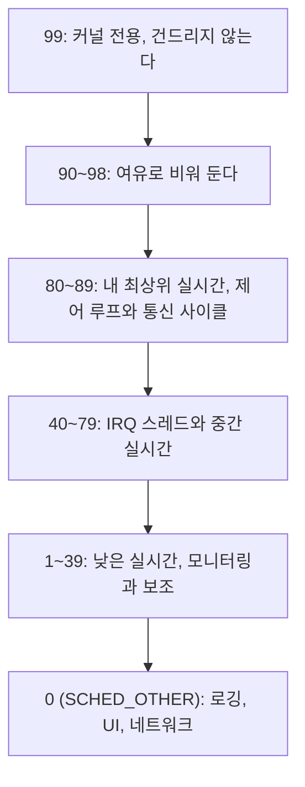
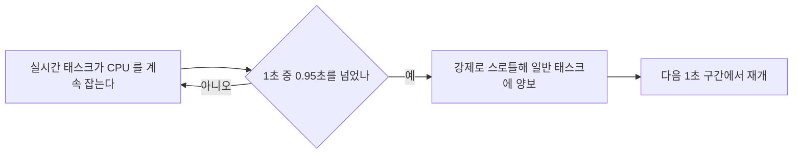
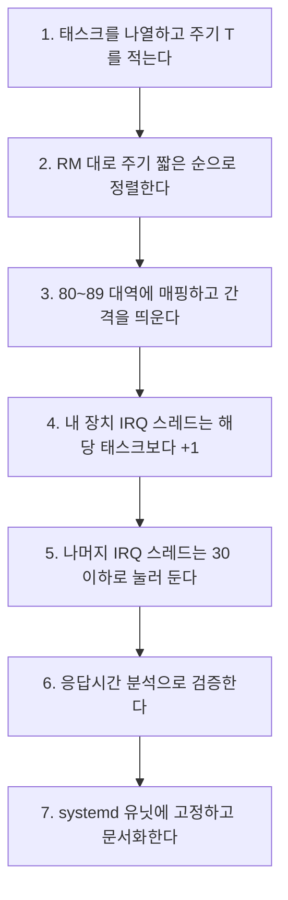

> **기준 출처:** [man 7 sched](https://man7.org/linux/man-pages/man7/sched.7.html) (RT throttling) · [man 5 limits.conf](https://man7.org/linux/man-pages/man5/limits.conf.5.html) · [man 7 capabilities](https://man7.org/linux/man-pages/man7/capabilities.7.html) · [Linux kernel Real-Time group scheduling](https://docs.kernel.org/scheduler/sched-rt-group.html) / 확인일 2026-08-07
> **시리즈:** [목차](/posts/00-rtos-series/) | 이전 → [04. POSIX 실시간 스케줄링 정책](/posts/04-posix-realtime-scheduling/) | 다음 → [06. 메모리 잠그기](/posts/06-lock-memory-mlockall/)

## 1. 우선순위 99를 쓰지 않는다

리눅스 `SCHED_FIFO` 범위는 1에서 99이고 99가 가장 높다. 그런데 실무에서 99를 쓰면 안 된다. 거기에 커널 스레드가 이미 있다.

```bash
ps -eo pid,cls,rtprio,comm --sort=-rtprio | head
#  PID CLS RTPRIO COMMAND
#   12 FF      99 migration/0     <- 커널 스레드가 이미 여기 있다
#   14 FF      99 migration/1
#   11 FF      99 watchdog/0      <- 이걸 막으면 시스템이 죽는다
```

| 커널 스레드 | 하는 일 | 막으면 |
| --- | --- | --- |
| `migration/N` | 코어 간 태스크 이동 | 스케줄러가 제대로 동작하지 않는다 |
| `watchdog/N` | 커널 락업 감지 | 하드락업을 감지하지 못한다 |
| `rcu*` | RCU 처리 | 메모리 회수가 지연된다 |

내 태스크를 99로 두고 CPU를 놓지 않으면 이 커널 스레드들이 굶어서 시스템 전체가 이상해진다. 최악의 경우 SSH도 붙지 않고 재부팅밖에 답이 없다.



실무 관례는 80을 기준점으로 삼는 것이다. 대부분의 산업용 실시간 리눅스 예제와 필드버스 마스터 문서가 이 근처를 쓴다. 그리고 [RM 원칙](/posts/05-rate-monotonic-utilization-bound/)대로 주기가 짧은 태스크에 큰 숫자를 준다.

로봇 컨트롤러를 예로 배정하면 이렇게 된다.

| 태스크 | 주기 | 정책 | 우선순위 | 근거 |
| --- | --- | --- | --- | --- |
| 필드버스 사이클 | 1 ms | `SCHED_FIFO` | 85 | 가장 짧은 주기 (RM) |
| 필드버스 NIC IRQ 스레드 | 이벤트 | `SCHED_FIFO` | 86 | 사이클 태스크를 깨우므로 살짝 높게 |
| 제어 연산 | 1 ms | `SCHED_FIFO` | 84 | 사이클 다음 |
| 궤적 보간 | 4 ms | `SCHED_FIFO` | 70 | 주기가 길다 |
| 상태 감시 | 20 ms | `SCHED_FIFO` | 50 | |
| 그 외 IRQ 스레드 | | `SCHED_FIFO` | 30 | 실시간 태스크보다 낮게 눌러 둔다 |
| 로깅과 통신 보고 | | `SCHED_OTHER` | 0 | 실시간이 아니다 |

마지막 두 번째 줄이 실질적인 조치다. RT 커널이 인터럽트를 스레드로 만들어 준 덕분에([03편](/posts/03-what-preempt-rt-does/)) 그 외 IRQ 스레드를 30으로 눌러 둘 수 있다. 이러면 USB를 꽂거나 네트워크가 폭주해도 제어 루프가 밀리지 않는다.

## 2. RT throttling, 폭주 방어

`SCHED_FIFO` 태스크가 무한루프에 빠지면 시스템이 멈춘다([04편](/posts/04-posix-realtime-scheduling/)). 리눅스는 기본 방어를 하나 켜 둔다.

```bash
cat /proc/sys/kernel/sched_rt_period_us     # 1000000  (1 초)
cat /proc/sys/kernel/sched_rt_runtime_us    #  950000  (0.95 초)
```

1초 중 최대 0.95초만 실시간 태스크가 쓸 수 있다는 뜻이다. 나머지 0.05초는 강제로 일반 태스크에 준다. 그래서 실시간 태스크가 폭주해도 셸을 띄워 죽일 수 있다.



그런데 이것이 제어 루프를 방해할 수 있다. 정상적인 제어 루프도 5% 스로틀에 걸릴 수 있고, 걸리면 최대 50 ms 동안 실시간 태스크가 돌지 않는다. 1 kHz 루프라면 50 스텝을 통째로 놓친다.

| 대응 | 방법 | 위험 |
| --- | --- | --- |
| 격리된 코어에서 돌린다 | `isolcpus`로 뺀 코어는 throttling 영향이 다르다. [07편](/posts/07-cpu-isolation-irq-affinity/) | 낮다 |
| CPU 사용률을 낮춘다 | 애초에 95%를 안 쓰면 걸리지 않는다. [여유 20~30% 원칙](/posts/13-wcet-execution-budget/) | 없다 |
| throttling 완화 | `sched_rt_runtime_us`를 990000 등으로 올린다 | 폭주 시 복구 여지가 줄어든다 |
| 끈다 | `echo -1 > /proc/sys/kernel/sched_rt_runtime_us` | 폭주하면 재부팅밖에 없다 |

개발 중에는 끄지 않는다. 실시간 태스크 버그로 시스템이 완전히 멈추면 디버깅 자체가 불가능하다. 끄는 것은 검증이 끝난 운용 단계의 선택이고 그때도 워치독을 함께 둔다.

## 3. 권한

`SCHED_FIFO`로 올리려면 특권이 필요하고 방법이 셋이다.

첫째는 `limits.conf`로 사용자나 그룹에 권한을 부여하는 것이다.

```bash
# /etc/security/limits.d/99-realtime.conf
@realtime   -   rtprio      95        # SCHED_FIFO 우선순위 95 까지 허용
@realtime   -   memlock     unlimited # mlockall 허용
@realtime   -   nice        -20

# 사용자를 그룹에 넣는다
sudo groupadd -f realtime
sudo usermod -aG realtime $USER
# 다시 로그인해야 적용된다. PAM 이 로그인 시점에 읽는다

# 확인
ulimit -r        # 95
ulimit -l        # unlimited
```

`ulimit -r`이 0이면 `SCHED_FIFO` 설정이 `EPERM`으로 실패한다. 코드는 맞는데 우선순위가 안 올라간다는 현상의 가장 흔한 원인이다. 그리고 재로그인 전에는 반영되지 않는다. `su - $USER`로도 안 되는 경우가 있으니 완전히 로그아웃한다.

둘째는 실행 파일에 capability를 부여하는 것이다.

```bash
sudo setcap cap_sys_nice,cap_ipc_lock=eip ./control_app
getcap ./control_app
# ./control_app cap_ipc_lock,cap_sys_nice=eip
```

| capability | 무엇을 허용하나 |
| --- | --- |
| `CAP_SYS_NICE` | 실시간 정책과 우선순위 설정 |
| `CAP_IPC_LOCK` | `mlockall` |

`sudo`로 전체 root 권한을 주는 것보다 capability가 낫다. 필요한 것만 준다. 다만 파일을 복사하거나 다시 빌드하면 capability가 사라지므로 배포 스크립트에 넣어 둬야 한다.

셋째는 systemd 서비스로 실행하는 것이다.

```ini
# /etc/systemd/system/control.service
[Service]
ExecStart=/opt/robot/control_app
CPUSchedulingPolicy=fifo
CPUSchedulingPriority=85
LimitRTPRIO=95
LimitMEMLOCK=infinity
AmbientCapabilities=CAP_SYS_NICE CAP_IPC_LOCK
CPUAffinity=3
IOSchedulingClass=realtime
Nice=-20
```

운용 환경에서는 이 방식이 가장 낫다. 권한과 affinity와 우선순위가 한 파일에 문서화되고 재부팅해도 그대로 적용된다. 사람이 `chrt`를 손으로 치는 것보다 재현성이 높다.

## 4. 우선순위 설계 체크리스트



3단계에서 간격을 띄우는 이유가 있다. 나중에 태스크가 추가된다. 85, 84, 83처럼 붙여 두면 사이에 넣을 자리가 없어 전부 다시 매겨야 한다. 85, 80, 70, 50처럼 띄워 둔다.

| 흔한 실수 | 결과 |
| --- | --- |
| 99 사용 | 커널 스레드가 굶어 시스템이 이상해진다 |
| `ulimit -r` 미설정 | `EPERM`으로 조용히 일반 태스크로 동작한다 |
| 중요도 순으로 배정 | 급한 태스크가 밀린다. [RM 원칙](/posts/05-rate-monotonic-utilization-bound/) 위반이다 |
| IRQ 스레드 방치 | 네트워크와 USB 이벤트가 제어를 방해한다 |
| 우선순위를 붙여서 배정 | 나중에 태스크 추가 시 전면 재배정이 필요하다 |
| throttling을 무조건 끔 | 폭주 시 복구가 불가능하다 |

## 정리

- 우선순위 99를 쓰지 않는다. `migration/N`과 `watchdog/N` 같은 커널 스레드가 거기 있다.
- 권장 대역은 80에서 89가 내 최상위 실시간, 50에서 79가 중간과 IRQ, 0이 비실시간이다.
- RM 원칙대로 주기 짧은 순으로 배정하고 나중에 끼워 넣을 수 있게 간격을 띄운다.
- 내 장치 IRQ 스레드는 하나 올리고 나머지 IRQ는 30 이하로 눌러 둔다.
- RT throttling은 1초 중 0.95초 제한이다. 폭주 방어 장치이면서 정상 루프도 걸릴 수 있는 함정이다.
- 개발 중에는 끄지 않는다. 대신 CPU 여유를 남기고 코어를 격리한다.
- 권한은 `limits.conf`의 `rtprio`, capability의 `CAP_SYS_NICE`, systemd 유닛 셋이다.
- `ulimit -r`이 0이면 조용히 실패하고 재로그인해야 반영된다.
- 운용은 systemd 유닛에 고정한다. 권한과 affinity와 우선순위가 한 파일에 문서화된다.

## 참고

- [man 7 sched](https://man7.org/linux/man-pages/man7/sched.7.html)
- [man 5 limits.conf](https://man7.org/linux/man-pages/man5/limits.conf.5.html)
- [man 7 capabilities](https://man7.org/linux/man-pages/man7/capabilities.7.html)
- [Linux kernel — Real-Time group scheduling](https://docs.kernel.org/scheduler/sched-rt-group.html)