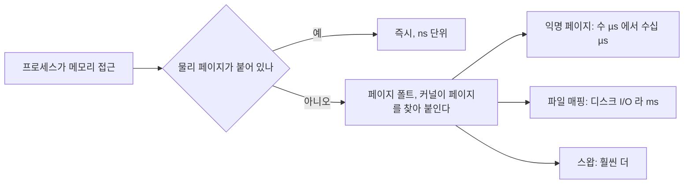
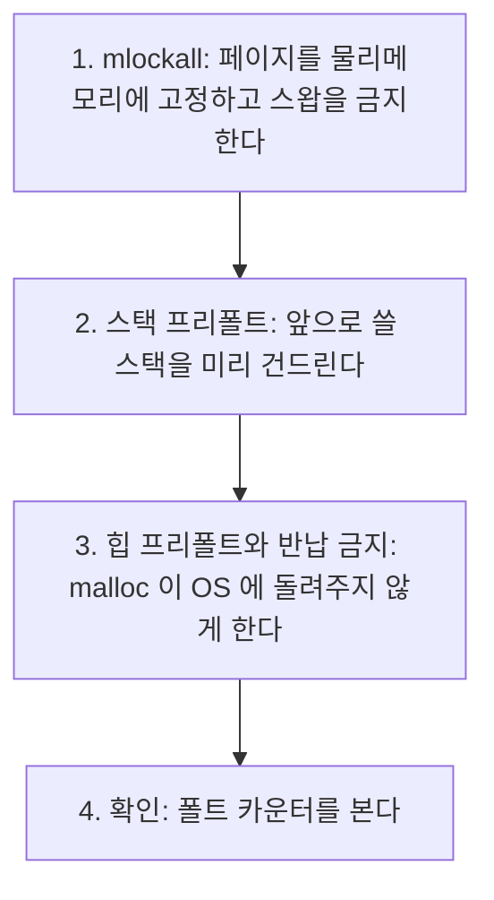

> **기준 출처:** [man 2 mlock, mlockall](https://man7.org/linux/man-pages/man2/mlock.2.html) · [man 3 mallopt](https://man7.org/linux/man-pages/man3/mallopt.3.html) · [Linux kernel Transparent Hugepage](https://www.kernel.org/doc/html/latest/admin-guide/mm/transhuge.html) · [man 5 proc](https://man7.org/linux/man-pages/man5/proc.5.html) / 확인일 2026-08-07
> **시리즈:** [목차](/posts/00-rtos-series/) | 이전 → [05. 우선순위 설계와 권한](/posts/05-priority-design-permissions/) | 다음 → [07. CPU 격리와 인터럽트 배치](/posts/07-cpu-isolation-irq-affinity/)

## 1. 증상부터

실시간 루프를 처음 돌리면 대개 이런 모습이 나온다.

```text
 스텝별 지연 (µs)

 스텝  1: 4,120
 스텝  2: 3,880
 스텝  3:   980
 ...
 스텝 50:    12
 스텝 51:     8
 ...
 스텝 900:    9   <- 안정
```

초반에만 크게 튀고 그 다음은 괜찮다. 이것은 거의 항상 페이지 폴트다.



## 2. 리눅스가 메모리를 게으르게 주기 때문이다

`malloc(1MB)`를 부르면 리눅스는 주소 공간만 예약하고 물리 메모리는 주지 않는다. 실제로 그 주소를 처음 건드릴 때 페이지를 붙인다(demand paging).

| 일반 프로그램에 좋은 이유 | 실시간에서 나쁜 이유 |
| --- | --- |
| 안 쓰는 메모리에 물리 자원을 낭비하지 않는다 | 첫 접근마다 예측 불가한 지연이 생긴다 |
| 프로세스 시작이 빠르다 | 언제 어디서 발생할지 모른다 |
| 메모리를 초과 할당할 수 있다 | 스왑까지 걸리면 ms 단위가 된다 |

실시간 루프의 원칙은 루프에 들어가기 전에 전부 확보하고 전부 건드려 두는 것이다.

## 3. 3단계로 해결한다



첫째로 잠근다.

```c
#include <sys/mman.h>

if (mlockall(MCL_CURRENT | MCL_FUTURE) != 0) {
    perror("mlockall");     /* 실패를 반드시 확인한다. RLIMIT_MEMLOCK 부족이면 EPERM 이나 ENOMEM */
    exit(1);
}
```

| 플래그 | 뜻 |
| --- | --- |
| `MCL_CURRENT` | 지금 매핑된 모든 페이지를 고정한다 |
| `MCL_FUTURE` | 앞으로 매핑될 것도 자동으로 고정한다 |
| `MCL_ONFAULT` | 지금 다 잠그지 않고 폴트가 난 것만 고정한다. 메모리 절약형이다 |

`mlockall`은 `RLIMIT_MEMLOCK`이 있어야 한다. [05편](/posts/05-priority-design-permissions/)의 `limits.conf`에서 `memlock unlimited`를 주거나 `CAP_IPC_LOCK`을 준다. 안 그러면 `ulimit -l` 값까지만 잠기고 나머지는 그대로 폴트가 난다.

둘째로 스택을 프리폴트한다. `mlockall(MCL_FUTURE)`는 아직 매핑도 안 된 스택 영역까지 미리 붙여 주지는 않는다. 함수 호출이 깊어지면서 스택이 자라면 그때 폴트가 난다.

```c
#define MAX_STACK_KB  512     /* 이 스레드가 쓸 최대 스택, 넉넉히 */

static void prefault_stack(void)
{
    unsigned char dummy[MAX_STACK_KB * 1024];
    memset(dummy, 0, sizeof(dummy));   /* 실제로 건드려야 페이지가 붙는다 */
    /* dummy 는 함수 반환 시 사라지지만 붙은 페이지는 남는다 */
}
```

`memset`이 있어야 한다. 배열을 선언만 하면 컴파일러가 최적화로 날려 버리거나 페이지가 붙지 않는다. 최적화가 지우는 것을 막으려면 `volatile`을 쓰거나 결과를 어딘가에 쓴다. 스레드마다 스택이 따로이므로 실시간 스레드마다 시작할 때 한 번씩 호출한다.

셋째로 힙을 프리폴트하고 반납을 막는다.

```c
#include <malloc.h>

static void prefault_heap(size_t bytes)
{
    mallopt(M_TRIM_THRESHOLD, -1);   /* free 해도 OS 에 반납하지 않는다 */
    mallopt(M_MMAP_MAX, 0);          /* 큰 할당도 mmap 대신 힙에서 한다 */

    void *p = malloc(bytes);
    if (p) {
        memset(p, 0, bytes);         /* 실제로 건드려 페이지를 붙인다 */
        free(p);                     /* 반납되지 않으므로 힙에 그대로 남는다 */
    }
}
```

`M_TRIM_THRESHOLD`를 -1로 두는 것이 요점이다. 기본값에서는 `free`한 메모리를 glibc가 OS에 돌려주고 다음에 `malloc`하면 다시 폴트가 난다. -1로 두면 힙이 줄어들지 않아 한 번 붙은 페이지가 유지된다.

그래도 실시간 루프 안에서 `malloc`을 부르지는 않는다([이론 12편](/posts/12-context-switch-cache-memory/)). 이것은 루프 밖에서 쓰는 라이브러리가 몰래 할당할 때의 방어책이다.

## 4. 폴트가 실제로 0인지 확인한다

```c
#include <sys/resource.h>

void print_faults(const char *tag)
{
    struct rusage ru;
    getrusage(RUSAGE_SELF, &ru);
    printf("%s: minor=%ld  major=%ld\n", tag, ru.ru_minflt, ru.ru_majflt);
}

/* 사용 */
init_realtime();          /* mlockall 과 prefault */
print_faults("루프 시작 전");
run_control_loop(10000);
print_faults("루프 종료 후");   /* 두 값이 같아야 한다 */
```

```text
 루프 시작 전: minor=3412  major=0
 루프 종료 후: minor=3412  major=0
                    ^ 늘지 않았다 = 루프 중 페이지 폴트 0
```

| 종류 | 뜻 | 실시간 영향 |
| --- | --- | --- |
| minor fault | 물리 페이지를 붙인다. 디스크는 관여하지 않는다 | µs 단위 |
| major fault | 디스크에서 읽어야 한다 | ms 단위라 있으면 안 된다 |

```bash
# 명령줄로도 볼 수 있다
awk '{print "minflt="$10"  majflt="$12}' /proc/self/stat

# 실제로 얼마나 잠겼는지
grep VmLck /proc/<PID>/status
# VmLck:     45120 kB
```

루프 중 폴트 증가가 0인 것이 목표다. 이 하나만 확인해도 초반 스파이크의 대부분이 사라진다. major fault는 단 한 번도 있으면 안 되고, 있다면 스왑이 켜져 있거나 파일 매핑을 루프에서 건드리고 있다는 뜻이다.

## 5. 함께 봐야 할 메모리 설정

| 설정 | 왜 | 방법 |
| --- | --- | --- |
| 스왑 끄기 | 스왑인이 ms에서 수십 ms다 | `swapoff -a`와 `/etc/fstab`에서 제거 |
| THP (Transparent Huge Page) | 백그라운드 압축(`khugepaged`)이 지연을 만든다 | `echo never > /sys/kernel/mm/transparent_hugepage/enabled` |
| 명시적 hugepage | TLB 미스를 줄여 오히려 유리할 수 있다 | `hugetlbfs`로 명시적으로 쓴다 |
| NUMA | 다른 노드 메모리 접근은 느리다 | `numactl --membind=0 --cpunodebind=0` |
| overcommit | 나중에 OOM이 나면 실시간 태스크가 죽을 수 있다 | `vm.overcommit_memory` 검토 |

THP가 헷갈리는 항목이다. 큰 페이지는 TLB 미스를 줄여 성능에 좋지만, transparent 방식은 커널이 백그라운드에서 페이지를 모으고 쪼개는 작업을 하며 예측 불가한 지연을 만든다. 실시간에서는 `never`로 끄고 큰 페이지가 필요하면 `hugetlbfs`로 명시적으로 확보한다. 자동으로 해 주는 것이 실시간의 적이라는 패턴이 여기서도 반복된다.

## 6. 초기화 함수

```c
#include <sys/mman.h>
#include <malloc.h>
#include <string.h>
#include <stdio.h>

#define PREFAULT_STACK_BYTES  (512 * 1024)
#define PREFAULT_HEAP_BYTES   (8 * 1024 * 1024)

static void prefault_stack(void)
{
    volatile unsigned char dummy[PREFAULT_STACK_BYTES];
    memset((void *)dummy, 0, sizeof(dummy));
}

int rt_memory_init(void)
{
    if (mlockall(MCL_CURRENT | MCL_FUTURE) != 0) {
        perror("mlockall (limits.conf 의 memlock 확인)");
        return -1;
    }

    mallopt(M_TRIM_THRESHOLD, -1);
    mallopt(M_MMAP_MAX, 0);

    void *p = malloc(PREFAULT_HEAP_BYTES);
    if (p) { memset(p, 0, PREFAULT_HEAP_BYTES); free(p); }

    prefault_stack();
    return 0;
}
```

이 함수를 실시간 스레드가 루프에 들어가기 직전에 부른다. 스택 프리폴트는 스레드마다 필요하므로 여러 실시간 스레드가 있으면 각 스레드 진입부에서 `prefault_stack()`을 한 번씩 부른다. [11편](/posts/11-realtime-control-loop-c/)의 완성 코드에 이것이 들어간다.

## 정리

- 처음 몇 초만 튄다는 증상의 정체는 거의 항상 페이지 폴트다.
- 리눅스는 메모리를 게으르게 준다. `malloc`은 주소만 예약하고 첫 접근에 페이지를 붙인다.
- 3단계는 `mlockall(MCL_CURRENT|MCL_FUTURE)`, 스택 프리폴트, 힙 프리폴트와 `M_TRIM_THRESHOLD=-1`이다.
- `mlockall`은 `RLIMIT_MEMLOCK`이 있어야 한다. `limits.conf`의 `memlock unlimited`가 필요하다.
- 프리폴트는 실제로 `memset`으로 건드려야 한다. 선언만으로는 페이지가 붙지 않는다.
- 스택 프리폴트는 스레드마다 필요하다.
- 확인은 `getrusage`의 `ru_minflt`와 `ru_majflt`가 루프 중에 늘지 않는지로 한다. major fault는 0이어야 한다.
- 함께 스왑을 끄고 THP를 `never`로 두고 NUMA를 바인딩한다.

## 참고

- [man 2 mlock](https://man7.org/linux/man-pages/man2/mlock.2.html)
- [man 3 mallopt](https://man7.org/linux/man-pages/man3/mallopt.3.html)
- [Linux kernel — Transparent Hugepage](https://www.kernel.org/doc/html/latest/admin-guide/mm/transhuge.html)
- [man 5 proc](https://man7.org/linux/man-pages/man5/proc.5.html)