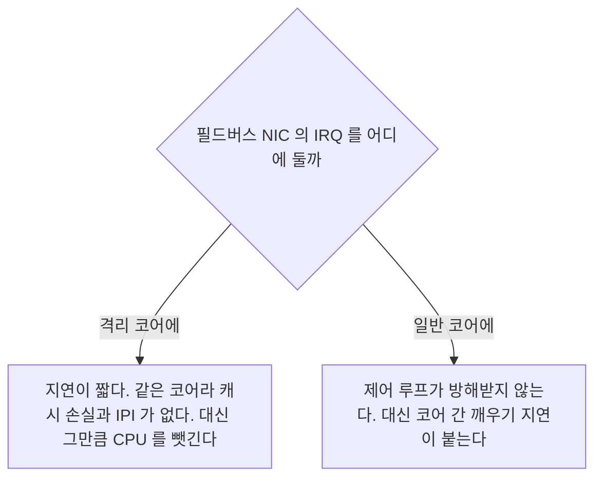
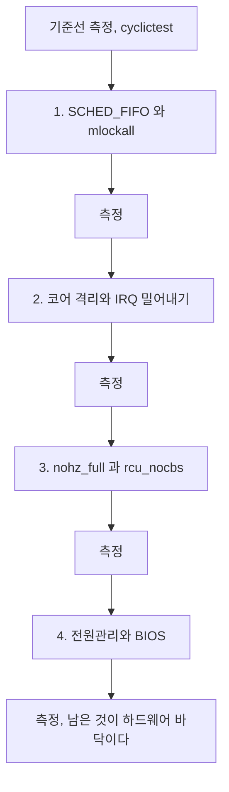

> **기준 출처:** [Linux kernel parameters](https://docs.kernel.org/admin-guide/kernel-parameters.html) · [Linux kernel NO_HZ](https://docs.kernel.org/timers/no_hz.html) · [SMP IRQ affinity](https://www.kernel.org/doc/html/latest/core-api/irq/irq-affinity.html) · [man 1 taskset](https://man7.org/linux/man-pages/man1/taskset.1.html) / 확인일 2026-08-07
> **시리즈:** [목차](/posts/00-rtos-series/) | 이전 → [06. 메모리 잠그기](/posts/06-lock-memory-mlockall/) | 다음 → [08. 주기 루프 타이머](/posts/08-periodic-loop-timer/)

## 1. 효과가 가장 큰 조치

RT 커널을 켜고 `SCHED_FIFO`를 줘도 남는 지터가 있다. 그 대부분은 그 코어에서 다른 일이 돌아서 생긴다. 그래서 코어 하나를 통째로 비우고 제어 루프만 올린다.


[이론 15편](/posts/15-multicore-realtime/)에서 본 대로 이렇게 하면 멀티코어 실시간 이론이 필요 없어진다. 그 코어에는 경쟁자가 없기 때문이다.

## 2. 부팅 파라미터로 코어를 뺀다

```bash
# /etc/default/grub
GRUB_CMDLINE_LINUX_DEFAULT="... isolcpus=3 nohz_full=3 rcu_nocbs=3 irqaffinity=0-2 \
                            intel_pstate=disable idle=poll nosoftlockup"

sudo update-grub && sudo reboot
```

| 파라미터 | 하는 일 | 없으면 |
| --- | --- | --- |
| `isolcpus=3` | 코어 3을 일반 스케줄러의 부하 분산에서 제외한다 | 커널이 아무 태스크나 올린다 |
| `nohz_full=3` | 코어 3의 주기적 타이머 틱을 없앤다. 실행 태스크가 하나일 때 | 초당 250에서 1000회 인터럽트가 걸린다 |
| `rcu_nocbs=3` | RCU 콜백 처리를 다른 코어로 넘긴다 | RCU 작업이 끼어든다 |
| `irqaffinity=0-2` | 모든 인터럽트를 0에서 2로 보낸다 | 인터럽트가 격리 코어에도 들어온다 |
| `intel_pstate=disable` | CPU 주파수 자동 변경을 끈다 | 주파수 전환 시 지연이 생긴다 |
| `idle=poll` | 유휴 시 C-state 진입을 금지한다 | C-state 복귀에 수십에서 수백 µs가 든다 |
| `nosoftlockup` | 소프트락업 감지를 끈다 | 격리 코어에서 오탐이 난다 |

`idle=poll`은 전력을 크게 먹는다. CPU가 항상 100%로 도는 것과 같아 발열과 전력이 올라간다. 배터리 장비에는 쓸 수 없고, 대신 `intel_idle.max_cstate=1`처럼 얕은 C-state만 허용하는 절충안을 쓴다. [12편](/posts/12-what-breaks-realtime/)에서 다룬다.

```bash
cat /proc/cmdline
# ... isolcpus=3 nohz_full=3 rcu_nocbs=3 irqaffinity=0-2 ...

cat /sys/devices/system/cpu/isolated
# 3
cat /sys/devices/system/cpu/nohz_full
# 3
```

## 3. 인터럽트를 실제로 밀어낸다

`irqaffinity=`는 부팅 이후에 등록되는 IRQ에는 적용되지 않을 수 있다. 런타임에도 확인하고 조정한다.

```bash
# 어느 IRQ 가 어느 코어에 얼마나 들어오는지
cat /proc/interrupts
#            CPU0     CPU1     CPU2     CPU3
#  24:     120344        0        0        0   PCI-MSI  eth0
#  31:          0        0        0     8821   PCI-MSI  i2c    <- 격리 코어에 들어온다
# LOC:    2103441  2098112  2094005      312   Local timer interrupts
#                                        ^^^ nohz_full 이 듣고 있다

# 특정 IRQ 의 affinity 확인과 변경
cat /proc/irq/31/smp_affinity_list
# 0-3
echo 0-2 | sudo tee /proc/irq/31/smp_affinity_list   # 격리 코어에서 빼낸다

# 전부 한 번에 밀어내기
for irq in /proc/irq/[0-9]*; do
    echo 0-2 | sudo tee $irq/smp_affinity_list > /dev/null 2>&1
done
```

일부 IRQ는 affinity 변경을 거부한다. per-CPU 인터럽트와 타이머가 그렇다. `tee`가 실패해도 넘어가도록 리다이렉션을 두고, `/proc/interrupts`를 다시 봐서 실제로 줄었는지 확인하는 것이 중요하다.

내 장치의 IRQ를 어디 둘지는 선택이다.



| 방식 | 언제 |
| --- | --- |
| 격리 코어에 둔다 | 인터럽트가 규칙적이고 적을 때. 1 kHz 사이클 하나 정도라면 지연이 가장 짧다 |
| 일반 코어에 둔다 | 인터럽트가 많거나 폭주 가능성이 있을 때 |
| 인터럽트를 아예 안 쓴다 | 폴링한다. 격리 코어에서 타이머 하나로 깨어나 직접 읽는다. [이론 10편](/posts/10-interrupts-and-tasks/) |

## 4. 태스크를 격리 코어에 올린다

```bash
# 명령줄
taskset -c 3 chrt -f 85 ./control_app

# 확인
taskset -pc $(pgrep control_app)
# pid 2431's current affinity list: 3
```

```c
/* 코드에서, 스레드 단위로 */
#define _GNU_SOURCE
#include <pthread.h>
#include <sched.h>

void pin_to_core(int core)
{
    cpu_set_t set;
    CPU_ZERO(&set);
    CPU_SET(core, &set);
    if (pthread_setaffinity_np(pthread_self(), sizeof(set), &set) != 0)
        perror("pthread_setaffinity_np");

    /* 확인 */
    printf("현재 코어: %d\n", sched_getcpu());
}
```

`sched_getcpu()`로 실제로 어느 코어에서 도는지 확인한다. affinity를 설정했다고 믿지 말고 값을 본다. [11편](/posts/11-realtime-control-loop-c/) 코드에서는 시작할 때 이것을 출력한다.

## 5. cgroup v2로 나머지를 몰아넣는다

`isolcpus`는 정적이고 재부팅이 필요하다. cgroup v2의 `cpuset`은 런타임에 조정할 수 있다.

```bash
# 시스템의 나머지 프로세스를 0-2 로 제한한다
sudo mkdir -p /sys/fs/cgroup/general
echo "+cpuset" | sudo tee /sys/fs/cgroup/cgroup.subtree_control
echo "0-2" | sudo tee /sys/fs/cgroup/general/cpuset.cpus

# 기존 프로세스들을 그 그룹으로 이동한다
for pid in $(cat /sys/fs/cgroup/cgroup.procs); do
    echo $pid | sudo tee /sys/fs/cgroup/general/cgroup.procs 2>/dev/null
done
```

systemd로 하면 더 간단하다.

```ini
# /etc/systemd/system.conf, 시스템 전체 기본 affinity
[Manager]
CPUAffinity=0-2
```

```ini
# 내 서비스만 격리 코어에
# /etc/systemd/system/control.service
[Service]
CPUAffinity=3
CPUSchedulingPolicy=fifo
CPUSchedulingPriority=85
```

systemd의 `CPUAffinity=0-2`를 `system.conf`에 넣는 것이 가장 간단한 방법이다. systemd가 시작하는 모든 서비스가 0에서 2에만 올라가고 내 서비스만 예외로 3을 쓴다.

## 6. 격리가 실제로 됐는지 본다

```bash
# 격리 코어에 무엇이 도는가
ps -eo pid,psr,cls,rtprio,comm | awk '$2==3'
#  PID PSR CLS RTPRIO COMMAND
# 2431   3 FF      85 control_app     <- 이것만 있어야 한다
#   28   3 FF      99 migration/3     <- 커널 스레드는 남는다, 정상이다

# 인터럽트가 들어오는가, 두 번 재서 차이를 본다
cat /proc/interrupts | awk '{print $1, $5}' > /tmp/a; sleep 10
cat /proc/interrupts | awk '{print $1, $5}' > /tmp/b
diff /tmp/a /tmp/b       # CPU3 열에 차이가 거의 없어야 한다

# 틱이 실제로 줄었는가
grep LOC /proc/interrupts
# LOC: 2103441 2098112 2094005 312
#                              ^^^ 다른 코어보다 자릿수가 작으면 nohz_full 이 듣고 있다

# 컨텍스트 스위치가 일어나는가
pidstat -w -p $(pgrep control_app) 1 5
# cswch/s 와 nvcswch/s 가 0 에 가까워야 한다
```

`nohz_full`은 그 코어에 실행 가능한 태스크가 정확히 하나일 때만 틱을 없앤다. 태스크가 둘 이상이면 스케줄링을 위해 틱이 되살아난다. 격리 코어에 스레드를 하나만 올리는 것이 그래서 중요하다. 로깅 스레드까지 같이 올리면 격리의 절반이 무의미해진다.

## 7. 무엇부터 할 것인가



한 번에 하나씩 바꾸고 매번 측정한다. 전부 한꺼번에 적용하면 무엇이 효과 있었는지 알 수 없고 나중에 문제가 생겼을 때 되돌릴 지점도 없다. 그리고 설정마다 대가가 있으므로 효과가 없는 설정은 되돌리는 것이 맞다.

| 설정 | 대가 |
| --- | --- |
| 코어 격리 | 그 코어를 다른 일에 못 쓴다 |
| `nohz_full` | 통계와 프로파일링 정확도가 떨어진다 |
| `idle=poll` | 전력과 발열이 올라간다 |
| `intel_pstate=disable` | 성능 스케일링을 포기한다 |

## 정리

- 코어 격리가 효과가 가장 크다. 코어 하나를 비우고 제어 루프만 올린다.
- 부팅 파라미터는 `isolcpus=3 nohz_full=3 rcu_nocbs=3 irqaffinity=0-2`다.
- `nohz_full`은 그 코어의 태스크가 정확히 하나일 때만 틱을 없앤다. 스레드를 하나만 올린다.
- 인터럽트는 `/proc/irq/*/smp_affinity_list`로 밀어낸다. 일부는 거부되므로 `/proc/interrupts`로 확인한다.
- 내 장치 IRQ는 격리 코어에 두거나 일반 코어에 두거나 폴링으로 없앤다.
- 태스크 고정은 `taskset -c 3`이나 `pthread_setaffinity_np`로 하고 `sched_getcpu()`로 확인한다.
- systemd `system.conf`의 `CPUAffinity=0-2`가 나머지를 몰아넣는 가장 간단한 방법이다.
- 검증은 격리 코어의 프로세스 목록, `/proc/interrupts` 증가분, `LOC` 틱 수, 컨텍스트 스위치 수 넷으로 한다.
- 한 번에 하나씩 바꾸고 매번 측정한다. 설정마다 대가가 있으므로 효과 없는 것은 되돌린다.

## 참고

- [Linux kernel — kernel parameters](https://docs.kernel.org/admin-guide/kernel-parameters.html)
- [Linux kernel — NO_HZ](https://docs.kernel.org/timers/no_hz.html)
- [Linux kernel — SMP IRQ affinity](https://www.kernel.org/doc/html/latest/core-api/irq/irq-affinity.html)
- [man 1 taskset](https://man7.org/linux/man-pages/man1/taskset.1.html)