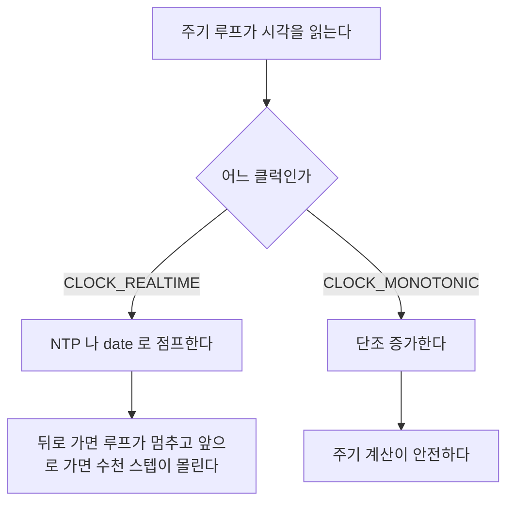
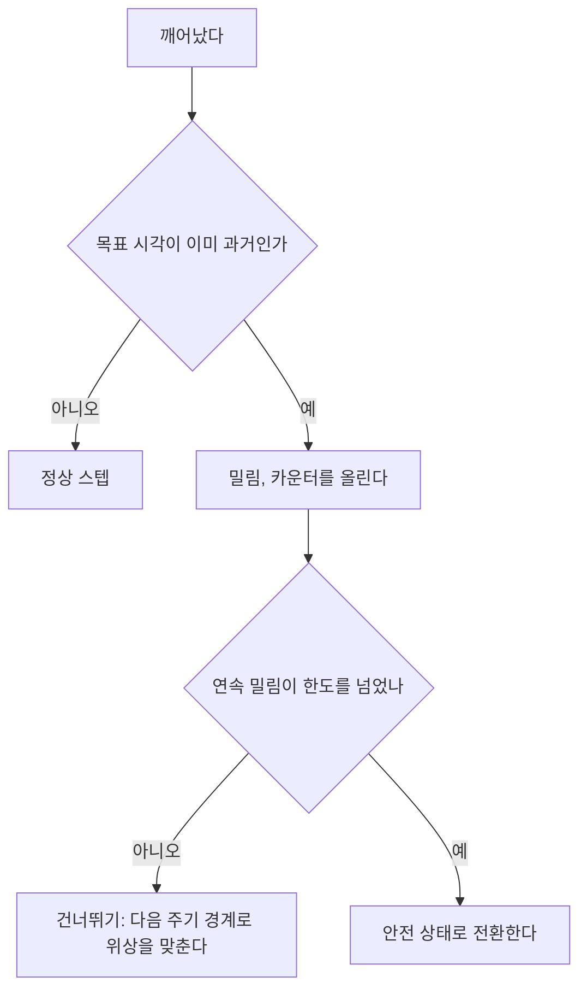

> **기준 출처:** [man 2 clock_nanosleep](https://man7.org/linux/man-pages/man2/clock_nanosleep.2.html) · [man 2 timerfd_create](https://man7.org/linux/man-pages/man2/timerfd_create.2.html) · [man 7 time](https://man7.org/linux/man-pages/man7/time.7.html) · [Linux kernel High resolution timers](https://docs.kernel.org/timers/highres.html) / 확인일 2026-08-07
> **시리즈:** [목차](/posts/00-rtos-series/) | 이전 → [07. CPU 격리와 인터럽트 배치](/posts/07-cpu-isolation-irq-affinity/) | 다음 → [09. 지연시간 측정](/posts/09-latency-measurement-cyclictest/)

## 1. 먼저 시계를 고른다

리눅스에는 여러 시계가 있고 실시간 루프에 써도 되는 것은 정해져 있다.

| 클럭 | 성질 | 실시간 루프에 |
| --- | --- | --- |
| `CLOCK_MONOTONIC` | 부팅 이후 단조 증가하고 뒤로 가지 않는다 | 이것을 쓴다 |
| `CLOCK_MONOTONIC_RAW` | NTP 보정도 받지 않는다 | 하드웨어 특성 측정용 |
| `CLOCK_REALTIME` | 벽시계다. NTP나 수동 변경으로 뛰거나 되돌아간다 | 쓰면 안 된다 |
| `CLOCK_BOOTTIME` | 서스펜드 시간을 포함한다 | 상황에 따라 쓴다 |
| `CLOCK_THREAD_CPUTIME_ID` | 이 스레드가 쓴 CPU 시간이다 | 실행시간 측정용 |

`CLOCK_REALTIME`을 쓰면 안 되는 이유가 분명하다. NTP가 시각을 조정하거나 누가 `date`로 시간을 바꾸면 시계가 점프한다. 뒤로 가면 `while (now < next)` 같은 루프가 몇 시간씩 멈추고, 앞으로 가면 수천 스텝이 한꺼번에 실행된다.



주기 계산과 측정은 전부 `CLOCK_MONOTONIC`으로 한다. 사람에게 보여 줄 타임스탬프만 `CLOCK_REALTIME`을 쓰고 그것도 로그 기록 시점에만 쓴다.

```c
struct timespec ts;
clock_gettime(CLOCK_MONOTONIC, &ts);
uint64_t ns = (uint64_t)ts.tv_sec * 1000000000ULL + ts.tv_nsec;

/* 해상도 확인 */
clock_getres(CLOCK_MONOTONIC, &ts);
printf("해상도: %ld ns\n", ts.tv_nsec);   /* 고해상도 타이머면 1 ns */
```

## 2. 절대시각 대기

[이론 11편](/posts/11-jitter-sources/)에서 본 것을 리눅스 API로 쓴다.

```c
/* 상대시간 대기, 오차가 계속 누적된다 */
while (1) {
    do_control();
    usleep(1000);              /* 지금부터 1 ms */
}
```

```c
/* 절대시각 대기, 누적되지 않는다 */
#define PERIOD_NS  1000000L    /* 1 ms */

static void ts_add_ns(struct timespec *t, long ns)
{
    t->tv_nsec += ns;
    while (t->tv_nsec >= 1000000000L) { t->tv_nsec -= 1000000000L; t->tv_sec++; }
}

struct timespec next;
clock_gettime(CLOCK_MONOTONIC, &next);

while (running) {
    ts_add_ns(&next, PERIOD_NS);                 /* 목표 시각 = 이전 목표 + T */

    int rc;
    do {
        rc = clock_nanosleep(CLOCK_MONOTONIC, TIMER_ABSTIME, &next, NULL);
    } while (rc == EINTR);                        /* 시그널로 깨면 다시 잔다 */
    if (rc != 0) { /* 오류 처리 */ }

    do_control();
}
```

| 요소 | 왜 |
| --- | --- |
| `TIMER_ABSTIME` | 절대시각 대기다. 이것이 없으면 상대 대기라 누적된다 |
| `next`를 이전 목표에 T를 더해 갱신 | 지금이 아니라 이전 목표에 더한다 |
| `EINTR` 재시도 | 시그널로 깨면 다시 자야 한다. 빼먹으면 주기가 깨진다 |
| `CLOCK_MONOTONIC` | 시계 점프를 막는다 |

`EINTR` 처리를 빼먹는 것이 흔한 실수다. `clock_nanosleep`은 시그널을 받으면 `EINTR`로 조기 반환하고, 그대로 진행하면 그 스텝이 목표보다 일찍 실행된다. `TIMER_ABSTIME`을 쓰면 남은 시간을 다시 계산할 필요 없이 같은 `next`로 재호출하면 되므로 처리가 간단하다. 상대 대기였다면 남은 시간을 직접 계산해야 한다.

## 3. 밀렸을 때 어떻게 할 것인가

한 스텝이 데드라인을 넘겨 끝났다면 다음 목표 시각이 이미 과거일 수 있다. 그러면 `clock_nanosleep`이 즉시 반환하고 루프가 따라잡기 위해 연속 실행된다.

```text
 밀림이 발생했을 때

 목표   0    1    2    3    4    5   (ms)
        |    |    |    |    |    |
 실제   [==== 3.2 ms 걸린 스텝 ====][1][1][1]
                                    ^  ^  ^
                              목표 1, 2, 3 이 이미 지나서
                              세 스텝이 연속으로 실행된다
```

제어에서 이것은 대개 나쁘다. 세 스텝을 몰아서 계산하면 목표 궤적이 점프하고 미분항이 폭주한다.

```c
/* 밀림 감지와 처리 */
struct timespec now;
clock_gettime(CLOCK_MONOTONIC, &now);
int64_t lateness_ns = ts_diff_ns(&now, &next);   /* now - next */

if (lateness_ns > OVERRUN_THRESHOLD_NS) {
    overrun_count++;
    log_push_overrun(lateness_ns);

    /* 정책 A, 건너뛰기: 놓친 주기를 버리고 다음 경계에 맞춘다 */
    while (ts_diff_ns(&now, &next) > 0)
        ts_add_ns(&next, PERIOD_NS);

    /* 정책 B, 따라잡기: 아무것도 안 하면 자동으로 연속 실행된다 */

    /* 정책 C, 심각하면 안전 상태로 */
    if (overrun_count > MAX_CONSECUTIVE_OVERRUN)
        enter_safe_state();
}
```



| 정책 | 언제 |
| --- | --- |
| A. 건너뛰기 | 제어 루프의 기본이다. 놓친 스텝은 버리고 위상을 맞춘다. 카운터는 반드시 올린다 |
| B. 따라잡기 | 누적 적분이 중요한 계측이나 계수 작업에 쓴다 |
| C. 안전 상태 | 연속 밀림이면 시스템이 이미 이상하다 |

[이론 02편](/posts/02-hard-soft-firm-realtime/)에서 준경성으로 설계하려면 놓쳤을 때의 복구를 코드에 명시해야 한다고 한 것이 여기 해당한다. 이 처리를 안 쓰면 기본 동작인 따라잡기가 되는데 그것은 선택한 것이 아니라 방치한 것이다.

## 4. 다른 방법

`timerfd`는 `epoll`과 함께 쓸 때 유용하다.

```c
#include <sys/timerfd.h>

int tfd = timerfd_create(CLOCK_MONOTONIC, TFD_CLOEXEC);
struct itimerspec its = {
    .it_interval = { .tv_sec = 0, .tv_nsec = PERIOD_NS },   /* 주기 */
    .it_value    = { .tv_sec = 0, .tv_nsec = PERIOD_NS },   /* 첫 만료 */
};
timerfd_settime(tfd, 0, &its, NULL);

uint64_t expirations;
while (running) {
    read(tfd, &expirations, sizeof(expirations));   /* 블록된다 */
    if (expirations > 1) {
        /* 놓친 주기 수를 커널이 알려준다. 밀림 감지가 공짜다 */
        overrun_count += expirations - 1;
    }
    do_control();
}
```

| 장점 | 단점 |
| --- | --- |
| `epoll`로 다른 fd와 함께 대기할 수 있다. 소켓과 시리얼 등 | `read()` 시스템 콜 오버헤드가 있다 |
| 놓친 주기 수를 커널이 세어 준다 | `clock_nanosleep`보다 지터가 조금 크다 |

이벤트가 여럿 섞인 루프에는 `timerfd`와 `epoll`이 깔끔하고, 순수 주기 제어 루프에는 `clock_nanosleep`이 더 좋다.

| 방법 | 지터 | 밀림 감지 | 다른 이벤트와 결합 |
| --- | --- | --- | --- |
| `clock_nanosleep(ABSTIME)` | 가장 작다 | 직접 계산한다 | 안 된다 |
| `timerfd`와 `read` | 조금 크다 | 커널이 알려준다 | `epoll`로 자유롭다 |
| `timer_create`와 시그널 | 시그널 전달 지연이 있다 | 오버런 카운트가 있다 | 시그널 처리가 복잡하다 |
| `nanosleep`이나 `usleep` | 누적 드리프트가 생긴다 | 안 된다 | 안 된다 |

## 5. 고해상도 타이머가 켜져 있나

```bash
# 커널 설정
grep HIGH_RES_TIMERS /boot/config-$(uname -r)
# CONFIG_HIGH_RES_TIMERS=y

# 실제 동작 확인
cat /proc/timer_list | grep -A3 "Clock Event Device"
#  Clock Event Device: lapic-deadline
#   min_delta_ns:   1000
# resolution: 1 nsecs        <- 고해상도

# 프로그램에서
clock_getres(CLOCK_MONOTONIC, &ts);   /* tv_nsec 이 1 이면 고해상도 */
```

고해상도 타이머가 없으면 `clock_nanosleep`의 정밀도가 틱 단위로 떨어진다. [윈도우 04편](/posts/04-timer-resolution-measurement/)에서 볼 윈도우의 15.6 ms 문제와 같은 성질이다. 요즘 x86 커널은 기본으로 켜져 있지만 임베디드 보드에서는 확인이 필요하다.

## 6. 실행시간과 지터를 같이 기록한다

```c
struct timespec now;
clock_gettime(CLOCK_MONOTONIC, &now);
int64_t wake_err_ns = ts_diff_ns(&now, &next);      /* 릴리스 지터 */

uint64_t t0 = ns_now();
do_control();
uint64_t exec_ns = ns_now() - t0;                    /* 실행시간 C */

/* 링버퍼에 숫자만 쌓는다 */
stats_push(wake_err_ns, exec_ns);
```

| 기록할 값 | 무엇을 알려주나 |
| --- | --- |
| 깨어남 오차 | 릴리스 지터. OS와 커널 문제다 |
| 실행시간 | $C_i$. 내 코드 문제다 |
| 주기 실측, 연속 두 깨어남 간격 | 드리프트가 있는지 알려준다 |
| 밀림 횟수 | 데드라인 초과를 알려준다 |

두 값을 나눠 기록해야 원인을 가른다. 지연이 커졌을 때 OS가 늦게 깨웠는지 내 코드가 느려졌는지가 한눈에 보인다. 하나로 합쳐 재면 이 구분이 사라진다.

## 정리

- `CLOCK_REALTIME`을 쓰지 않는다. NTP나 수동 변경으로 시계가 점프한다. `CLOCK_MONOTONIC`을 쓴다.
- `clock_nanosleep(CLOCK_MONOTONIC, TIMER_ABSTIME, &next, NULL)`이 표준 형태다.
- `next`는 이전 목표에 T를 더해 갱신한다. 지금에 더하면 누적 드리프트가 생긴다.
- `EINTR` 재시도를 반드시 넣는다. 빼먹으면 시그널 하나에 주기가 깨진다.
- 밀렸을 때의 정책을 코드에 명시한다. 건너뛰기가 제어의 기본이고 카운터는 반드시 올린다.
- `timerfd`는 `epoll` 결합과 커널이 세 주는 오버런 카운트가 장점이다. 순수 주기 루프는 `clock_nanosleep`이 낫다.
- `CONFIG_HIGH_RES_TIMERS`와 `clock_getres`로 고해상도 타이머를 확인한다.
- 깨어남 오차와 실행시간을 나눠 기록한다. OS 문제인지 내 코드 문제인지 갈린다.

## 참고

- [man 2 clock_nanosleep](https://man7.org/linux/man-pages/man2/clock_nanosleep.2.html)
- [man 2 timerfd_create](https://man7.org/linux/man-pages/man2/timerfd_create.2.html)
- [man 7 time](https://man7.org/linux/man-pages/man7/time.7.html)
- [Linux kernel — High resolution timers](https://docs.kernel.org/timers/highres.html)