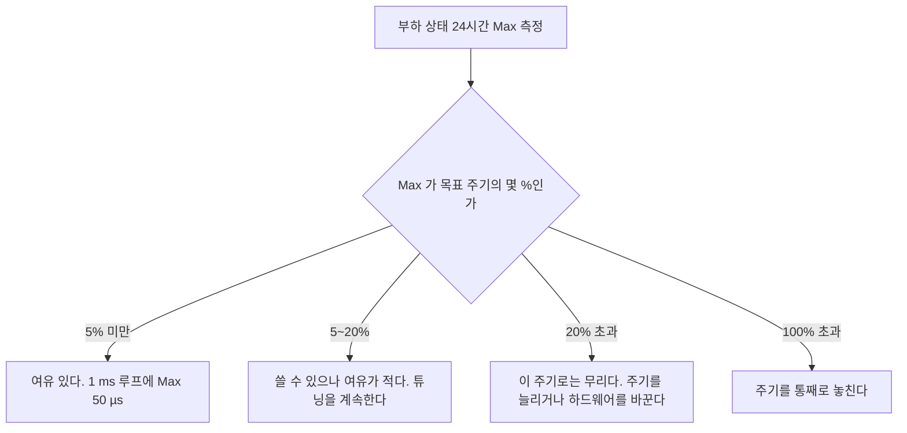
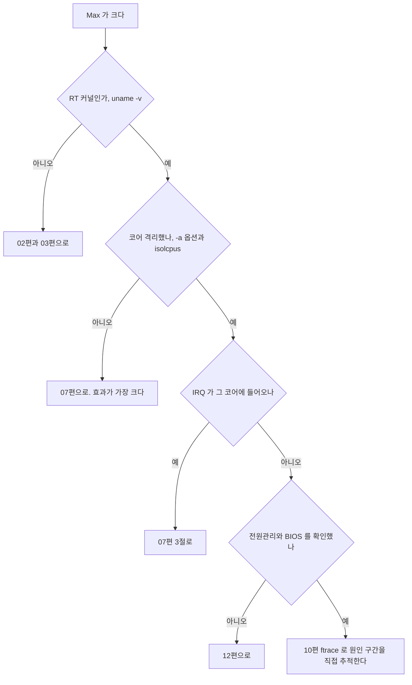

> **기준 출처:** [Linux Foundation RT cyclictest](https://wiki.linuxfoundation.org/realtime/documentation/howto/tools/cyclictest/start) · [rt-tests 도구 모음](https://wiki.linuxfoundation.org/realtime/documentation/howto/tools/rt-tests) / 확인일 2026-08-07
> **시리즈:** [목차](/posts/00-rtos-series/) | 이전 → [08. 주기 루프 타이머](/posts/08-periodic-loop-timer/) | 다음 → [10. 추적 도구 ftrace](/posts/10-tracing-ftrace-tracecmd/)

아래 출력은 형식을 설명하기 위한 예시다. 측정 환경이 없어 실측값이 아니다.

## 1. cyclictest가 재는 것


cyclictest는 OS가 나를 목표 시각에 얼마나 정확히 깨워 주는가만 잰다. 내 응용의 성능을 재는 것이 아니다. cyclictest가 좋아도 내 코드가 느리면 소용없고, 반대로 cyclictest 결과는 내 코드가 도달할 수 있는 하한이다. [릴리스 지터](/posts/11-jitter-sources/)만 잰다는 점을 기억한다.

## 2. 설치와 기본 실행

```bash
# Debian 과 Ubuntu
sudo apt install rt-tests

# 기본 실행
sudo cyclictest -m -p 80 -i 1000 -h 400 -q -D 10m
```

| 옵션 | 뜻 |
| --- | --- |
| `-m` | `mlockall`로 페이지 폴트를 제거한다 ([06편](/posts/06-lock-memory-mlockall/)) |
| `-p 80` | `SCHED_FIFO` 우선순위 80 |
| `-i 1000` | 주기 1000 µs, 곧 1 kHz |
| `-h 400` | 히스토그램을 400 µs까지 버킷으로 만든다 |
| `-q` | 실행 중 출력을 억제하고 끝에만 요약한다 |
| `-D 10m` | 10분 동안 돌린다 |
| `-t N` | 스레드 N개, 인자 없으면 코어 수만큼 |
| `-a 3` | 코어 3에 고정한다 ([07편](/posts/07-cpu-isolation-irq-affinity/)) |
| `-S` | 코어마다 스레드 하나씩 |

출력은 이렇게 읽는다.

```text
policy: fifo: loadavg: 0.42 0.31 0.20 1/312 4821

T: 0 ( 4821) P:80 I:1000 C: 600000 Min:      2 Act:    6 Avg:    7 Max:      23
   ^    ^     ^     ^        ^          ^         ^        ^          ^
 스레드 PID  우선순위 주기   측정 횟수  최소값   현재값  평균값    최대값
```

| 항목 | 무엇 | 실시간에서의 의미 |
| --- | --- | --- |
| `Min` | 최소 지연 | 하드웨어와 커널의 이상적 값이다 |
| `Avg` | 평균 | 참고용이고 판정 근거가 아니다 |
| `Max` | 최대 지연 | 이 값만 본다 |

`Max` 하나가 결론이다. [이론 01편](/posts/01-what-is-realtime/)의 평균이 아니라 최악값이라는 원칙이 그대로 적용된다. `Avg` 7 µs에 `Max` 23 µs인 시스템은 23 µs 시스템이다.

## 3. 반드시 부하를 걸고 잰다

아무것도 안 돌 때 재면 일반 커널도 좋은 값이 나온다. RT 커널의 가치는 부하 상태에서도 최악값이 늘어나지 않는다는 것이다.

```bash
# 터미널 1, 부하 생성
sudo apt install stress-ng
stress-ng --cpu 4 --io 4 --vm 2 --vm-bytes 1G --hdd 2 --timeout 15m

# 동시에 네트워크와 디스크 부하도 준다
ping -f 192.168.1.1 &                            # 인터럽트 부하
dd if=/dev/zero of=/tmp/f bs=1M count=8000 &     # 디스크 I/O

# 터미널 2, 측정
sudo cyclictest -m -p 80 -i 1000 -a 3 -h 400 -q -D 15m
```

| 부하 종류 | 무엇을 자극하나 |
| --- | --- |
| CPU | 스케줄러 경쟁 |
| 메모리 | 캐시와 TLB와 메모리 대역폭. [이론 15편](/posts/15-multicore-realtime/)의 코런너 효과 |
| 디스크 | 블록 I/O와 커널 락 |
| 네트워크 | 인터럽트 폭풍. 가장 잘 드러난다 |
| USB를 꽂았다 뺐다 | 실제로 큰 스파이크를 만든다 |

실제 워크로드로 재는 것이 가장 정확하다. `stress-ng`는 합성 부하라 실제 시스템과 다를 수 있으므로 최종 검증은 실제 응용을 다 띄운 상태에서 한다.

## 4. 히스토그램으로 꼬리를 본다

```bash
sudo cyclictest -m -p 80 -i 1000 -a 3 -h 400 -q -D 30m > hist.txt

# 히스토그램 부분만
grep -v "^#" hist.txt | head -50
# 000000 598234        <- 0 µs 에 598,234 회
# 000001  95120
# 000002  42310
# ...
# 000023      4        <- 23 µs 에 4 회
```

```text
 지연 분포 개념도

 회수
  10^6 |#
  10^5 |##
  10^4 |###
  10^3 |####
  10^2 |#####
  10^1 |######        |      |
  10^0 |#######    |  |  |   |   <- 이 꼬리가 문제다
       +----------------------------
        0   5   10   15   20   25  µs
```

분포의 모양이 원인을 알려준다. 좁고 하나의 봉우리면 좋은 상태다. 봉우리가 둘이면 두 가지 다른 경로가 있다는 뜻이고 캐시 히트와 미스, C-state 진입 여부가 후보다. 멀리 떨어진 외딴 점은 드문 사건이고 SMI나 전원관리나 특정 드라이버가 후보다. 꼬리가 길게 이어지면 부하에 비례하는 간섭이다.

## 5. 얼마나 오래 재야 하나

| 목적 | 최소 시간 |
| --- | --- |
| 빠른 확인, 설정 바꾸고 효과 보기 | 5에서 10분 |
| 개발 중 검증 | 1에서 2시간 |
| 출하 전 검증 | 24시간 이상, 실제 부하로 |

드문 사건은 오래 돌려야 나온다. SMI는 몇 분에서 몇 시간에 한 번 나오고, 온도에 따른 주파수 변동은 장비가 데워진 뒤에 나온다. 10분 돌려서 나온 Max를 출하 기준으로 쓰면 안 된다.

그리고 [이론 13편](/posts/13-wcet-execution-budget/)에서 말했듯 측정은 안 나왔다까지만 증명한다. 24시간 결과에도 여유를 곱해서 설계한다.

```bash
# 지연이 50 µs 를 넘는 순간 ftrace 를 멈추고 그 직전 기록을 남긴다
sudo cyclictest -m -p 80 -i 1000 -a 3 -b 50 --tracemark -D 24h

# 멈춘 뒤 원인 보기
cat /sys/kernel/debug/tracing/trace | tail -100
```

`-b`(breaktrace)가 이 도구에서 가장 유용한 기능이다. 가끔 튀는데 언제인지 모르겠다는 문제를 해결한다. 튄 그 순간의 커널 동작이 그대로 남으므로 24시간 돌려놓고 다음날 확인하면 된다. 자세한 해석은 [10편](/posts/10-tracing-ftrace-tracecmd/)에서 다룬다.

## 6. 결과를 어떻게 판정하나



| 목표 | 필요한 Max, 대략 |
| --- | --- |
| 100 Hz (10 ms) | 500 µs 미만 |
| 1 kHz (1 ms) | 50에서 100 µs 미만 |
| 4 kHz (250 µs) | 20 µs 미만. 리눅스로는 매우 어렵다 |
| 10 kHz (100 µs) | MCU로 간다 |

위 기준은 관례적인 목표치이지 규격이 아니다. 실제 필요값은 응용이 정한다. [지터가 제어에 미치는 영향](/posts/11-jitter-sources/)을 계산해서 정하는 것이 맞고, 위상여유를 얼마나 깎아도 되는지가 실제 기준이다.

값이 나쁘면 순서대로 확인한다.



## 7. 함께 쓰는 rt-tests 도구들

| 도구 | 무엇을 재나 |
| --- | --- |
| `cyclictest` | 타이머 깨어남 지연 |
| `hackbench` | 스케줄러와 IPC 부하 생성. 부하원으로 많이 쓴다 |
| `pi_stress` | 우선순위 상속이 실제로 동작하는지 검증한다 ([이론 09편](/posts/09-priority-inheritance-ceiling/)) |
| `signaltest` | 시그널 전달 지연 |
| `rt-migrate-test` | 태스크 이주 동작 |
| `oslat` | OS가 응용을 방해하는 시간을 잰다. cyclictest와 관점이 다르다 |

`oslat`은 cyclictest를 보완한다. cyclictest는 깨워 주는 정확도를 재고 `oslat`은 돌고 있는 중에 얼마나 뺏기는가를 잰다. 폴링 방식 제어 루프를 쓸 계획이라면 `oslat` 쪽이 더 관련 있다.

## 정리

- cyclictest는 OS가 목표 시각에 얼마나 정확히 깨워 주는가만 잰다. 곧 릴리스 지터다.
- 표준 실행은 `cyclictest -m -p 80 -i 1000 -a 3 -h 400 -q -D 10m`이다.
- `Max` 하나만 본다. `Avg`는 판정 근거가 아니다.
- 반드시 부하를 걸고 잰다. 무부하 값은 아무것도 증명하지 않고, 특히 네트워크 인터럽트 부하가 잘 드러낸다.
- 히스토그램의 모양이 원인을 알려준다. 봉우리 둘, 외딴 점, 긴 꼬리가 각각 다른 원인이다.
- 출하 검증은 24시간 이상 실제 부하로 한다. 드문 사건은 오래 돌려야 나온다.
- `-b 50 --tracemark`로 튄 순간의 커널 동작을 잡는다. 가끔 튄다는 문제의 해결책이다.
- 관례적 판정 기준은 1 kHz 루프에서 Max 50에서 100 µs 미만이다. 실제 기준은 제어 요구가 정한다.
- 값이 나쁘면 RT 커널, 코어 격리, IRQ 배치, 전원관리, ftrace 추적 순으로 확인한다.

## 참고

- [Linux Foundation RT — cyclictest](https://wiki.linuxfoundation.org/realtime/documentation/howto/tools/cyclictest/start)
- [Linux Foundation RT — rt-tests](https://wiki.linuxfoundation.org/realtime/documentation/howto/tools/rt-tests)