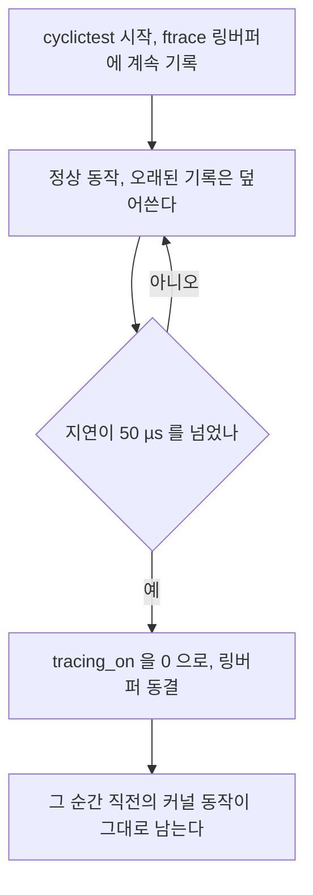

> **기준 출처:** [Linux kernel ftrace](https://docs.kernel.org/trace/ftrace.html) · [Event Tracing](https://docs.kernel.org/trace/events.html) · [man 1 trace-cmd](https://man7.org/linux/man-pages/man1/trace-cmd.1.html) / 확인일 2026-08-07
> **시리즈:** [목차](/posts/00-rtos-series/) | 이전 → [09. 지연시간 측정](/posts/09-latency-measurement-cyclictest/) | 다음 → [11. 1 kHz 제어 루프 C 코드](/posts/11-realtime-control-loop-c/)

아래 출력은 형식 설명용 예시다. 측정 환경이 없어 실측값이 아니다.

## 1. 왜 필요한가

[09편](/posts/09-latency-measurement-cyclictest/)의 cyclictest는 얼마나 튀었는지를 알려주지만 왜 튀었는지는 알려주지 않는다.


ftrace는 커널에 내장된 추적기다. 별도 설치가 필요 없고 `debugfs`나 `tracefs`로 조작한다.

## 2. 실시간에서 쓰는 트레이서

```bash
# 사용 가능한 트레이서 확인
cat /sys/kernel/debug/tracing/available_tracers
# hwlat blk mmiotrace function_graph wakeup_dl wakeup_rt wakeup function nop
```

| 트레이서 | 무엇을 재나 | 언제 쓰나 |
| --- | --- | --- |
| `irqsoff` | 인터럽트가 꺼져 있던 최장 구간 | [이론 10편](/posts/10-interrupts-and-tasks/) 3절의 그 값이다 |
| `preemptoff` | 선점이 막혀 있던 최장 구간 | 커널 선점 불가 구간 |
| `preemptirqsoff` | 둘 중 하나라도 막힌 최장 구간 | 종합해서 볼 때 |
| `wakeup_rt` | 실시간 태스크의 깨우기에서 실행까지 최장 지연 | 스케줄링 지연 |
| `function_graph` | 커널 함수 호출 그래프와 각 함수 소요시간 | 원인 함수 특정 |
| `hwlat` | 하드웨어나 펌웨어(SMI)가 CPU를 훔친 시간 | OS 밖의 원인 |

`irqsoff`와 `preemptoff`는 커널 설정이 필요하다. `CONFIG_IRQSOFF_TRACER`와 `CONFIG_PREEMPT_TRACER`가 없으면 `available_tracers`에 나오지 않는다. 그리고 이 트레이서들은 오버헤드가 크므로 운용 커널에는 켜지 않고 진단용 커널에만 켠다.

## 3. wakeup_rt로 스케줄링 지연 잡기

```bash
cd /sys/kernel/debug/tracing

echo 0 > tracing_on
echo wakeup_rt > current_tracer
echo 0 > tracing_max_latency        # 최대값 초기화
echo 1 > tracing_on

# 이 상태로 부하와 함께 실시간 태스크를 돌린다
sudo cyclictest -m -p 80 -i 1000 -a 3 -D 5m

echo 0 > tracing_on
cat tracing_max_latency             # 관측된 최대 지연, µs
# 87
cat trace | head -40                # 그 순간의 상세
```

```text
# tracer: wakeup_rt
#
# latency: 87 us, #124/124, CPU#3 | (M:preempt_rt VP:0, KP:0, SP:0 HP:0)
#    | task: cyclictest-4821 (uid:0 nice:0 policy:fifo rt_prio:80)
#
#  cmd     pid        ||||| time  |   caller
  <idle>-0      3d..1    0us :      0:120:R   + [003] 4821: 19:R cyclictest
  <idle>-0      3d..1    2us : ttwu_do_wakeup
  ...
  kworker-142   3d..2   85us : some_driver_function     <- 여기가 원인이다
 cyclictest-4821 3d..3  87us : finish_task_switch
```

`caller` 열을 따라가면 어느 커널 함수가 시간을 먹었는지 나온다. 위 예시라면 `kworker`가 어떤 드라이버 함수를 도느라 `cyclictest`를 늦게 깨운 것이다. 그 함수 이름으로 검색하면 어느 드라이버인지 나온다.

## 4. hwlat으로 OS 밖의 원인을 잡는다

[이론 11편](/posts/11-jitter-sources/)에서 SMI는 OS가 못 막는다고 했다. hwlat은 그 SMI를 간접적으로 잡는다. 원리는 단순하다. CPU를 붙잡고 시각을 계속 읽는데, 읽는 사이에 큰 간격이 생기면 그동안 OS가 모르는 무언가가 CPU를 가져간 것이다.

```bash
cd /sys/kernel/debug/tracing
echo hwlat > current_tracer
echo 3 > tracing_cpumask             # 코어 3 에서
echo 1000000 > hwlat_detector/width  # 1 초 중
echo 1000000 > hwlat_detector/window # 1 초 동안 측정
echo 1 > tracing_on
sleep 300
cat trace
```

```text
# tracer: hwlat
#
#           TASK-PID   CPU#  ||||   TIMESTAMP    FUNCTION
       <...>-4821    [003] ....  120.00: #1 inner/outer(us): 12/230 ts:...
                                                        ^
                             230 µs 동안 CPU 가 사라졌다. SMI 의심
```

hwlat에서 값이 나오면 소프트웨어로는 고칠 수 없다. BIOS 설정에서 전원관리나 USB legacy나 하드웨어 감시나 TPM 등을 끄거나, 그 하드웨어를 쓰지 않는 수밖에 없다. 실시간용 산업 PC를 따로 고르는 이유가 이것이다. [12편](/posts/12-what-breaks-realtime/)에서 다룬다.

hwlat은 CPU 하나를 100% 점유하므로 운용 중에는 돌릴 수 없다. 장비 도입 평가 단계에서 쓰는 도구다.

## 5. trace-cmd

`/sys/kernel/debug/tracing`을 직접 만지는 대신 명령 하나로 처리한다.

```bash
sudo apt install trace-cmd

# 스케줄링 이벤트만 기록
sudo trace-cmd record -e sched:sched_switch -e sched:sched_wakeup \
                      -e irq:irq_handler_entry -e irq:irq_handler_exit \
                      -M 8 -- sleep 30           # -M 8 은 CPU3 만, 비트마스크다

sudo trace-cmd report | less

# 지연 원인 요약
sudo trace-cmd record -p wakeup_rt -- cyclictest -m -p80 -i1000 -a3 -D 60
```

```text
 cyclictest-4821 [003] 1234.567890: sched_switch: prev=cyclictest prev_prio=19
                                    next=kworker/3:1 next_prio=120
 kworker/3:1-142 [003] 1234.567920: irq_handler_entry: irq=24 name=eth0
 kworker/3:1-142 [003] 1234.568150: irq_handler_exit:  irq=24 ret=handled
                                                       ^ 230 µs 동안 IRQ 처리
```

`sched_switch`와 `irq_handler_*` 이벤트 조합이 실시간 디버깅의 기본 세트다. 내 태스크가 언제 밀려났고 그 자리에 무엇이 들어왔는지가 그대로 보인다.

## 6. 튄 순간만 잡기

24시간 추적을 다 남기면 용량이 수백 GB가 된다. breaktrace로 튄 순간만 남긴다.

```bash
cd /sys/kernel/debug/tracing
echo function_graph > current_tracer
echo 1 > options/funcgraph-tail
echo 1 > tracing_on

# 지연이 50 µs 를 넘는 순간 추적을 멈춘다
sudo cyclictest -m -p 80 -i 1000 -a 3 -b 50 --tracemark -D 24h

# 튀면 여기서 자동 종료된다
cat /sys/kernel/debug/tracing/trace | tail -200 > /tmp/spike.txt
```



이것이 가끔 튀는데 원인을 모르겠다는 문제의 답이다. 링버퍼는 계속 덮어쓰다가 조건이 걸리면 그 자리에서 멈춘다. 튄 순간의 몇 ms 전부터가 통째로 남으므로 밤새 돌려놓고 아침에 보면 된다.

## 7. 응용 코드에서 마커 찍기

```c
/* 내 코드의 위치를 커널 추적에 끼워 넣는다 */
static int trace_fd = -1;

void trace_init(void) {
    trace_fd = open("/sys/kernel/debug/tracing/trace_marker", O_WRONLY);
}

static inline void trace_mark(const char *s) {
    if (trace_fd >= 0) write(trace_fd, s, strlen(s));
}

/* 사용 */
trace_mark("ctrl_begin");
do_control();
trace_mark("ctrl_end");
```

마커를 넣으면 커널 이벤트와 내 코드가 같은 시간축에 놓인다. 내 제어 함수가 도는 중에 어떤 IRQ가 들어왔는지를 직접 볼 수 있다. 다만 `write()` 자체가 µs 단위 오버헤드이므로 디버깅 중에만 켜고 운용 빌드에서는 뺀다.

## 8. 그 밖의 도구

| 도구 | 언제 |
| --- | --- |
| `perf` | 프로파일링 전반. `perf sched latency`, `perf record -e sched:*` |
| `perf sched latency` | 태스크별 스케줄링 지연 요약. 빠른 개요에 좋다 |
| `bpftrace`와 eBPF | 임의 조건으로 추적한다. 오버헤드가 낮고 유연하다 |
| `LTTng` | 장시간 저오버헤드 추적, 사용자와 커널 통합 |
| `pidstat -w` | 컨텍스트 스위치 횟수 |
| `/proc/interrupts` | 인터럽트 분포 ([07편](/posts/07-cpu-isolation-irq-affinity/)) |

```bash
# bpftrace 예, 실시간 태스크가 선점당한 순간과 가해자를 출력한다
sudo bpftrace -e '
tracepoint:sched:sched_switch /args->prev_prio < 100/ {
    printf("%s(prio %d) -> %s(prio %d)\n",
           args->prev_comm, args->prev_prio, args->next_comm, args->next_prio);
}'
```

## 9. 추적의 원칙

| 원칙 | 왜 |
| --- | --- |
| 추적 자체가 지연을 만든다 | `function_graph`는 오버헤드가 크다. 값이 나빠져도 추적 탓일 수 있다 |
| 범위를 좁혀 들어간다 | 전체 추적에서 이벤트 추적으로, 다시 함수 추적으로 |
| 코어를 지정한다 | 격리 코어만 보면 데이터가 크게 줄어든다 |
| 재현 조건을 먼저 찾는다 | 재현이 안 되면 breaktrace로 기다린다 |
| 한 번에 하나만 바꾼다 | [07편](/posts/07-cpu-isolation-irq-affinity/)과 같은 원칙이다 |

## 정리

- cyclictest는 얼마나를, ftrace는 왜를 알려준다.
- 실시간용 트레이서는 `irqsoff`, `preemptoff`, `wakeup_rt`, `hwlat`이다.
- `wakeup_rt`의 `caller` 열이 원인 커널 함수를 지목한다.
- `hwlat`에서 값이 나오면 소프트웨어로는 못 고친다. BIOS 설정이나 하드웨어 교체가 답이다.
- `trace-cmd`로 편하게 쓴다. `sched_switch`와 `irq_handler_*` 조합이 기본 세트다.
- `cyclictest -b 50 --tracemark`가 튄 순간에 링버퍼를 동결한다. 가끔 튄다는 문제의 답이다.
- `trace_marker`로 내 코드 위치를 커널 추적에 끼워 넣는다.
- 추적 자체가 지연을 만든다. 범위를 좁혀 들어가고 운용 빌드에서는 뺀다.

## 참고

- [Linux kernel — ftrace](https://docs.kernel.org/trace/ftrace.html)
- [Linux kernel — Event Tracing](https://docs.kernel.org/trace/events.html)
- [man 1 trace-cmd](https://man7.org/linux/man-pages/man1/trace-cmd.1.html)
- [perf wiki](https://perf.wiki.kernel.org/index.php/Main_Page)