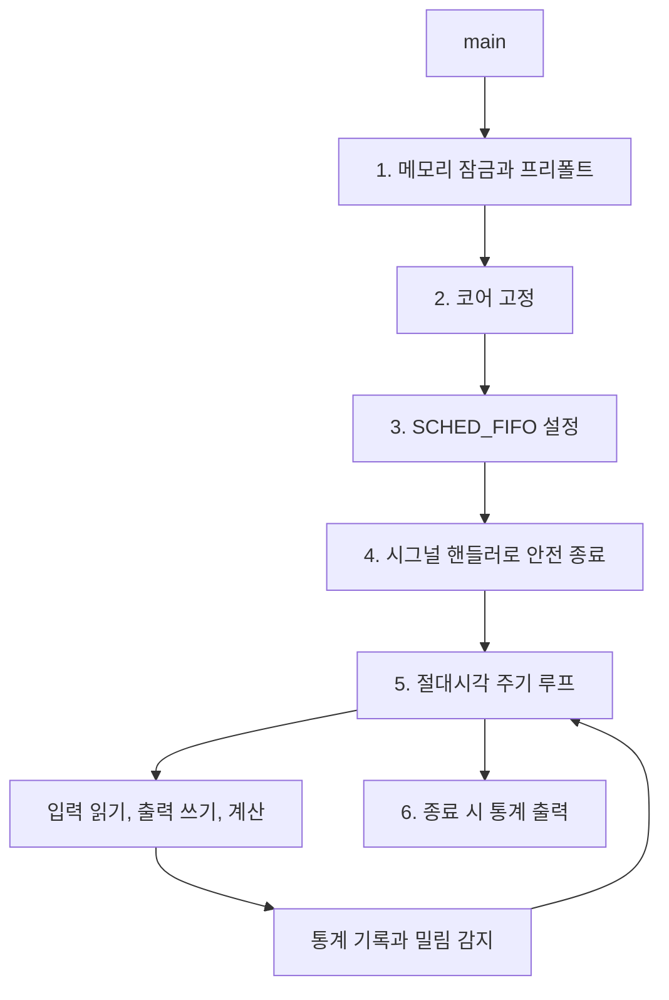
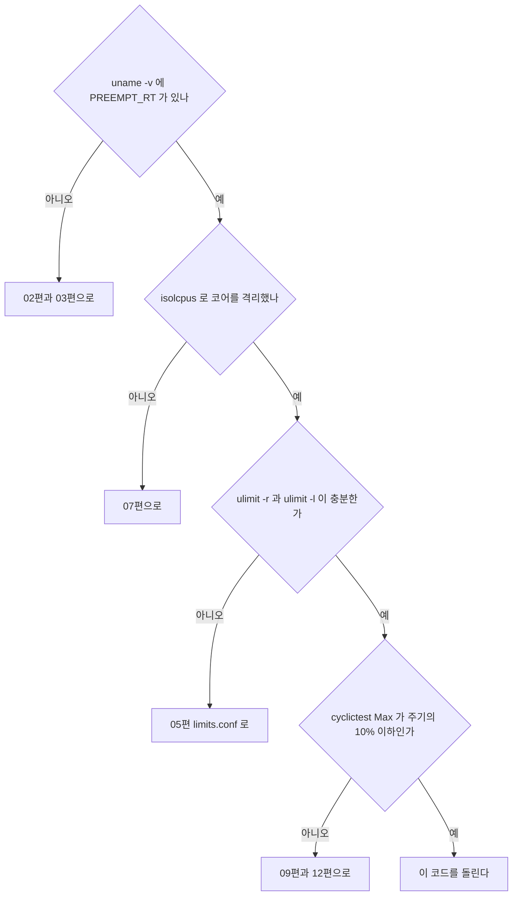

> **기준 출처:** [Linux Foundation RT HOWTO, Build an RT application](https://wiki.linuxfoundation.org/realtime/documentation/howto/applications/application_base) · [man 2 clock_nanosleep](https://man7.org/linux/man-pages/man2/clock_nanosleep.2.html) · [man 2 mlock](https://man7.org/linux/man-pages/man2/mlock.2.html) · [man 3 pthread_setschedparam](https://man7.org/linux/man-pages/man3/pthread_setschedparam.3.html) / 확인일 2026-08-07
> **시리즈:** [목차](/posts/00-rtos-series/) | 이전 → [10. 추적 도구 ftrace](/posts/10-tracing-ftrace-tracecmd/) | 다음 → [12. 실시간을 망치는 것들](/posts/12-what-breaks-realtime/)

이 코드는 컴파일과 실행 검증을 하지 않았다. 앞선 편들의 내용을 공개 문서에 따라 하나로 합친 구조 참고용이며, 실제로 쓰기 전에 대상 장비에서 빌드하고 측정해야 한다.

## 1. 이 코드가 담고 있는 것



## 2. 전체 코드

```c
/* rt_control.c, 1 kHz 실시간 제어 루프 골격
 *
 * 빌드:  gcc -O2 -Wall -o rt_control rt_control.c -lpthread -lrt
 * 권한:  sudo setcap cap_sys_nice,cap_ipc_lock=eip ./rt_control
 *        또는 limits.conf 에 rtprio 와 memlock 설정
 * 실행:  ./rt_control
 */
#define _GNU_SOURCE
#include <stdio.h>
#include <stdlib.h>
#include <string.h>
#include <stdint.h>
#include <errno.h>
#include <signal.h>
#include <unistd.h>
#include <pthread.h>
#include <sched.h>
#include <time.h>
#include <malloc.h>
#include <sys/mman.h>
#include <sys/resource.h>

/* --- 설정 --- */
#define PERIOD_NS            1000000L      /* 1 ms = 1 kHz */
#define RT_PRIORITY          85            /* 80~89 대역 */
#define RT_CORE              3             /* isolcpus 로 격리한 코어 */
#define BUDGET_NS            600000L       /* 실행시간 예산 = 주기의 60% */
#define OVERRUN_LIMIT        5             /* 연속 밀림 허용 횟수 */
#define PREFAULT_STACK_BYTES (512 * 1024)
#define PREFAULT_HEAP_BYTES  (8 * 1024 * 1024)
#define STAT_RING_N          4096          /* 2의 거듭제곱 */

/* --- 시간 헬퍼 --- */
static inline uint64_t ts_to_ns(const struct timespec *t)
{
    return (uint64_t)t->tv_sec * 1000000000ULL + (uint64_t)t->tv_nsec;
}

static inline uint64_t now_ns(void)
{
    struct timespec t;
    clock_gettime(CLOCK_MONOTONIC, &t);    /* REALTIME 을 쓰지 않는다 */
    return ts_to_ns(&t);
}

static inline void ts_add_ns(struct timespec *t, long ns)
{
    t->tv_nsec += ns;
    while (t->tv_nsec >= 1000000000L) { t->tv_nsec -= 1000000000L; t->tv_sec++; }
}

/* --- 통계, 락 없는 링버퍼 --- */
typedef struct {
    uint64_t seq;
    int64_t  wake_err_ns;   /* 깨어남 오차 = 릴리스 지터 */
    uint64_t exec_ns;       /* 실행시간 = C */
} sample_t;

static sample_t stat_ring[STAT_RING_N];
static volatile uint32_t stat_head;       /* 생산자만 갱신한다 */

static struct {
    uint64_t cycles, overruns, budget_over;
    int64_t  wake_min, wake_max;
    uint64_t exec_max;
} S = { .wake_min = INT64_MAX };

static inline void stat_push(uint64_t seq, int64_t wake, uint64_t exec)
{
    uint32_t h = stat_head;
    stat_ring[h & (STAT_RING_N - 1)] = (sample_t){ seq, wake, exec };
    __atomic_store_n(&stat_head, h + 1, __ATOMIC_RELEASE);

    if (wake < S.wake_min) S.wake_min = wake;
    if (wake > S.wake_max) S.wake_max = wake;
    if (exec > S.exec_max) S.exec_max = exec;
}

/* --- 1. 메모리 잠금과 프리폴트 --- */
static void prefault_stack(void)
{
    volatile unsigned char dummy[PREFAULT_STACK_BYTES];
    memset((void *)dummy, 0, sizeof(dummy));   /* 실제로 건드려야 페이지가 붙는다 */
}

static int rt_memory_init(void)
{
    if (mlockall(MCL_CURRENT | MCL_FUTURE) != 0) {
        fprintf(stderr, "mlockall 실패: %s (limits.conf 의 memlock 확인)\n",
                strerror(errno));
        return -1;
    }
    mallopt(M_TRIM_THRESHOLD, -1);    /* free 해도 OS 에 반납하지 않는다 */
    mallopt(M_MMAP_MAX, 0);

    void *p = malloc(PREFAULT_HEAP_BYTES);
    if (p) { memset(p, 0, PREFAULT_HEAP_BYTES); free(p); }

    prefault_stack();
    return 0;
}

/* --- 2. 코어 고정 --- */
static int pin_to_core(int core)
{
    cpu_set_t set;
    CPU_ZERO(&set);
    CPU_SET(core, &set);
    if (pthread_setaffinity_np(pthread_self(), sizeof(set), &set) != 0) {
        fprintf(stderr, "affinity 실패: %s\n", strerror(errno));
        return -1;
    }
    return 0;
}

/* --- 3. SCHED_FIFO --- */
static int make_realtime(int prio)
{
    struct sched_param sp = { .sched_priority = prio };
    if (pthread_setschedparam(pthread_self(), SCHED_FIFO, &sp) != 0) {
        fprintf(stderr, "SCHED_FIFO 실패: %s (ulimit -r 확인)\n", strerror(errno));
        return -1;
    }
    /* 설정됐는지 반드시 확인한다. 조용히 실패하는 경우가 있다 */
    int pol; struct sched_param got;
    pthread_getschedparam(pthread_self(), &pol, &got);
    if (pol != SCHED_FIFO || got.sched_priority != prio) {
        fprintf(stderr, "정책이 반영되지 않았다 (pol=%d prio=%d)\n",
                pol, got.sched_priority);
        return -1;
    }
    return 0;
}

/* --- 4. 안전 종료 --- */
static volatile sig_atomic_t running = 1;
static void on_signal(int sig) { (void)sig; running = 0; }

/* --- 제어 알고리즘 자리표시자 --- */
static double u_prev = 0.0;

static void read_sensors(double *y)   { *y = 0.0; /* 필드버스 PDO 등 */ }
static void write_outputs(double u)   { (void)u;  /* 토크 명령 출력 */ }
static double compute_control(double y)
{
    /* 여기에 제어 알고리즘. 동적 할당과 I/O 와 락은 금지다 */
    return -0.5 * y;
}

/* --- 5. 주기 루프 --- */
static void control_loop(void)
{
    struct timespec next;
    clock_gettime(CLOCK_MONOTONIC, &next);
    uint64_t seq = 0;
    int consecutive_overrun = 0;

    while (running) {
        ts_add_ns(&next, PERIOD_NS);          /* 목표 = 이전 목표 + T */

        int rc;
        do {
            rc = clock_nanosleep(CLOCK_MONOTONIC, TIMER_ABSTIME, &next, NULL);
        } while (rc == EINTR);                /* 시그널로 깨면 다시 잔다 */
        if (rc != 0 && running) {
            fprintf(stderr, "clock_nanosleep: %s\n", strerror(rc));
            break;
        }

        uint64_t t_wake   = now_ns();
        int64_t  wake_err = (int64_t)(t_wake - ts_to_ns(&next));

        /* --- 주기 본체: 입출력을 앞에 몰아 지연을 고정한다 --- */
        double y;
        read_sensors(&y);            /* 항상 주기 시작 시각에 읽는다 */
        write_outputs(u_prev);       /* 지난 주기에 계산한 값을 지금 낸다 */
        u_prev = compute_control(y); /* 계산은 그 다음. 시간이 흔들려도 무관하다 */
        /* ------------------------------------------------------ */

        uint64_t exec_ns = now_ns() - t_wake;

        S.cycles++;
        stat_push(seq++, wake_err, exec_ns);

        /* 예산 감시 */
        if (exec_ns > (uint64_t)BUDGET_NS) S.budget_over++;

        /* 밀림 감지와 복구, 건너뛰기 정책 */
        struct timespec now_ts;
        clock_gettime(CLOCK_MONOTONIC, &now_ts);
        if (ts_to_ns(&now_ts) > ts_to_ns(&next) + (uint64_t)PERIOD_NS) {
            S.overruns++;
            if (++consecutive_overrun > OVERRUN_LIMIT) {
                fprintf(stderr, "연속 밀림 %d회, 안전 상태로 전환\n",
                        consecutive_overrun);
                write_outputs(0.0);
                break;
            }
            while (ts_to_ns(&now_ts) > ts_to_ns(&next))
                ts_add_ns(&next, PERIOD_NS);   /* 놓친 주기를 버리고 위상 복구 */
        } else {
            consecutive_overrun = 0;
        }
    }

    write_outputs(0.0);   /* 종료 시 안전 출력 */
}

/* --- 6. 결과 출력 --- */
static void report(void)
{
    struct rusage ru;
    getrusage(RUSAGE_SELF, &ru);

    printf("\n===== 실행 결과 =====\n");
    printf("사이클 수      : %llu\n", (unsigned long long)S.cycles);
    printf("깨어남 오차    : min %+lld ns   max %+lld ns\n",
           (long long)S.wake_min, (long long)S.wake_max);
    printf("실행시간 최대  : %llu ns  (예산 %ld ns)\n",
           (unsigned long long)S.exec_max, (long)BUDGET_NS);
    printf("예산 초과      : %llu 회\n", (unsigned long long)S.budget_over);
    printf("주기 밀림      : %llu 회\n", (unsigned long long)S.overruns);
    printf("페이지 폴트    : minor %ld   major %ld\n",
           ru.ru_minflt, ru.ru_majflt);
    printf("자발 스위치    : %ld   비자발 %ld\n",
           ru.ru_nvcsw, ru.ru_nivcsw);
}

/* --- main --- */
int main(void)
{
    struct sigaction sa = { .sa_handler = on_signal };
    sigemptyset(&sa.sa_mask);
    sigaction(SIGINT,  &sa, NULL);
    sigaction(SIGTERM, &sa, NULL);

    if (rt_memory_init()   != 0) return 1;
    if (pin_to_core(RT_CORE) != 0) return 1;
    if (make_realtime(RT_PRIORITY) != 0) return 1;

    printf("코어 %d, SCHED_FIFO %d, 주기 %ld ns 로 시작\n",
           sched_getcpu(), RT_PRIORITY, PERIOD_NS);

    struct rusage before;
    getrusage(RUSAGE_SELF, &before);

    control_loop();

    report();
    printf("(루프 전 minor 폴트: %ld)\n", before.ru_minflt);
    return 0;
}
```

## 3. 코드에서 눈여겨볼 다섯 곳

| # | 위치 | 왜 |
| --- | --- | --- |
| 1 | `ts_add_ns(&next, PERIOD_NS)` | 이전 목표에 T를 더한다. 지금에 더하면 드리프트가 누적된다 |
| 2 | `while (rc == EINTR)` | 빼먹으면 시그널 하나에 주기가 깨진다 |
| 3 | `read`, `write`, `compute` 순서 | 입출력 지연을 한 주기로 고정한다 |
| 4 | `pthread_getschedparam` 재확인 | 정책 설정이 조용히 실패하는 경우를 잡는다 |
| 5 | `ru_minflt` 비교 | 루프 중 페이지 폴트 0이 프리폴트가 됐다는 증거다 |

## 4. 돌리기 전 체크리스트



```bash
# 사전 확인 명령 모음
uname -v | grep -o PREEMPT_RT
cat /sys/devices/system/cpu/isolated
ulimit -r; ulimit -l
sudo cyclictest -m -p 80 -i 1000 -a 3 -q -D 5m
```

## 5. 결과 읽는 법

```text
===== 실행 결과 =====
사이클 수      : 600000
깨어남 오차    : min -1200 ns   max +18400 ns
실행시간 최대  : 143000 ns  (예산 600000 ns)
예산 초과      : 0 회
주기 밀림      : 0 회
페이지 폴트    : minor 3412   major 0
자발 스위치    : 600001   비자발 3
```

| 항목 | 좋은 값 | 나쁘면 |
| --- | --- | --- |
| 깨어남 오차 max | 주기의 5% 이내, 1 ms면 50 µs | 09편과 12편으로 |
| 실행시간 max | 예산 이내 | 코드 최적화와 주기 재검토 |
| 주기 밀림 | 0 | 위 둘 중 하나가 원인이다 |
| major 폴트 | 0 | 스왑을 끄고 `mlockall`을 확인한다 |
| minor 폴트 증가 | 0 | 프리폴트가 부족하다 |
| 비자발 스위치 | 0에 가깝게 | 크면 격리가 안 됐다 |

`ru_nivcsw`(비자발 컨텍스트 스위치)가 이 표에서 진단력이 가장 높다. 이 값이 크다는 것은 누군가 내 태스크를 선점하고 있다는 직접 증거다. 코어 격리가 제대로 됐다면 0에 가까워야 한다. `ru_nvcsw`(자발)는 매 주기 `clock_nanosleep`으로 잠들기 때문에 사이클 수만큼 나오는 것이 정상이다.

## 6. 여기서 더 나아가려면

| 다음 단계 | 어디로 |
| --- | --- |
| 남은 스파이크의 원인을 찾는다 | [10편 ftrace](/posts/10-tracing-ftrace-tracecmd/), [12편 체크리스트](/posts/12-what-breaks-realtime/) |
| 필드버스 슬레이브를 붙인다 | [13편](/posts/13-ethercat-master-on-linux/) |
| 로깅 스레드를 추가한다 | [이론 14편](/posts/14-task-ipc-synchronization/). 링버퍼 소비자를 `SCHED_OTHER`로 둔다 |
| 태스크를 여럿으로 나눈다 | [이론 07편](/posts/07-response-time-analysis/)으로 스케줄 가능성을 검증한다 |
| 이 주기로 안 되면 | [이론 16편](/posts/16-rtos-kernel-freertos-zephyr/). MCU로 내린다 |

## 정리

- 이 골격은 앞선 리눅스 편들과 이론 편들을 하나로 합친 것이다.
- 초기화 순서는 메모리 잠금과 프리폴트, 코어 고정, `SCHED_FIFO`, 시그널 핸들러다.
- 루프의 요점 셋은 절대시각 대기, `EINTR` 재시도, 입력과 출력을 앞에 몰기다.
- 설정이 조용히 실패하는 것을 막기 위해 `pthread_getschedparam`으로 되읽어 확인한다.
- 통계는 락 없는 링버퍼에 숫자만 쌓고 출력은 종료 후에 한다.
- 밀림 처리는 건너뛰기와 카운터, 연속 시 안전 상태 전환이다.
- 결과 판정에서 진단력이 가장 높은 값은 비자발 스위치와 페이지 폴트 증가분이다.
- 이 코드는 컴파일 검증을 하지 않았다. 대상 장비에서 빌드하고 `cyclictest`로 환경을 먼저 확인한다.

## 참고

- [Linux Foundation RT — HOWTO: Build an RT application](https://wiki.linuxfoundation.org/realtime/documentation/howto/applications/application_base)
- [man 2 clock_nanosleep](https://man7.org/linux/man-pages/man2/clock_nanosleep.2.html)
- [man 2 mlock](https://man7.org/linux/man-pages/man2/mlock.2.html)
- [man 3 pthread_setschedparam](https://man7.org/linux/man-pages/man3/pthread_setschedparam.3.html)