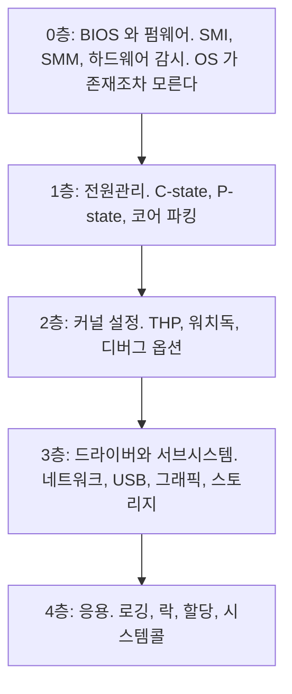
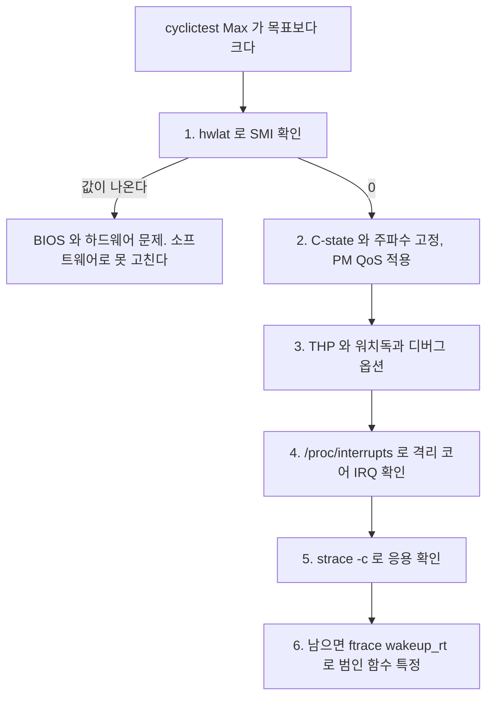

> **기준 출처:** [Linux kernel CPU Idle](https://docs.kernel.org/admin-guide/pm/cpuidle.html) · [intel_pstate](https://docs.kernel.org/admin-guide/pm/intel_pstate.html) · [Transparent Hugepage](https://www.kernel.org/doc/html/latest/admin-guide/mm/transhuge.html) · [Linux Foundation RT Debugging steps](https://wiki.linuxfoundation.org/realtime/documentation/howto/debugging/debug-steps) / 확인일 2026-08-07
> **시리즈:** [목차](/posts/00-rtos-series/) | 이전 → [11. 1 kHz 제어 루프 C 코드](/posts/11-realtime-control-loop-c/) | 다음 → [13. 리눅스에서 EtherCAT 마스터](/posts/13-ethercat-master-on-linux/)

## 1. 층별 체크리스트

RT 커널과 코어 격리까지 다 했는데도 스파이크가 남는다면 아래를 위에서부터 확인한다. 위쪽일수록 소프트웨어로 고치기 어렵다.



## 2. 0층, SMI와 SMM

System Management Interrupt는 CPU를 OS 몰래 펌웨어 모드(SMM)로 전환한다. OS는 이 시간을 관측조차 못 하고 시간이 그냥 사라진 것처럼 보인다.

| SMI를 일으키는 것 | 흔한 예 |
| --- | --- |
| 하드웨어 감시 | 온도, 팬 속도, 전압 모니터링 |
| USB legacy 지원 | USB 키보드를 PS/2처럼 보이게 하는 에뮬레이션 |
| ECC 메모리 오류 처리 | |
| TPM과 보안 기능 | |
| 전원 버튼과 배터리 이벤트 | |

```bash
# hwlat 트레이서로 확인한다
cd /sys/kernel/debug/tracing
echo hwlat > current_tracer
echo 3 > tracing_cpumask
echo 1 > tracing_on
sleep 300
cat trace
# #1 inner/outer(us): 12/230    <- 230 µs 동안 CPU 가 사라졌다

# 일부 인텔 CPU 는 SMI 카운터를 제공한다
sudo rdmsr -a 0x34        # MSR_SMI_COUNT, msr-tools 필요
# 두 번 읽어 차이를 본다. 늘고 있으면 SMI 가 발생하는 중이다
```

| 대응 | 방법 |
| --- | --- |
| BIOS에서 끈다 | USB Legacy Support, 하드웨어 모니터링, Fan control, ErP, 불필요한 TPM |
| 실시간용 하드웨어를 고른다 | 산업용 보드 벤더는 RT 지원 BIOS 옵션을 제공하기도 한다 |
| 평가 단계에서 거른다 | 장비 도입 전에 `hwlat`을 돌려 본다 |

SMI는 소프트웨어로 고칠 수 없다. 이것만은 하드웨어와 BIOS 문제다. 그래서 장비를 고를 때 실시간 성능을 미리 재 봐야 한다. 사고 나서 알면 바꿀 수가 없다.

## 3. 1층, 전원관리

CPU가 놀 때 깊게 잠들면 전력은 아끼지만 깨어나는 데 시간이 걸린다.

| 상태 | 전력 | 전형적 복귀 지연 |
| --- | --- | --- |
| C0 | 최대 | 0 |
| C1 | | 약 1 µs |
| C3 | | 수십 µs |
| C6 이상 | 최소 | 수백 µs |

```bash
# 현재 C-state 확인
cat /sys/devices/system/cpu/cpu3/cpuidle/state*/name
# POLL C1 C1E C3 C6

# 각 상태에 얼마나 들어갔나
grep . /sys/devices/system/cpu/cpu3/cpuidle/state*/usage

# 부팅 파라미터로 제한한다
#    intel_idle.max_cstate=1 processor.max_cstate=1
#    또는 idle=poll, 전력을 많이 먹는다

# 런타임에 특정 상태만 끈다
echo 1 | sudo tee /sys/devices/system/cpu/cpu3/cpuidle/state3/disable
echo 1 | sudo tee /sys/devices/system/cpu/cpu3/cpuidle/state4/disable
```

가장 깔끔한 방법은 PM QoS다. 응용이 직접 지연 상한을 요구한다.

```c
/* PM QoS, 프로그램이 도는 동안만 적용된다 */
int fd = open("/dev/cpu_dma_latency", O_WRONLY);
int32_t target_us = 0;                    /* 허용 지연 0 µs = 깊은 C-state 금지 */
write(fd, &target_us, sizeof(target_us));
/* fd 를 닫으면 요구가 사라진다. 프로그램이 끝날 때까지 열어 둔다 */
```

PM QoS가 `idle=poll`보다 낫다. 부팅 파라미터는 시스템 전체에 항상 적용되어 전력 낭비가 크지만 PM QoS는 내 프로그램이 도는 동안만 적용된다.

주파수 쪽도 고정한다. 주파수가 바뀌는 순간에도 지연이 생기고, 무엇보다 실행시간이 달라져 $C$가 상수라는 [모델 가정](/posts/03-task-model-timing-params/)이 깨진다.

```bash
# 거버너를 성능 고정으로
sudo cpupower frequency-set -g performance

# 확인
cpupower frequency-info
grep MHz /proc/cpuinfo

# 터보 부스트 끄기, 주파수를 완전히 고정한다
echo 1 | sudo tee /sys/devices/system/cpu/intel_pstate/no_turbo
```

터보 부스트를 끄는 것이 반직관적이지만 옳다. 터보는 온도와 전력 여유에 따라 주파수를 올렸다 내렸다 하므로 같은 코드의 실행시간이 장비 온도에 따라 달라진다. 최고 성능보다 일정한 성능이 중요하다. [이론 01편](/posts/01-what-is-realtime/)의 결정성 요구가 여기서도 반복된다.

## 4. 2층, 커널 설정

| 항목 | 문제 | 대응 |
| --- | --- | --- |
| THP | `khugepaged`가 백그라운드에서 페이지를 모은다 | `echo never > /sys/kernel/mm/transparent_hugepage/enabled` |
| 커널 워치독 | 주기적으로 모든 코어를 깨운다 | `nowatchdog` 부팅 파라미터, `kernel.watchdog=0` |
| 디버그 옵션 | `DEBUG_PREEMPT`와 `PROVE_LOCKING`이 지연을 크게 늘린다 | 운용 커널에서 뺀다 |
| `vm.stat_interval` | 통계 갱신이 주기적으로 CPU를 쓴다 | 값을 크게 둔다. 예를 들어 300 |
| RCU 콜백 | 격리 코어에서 돌면 방해가 된다 | `rcu_nocbs=3` |
| `kswapd`와 메모리 압박 | 페이지 회수가 지연을 만든다 | 메모리 여유 확보, 스왑 끄기 |
| timer migration | 타이머가 격리 코어로 이동한다 | `kernel.timer_migration=0` |

```bash
# 한 번에 적용하는 예
echo never | sudo tee /sys/kernel/mm/transparent_hugepage/enabled
echo never | sudo tee /sys/kernel/mm/transparent_hugepage/defrag
sudo sysctl -w kernel.watchdog=0
sudo sysctl -w kernel.timer_migration=0
sudo sysctl -w vm.stat_interval=300
sudo swapoff -a
```

## 5. 3층, 드라이버와 서브시스템

| 원인 | 증상 | 대응 |
| --- | --- | --- |
| 네트워크 인터럽트 | 트래픽이 늘면 지연이 증가한다 | IRQ affinity, 실시간 NIC 분리 |
| USB | 꽂았다 뺄 때 큰 스파이크가 난다 | 운용 중 USB 사용 금지, USB legacy 끄기 |
| 그래픽 | 화면 갱신 시 지연이 생긴다 | 헤드리스 운용, `nomodeset` |
| 스토리지 I/O | 로그 쓰기와 동기화가 걸린다 | 로그를 tmpfs에, I/O를 다른 코어로 |
| `i2c`와 `spi` 폴링 드라이버 | 임의 구간에서 CPU를 점유한다 | 드라이버 검토, 격리 코어에서 제외 |
| ACPI 이벤트 | 배터리와 온도를 폴링한다 | 불필요하면 비활성화한다 |

```bash
# 어느 IRQ 가 많이 들어오는지
watch -n1 'cat /proc/interrupts'

# 커널 스레드 중 CPU 를 쓰는 것
top -H -b -n1 | head -30

# 격리 코어에 무엇이 도는지
ps -eo pid,psr,cls,rtprio,comm | awk '$2==3'
```

## 6. 4층, 응용 코드

[이론 12편](/posts/12-context-switch-cache-memory/)의 금기 목록과 같다.

| 금기 | 이유 | 대신 |
| --- | --- | --- |
| `printf`와 파일 로그 | 락과 I/O와 버퍼 할당이 겹친다 | 링버퍼와 낮은 우선순위 소비자 |
| `malloc`과 `new` | 상한이 없고 전역 락을 쓴다 | 초기화 때 전부 할당 |
| 무한 대기 락 | 블로킹 상한이 없다 | 타임아웃과 실패 처리 |
| 상속 없는 뮤텍스 | 우선순위 역전이 생긴다 | `PTHREAD_PRIO_INHERIT` |
| 예상 못 한 시스템 콜 | 커널 진입 비용과 블로킹 | 루프에서 시스템 콜을 센다 |
| `CLOCK_REALTIME` | 시계가 점프한다 | `CLOCK_MONOTONIC` |
| C++ 예외와 `std::vector::push_back` | 숨은 할당과 비결정성 | 고정 크기 컨테이너 |

```bash
# 루프가 어떤 시스템 콜을 부르는지 센다. 개발 중에만 쓴다
sudo strace -c -f -p $(pgrep control_app)
# 정상이라면 clock_nanosleep 만 사이클 수만큼 나와야 한다
```

`strace -c` 한 줄이 진단력이 크다. 실시간 루프에서 예상 못 한 시스템 콜인 `write`나 `futex`나 `mmap`이 보이면 그것이 지터원이다. 라이브러리가 몰래 부르는 경우가 많다.

## 7. 진단 순서



한 번에 하나씩 바꾸고 매번 측정한다. 그리고 효과 없는 설정은 되돌린다. 설정마다 전력이나 성능이나 기능 상실이라는 대가가 있고, 근거 없이 쌓인 설정은 나중에 아무도 못 건드린다. 무엇을 왜 켰는지 기록해 둔다.

## 8. 자주 쓰는 설정 모음

```bash
# /etc/default/grub, 부팅 파라미터
GRUB_CMDLINE_LINUX_DEFAULT="quiet \
  isolcpus=3 nohz_full=3 rcu_nocbs=3 irqaffinity=0-2 \
  intel_pstate=disable intel_idle.max_cstate=1 processor.max_cstate=1 \
  nosoftlockup nowatchdog nmi_watchdog=0 \
  audit=0 mce=off tsc=reliable"
```

```bash
#!/bin/bash
# rt-tune.sh, 런타임 튜닝. 매 부팅 시 실행한다
echo never > /sys/kernel/mm/transparent_hugepage/enabled
echo never > /sys/kernel/mm/transparent_hugepage/defrag
sysctl -w kernel.watchdog=0
sysctl -w kernel.timer_migration=0
sysctl -w vm.stat_interval=300
swapoff -a
cpupower frequency-set -g performance
echo 1 > /sys/devices/system/cpu/intel_pstate/no_turbo 2>/dev/null

# 인터럽트를 격리 코어에서 빼낸다
for irq in /proc/irq/[0-9]*; do
    echo 0-2 > $irq/smp_affinity_list 2>/dev/null
done
```

위 설정을 그대로 복사해 쓰지 않는다. `mce=off`처럼 하드웨어 오류 감지를 끄는 설정은 안전 관련 시스템에서 문제가 될 수 있고, `audit=0`은 보안 요구와 충돌할 수 있다. 각 항목이 무엇을 포기하는지 알고 고른다. 이 목록은 무엇을 검토할지의 목록이지 권장 설정이 아니다.

## 정리

- 층별로 위에서부터 확인한다. BIOS와 SMI, 전원관리, 커널, 드라이버, 응용 순이다.
- SMI는 OS가 관측조차 못 한다. `hwlat`으로만 잡히고 소프트웨어로 고칠 수 없다.
- C-state의 깊은 상태는 복귀에 수백 µs가 든다. PM QoS가 가장 깔끔하다.
- P-state는 성능 거버너로 고정하고 터보를 끈다. 최고 성능보다 일정한 성능이 중요하다.
- 2층에서는 THP를 `never`로, 워치독을 끄고, 디버그 옵션을 제거하고, `timer_migration`을 0으로 둔다.
- 3층에서는 네트워크 IRQ와 USB가 가장 흔한 원인이다. `/proc/interrupts`로 확인한다.
- 4층에서는 `strace -c`로 루프의 시스템 콜을 센다. `clock_nanosleep` 외에 뭐가 있으면 그것이 원인이다.
- 한 번에 하나씩 바꾸고 매번 측정한다. 효과 없으면 되돌리고 무엇을 왜 켰는지 기록한다.

## 참고

- [Linux kernel — CPU Idle](https://docs.kernel.org/admin-guide/pm/cpuidle.html)
- [Linux kernel — intel_pstate](https://docs.kernel.org/admin-guide/pm/intel_pstate.html)
- [Linux kernel — Transparent Hugepage](https://www.kernel.org/doc/html/latest/admin-guide/mm/transhuge.html)
- [Linux Foundation RT — Debugging steps](https://wiki.linuxfoundation.org/realtime/documentation/howto/debugging/debug-steps)