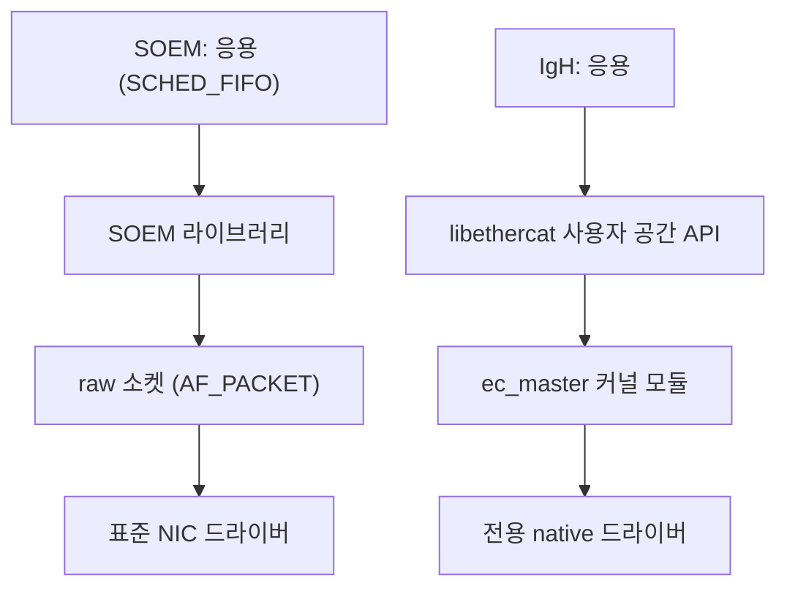
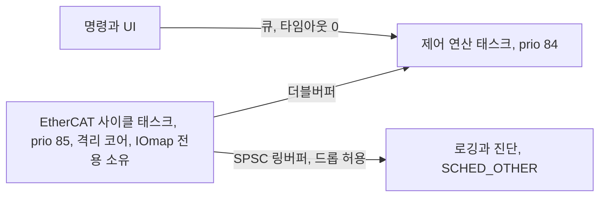
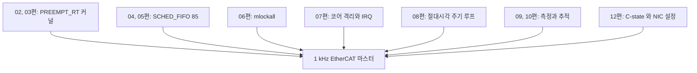

> **기준 출처:** [SOEM (Simple Open EtherCAT Master)](https://github.com/OpenEtherCATsociety/SOEM), GPLv2 · [IgH EtherCAT Master (EtherLab)](https://gitlab.com/etherlab.org/ethercat), GPLv2 · [ETG EtherCAT Technology](https://www.ethercat.org/en/technology.html) · [man 7 packet](https://man7.org/linux/man-pages/man7/packet.7.html) / 확인일 2026-08-07
> **시리즈:** [목차](/posts/00-rtos-series/) | 이전 → [12. 실시간을 망치는 것들](/posts/12-what-breaks-realtime/) | 다음 → [14. Xenomai 듀얼커널과 비교](/posts/14-xenomai-dual-kernel/)

EtherCAT 프로토콜 자체는 [로봇 통신 연재의 EtherCAT 17편](/posts/00-comm-series/)에서 다뤘다. 여기서는 마스터 쪽 실시간 요구만 본다.

## 1. 왜 이 조합이 실시간 이야기의 종착점인가

EtherCAT은 마스터가 주기적으로 프레임을 내보내는 구조다. 슬레이브는 프레임이 지나갈 때 데이터를 넣고 뺀다([on-the-fly 처리](/posts/02-on-the-fly-processing/)). 그래서 필드버스의 실시간성은 마스터 쪽 OS가 정한다. EtherCAT 프로토콜이 아무리 정밀해도 마스터가 프레임을 제때 안 보내면 그 사이클은 없는 것이다.


| 구간 | 지터 원인 | 크기 |
| --- | --- | --- |
| 마스터가 프레임을 만들어 보내는 시각 | OS 스케줄링과 지터 | 이 연재 전체가 다룬 것 |
| 프레임이 슬레이브들을 통과 | 하드웨어라 거의 결정적이다 | ns에서 µs |
| 슬레이브가 출력을 적용 | DC로 동기하면 결정적이다 | ns |

DC(Distributed Clocks)가 마스터 지터를 상당 부분 흡수한다. 슬레이브가 프레임이 도착한 순간이 아니라 약속된 시각에 출력을 적용하기 때문이다([분산 클록](/posts/09-distributed-clocks/)). 마스터가 조금 늦게 보내도 슬레이브들끼리는 여전히 동시에 움직인다.

그래도 마스터 지터가 무한정 허용되지는 않는다. 프레임이 약속된 시각보다 늦게 도착하면 그 사이클을 놓친다. 그리고 DC 시각 보정 자체가 마스터의 주기적 프레임에 실려 나가므로 마스터가 불안정하면 동기 품질이 떨어진다.

## 2. 두 가지 구현 방식



| | SOEM | IgH EtherCAT Master |
| --- | --- | --- |
| 위치 | 사용자 공간 | 커널 모듈 |
| 드라이버 | 표준 NIC 드라이버와 raw 소켓 | 전용 native 드라이버라 지연이 짧다 |
| 도입 난이도 | 쉽다. 라이브러리 링크만 하면 된다 | 커널 모듈 빌드와 NIC 지원 확인이 필요하다 |
| 커널 업그레이드 | 영향이 없다 | 모듈 재빌드가 필요하다 |
| 지터 | 소켓 계층을 거친다 | 더 낮다 |
| 라이선스 | GPLv2 | GPLv2 |
| 디버깅 | 사용자 공간이라 쉽다 | 커널 디버깅이 필요하다 |

먼저 SOEM으로 시작하는 것이 실용적이다. 도입이 훨씬 쉽고 PREEMPT_RT와 코어 격리를 제대로 하면 1 kHz는 대개 나온다. 그것으로 부족할 때 IgH를 검토한다. IgH는 native 드라이버로 소켓 계층을 건너뛰므로 지연이 짧지만 그만큼 유지보수 부담이 있다.

## 3. SOEM 마스터의 실시간 구조

```c
/* SOEM 주기 루프, 11편 골격에 EtherCAT 을 얹은 형태. 구조 참고용이다 */
#include "ethercat.h"

static char IOmap[4096];

static void ecat_cyclic(void)
{
    struct timespec next;
    clock_gettime(CLOCK_MONOTONIC, &next);

    while (running) {
        ts_add_ns(&next, PERIOD_NS);                    /* 1 ms */
        int rc;
        do { rc = clock_nanosleep(CLOCK_MONOTONIC, TIMER_ABSTIME, &next, NULL); }
        while (rc == EINTR);

        /* --- 주기 본체 --- */
        ec_receive_processdata(EC_TIMEOUTRET);          /* 지난 사이클 응답 수신 */

        /* 입력, 제어 계산, 출력. 출력은 다음 send 로 나간다 */
        read_inputs_from(IOmap);
        compute_control();
        write_outputs_to(IOmap);

        ec_send_processdata();                          /* 다음 프레임 송신 */

        /* 진단, WKC 로 통신 상태 확인 */
        int wkc = ec_receive_processdata(EC_TIMEOUTRET);
        if (wkc < expectedWKC) lost_frames++;
    }
}
```

`send`와 `receive`를 한 사이클 안에서 짝짓는 방식과 한 사이클 어긋나게 하는 방식이 있다. 어긋나게 하면 이번 사이클에 보내고 다음 사이클에 받으므로 프레임 왕복 시간이 주기 안에 들어가지 않아도 되어 여유가 생긴다. 대신 입출력 지연이 한 주기 늘어난다. [이론 11편](/posts/11-jitter-sources/)의 일정하게 느린 편이 낫다는 맞바꿈과 같다.

프로세스 데이터 접근은 락 없이 한다. 여러 태스크가 `IOmap`을 건드리면 [우선순위 역전](/posts/08-priority-inversion-mars-pathfinder/)이 생긴다. 사이클 태스크만 `IOmap`을 만지고 다른 태스크와는 [더블버퍼](/posts/14-task-ipc-synchronization/)로 주고받는다.



## 4. 네트워크 계층에서 신경 쓸 것

| 항목 | 왜 | 대응 |
| --- | --- | --- |
| 전용 NIC | 일반 트래픽과 섞이면 지터와 손실이 생긴다 | EtherCAT 전용 포트를 쓴다 |
| 인터럽트 coalescing | NIC이 인터럽트를 모았다 보내면 지연이 생긴다 | `ethtool -C ethX rx-usecs 0 tx-usecs 0` |
| 오프로딩 기능 | GRO와 LRO와 TSO가 프레임을 묶는다 | `ethtool -K ethX gro off lro off tso off gso off` |
| IRQ affinity | 격리 코어나 근처 코어로 보낸다 | [07편](/posts/07-cpu-isolation-irq-affinity/) |
| NAPI 폴링 | 부하가 높으면 폴링으로 전환된다 | 대개 유리하다 |
| `ethtool -c` 확인 | 기본값이 지연을 만들 수 있다 | 도입 시 반드시 확인한다 |

```bash
# EtherCAT 용 NIC 설정 예
sudo ethtool -C eth1 rx-usecs 0 rx-frames 1 tx-usecs 0 tx-frames 1
sudo ethtool -K eth1 gro off lro off tso off gso off rx off tx off
sudo ethtool -G eth1 rx 128 tx 128        # 링버퍼를 작게 두면 지연이 줄어든다
```

인터럽트 coalescing이 가장 자주 놓치는 항목이다. NIC은 기본적으로 인터럽트를 줄여 CPU를 아끼려고 프레임을 수십 µs씩 모은다. 처리량에는 좋지만 1 ms 주기 제어에는 치명적이다. `ethtool -c`로 현재 값을 확인하고 0으로 내린다.

## 5. 무엇을 재야 하나

| 지표 | 어떻게 | 목표 |
| --- | --- | --- |
| 사이클 지터 | 마스터에서 송신 시각을 기록한다 | 주기의 5% 이내 |
| WKC (Working Counter) | `ec_receive_processdata()` 반환값 | 매 사이클 기대값과 일치 |
| Lost frame | WKC 불일치 횟수 | 0 |
| DC 오프셋 | 슬레이브 DC 레지스터 | 수백 ns 이내 |
| CRC 오류 카운터 | 슬레이브 진단 레지스터 | 증가하지 않아야 한다 |

WKC를 매 사이클 확인하는 것이 EtherCAT 마스터의 기본 위생이다. 프레임이 정상 왕복하면 WKC가 기대값과 같고 슬레이브 하나가 응답을 못 하면 값이 줄어든다. 이 검사를 안 하면 통신이 끊긴 채로 계속 도는 상태가 된다. 상세는 [진단 편](/posts/16-diagnostics-wkc-crc-counters/)에서 다뤘다.

그리고 CRC 카운터가 늘고 있으면 케이블이나 커넥터 문제다. 실시간 튜닝을 아무리 해도 안 고쳐지므로 원인을 층에서 먼저 가른다.

## 6. 리눅스 편 전체가 여기로 모인다



EtherCAT 마스터는 리눅스 편에서 배운 것을 전부 쓰는 응용이다. 하나라도 빠지면 대개는 되는데 가끔 프레임을 놓치는 시스템이 된다. 그리고 그 가끔이 하필 로봇이 빠르게 움직일 때 나온다. 그때 CPU 부하가 제일 높기 때문이다.

## 정리

- 필드버스의 실시간성은 마스터 쪽 OS가 정한다. EtherCAT이 정밀해도 마스터가 늦으면 그 사이클은 없다.
- DC가 마스터 지터를 상당 부분 흡수하지만 무한정은 아니다.
- SOEM은 사용자 공간이라 도입이 쉽고 IgH는 커널 모듈이라 지연이 짧다. SOEM으로 시작한다.
- `IOmap`은 사이클 태스크만 소유하고 다른 태스크와는 더블버퍼나 링버퍼로 주고받는다.
- NIC의 인터럽트 coalescing을 0으로 내린다. 가장 자주 놓치는 항목이다.
- 오프로딩을 끄고 링버퍼를 작게 두고 전용 NIC을 쓴다.
- WKC를 매 사이클 확인한다. 안 하면 통신이 끊긴 채로 계속 도는 상태가 된다.
- CRC 카운터가 늘면 케이블 문제다. 실시간 튜닝으로 안 고쳐지니 층을 먼저 가른다.

## 참고

- [SOEM — Simple Open EtherCAT Master](https://github.com/OpenEtherCATsociety/SOEM)
- [IgH EtherCAT Master (EtherLab)](https://gitlab.com/etherlab.org/ethercat)
- [ETG — EtherCAT Technology](https://www.ethercat.org/en/technology.html)
- [man 7 packet](https://man7.org/linux/man-pages/man7/packet.7.html)