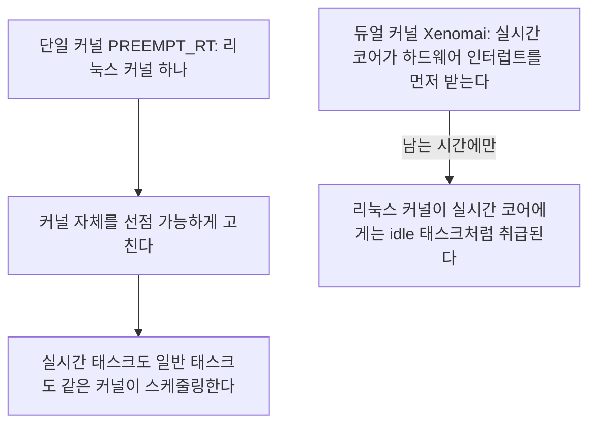
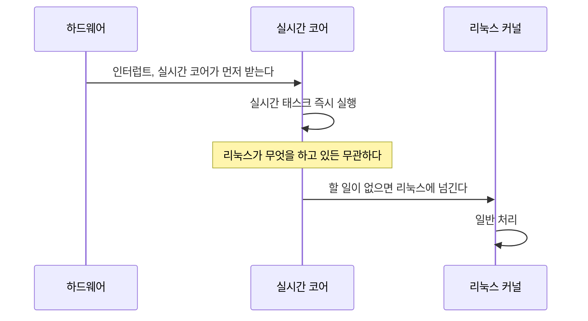
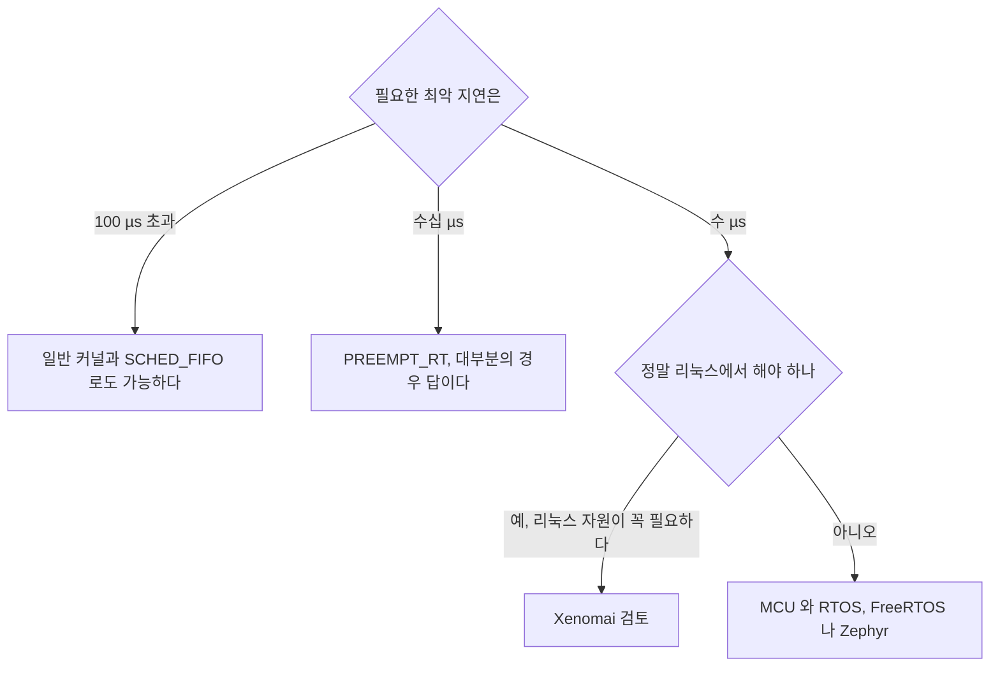

> **기준 출처:** [Xenomai 프로젝트 wiki](https://source.denx.de/Xenomai/xenomai/-/wikis/home) · [EVL / Xenomai 4 프로젝트](https://evlproject.org/) · [Linux Foundation Real-Time Linux](https://wiki.linuxfoundation.org/realtime/start) / 확인일 2026-08-07
> **시리즈:** [목차](/posts/00-rtos-series/) | 이전 → [13. 리눅스에서 EtherCAT 마스터](/posts/13-ethercat-master-on-linux/) | 다음 → [윈도우 01. 윈도우는 왜 실시간이 아닌가](/posts/01-why-windows-not-realtime/)

## 1. 두 가지 접근

리눅스로 실시간을 하는 방법에 근본적으로 다른 두 갈래가 있다.

| | PREEMPT_RT | Xenomai (듀얼 커널) |
| --- | --- | --- |
| 구조 | 리눅스 커널 하나를 고친다 | 리눅스 옆에 작은 실시간 커널을 둔다 |
| 인터럽트 | 리눅스가 받는다 | 실시간 코어가 먼저 받는다 |
| 리눅스의 지위 | 그대로다 | 실시간 코어 입장에서 가장 낮은 우선순위 태스크다 |
| API | 표준 POSIX. `pthread`와 `clock_nanosleep` | 전용 API. Alchemy나 POSIX 스킨 |
| 최악 지연 | 수십 µs | 수 µs |
| 드라이버 | 리눅스 드라이버 전부 | 실시간 경로용 드라이버를 따로 만들어야 한다 (RTDM) |
| 유지보수 | 메인라인, 커널 6.12 이후 | 커널 버전마다 포팅이 필요하다 |

차이의 뿌리는 리눅스를 신뢰하는가다. PREEMPT_RT는 리눅스 커널을 고쳐서 믿을 만하게 만든다. Xenomai는 리눅스를 믿지 않고 옆으로 밀어낸다. 실시간 코어가 인터럽트를 먼저 가로채고 리눅스는 남는 시간에만 돈다.

## 2. 듀얼 커널이 더 빠른 이유

리눅스가 인터럽트를 꺼도 실시간 코어는 영향을 받지 않는다. [01편](/posts/01-why-linux-not-realtime/)에서 본 커널과 드라이버가 최악 지연을 정한다는 문제가 구조적으로 사라진다. 리눅스가 아무리 나쁘게 굴어도 실시간 코어 위의 태스크는 막지 못한다. 듀얼 커널이 수 µs대 최악 지연을 내는 이유가 여기 있다.

## 3. 그런데 대가가 크다

| 대가 | 내용 |
| --- | --- |
| 전용 API | 표준 `pthread`와 `clock_nanosleep`이 아니라 Xenomai API를 써야 한다. POSIX 스킨이 있지만 완전 호환은 아니다 |
| 드라이버를 다시 만든다 | 리눅스 드라이버는 실시간 경로에서 못 쓴다. RTDM으로 따로 작성한다 |
| 모드 전환 함정 | 실시간 태스크가 실수로 리눅스 시스템 콜을 부르면 secondary mode로 떨어져 실시간성을 잃는다 |
| 유지보수 | 커널 버전마다 포팅해야 한다. 메인라인이 아니다 |
| 인력 | 다룰 줄 아는 사람이 훨씬 적다 |

모드 전환이 실무에서 가장 까다롭다. 실시간 태스크가 `printf` 하나만 불러도 리눅스 쪽으로 넘어가고 그 순간 실시간 보장이 사라진다. 에러가 나지 않고 조용히 느려진다. Xenomai는 이것을 잡으라고 `SIGDEBUG` 시그널과 모드 전환 카운터를 제공하는데, 그 카운터를 감시하지 않으면 실시간인 줄 알고 아닌 시스템을 돌리게 된다.

## 4. 지금 어느 쪽을 고를 것인가

2020년대 중반의 실무 기본값은 PREEMPT_RT다. 이유가 셋이다. 메인라인에 들어가서 유지보수 부담이 크게 줄었고, 표준 POSIX API를 쓰므로 코드가 이식 가능하고 배우는 비용이 낮고 도구가 다 통하며, 드라이버를 그대로 쓸 수 있다. 마지막 항목이 리눅스를 쓰는 이유 자체다.

Xenomai는 수 µs가 정말로 필요하고 그런데도 리눅스여야 하는 좁은 경우에 남는다. 그리고 그 경우 대부분은 MCU로 내리는 것이 더 나은 답이다. µs급 제어는 애초에 MCU의 영역이고 거기서는 지연이 훨씬 작으면서 검증도 쉽다.

[이론 16편](/posts/16-rtos-kernel-freertos-zephyr/)에서 본 층 구조로 가면 리눅스를 µs급으로 만드는 문제 자체가 없어진다. µs가 필요한 일을 MCU에 두면 되기 때문이다. Xenomai를 고민하고 있다면 먼저 이 일을 정말 이 CPU에서 해야 하는지를 물어보는 것이 낫다.

## 5. 다른 접근들

| 이름 | 방식 | 상태 |
| --- | --- | --- |
| RTAI | 듀얼 커널. Xenomai와 뿌리가 같다 | 활동이 줄었다 |
| Xenomai 3 | 듀얼 커널. I-pipe와 Dovetail 기반 | 유지 중이다 |
| EVL / Xenomai 4 | Dovetail 기반으로 구조를 단순화했다 | 개발 중이다 |
| Jailhouse | 하이퍼바이저로 코어와 장치를 물리적으로 분리한다 | 리눅스와 RTOS를 한 칩에서 나란히 둔다 |
| AMP (이종 코어) | 하드웨어로 분리한다. 리눅스는 A코어, RTOS는 M코어 | 로봇 컨트롤러에서 흔하다 |

AMP가 요즘 가장 실용적인 답인 경우가 많다. 응용 프로세서 옆에 Cortex-M 코어가 붙어 있는 SoC를 쓰면 제어는 M 코어의 RTOS에서 µs급으로 돌리고 리눅스는 UI와 네트워크만 맡는다. 소프트웨어로 억지로 나누는 대신 하드웨어가 이미 나눠져 있어서 격리가 확실하고 검증도 쉽다.

## 리눅스 편을 마치며

14편을 세 줄로 줄이면 이렇게 된다.

1. 리눅스는 공평성을 최적화하도록 만들어졌고 실시간은 그것을 하나씩 되돌리는 과정이다. 스케줄링 클래스, 커널 선점, 메모리 잠금, 코어 격리, 전원관리가 그 목록이다.
2. 각 단계마다 처리량이나 전력이나 코어 하나라는 대가가 있다. 그래서 한 번에 하나씩 바꾸고 매번 측정한다.
3. 현실적 목표는 1 kHz에 최악 지터 수십 µs다. 그 이상이 필요하면 리눅스를 더 조이는 것보다 일을 MCU로 내리는 것이 옳다.

## 정리

- 두 접근은 PREEMPT_RT가 커널을 고치는 쪽이고 Xenomai가 옆에 실시간 코어를 두는 쪽이다.
- 듀얼 커널이 빠른 이유는 실시간 코어가 인터럽트를 먼저 받고 리눅스가 그 아래 태스크이기 때문이다.
- 대가는 전용 API, RTDM 드라이버 재작성, 모드 전환 함정, 커널마다 포팅, 인력이다.
- 모드 전환은 조용히 일어난다. `printf` 하나로 실시간성을 잃으므로 카운터를 감시해야 한다.
- 실무 기본값은 PREEMPT_RT다. 메인라인이고 표준 POSIX를 쓰고 드라이버를 그대로 쓴다.
- Xenomai는 수 µs가 필요한데 그래도 리눅스여야 하는 좁은 경우에 남는다.
- 그 경우 대부분의 더 나은 답은 층을 나누는 것이다. µs는 MCU, ms는 리눅스 RT, 연성은 일반 OS다.
- AMP는 소프트웨어 분리를 하드웨어 분리로 바꾼 것이다. 검증이 훨씬 쉽다.

## 참고

- [Xenomai 프로젝트 wiki](https://source.denx.de/Xenomai/xenomai/-/wikis/home)
- [EVL / Xenomai 4](https://evlproject.org/)
- [Linux Foundation — Real-Time Linux](https://wiki.linuxfoundation.org/realtime/start)