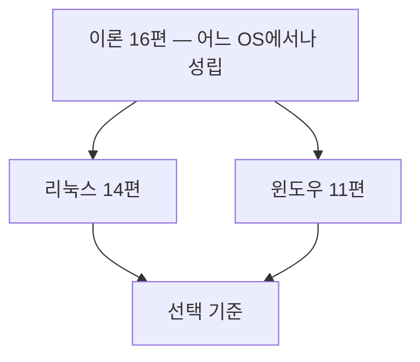

> **기준 출처:** [Linux Foundation Real-Time wiki](https://wiki.linuxfoundation.org/realtime/start) · [Linux kernel 스케줄러 문서](https://www.kernel.org/doc/html/latest/scheduler/index.html) · [Microsoft Learn Scheduling](https://learn.microsoft.com/en-us/windows/win32/procthread/scheduling) · [FreeRTOS 문서](https://www.freertos.org/Documentation/00-Overview) · Liu & Layland 1973 / 확인일 2026-08-07

RTOS 공부가 "FreeRTOS 사용법"으로 끝나는 경우가 많다. 그런데 실제로 부딪히는 문제는 특정 RTOS의 API가 아니라 어느 OS에서든 똑같이 나타나는 시간 문제다. 같은 문제를 이름만 바꿔 세 번 만나게 된다.

| 같은 문제 | 이론에서 부르는 이름 | 리눅스에서 | 윈도우에서 |
| --- | --- | --- | --- |
| 급한 일이 늦게 실행된다 | 우선순위, 선점 | `SCHED_FIFO` + `chrt` | 우선순위 클래스 × 스레드 레벨 |
| 낮은 일이 높은 일을 막는다 | 우선순위 역전 | `PTHREAD_PRIO_INHERIT` | 커널 내부에서만 처리 |
| 주기가 들쭉날쭉하다 | 지터 | `clock_nanosleep(ABSTIME)` | 타이머 해상도 + spin |
| 가끔 크게 튄다 | 최악실행시간, 커널 지연 | `PREEMPT_RT` | DPC/ISR 지연 |
| 첫 실행만 유난히 느리다 | 페이지 폴트, 캐시 미스 | `mlockall` | `VirtualLock` |

그래서 연재를 세 갈래로 나눴다.

| 갈래 | 편수 | 무엇 |
| --- | --- | --- |
| 이론 | 16 | 어느 OS를 쓰든 똑같이 성립하는 것 |
| 리눅스 | 14 | 리눅스를 실시간으로 쓰는 법 |
| 윈도우 | 11 | 윈도우를 실시간에 가깝게 쓰는 법, 그리고 한계 |

## 이 연재로 얻으려는 것

1. "이 제어 루프는 몇 kHz까지 올릴 수 있나"라는 질문에 근거를 대고 답한다.
2. 루프가 가끔 튀었을 때 어느 층에서 튀었는지 좁혀 들어간다. 후보는 스케줄러, 인터럽트, 메모리, 전원관리다.
3. 리눅스, 윈도우, MCU 중 어디에 무엇을 올릴지 스스로 고른다.

## 읽는 순서

이론을 먼저 읽는다. 이론을 건너뛰면 나머지 두 갈래가 명령어 모음으로 읽힌다. `chrt -f 80`이 무슨 뜻인지는 리눅스 문서가 알려주지만, 80을 왜 80으로 두는지는 이론 05편과 07편이 알려준다.

리눅스와 윈도우는 서로 독립이라 순서가 없다. 다만 둘 다 읽으면 같은 문제를 두 OS가 얼마나 다르게 푸는지 보이고, 그게 곧 OS를 고르는 기준이 된다.

## 1부. 이론 — 무엇이 실시간인가

| # | 글 |
| --- | --- |
| 01 | [실시간이란 무엇인가, 빠름이 아니라 기한](/posts/01-what-is-realtime/) |
| 02 | [경성, 연성, 준경성 실시간](/posts/02-hard-soft-firm-realtime/) |
| 03 | [태스크 모델과 시간 파라미터 T, C, D, R](/posts/03-task-model-timing-params/) |

## 2부. 이론 — 스케줄링

| # | 글 |
| --- | --- |
| 04 | [스케줄링 기초, 선점과 우선순위](/posts/04-scheduling-preemption-priority/) |
| 05 | [RM 고정우선순위와 69%의 벽](/posts/05-rate-monotonic-utilization-bound/) |
| 06 | [EDF, 마감이 급한 순서](/posts/06-edf-dynamic-priority/) |
| 07 | [응답시간 분석, 손으로 계산하기](/posts/07-response-time-analysis/) |

## 3부. 이론 — 공유자원이 만드는 문제

| # | 글 |
| --- | --- |
| 08 | [우선순위 역전과 Mars Pathfinder](/posts/08-priority-inversion-mars-pathfinder/) |
| 09 | [우선순위 상속과 천장 프로토콜](/posts/09-priority-inheritance-ceiling/) |

## 4부. 이론 — 실행시간을 흔드는 것들

| # | 글 |
| --- | --- |
| 10 | [인터럽트와 태스크의 관계](/posts/10-interrupts-and-tasks/) |
| 11 | [지터는 어디서 생기고 왜 성능이 되나](/posts/11-jitter-sources/) |
| 12 | [컨텍스트 스위치, 캐시, 메모리](/posts/12-context-switch-cache-memory/) |
| 13 | [WCET와 실행시간 예산](/posts/13-wcet-execution-budget/) |

## 5부. 이론 — 만드는 쪽

| # | 글 |
| --- | --- |
| 14 | [태스크 간 통신과 동기화](/posts/14-task-ipc-synchronization/) |
| 15 | [멀티코어 실시간](/posts/15-multicore-realtime/) |
| 16 | [RTOS 커널 구조, FreeRTOS와 Zephyr](/posts/16-rtos-kernel-freertos-zephyr/) |

## 6부. 리눅스 — 기본 리눅스의 한계

| # | 글 |
| --- | --- |
| 01 | [리눅스는 왜 실시간이 아닌가](/posts/01-why-linux-not-realtime/) |
| 02 | [커널 프리엠션 모델 네 단계](/posts/02-kernel-preemption-models/) |
| 03 | [PREEMPT_RT가 실제로 바꾸는 것](/posts/03-what-preempt-rt-does/) |

## 7부. 리눅스 — 정책과 자원

| # | 글 |
| --- | --- |
| 04 | [POSIX 실시간 스케줄링 정책](/posts/04-posix-realtime-scheduling/) |
| 05 | [우선순위 설계와 권한](/posts/05-priority-design-permissions/) |
| 06 | [메모리 잠그기, mlockall](/posts/06-lock-memory-mlockall/) |
| 07 | [CPU 격리와 인터럽트 배치](/posts/07-cpu-isolation-irq-affinity/) |

## 8부. 리눅스 — 실제로 루프를 돌린다

| # | 글 |
| --- | --- |
| 08 | [주기 루프 타이머](/posts/08-periodic-loop-timer/) |
| 09 | [지연시간 측정, cyclictest](/posts/09-latency-measurement-cyclictest/) |
| 10 | [추적 도구, ftrace와 trace-cmd](/posts/10-tracing-ftrace-tracecmd/) |
| 11 | [1 kHz 제어 루프 C 코드 골격](/posts/11-realtime-control-loop-c/) |

## 9부. 리눅스 — 망치는 것들과 실전

| # | 글 |
| --- | --- |
| 12 | [실시간을 망치는 것들](/posts/12-what-breaks-realtime/) |
| 13 | [리눅스에서 EtherCAT 마스터](/posts/13-ethercat-master-on-linux/) |
| 14 | [Xenomai 듀얼커널과 비교](/posts/14-xenomai-dual-kernel/) |

## 10부. 윈도우 — 구조와 한계

| # | 글 |
| --- | --- |
| 01 | [윈도우는 왜 실시간이 아닌가](/posts/01-why-windows-not-realtime/) |
| 02 | [윈도우 스케줄러 구조](/posts/02-windows-scheduler-structure/) |

## 11부. 윈도우 — 재본다

| # | 글 |
| --- | --- |
| 03 | [스레드 우선순위 실전](/posts/03-thread-priority-in-practice/) |
| 04 | [타이머 해상도와 시간 측정](/posts/04-timer-resolution-measurement/) |
| 05 | [DPC와 ISR 지연](/posts/05-dpc-isr-latency/) |

## 12부. 윈도우 — 방해 요인

| # | 글 |
| --- | --- |
| 06 | [MMCSS, 멀티미디어 클래스 스케줄러](/posts/06-mmcss-multimedia-scheduler/) |
| 07 | [전원관리와 코어 파킹](/posts/07-power-management-core-parking/) |
| 08 | [페이징과 메모리 잠금](/posts/08-paging-memory-locking/) |

## 13부. 윈도우 — 확장과 선택

| # | 글 |
| --- | --- |
| 09 | [실시간 확장, RTX64와 INtime](/posts/09-realtime-extensions-rtx64-intime/) |
| 10 | [TwinCAT, 윈도우에서 산업제어](/posts/10-twincat-industrial-control/) |
| 11 | [윈도우, 리눅스, MCU 선택 기준](/posts/11-windows-linux-mcu-selection/) |

## 이 연재를 끝내면 대답할 수 있어야 하는 질문

1. 평균 응답 0.1 ms인 시스템이 평균 5 ms인 시스템보다 실시간성이 나쁠 수 있는가? 어떤 경우에?
2. 태스크 세 개의 주기와 실행시간이 주어졌을 때, 스케줄 가능한지 계산으로 판정할 수 있는가?
3. EDF가 이용률 100%까지 쓸 수 있는데 산업 현장에서 RM을 쓰는 이유는 무엇인가?
4. `malloc`을 실시간 루프에서 쓰지 않는 이유를 최악값 관점에서 설명할 수 있는가?
5. 같은 1 kHz 루프를 리눅스와 윈도우에 올렸을 때 무엇이 달라지는가?

## 측정에 관한 방침

윈도우 편의 수치는 문서에서 가져온 것이 아니라 일반 사무용 노트북급 x86-64 장비에서 직접 측정한 값이다. 측정한 값에는 실측이라고 표시하고, 문서에서 가져온 수치에는 출처를 링크한다. 리눅스 편은 이 환경에 실시간 커널이 없어 수치를 싣지 않고, 측정 방법과 판정 기준만 다룬다. 측정하지 않은 것을 측정한 것처럼 쓰지 않는다.

## 참고

- [Linux Foundation — Real-Time Linux wiki](https://wiki.linuxfoundation.org/realtime/start)
- [Linux kernel docs — Scheduler](https://www.kernel.org/doc/html/latest/scheduler/index.html)
- [man 7 sched](https://man7.org/linux/man-pages/man7/sched.7.html)
- [Microsoft Learn — Scheduling Priorities](https://learn.microsoft.com/en-us/windows/win32/procthread/scheduling-priorities)
- [FreeRTOS 공식 문서](https://www.freertos.org/Documentation/00-Overview)
- [Zephyr — Kernel Services](https://docs.zephyrproject.org/latest/kernel/services/index.html)