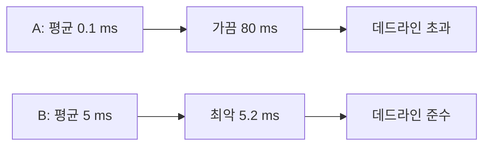
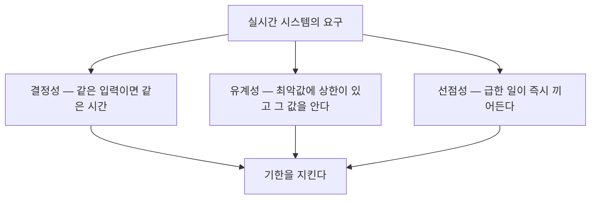
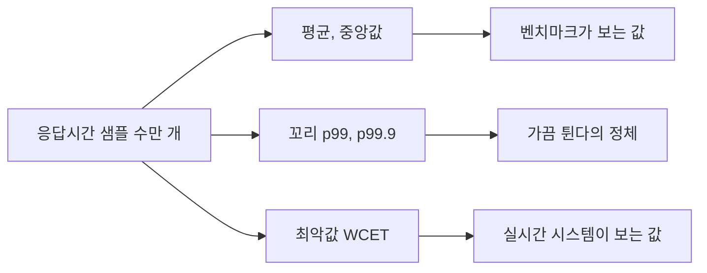

> **기준 출처:** Liu & Layland, *Scheduling Algorithms for Multiprogramming in a Hard-Real-Time Environment*, JACM 20(1), 1973 (hard-real-time이라는 말의 원전) · [Linux Foundation Real-Time 문서](https://wiki.linuxfoundation.org/realtime/documentation/start) · [Zephyr Scheduling](https://docs.zephyrproject.org/latest/kernel/services/scheduling/index.html) / 확인일 2026-08-07
> **시리즈:** [목차](/posts/00-rtos-series/) | 다음 → [02. 경성, 연성, 준경성 실시간](/posts/02-hard-soft-firm-realtime/)

## 1. 흔한 오해 — 실시간과 빠름의 구분

실시간은 빠르다는 뜻이 아니라 정해진 시각까지 반드시 끝난다는 뜻이다. 이 둘은 정도의 차이가 아니라 거의 반대 방향이다. 숫자로 놓으면 바로 보인다.

| | 시스템 A | 시스템 B |
| --- | --- | --- |
| 평균 응답 | 0.1 ms | 5 ms |
| 최악 응답 | 80 ms (1만 번에 한 번) | 5.2 ms (한 번도 넘긴 적 없음) |
| 데드라인 10 ms 기준 | 실시간 아님 | 실시간 |

A가 B보다 평균으로 50배 빠른데도 실시간이 아니다. 데드라인 10 ms를 한 번이라도 넘기면 그 순간 시스템은 실패한 것이기 때문이다.

그래서 실시간 시스템에서 평가하는 값은 평균이 아니라 최악값이다. 벤치마크의 초당 몇 회가 아니라 제일 나쁠 때 몇 마이크로초인지를 본다.

## 2. 정확성의 정의가 하나 늘어난다

일반 소프트웨어에서 프로그램이 맞다는 것은 한 가지다. 입력에 대해 올바른 출력이 나오면 된다. 이것을 논리적 정확성이라 한다.

실시간 시스템에서는 조건이 하나 더 붙는다. 올바른 출력이 정해진 시각 안에 나와야 한다. 논리적 정확성에 시간적 정확성이 더해진다.

늦게 나온 정답은 오답이다. 이 문장이 실시간 시스템 전체의 출발점이다.

로봇 조인트를 1 kHz로 제어한다면 1 ms마다 토크 명령을 계산해야 한다. 1.5 ms 걸려서 나온 명령은 값이 아무리 정확해도 이미 필요 없는 값이다. 그 순간 제어 루프는 한 스텝을 통째로 놓쳤고, 모터는 지난 명령을 두 배로 오래 유지한 셈이 된다.

## 3. 요구사항은 셋이다

실시간이라는 말 하나에 세 가지 요구가 섞여 있다. 나눠 봐야 문제를 정확히 지목할 수 있다.

| 요구 | 뜻 | 깨지면 |
| --- | --- | --- |
| 결정성 | 실행할 때마다 걸리는 시간이 비슷하다 | 언제 튈지 예측이 안 되어 설계가 성립하지 않는다 |
| 유계성 | 아무리 나빠도 X µs라고 말할 수 있다 | 스케줄 가능성을 계산할 수 없다 ([07편](/posts/07-response-time-analysis/)) |
| 선점성 | 낮은 일이 돌고 있어도 급한 일이 바로 끼어든다 | 급한 일이 낮은 일이 끝날 때까지 기다린다 ([04편](/posts/04-scheduling-preemption-priority/)) |

세 요구 중 유계성이 설계 작업의 대부분을 차지한다. 실시간 시스템 설계는 어떤 구간의 최악값 상한을 알아내고 그 상한을 줄이는 일로 이루어진다.

상한을 모르는 코드는 실시간 루프에 넣을 수 없다. `malloc`, 파일 I/O, 로그 출력, 무한 락 대기가 실시간 루프에서 금기인 이유가 여기 있다. 하나같이 최악값의 상한을 말할 수 없는 동작이다.

## 4. 왜 평균을 보면 안 되나

응답시간을 히스토그램으로 그리면 이 논의가 한눈에 정리된다.

- 평균은 사용자 체감 성능이다. 웹 서버에서는 이게 맞는 지표다.
- 꼬리인 p99와 p99.9는 가끔 튄다는 현상의 정체다. 여기부터 실시간이 신경 쓴다.
- 최악값은 단 한 번이라도 넘으면 안 되는 선이다. 실시간에서는 이 값만 본다.

[윈도우 03편](/posts/03-thread-priority-in-practice/)에서 1 kHz 루프를 실제로 돌린 결과가 나온다. 중앙값은 0 µs, 상위 1%도 3.3 µs로 좋은데 최악값이 1,142 µs였다. 평균만 보면 완벽한 시스템이고 최악값을 보면 주기 하나를 통째로 놓친 시스템이다. 같은 데이터에서 나온 두 판정이다.

## 5. RTOS가 포기하는 것

일반 OS는 처리량과 공평성을 최적화한다. 모든 프로그램이 골고루 CPU를 나눠 쓰고 전체적으로 일을 많이 처리하는 것이 목표다. RTOS는 그것을 의도적으로 포기한다.

| | 일반 OS | RTOS |
| --- | --- | --- |
| 목표 | 처리량, 공평성 | 기한 준수, 예측 가능성 |
| 스케줄러 | 공평하게 나눠 준다 (CFS, EEVDF 등) | 우선순위가 절대적이다 |
| 낮은 우선순위 태스크 | 언젠가는 실행된다 (기아 방지) | 영원히 실행 안 될 수도 있다 |
| 커널 내부 | 일부 구간에서 선점 불가 | 거의 모든 구간에서 선점 가능 |
| 평가 지표 | 초당 처리량 | 최악 응답시간, 최악 지연 |

RTOS는 더 좋은 OS가 아니라 다른 것을 최적화한 OS다. 리눅스에 PREEMPT_RT를 붙이면 전체 처리량은 오히려 떨어지고, 그 대가로 최악 지연이 줄어든다. 이 맞바꿈이 연재 전체의 배경이다.

## 6. 용어

| 용어 | 뜻 |
| --- | --- |
| 데드라인 | 이 시각까지 끝나야 한다는 절대 기한 |
| 지연 (latency) | 사건이 일어난 시점부터 반응이 시작된 시점까지 |
| 지터 (jitter) | 그 지연이 매번 얼마나 흔들리는가 ([11편](/posts/11-jitter-sources/)) |
| WCET | Worst-Case Execution Time, 최악 실행시간 ([13편](/posts/13-wcet-execution-budget/)) |
| 선점 (preemption) | 실행 중인 태스크를 강제로 멈추고 다른 태스크로 바꾸는 것 |
| 결정성 | 실행 시간이 예측 가능하고 재현되는 성질 |

## 정리

- 실시간은 빠름이 아니라 기한 준수다. 평균이 아니라 최악값을 본다.
- 정확성의 정의가 하나 늘어난다. 논리적 정확성에 시간적 정확성이 더해지고, 늦은 정답은 오답이다.
- 요구는 결정성, 유계성, 선점성 셋이다. 이 중 최악값의 상한을 말할 수 있는지가 설계 작업의 대부분이다.
- 상한을 말할 수 없는 동작은 실시간 루프에 들어갈 수 없다. `malloc`, 파일 I/O, 무한 락 대기가 그렇다.
- RTOS는 처리량과 공평성을 의도적으로 포기하고 예측 가능성을 얻는다.

## 참고

- Liu, C. L. & Layland, J. W., *Scheduling Algorithms for Multiprogramming in a Hard-Real-Time Environment*, Journal of the ACM 20(1), 1973
- [Linux Foundation — Real-Time 문서](https://wiki.linuxfoundation.org/realtime/documentation/start)
- [Zephyr — Scheduling](https://docs.zephyrproject.org/latest/kernel/services/scheduling/index.html)