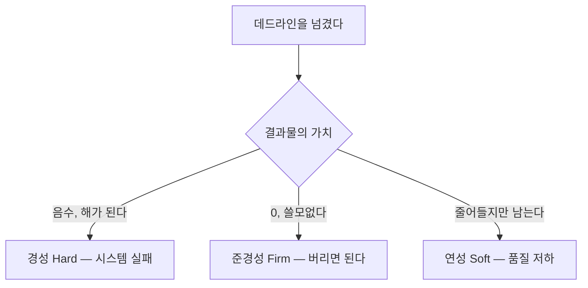
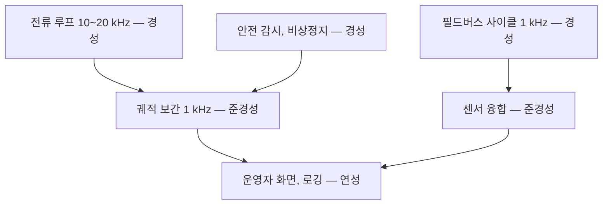
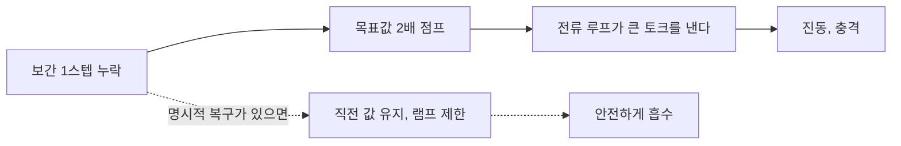

> **기준 출처:** Buttazzo, *Hard Real-Time Computing Systems: Predictability, Scheduling and Applications*, Springer (hard/firm/soft 분류의 표준 서술) · [Linux Foundation Real-Time 문서](https://wiki.linuxfoundation.org/realtime/documentation/start) · IEC 62304, ISO 26262는 공개된 범위의 일반 서술만 인용 / 확인일 2026-08-07
> **시리즈:** [목차](/posts/00-rtos-series/) | 이전 → [01. 실시간이란 무엇인가](/posts/01-what-is-realtime/) | 다음 → [03. 태스크 모델](/posts/03-task-model-timing-params/)

## 1. 나누는 기준은 하나

[01편](/posts/01-what-is-realtime/)에서 늦은 정답은 오답이라고 했다. 그런데 얼마나 오답인지는 시스템마다 다르다. 그 차이로 셋을 나눈다. 물어야 할 것은 데드라인을 넘긴 결과물의 가치가 얼마인가 하나다.

| | 경성 (Hard) | 준경성 (Firm) | 연성 (Soft) |
| --- | --- | --- | --- |
| 늦으면 | 시스템 실패. 사람이 다치거나 장비가 망가질 수 있다 | 그 결과를 버린다. 손해는 없지만 이득도 없다 | 품질이 떨어진다. 여전히 쓸모는 있다 |
| 늦은 값의 가치 | 음수 | 0 | 양수이나 감소 |
| 설계 목표 | 데드라인 초과 0회를 증명 | 초과율을 정해진 비율 이하로 | 평균과 백분위 관리 |
| 예 | 모터 전류 루프, 에어백 전개, 안전정지 | 영상 프레임 1장 드롭, 통신 사이클 1회 누락 | 사용자 UI 반응, 로그 저장, 화면 갱신 |
| 필요한 것 | 증명, 곧 분석과 시험 | 통계적 보증 | 최선 노력 |

## 2. 하나의 시스템 안에 셋이 다 있다

실무에서 가장 자주 헷갈리는 지점이다. 우리 시스템은 경성 실시간이다라는 문장은 대개 정확하지 않다. 로봇 하나 안에도 세 등급이 섞여 있다.

설계의 요령은 등급을 섞지 않는 것이다. 연성인 로깅 코드가 경성인 전류 루프와 같은 스레드나 같은 락을 공유하면, 로깅이 느려질 때 전류 루프가 같이 늦는다. 그 경로가 [08편의 우선순위 역전](/posts/08-priority-inversion-mars-pathfinder/)으로 이어진다.

이 구분이 실무에서 하는 일은 자원 배분이다. 어느 등급인지를 먼저 정하면 어디에 얼마나 공을 들일지가 자동으로 정해진다. 경성 구간은 코드 한 줄까지 최악값을 따지고 연성 구간은 편하게 짠다. 전부를 경성으로 취급하면 개발이 끝나지 않고, 전부를 연성으로 취급하면 언젠가 사고가 난다.

## 3. 경성 실시간에서 증명이란 무엇인가

연성은 측정으로 충분하다. 경성은 측정만으로는 부족하다.

| 방법 | 무엇을 말해 주나 | 한계 |
| --- | --- | --- |
| 측정 (시험) | 10시간 돌렸는데 최대 340 µs였다 | 더 나쁜 경우를 못 봤을 뿐일 수 있다. 못 본 경로가 남는다 |
| 분석 (계산) | 이론상 최악은 480 µs이고 이 조합에서 발생한다 | 모델이 실제와 다르면 틀린다. 캐시와 파이프라인 모델링이 어렵다 |
| 둘 다 | 분석으로 상한을 잡고 측정으로 모델을 검증한다 | 실무의 표준 |

경성 실시간은 관측한 적 없다가 아니라 일어날 수 없다를 요구한다. 그래서 [07편의 응답시간 분석](/posts/07-response-time-analysis/) 같은 계산이 필요하다. 측정으로는 도달할 수 없는 결론이기 때문이다.

이 구분은 규격에도 들어와 있다. IEC 62304나 ISO 26262 같은 규격은 안전 등급이 높은 기능에 대해 시험했다가 아니라 요구를 만족함을 보였다를 요구한다. 시간 요구도 같은 취급을 받는다.

## 4. 함정 — 연성이라 괜찮다는 판단

연성이나 준경성이라도 누적되면 경성 문제로 바뀐다. 궤적 보간이 한 스텝 늦으면 다음 스텝에서 목표 위치가 두 배로 점프하고, 전류 루프가 그 큰 오차를 보고 큰 토크를 낸다. 결과는 진동과 충격이다.

이 스텝을 버려도 되는지는 상위 로직이 정하는 것이고 스케줄러가 정해 주지 않는다. 준경성으로 설계하려면 놓쳤을 때 어떻게 복구할지를 코드에 명시해야 한다. 그 처리가 없으면 실질적으로 경성이다.

## 정리

- 나누는 기준은 데드라인을 넘긴 결과물의 가치 하나다. 경성은 음수, 준경성은 0, 연성은 감소한 양수다.
- 하나의 시스템 안에 셋이 다 있다. 기능별로 등급을 먼저 정한다.
- 등급을 섞으면 낮은 등급이 높은 등급을 끌어내린다. 같은 스레드와 같은 락이 그 경로다.
- 경성은 측정이 아니라 증명을 요구한다. 07편의 계산이 필요한 이유가 여기 있다.
- 준경성으로 설계하려면 놓쳤을 때의 복구를 코드에 명시해야 한다. 없으면 사실상 경성이다.

## 참고

- Buttazzo, G., *Hard Real-Time Computing Systems: Predictability, Scheduling and Applications*, Springer
- [Linux Foundation — Real-Time 문서](https://wiki.linuxfoundation.org/realtime/documentation/start)