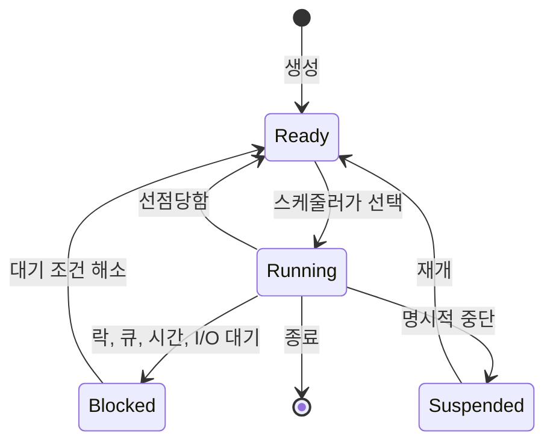
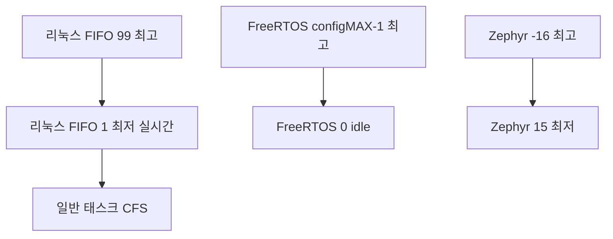
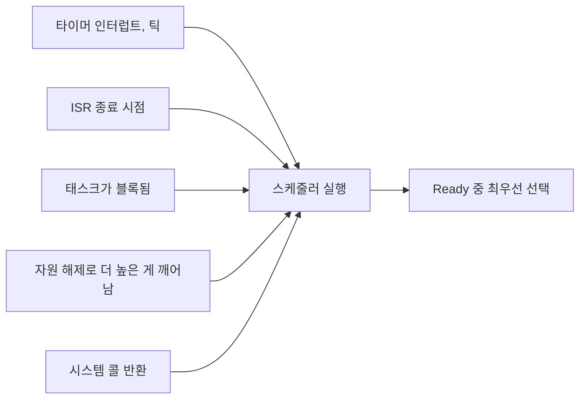

> **기준 출처:** Buttazzo, *Hard Real-Time Computing Systems*, Springer · [FreeRTOS Task States](https://www.freertos.org/Documentation/02-Kernel/02-Kernel-features/01-Tasks-and-co-routines/03-Task-states) · [man 7 sched](https://man7.org/linux/man-pages/man7/sched.7.html) · [Microsoft Learn Scheduling Priorities](https://learn.microsoft.com/en-us/windows/win32/procthread/scheduling-priorities) / 확인일 2026-08-07
> **시리즈:** [목차](/posts/00-rtos-series/) | 이전 → [03. 태스크 모델](/posts/03-task-model-timing-params/) | 다음 → [05. RM과 69%의 벽](/posts/05-rate-monotonic-utilization-bound/)

## 1. 스케줄러가 하는 일

스케줄러가 결정하는 것은 하나다. 지금 이 순간 준비된(Ready) 태스크 중 어느 것을 CPU에 올릴 것인가. 복잡해 보이는 모든 스케줄링 이론은 그 어느 것을 고르는 규칙을 다르게 정한 것이다.

태스크 상태는 어느 RTOS에서나 거의 같다.



| 상태 | 뜻 | 실시간에서의 의미 |
| --- | --- | --- |
| Running | CPU를 쓰는 중 | 코어당 하나 |
| Ready | 지금 당장 돌 수 있는데 CPU를 못 받은 상태 | 여기 오래 머물면 선점당하고 있다는 뜻이다 |
| Blocked | 무언가를 기다리는 중 | 여기 머무는 시간의 상한을 모르면 실시간이 성립하지 않는다 |
| Suspended | 명시적으로 멈춰 둔 상태 | 스케줄 대상이 아니다 |

## 2. 선점은 실시간의 필수 조건

선점(preemption)은 돌고 있는 태스크를 강제로 멈추고 더 급한 태스크로 바꾸는 것이다. 없으면 어떻게 되는지 시간축으로 보면 분명하다.

```text
비선점 - 낮은 게 끝날 때까지 기다린다

 시각 0    1    2    3    4    5    6    7    8
      |----|----|----|----|----|----|----|----|
 low    [========= 실행 C=6 ==========]
 high        ^ 릴리스                  [== 실행 ==]
             +---- 5 만큼 기다림 ----+
                   데드라인 초과
```

```text
선점 - 급한 게 오면 즉시 바꾼다

 시각 0    1    2    3    4    5    6    7    8
      |----|----|----|----|----|----|----|----|
 low    [==]              [======= 나머지 =======]
 high        ^ [== 실행 ==]
             + 즉시 시작
```

비선점 시스템에서 높은 우선순위 태스크의 최악 대기시간은 가장 긴 낮은 태스크의 실행시간이다. 낮은 태스크 중에 100 ms짜리가 하나라도 있으면 1 ms 주기 제어 루프는 성립하지 않는다.

그래서 [리눅스 프리엠션 모델](/posts/02-kernel-preemption-models/)과 [윈도우의 한계](/posts/01-why-windows-not-realtime/)가 모두 커널 안에서 얼마나 선점할 수 있는지를 따진다.

## 3. 우선순위를 무엇으로 정하나

| 방식 | 규칙 | 예 |
| --- | --- | --- |
| 고정 우선순위 (FPP) | 태스크마다 숫자를 정해 두고 항상 큰 쪽을 먼저 | RM ([05편](/posts/05-rate-monotonic-utilization-bound/)), 실제 RTOS의 기본 |
| 동적 우선순위 | 상황에 따라 순위가 바뀐다 | EDF ([06편](/posts/06-edf-dynamic-priority/)), 마감이 가까운 쪽 |
| 공평 분배 | 모두에게 골고루 | 일반 리눅스 CFS와 EEVDF, 윈도우 기본. 실시간용이 아니다 |

실무에서 압도적으로 많이 쓰는 것은 고정 우선순위다. 구현이 정수 비교로 끝나고 오버헤드가 작으며, 문제가 생겼을 때 원인을 추적하기 쉽다.

같은 우선순위끼리는 두 정책이 있다.

| 정책 | 동작 | 리눅스 이름 | 윈도우 |
| --- | --- | --- | --- |
| FIFO | 먼저 온 게 끝날 때까지 돈다. 스스로 양보하지 않으면 안 바뀐다 | `SCHED_FIFO` | 실시간 클래스에서 유사하게 동작 |
| 라운드로빈 | 정해진 퀀텀씩 번갈아 | `SCHED_RR` | 기본 동작 |

제어 루프에는 FIFO를 쓴다. 라운드로빈은 같은 우선순위 태스크끼리 불필요한 컨텍스트 스위치를 만들고 그만큼 지터가 생긴다. 실시간 루프는 시작했으면 끝까지 도는 쪽이 맞다.

## 4. 우선순위 숫자의 방향이 OS마다 반대다

여기서 실수가 자주 난다.

| 환경 | 범위 | 어느 쪽이 높은가 |
| --- | --- | --- |
| 리눅스 실시간 (`SCHED_FIFO`, `SCHED_RR`) | 1 ~ 99 | 숫자가 클수록 높다 |
| 리눅스 일반 (`nice`) | -20 ~ +19 | 숫자가 작을수록 높다 |
| FreeRTOS | 0 ~ `configMAX_PRIORITIES-1` | 숫자가 클수록 높다 |
| Zephyr | 협조형 음수 ~ 선점형 양수 | 숫자가 작을수록 높다 |
| 윈도우 | 0 ~ 31 (내부값) | 숫자가 클수록 높다 |



리눅스에서 `SCHED_FIFO` 우선순위 99는 쓰지 않는다. 커널의 워치독 같은 관리 스레드가 그 근처에 있어서, 사용자 태스크가 99를 잡고 CPU를 놓지 않으면 시스템이 통째로 멈춘다. 실무 관례는 1에서 89 범위를 쓰는 것이다. [리눅스 05편](/posts/05-priority-design-permissions/)에서 다룬다.

## 5. 스케줄러가 실제로 언제 도나

우선순위가 높으면 즉시 실행된다는 말은 정확히는 스케줄러가 도는 순간에 즉시 선택된다는 뜻이다. 스케줄러는 아무 때나 도는 게 아니라 정해진 지점(scheduling point)에서만 돈다.



여기서 실시간의 주요 지표가 나온다. 스케줄링 지연(scheduling latency)은 사건이 발생한 시점부터 그 사건 때문에 깨어나야 할 태스크가 실제로 CPU를 잡은 시점까지다. 이 값이 커지는 이유는 셋이다.

| 원인 | 내용 | 어디서 다루나 |
| --- | --- | --- |
| 인터럽트 비활성 구간 | 커널이 인터럽트를 끄고 있으면 사건 자체가 늦게 인지된다 | [10편](/posts/10-interrupts-and-tasks/) |
| 선점 불가 구간 | 커널이 선점을 막고 있으면 스케줄러가 돌지 못한다 | [리눅스 02편](/posts/02-kernel-preemption-models/) |
| 컨텍스트 스위치 비용 | 실제로 바꾸는 데 드는 시간 | [12편](/posts/12-context-switch-cache-memory/) |

RTOS와 일반 OS의 실질적 차이는 대부분 앞의 두 구간의 길이다. PREEMPT_RT가 하는 일도 정확히 그 두 구간을 줄이는 것이다.

## 정리

- 스케줄러가 하는 일은 Ready 중 어느 것을 Running으로 올릴지 고르는 것이다.
- 상태 넷 중 Blocked에 머무는 시간의 상한을 모르면 실시간이 아니다.
- 선점은 필수다. 비선점이면 최악 대기가 가장 긴 낮은 태스크의 실행시간이 된다.
- 실무는 대부분 고정 우선순위에 FIFO를 쓴다. 제어 루프에 라운드로빈을 쓰면 불필요한 스위치가 생긴다.
- 우선순위 숫자 방향이 OS마다 반대다. 리눅스 실시간, FreeRTOS, 윈도우는 클수록 높고 `nice`와 Zephyr는 작을수록 높다.
- 스케줄링 지연의 원인은 인터럽트 비활성, 선점 불가, 스위치 비용 셋이다. RTOS는 앞의 둘을 줄인 OS다.

## 참고

- Buttazzo, G., *Hard Real-Time Computing Systems*, Springer
- [FreeRTOS — Task States](https://www.freertos.org/Documentation/02-Kernel/02-Kernel-features/01-Tasks-and-co-routines/03-Task-states)
- [man 7 sched](https://man7.org/linux/man-pages/man7/sched.7.html)
- [Microsoft Learn — Scheduling Priorities](https://learn.microsoft.com/en-us/windows/win32/procthread/scheduling-priorities)