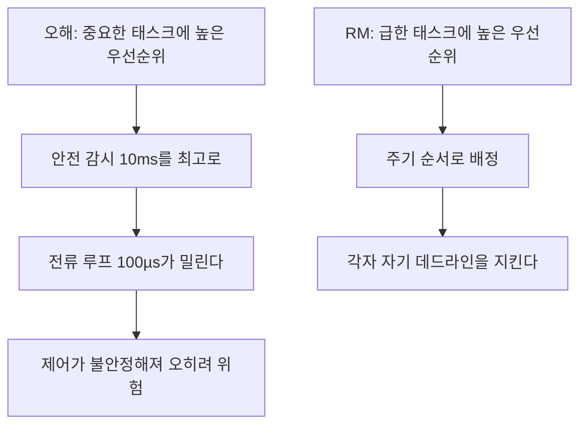
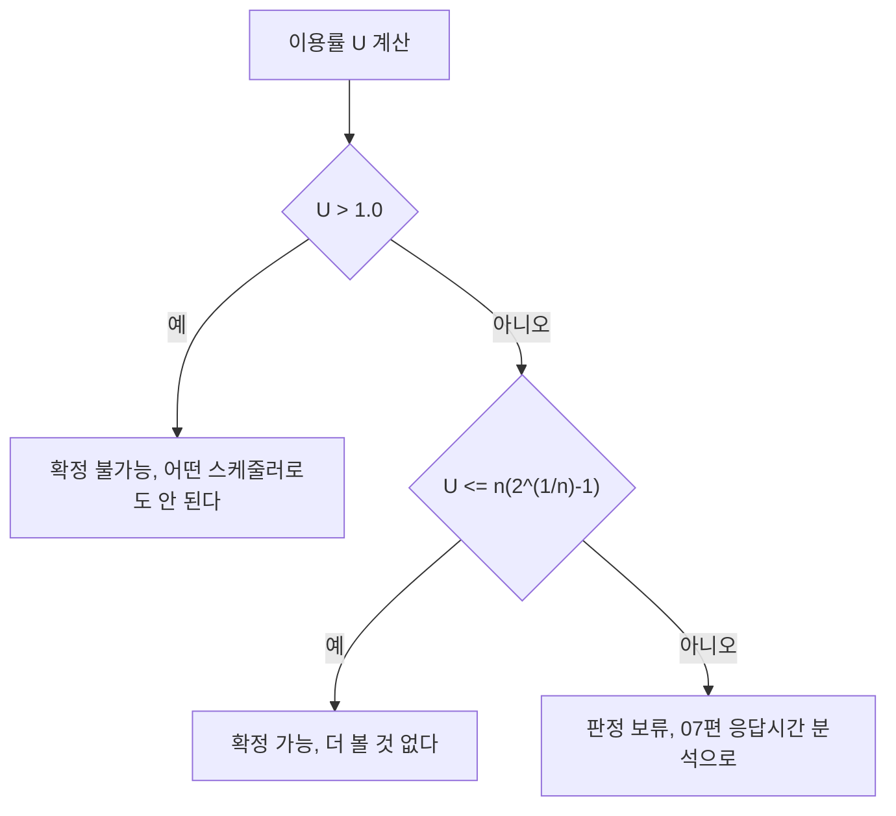

> **기준 출처:** Liu & Layland, JACM 20(1), 1973 (RM의 최적성과 이용률 한계의 원전) · Lehoczky, Sha & Ding, RTSS 1989 (평균적으로는 88%라는 결과) · Buttazzo, *Hard Real-Time Computing Systems*, Springer / 확인일 2026-08-07
> **시리즈:** [목차](/posts/00-rtos-series/) | 이전 → [04. 스케줄링 기초](/posts/04-scheduling-preemption-priority/) | 다음 → [06. EDF](/posts/06-edf-dynamic-priority/)

## 1. 규칙은 한 줄

Rate Monotonic(RM)은 주기가 짧은 태스크에 높은 우선순위를 준다. 실행시간도 중요도도 데드라인도 보지 않고 오직 주기 $T$만 본다.

| 태스크 | 주기 T | 우선순위 |
| --- | --- | --- |
| 전류 루프 | 100 µs | 1위, 가장 높다 |
| 필드버스 사이클 | 1 ms | 2위 |
| 속도, 위치 루프 | 1 ms | 2위 동률 |
| 궤적 보간 | 4 ms | 4위 |
| 로깅 | 50 ms | 5위, 가장 낮다 |

주기가 짧다는 것은 여유가 적다는 뜻이다. 100 µs마다 도는 태스크는 100 µs 안에 끝나야 하니 조금만 밀려도 데드라인을 넘긴다. 반면 50 ms짜리는 몇 ms 밀려도 여유가 있다. 급한 순서가 곧 여유가 적은 순서이고 그것이 주기가 짧은 순서다.

Liu & Layland의 결과는 RM이 고정 우선순위 방식 중 최적이라는 것이다. 어떤 고정 우선순위 배정으로든 스케줄 가능한 태스크 집합이라면 RM 배정으로도 반드시 스케줄 가능하다. 뒤집으면 RM이 안 되면 다른 어떤 고정 우선순위 배정도 안 된다. $D = T$를 가정한 결과다.

## 2. 왜 중요도 순이 아닌가

처음 배울 때 가장 저항이 큰 지점이다. 안전 감시 태스크가 제일 중요한데 주기가 10 ms라고 낮은 우선순위를 주는 것이 맞는가.

맞다. 우선순위는 중요도 등급이 아니라 시간 자원 배분 규칙이다. 안전 감시가 10 ms마다 돌면 10 ms 안에만 끝나면 요구를 전부 만족한다. 그보다 먼저 실행할 이유가 없다. 오히려 안전 감시를 최고 우선순위로 올리면 100 µs 전류 루프가 밀려서 시스템 전체가 깨진다.



중요도는 우선순위가 아니라 다른 수단으로 보장한다. 워치독, 하드웨어 인터록, 독립 감시 회로, [실행시간 예산](/posts/13-wcet-execution-budget/)이 그 수단이다. 중요한 것을 급한 것으로 바꿔치기하면 둘 다 잃는다.

## 3. 타임라인으로 확인

세 태스크로 본다.

| 태스크 | T | C | U = C/T | RM 우선순위 |
| --- | --- | --- | --- | --- |
| τ1 | 4 | 1 | 0.250 | 높음 |
| τ2 | 6 | 2 | 0.333 | 중간 |
| τ3 | 12 | 3 | 0.250 | 낮음 |
| | | | U = 0.833 | |

```text
 시각  0    2    4    6    8   10   12
       |----|----|----|----|----|----|
 t1    [1]      [1]      [1]      [1]      T=4 마다 C=1
 t2       [ 2 ]    [ 2]      [ 2 ]         T=6 마다 C=2
 t3            [1]    [1] [1]              T=12, C=3 이 세 조각으로 쪼개진다

 t3의 응답시간 R3 = 10 <= D3 = 12  -> 통과 (여유 2)
```

τ3을 보면 $C_3 = 3$인데 실제로 끝난 것은 시각 10이다. 3만큼 일하는 데 10이 걸렸고, 나머지 7은 높은 우선순위에게 선점당해 Ready 상태로 기다린 시간이다. 이 기다림을 계산하는 것이 [07편](/posts/07-response-time-analysis/)이다.

## 4. 69%의 벽

RM으로 반드시 스케줄 가능함을 보장하는 조건이 있다.

$$U = \sum_{i=1}^{n} \frac{C_i}{T_i} \le n\left(2^{1/n} - 1\right)$$

| n (태스크 수) | 한계 U |
| --- | --- |
| 1 | 1.000 |
| 2 | 0.828 |
| 3 | 0.780 |
| 4 | 0.757 |
| 5 | 0.743 |
| 10 | 0.718 |
| n → ∞ | 0.693 ($\ln 2$) |

태스크가 많아지면 한계가 $\ln 2 \approx 69.3\%$로 수렴한다. 흔히 인용되는 RM은 CPU를 69%까지만 쓴다는 말의 출처가 이 식이다.

여기서 오해가 자주 생긴다. 이 조건은 충분조건이고 필요조건이 아니다.



U가 한계를 넘었다고 불가능한 것이 아니다. 3절의 예제는 $U = 0.833$으로 3개짜리 한계 0.780을 넘었지만 실제로는 스케줄 가능했다. 이 한계식은 주기가 어떻게 배치되든 최악의 경우에도 되는가를 보는 보수적인 기준이다.

Lehoczky 1989는 주기가 무작위로 분포할 때 RM이 실제로 스케줄 가능한 평균 이용률이 약 88%라고 보고한다. 69%는 최악의 경우이고 실제 시스템은 대개 더 여유가 있다. 그래도 정확한 판정은 07편으로 해야 한다.

주기가 서로 정수배(harmonic)면 사정이 달라진다. $T_1 = 1$ ms, $T_2 = 2$ ms, $T_3 = 4$ ms처럼 배수 관계면 RM의 한계가 $U \le 1.0$으로 올라간다.

여기서 설계 요령이 나온다. 제어 루프 주기를 2의 거듭제곱 배수로 잡는다. 1 kHz, 500 Hz, 250 Hz, 125 Hz처럼 두면 CPU를 훨씬 많이 쓸 수 있고, 타임라인이 매 hyperperiod마다 정확히 반복되어 디버깅도 쉬워진다. 반대로 1 kHz, 700 Hz, 300 Hz 같은 조합은 이용률 한계도 낮고 패턴도 복잡해진다.

## 5. D < T인 경우는 DM

RM은 $D = T$를 가정한다. $D < T$라면 규칙을 하나 바꾼다. Deadline Monotonic(DM)은 데드라인이 짧은 태스크에 높은 우선순위를 준다.

$D = T$이면 DM은 RM과 같아진다. 그리고 $D \le T$인 모든 경우에 DM이 고정 우선순위 중 최적이다. 실무에서는 데드라인 짧은 순으로 외워 두면 둘 다 덮인다.

## 6. 03편 예제로 돌아가서

| 태스크 | T | C | U | RM 우선순위 |
| --- | --- | --- | --- | --- |
| τ1 전류 루프 | 100 µs | 25 µs | 0.250 | 1, 최고 |
| τ2 속도, 위치 | 1 ms | 200 µs | 0.200 | 2 |
| τ3 필드버스 | 1 ms | 150 µs | 0.150 | 3, τ2와 동률이라 임의 |
| τ4 궤적 보간 | 4 ms | 400 µs | 0.100 | 4 |
| τ5 로깅 | 50 ms | 2 ms | 0.040 | 5, 최저 |
| | | | U = 0.740 | |

$n = 5$의 한계는 0.743이고 $U = 0.740$이므로 충분조건을 통과한다. RM으로 스케줄 가능함이 보장된다.

다만 여유가 0.003밖에 없다. 로깅 태스크의 C가 2 ms에서 2.2 ms로만 늘어도 $U = 0.744$가 되어 충분조건을 벗어난다. 실제로는 그래도 될 가능성이 높지만, 될 가능성이 높다는 것은 경성 실시간의 답이 아니다. 07편으로 정확히 판정한다.

## 정리

- RM은 주기가 짧을수록 높은 우선순위를 준다. 실행시간도 중요도도 보지 않는다.
- 우선순위는 중요도가 아니라 급한 정도다. 중요도는 워치독이나 인터록 같은 다른 수단으로 보장한다.
- Liu & Layland: $D = T$일 때 RM은 고정 우선순위 중 최적이다.
- 이용률 한계는 $U \le n(2^{1/n}-1)$이고 $n \to \infty$에서 $\ln 2 \approx 69.3\%$다.
- 이 조건은 충분조건이다. 넘었다고 불가능한 것이 아니고 평균적으로는 88%까지 된다.
- 주기를 2의 거듭제곱 배수로 잡으면 한계가 1.0으로 올라간다.
- $D < T$면 DM을 쓴다. 외우기는 데드라인 짧은 순으로 통일한다.

## 참고

- Liu, C. L. & Layland, J. W., JACM 20(1), 1973
- Lehoczky, J., Sha, L. & Ding, Y., RTSS 1989
- Buttazzo, G., *Hard Real-Time Computing Systems*, Springer