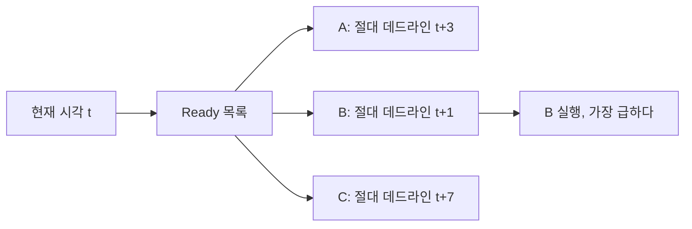
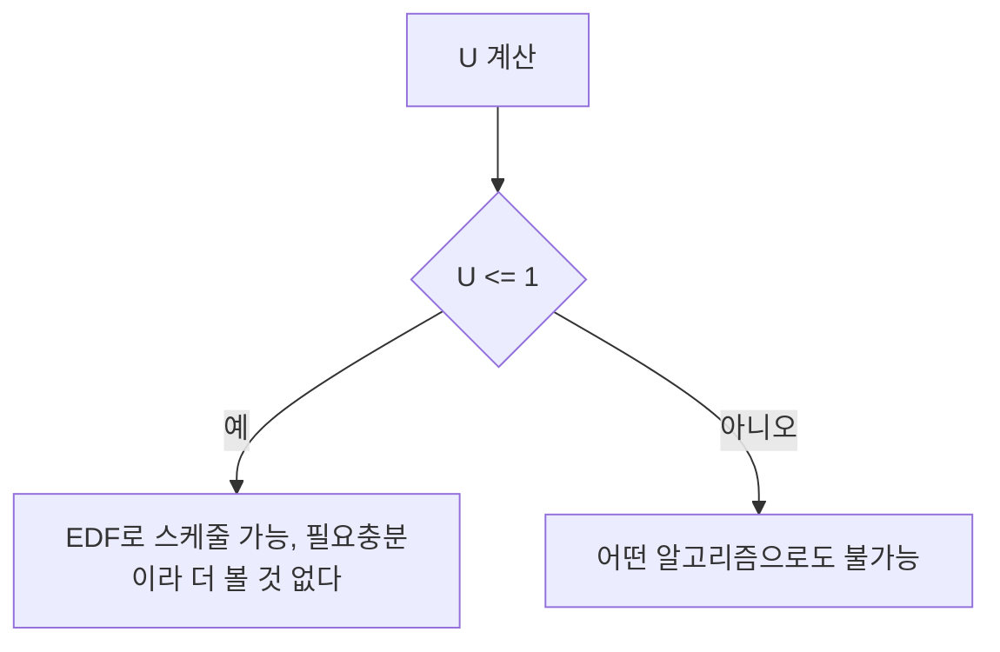
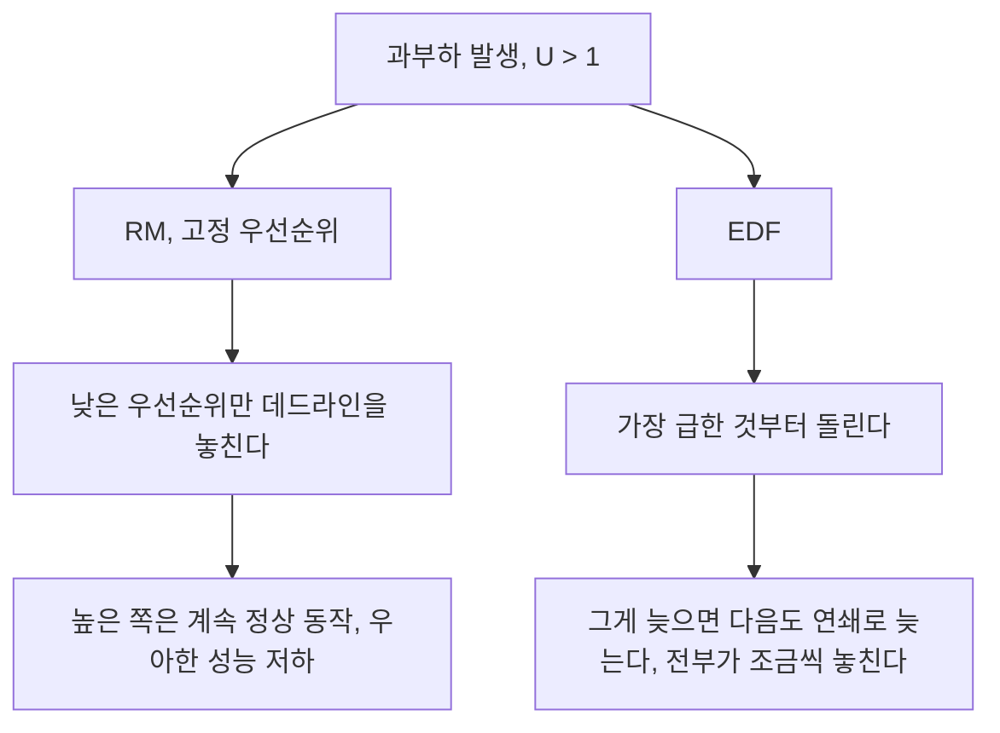

> **기준 출처:** Liu & Layland, JACM 1973 (EDF, 당시 deadline driven의 최적성 증명) · [Linux kernel SCHED_DEADLINE](https://www.kernel.org/doc/html/latest/scheduler/sched-deadline.html) · Buttazzo, *Rate Monotonic vs. EDF: Judgment Day*, Real-Time Systems 29(1), 2005 / 확인일 2026-08-07
> **시리즈:** [목차](/posts/00-rtos-series/) | 이전 → [05. RM과 69%의 벽](/posts/05-rate-monotonic-utilization-bound/) | 다음 → [07. 응답시간 분석](/posts/07-response-time-analysis/)

## 1. 규칙

Earliest Deadline First(EDF)는 지금 준비된 태스크 중 끝내야 할 시각이 가장 이른 것을 실행한다. RM과의 차이는 우선순위가 고정이 아니라는 점이다. 같은 태스크라도 어느 시점이냐에 따라 순위가 바뀐다.

| | RM (고정) | EDF (동적) |
| --- | --- | --- |
| 기준 | 주기 T, 변하지 않는다 | 절대 데드라인, 매 주기 갱신된다 |
| 우선순위 | 시스템 시작할 때 정해진다 | 매 순간 다시 계산된다 |
| 두 태스크의 순서 | 항상 같다 | 시점에 따라 뒤집힌다 |



## 2. 타임라인으로 보는 차이

RM이 실패하는 조합으로 비교한다.

| 태스크 | T | C | U = C/T |
| --- | --- | --- | --- |
| τ1 | 5 | 2 | 0.400 |
| τ2 | 7 | 4 | 0.571 |
| | | U = 0.971 | |

$n = 2$의 RM 한계는 0.828인데 $U = 0.971$이라 훨씬 넘는다.

```text
RM - t1 이 항상 높다

 시각  0    2    4    6    8   10   12   14
       |----|----|----|----|----|----|----|
 t1    [ 2 ]     [ 2 ]     [ 2 ]     [ 2 ]     T=5
 t2         [ 2 ]     [1]                      T=7, C=4 필요
                       t2 는 시각 7까지 3만 실행, 1 부족 -> 데드라인 초과


EDF - 절대 데드라인이 이른 쪽

 시각  0    2    4    6    8   10   12   14
       |----|----|----|----|----|----|----|
 t1    [ 2 ]          [ 2 ]      [ 2 ]         T=5
 t2         [   4   ]      [   4  ]            T=7
       t=0: t1 데드라인 5, t2 데드라인 7 -> t1 먼저
       t=5: t1 의 새 데드라인은 10, t2 는 7 -> t2 를 계속 돌린다
```

차이가 나는 지점은 시각 5다. RM은 무조건 τ1을 먼저 돌린다. EDF는 τ1의 데드라인이 10이고 τ2의 데드라인이 7이라는 것을 보고 τ2를 계속 돌린다. 이 한 번의 판단 차이가 성공과 실패를 가른다.

## 3. EDF의 이용률 한계는 100%다

$$U = \sum_{i=1}^{n} \frac{C_i}{T_i} \le 1$$

$D = T$인 주기 태스크 집합에 대해 $U \le 1$이면 EDF로 스케줄 가능하고 $U > 1$이면 어떤 알고리즘으로도 불가능하다. 필요충분조건이라 판정이 나눗셈 몇 번으로 끝나고, RM처럼 07편의 반복 계산이 필요 없다.



## 4. 그럼 왜 다들 RM을 쓰나

이론적으로 EDF가 우월한데 실제 RTOS는 대부분 고정 우선순위를 기본으로 쓴다. 이유가 넷이다.

| 이유 | 내용 |
| --- | --- |
| 구현 비용 | 매 스케줄링 시점마다 절대 데드라인을 비교해야 한다. 고정 우선순위는 정수 비교 한 번이나 비트맵 한 번으로 끝난다 |
| 과부하 시 붕괴 | 아래에서 따로 다룬다. 실무 선택을 가르는 이유다 |
| 디버깅 | RM은 누가 누구를 막았는지가 항상 같다. EDF는 시점마다 달라져 재현이 어렵다 |
| 생태계 | 대부분의 RTOS, 미들웨어, 드라이버가 고정 우선순위를 전제로 만들어져 있다 |

U가 잠깐이라도 1을 넘으면, 즉 누가 예상보다 오래 걸리면 두 방식의 반응이 정반대다.



경성 실시간에서 이 차이는 치명적이다. RM은 과부하가 나도 어느 태스크가 희생되는지 예측할 수 있고, 설계자가 로깅을 희생하도록 미리 정해 둘 수 있다. EDF는 과부하에서 아무도 보장받지 못한다. 안전 관련 기능이 섞여 있다면 받아들일 수 없는 성질이다.

## 5. 리눅스에는 EDF가 실제로 들어 있다

리눅스의 `SCHED_DEADLINE` 정책이 EDF이고, `SCHED_FIFO`보다도 높은 우선순위로 동작한다. 리눅스는 4절의 도미노 문제를 CBS(Constant Bandwidth Server)로 해결했다.

| 파라미터 | 뜻 |
| --- | --- |
| `sched_runtime` | 한 주기에 쓸 수 있는 CPU 시간, 곧 C |
| `sched_deadline` | 상대 데드라인, 곧 D |
| `sched_period` | 주기, 곧 T |

CBS는 예산 초과를 격리한다. 태스크가 `sched_runtime`을 다 쓰면 강제로 스로틀되어 다음 주기까지 실행이 막힌다. 하나가 폭주해도 다른 태스크의 보장은 그대로 유지되고 도미노가 차단된다.

여기에 커널이 입학 제어(admission control)를 한다. 새 `SCHED_DEADLINE` 태스크를 만들 때 U 합이 1을 넘으면 `EBUSY`로 거부한다. [03편](/posts/03-task-model-timing-params/)에서 계산한 이용률을 커널이 대신 확인해 주는 셈이다.

```c
/* 리눅스 SCHED_DEADLINE 설정 개념 예시
   출처: https://www.kernel.org/doc/html/latest/scheduler/sched-deadline.html */
struct sched_attr attr = {
    .size           = sizeof(attr),
    .sched_policy   = SCHED_DEADLINE,
    .sched_runtime  =  200 * 1000,   /* C = 200 us */
    .sched_deadline = 1000 * 1000,   /* D = 1 ms   */
    .sched_period   = 1000 * 1000,   /* T = 1 ms   */
};
sched_setattr(0, &attr, 0);   /* U 합이 1을 넘으면 EBUSY 로 거부된다 */
```

자세한 사용법은 [리눅스 04편](/posts/04-posix-realtime-scheduling/)에서 다룬다.

## 6. 어느 것을 고를 것인가

| 상황 | 권장 |
| --- | --- |
| MCU나 소형 RTOS | 고정 우선순위(RM, DM). 사실상 선택지가 이것뿐이다 |
| 안전 관련 기능이 섞여 있다 | 고정 우선순위. 과부하 시 희생 대상을 예측할 수 있다 |
| CPU 이용률을 90% 이상 짜내야 한다 | EDF 검토 |
| 리눅스에서 격리된 실시간 태스크 하나 | `SCHED_DEADLINE`. CBS 덕분에 안전하다 |
| 팀에 실시간 경험이 적다 | 고정 우선순위. 디버깅 난이도 차이가 크다 |

실무의 기본값은 고정 우선순위다. 이 연재의 나머지도 고정 우선순위를 전제로 쓴다. EDF는 이런 것이 있고 리눅스에 실제로 들어 있으며 예산 격리와 함께 쓰면 강력하다는 정도로 알아 두면 된다.

## 정리

- EDF는 절대 데드라인이 가장 이른 것부터 실행한다. 우선순위가 매 순간 바뀐다.
- 판정이 한 줄이다. $U \le 1$이면 가능하고 아니면 불가능이며, 필요충분조건이다.
- 이론적으로 RM보다 우월한데도 실무는 RM을 쓴다. 이유 넷 중 과부하 시 도미노 붕괴가 결정적이다.
- RM은 과부하에서 낮은 것만 희생된다. EDF는 전부가 조금씩 무너진다.
- 리눅스 `SCHED_DEADLINE`은 CBS 예산 스로틀과 입학 제어로 도미노를 막았다.
- 기본값은 고정 우선순위다. 이 연재의 나머지도 그 전제로 쓴다.

## 참고

- Liu, C. L. & Layland, J. W., JACM 20(1), 1973
- [Linux kernel — SCHED_DEADLINE](https://www.kernel.org/doc/html/latest/scheduler/sched-deadline.html)
- Buttazzo, G., *Rate Monotonic vs. EDF: Judgment Day*, Real-Time Systems 29(1), 2005