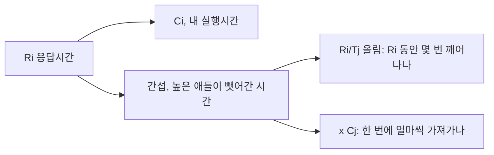
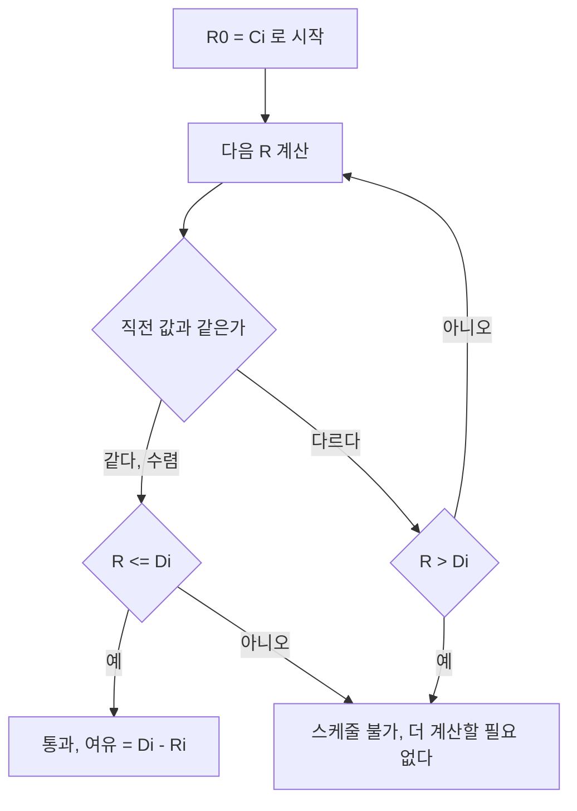

> **기준 출처:** Joseph & Pandya, *Finding Response Times in a Real-Time System*, The Computer Journal 29(5), 1986 (응답시간 반복식의 원전) · Audsley et al., SEJ 8(5), 1993 (블로킹과 릴리스 지터를 포함한 확장) · Buttazzo, *Hard Real-Time Computing Systems*, Springer / 확인일 2026-08-07
> **시리즈:** [목차](/posts/00-rtos-series/) | 이전 → [06. EDF](/posts/06-edf-dynamic-priority/) | 다음 → [08. 우선순위 역전](/posts/08-priority-inversion-mars-pathfinder/)

이 글의 수치는 계산 스크립트 출력을 그대로 옮긴 것이다.

## 1. 왜 필요한가

[05편](/posts/05-rate-monotonic-utilization-bound/)에서 이용률 한계는 충분조건일 뿐이라고 했다. 넘었다고 불가능한 것이 아니고, 통과했다고 여유가 얼마인지 알려주지도 않는다. 응답시간 분석(RTA, Response Time Analysis)은 정확한 답을 준다.

| | 이용률 한계 (05편) | 응답시간 분석 |
| --- | --- | --- |
| 답 | 될 수도 있다 또는 확실히 된다 | τ3의 최악 응답은 475 µs다 |
| 조건 | 충분조건 | 필요충분조건 (고정 우선순위, $D \le T$) |
| 계산 | 나눗셈 몇 번 | 수렴할 때까지 반복 |
| 얻는 것 | 통과 여부 | 각 태스크의 여유까지 |

[02편](/posts/02-hard-soft-firm-realtime/)에서 경성 실시간은 증명을 요구한다고 했다. 실제로 하는 계산이 이것이다.

## 2. 식을 한 조각씩

$$R_i = C_i + \sum_{j \in hp(i)} \left\lceil \frac{R_i}{T_j} \right\rceil C_j$$

$hp(i)$는 τi보다 높은 우선순위 태스크들의 집합이고 괄호는 올림이다.



| 부분 | 뜻 |
| --- | --- |
| $C_i$ | 내가 실제로 CPU를 쓰는 시간 |
| $\lceil R_i / T_j \rceil$ | 내 응답시간 동안 τj가 몇 번 깨어나는가. 올림인 이유는 반쯤 걸쳐도 한 번은 오기 때문이다 |
| $C_j$ | τj가 한 번 깨어날 때 뺏어 가는 시간 |

$R_i$가 양변에 다 있다. 내가 오래 걸릴수록 높은 태스크가 더 여러 번 깨어나고, 그래서 나는 더 오래 걸린다. 자기참조라서 한 번에 풀리지 않으므로 반복해서 수렴시킨다.

$$R_i^{(0)} = C_i, \qquad R_i^{(k+1)} = C_i + \sum_{j \in hp(i)} \left\lceil \frac{R_i^{(k)}}{T_j} \right\rceil C_j$$



값이 단조 증가하므로 수렴하거나 $D_i$를 넘어 실패하거나 둘 중 하나로 끝난다. 무한루프는 없다.

## 3. 실제로 계산한다

[03편](/posts/03-task-model-timing-params/)과 05편에서 끌고 온 예제다. RM 배정으로 우선순위를 준다.

| 우선순위 | 태스크 | T (µs) | C (µs) | U |
| --- | --- | --- | --- | --- |
| 1, 최고 | τ1 전류 루프 | 100 | 25 | 0.250 |
| 2 | τ2 속도, 위치 루프 | 1,000 | 200 | 0.200 |
| 3 | τ3 필드버스 처리 | 1,000 | 150 | 0.150 |
| 4 | τ4 궤적 보간 | 4,000 | 400 | 0.100 |
| 5, 최저 | τ5 로깅, 상태보고 | 50,000 | 2,000 | 0.040 |
| | | | U | 0.7400 |

τ1은 자기보다 높은 것이 없다. $R_1 = C_1 = 25$ µs이고 $D_1 = 100$이므로 여유 75로 통과한다. 최고 우선순위 태스크의 응답시간은 항상 자기 실행시간이다. 아무도 방해하지 않기 때문이다.

τ2는 τ1이 방해한다.

```text
R0 = 200
R1 = 200 + ceil(200/100)x25 = 200 + 2x25 = 250
R2 = 200 + ceil(250/100)x25 = 200 + 3x25 = 275
R3 = 200 + ceil(275/100)x25 = 200 + 3x25 = 275   <- 수렴
```

$R_2 = 275$ µs이고 $D_2 = 1{,}000$이므로 여유 725로 통과한다. τ2는 200 µs만 일하는데 275 µs가 걸린다. 그 사이 τ1이 세 번 깨어나 75 µs를 가져갔기 때문이다.

τ3은 τ1과 τ2 둘 다 방해한다.

```text
R0 = 150
R1 = 150 + ceil(150/100)x25 + ceil(150/1000)x200 = 150 + 2x25 + 1x200 = 400
R2 = 150 + ceil(400/100)x25 + ceil(400/1000)x200 = 150 + 4x25 + 1x200 = 450
R3 = 150 + ceil(450/100)x25 + ceil(450/1000)x200 = 150 + 5x25 + 1x200 = 475
R4 = 150 + ceil(475/100)x25 + ceil(475/1000)x200 = 150 + 5x25 + 1x200 = 475   <- 수렴
```

$R_3 = 475$ µs, 여유 525로 통과한다. τ4는 셋이 방해한다.

```text
R0 = 400
R1 = 400 + ceil(400/100)x25  + ceil(400/1000)x200  + ceil(400/1000)x150  =  850
R2 = 400 + ceil(850/100)x25  + ceil(850/1000)x200  + ceil(850/1000)x150  =  975
R3 = 400 + ceil(975/100)x25  + ceil(975/1000)x200  + ceil(975/1000)x150  = 1000
R4 = 400 + ceil(1000/100)x25 + ceil(1000/1000)x200 + ceil(1000/1000)x150 = 1000  <- 수렴
```

$R_4 = 1{,}000$ µs, 여유 3,000으로 통과한다. τ5는 넷이 방해해서 여덟 번 반복한다.

```text
R0 = 2000
R1 = 3600     R2 = 4700     R3 = 5725     R4 = 6350
R5 = 6850     R6 = 6975     R7 = 7000     R8 = 7000   <- 수렴
```

$R_5 = 7{,}000$ µs, 여유 43,000으로 통과한다. τ5는 2 ms 일하는데 7 ms가 걸리고 5 ms를 위의 넷에게 뺏겼다. 그래도 데드라인 50 ms에 비하면 여유가 있다.

| 태스크 | C (µs) | R (µs) | D (µs) | 여유 (µs) | 판정 |
| --- | --- | --- | --- | --- | --- |
| τ1 전류 루프 | 25 | 25 | 100 | 75 | 통과 |
| τ2 속도, 위치 | 200 | 275 | 1,000 | 725 | 통과 |
| τ3 필드버스 | 150 | 475 | 1,000 | 525 | 통과 |
| τ4 궤적 보간 | 400 | 1,000 | 4,000 | 3,000 | 통과 |
| τ5 로깅 | 2,000 | 7,000 | 50,000 | 43,000 | 통과 |

전부 통과하므로 이 시스템은 스케줄 가능하다. 05편에서는 $U = 0.740$이 한계 0.743에 아슬아슬해 불안했는데, 계산해 보니 가장 빡빡한 τ1도 여유가 75%다. 이용률 한계가 얼마나 보수적인 기준인지 보여 준다.

## 4. 설계 변경의 영향을 미리 계산한다

RTA는 통과 여부만 답하는 도구가 아니다. 파라미터를 바꿔 보면 무엇이 얼마나 늘어나는지 나온다.

필드버스 처리가 150에서 350 µs로 늘어나는 경우다.

| 태스크 | R (기준) | R (변경 후) | D | 판정 |
| --- | --- | --- | --- | --- |
| τ1 | 25 | 25 | 100 | 통과 |
| τ2 | 275 | 275 | 1,000 | 통과 |
| τ3 | 475 | 750 | 1,000 | 통과, 여유 250 |
| τ4 | 1,000 | 2,000 | 4,000 | 통과 |
| τ5 | 7,000 | 20,000 | 50,000 | 통과 |

U가 0.740에서 0.940으로 뛰었는데도 전부 통과한다. 다만 τ5의 응답시간이 7 ms에서 20 ms로 세 배가 됐다. 낮은 우선순위가 부담을 다 떠안는다는 것이 숫자로 보인다.

전류 루프 코드가 무거워져 25에서 40 µs가 되는 경우다.

| 태스크 | R (기준) | R (변경 후) | D | 판정 |
| --- | --- | --- | --- | --- |
| τ1 | 25 | 40 | 100 | 통과 |
| τ2 | 275 | 360 | 1,000 | 통과 |
| τ3 | 475 | 590 | 1,000 | 통과 |
| τ4 | 1,000 | 1,860 | 4,000 | 통과 |
| τ5 | 7,000 | 14,770 | 50,000 | 통과 |

τ1은 15 µs 늘었는데 τ5의 응답시간은 7,770 µs 늘었다. 최고 우선순위 태스크의 작은 증가가 아래로 갈수록 증폭된다. 100 µs마다 15 µs씩, 곧 CPU의 15%를 통째로 더 가져갔기 때문이다.

그래서 가장 빠른 루프의 코드가 가장 비싸다. 전류 루프에 `if` 하나 추가하는 것과 로깅에 추가하는 것은 시스템에 주는 부담이 완전히 다르다.

반대 방향도 계산된다. 기준 상태에서 τ5의 C만 키워 보면 14,800 µs까지 통과하고 14,900 µs에서 실패한다. 원래 2,000 µs였으니 일곱 배 넘게 여유가 있다. 로깅 때문에 제어가 밀린다는 걱정은 이 시스템에서 근거가 없다. 최저 우선순위라서 아무리 무거워도 위를 방해하지 못한다.

## 5. 실제 시스템에 쓸 때 더해야 할 것

2절의 식은 이상적인 모델이다. 실무에서는 항목을 더한다.

$$R_i = C_i + B_i + \sum_{j \in hp(i)} \left\lceil \frac{R_i + J_j}{T_j} \right\rceil C_j$$

| 추가 항 | 무엇 | 어디서 다루나 |
| --- | --- | --- |
| $B_i$ 블로킹 | 낮은 우선순위가 락을 쥐고 있어 못 도는 시간 | [09편](/posts/09-priority-inheritance-ceiling/) |
| $J_j$ 릴리스 지터 | τj가 정확히 T마다 안 깨어나고 흔들리는 폭 | [11편](/posts/11-jitter-sources/) |
| 인터럽트 | ISR은 모든 태스크보다 높다. 최상위 태스크로 모델링해 넣는다 | [10편](/posts/10-interrupts-and-tasks/) |
| 컨텍스트 스위치 | 선점 1회당 두 번, 나갈 때와 들어올 때 | [12편](/posts/12-context-switch-cache-memory/) |
| 캐시 재적재 | 선점당하면 캐시가 날아가 다음 실행이 느려진다 (CRPD) | [12편](/posts/12-context-switch-cache-memory/) |

가장 자주 빠뜨리는 것은 인터럽트다. 태스크 다섯 개로 계산해서 통과했는데 실제로는 밀리는 시스템의 원인 대부분이 여기 있다. ISR이 CPU를 10% 쓰고 있으면 위 계산은 전부 틀린 값이다.

## 6. 계산을 자동화한다

손으로 하는 것은 이해를 위한 것이고, 실무에서는 스크립트로 돌린다. 파라미터를 바꿔 가며 설계 후보를 비교하는 것이 실제 용도다.

```python
# 응답시간 분석 (고정 우선순위, D <= T, 블로킹 B 포함)
# tasks 는 우선순위 높은 순으로 정렬되어 있다고 가정한다
import math

def response_times(tasks):          # tasks = [(name, T, C, B), ...]
    out = []
    for i, (name, T, C, B) in enumerate(tasks):
        hp = tasks[:i]              # 나보다 높은 것들
        R = C + B
        while True:
            nxt = C + B + sum(math.ceil(R / Tj) * Cj for _, Tj, Cj, _ in hp)
            if nxt == R:            # 수렴
                break
            if nxt > T:             # 데드라인 초과 확정 (D = T 가정)
                R = nxt
                break
            R = nxt
        out.append((name, R, T, R <= T))
    return out

tasks = [
    ("current loop",   100,   25, 0),
    ("velocity/pos",  1000,  200, 0),
    ("fieldbus",      1000,  150, 0),
    ("interpolation", 4000,  400, 0),
    ("logging",      50000, 2000, 0),
]
for name, R, D, ok in response_times(tasks):
    print(f"{name:14s} R={R:6d} us   D={D:6d} us   {'PASS' if ok else 'FAIL'}")
```

## 정리

- RTA는 고정 우선순위 스케줄링의 필요충분조건이다. 이용률 한계와 달리 정확한 답을 준다.
- 식이 자기참조라서 반복으로 수렴시킨다. 시작은 $R^{(0)} = C_i$이고 수렴하거나 $D_i$를 넘거나 둘 중 하나로 끝난다.
- 예제 결과는 전류 25, 속도 275, 필드버스 475, 보간 1,000, 로깅 7,000 µs로 전부 통과다.
- 최고 우선순위의 작은 증가가 아래로 증폭된다. 전류 루프 +15 µs가 로깅 +7,770 µs가 된다.
- 실무에서는 블로킹, 릴리스 지터, 인터럽트, 컨텍스트 스위치를 더해야 한다.
- 가장 자주 빠뜨리는 것은 인터럽트다. ISR은 모든 태스크보다 높다.

## 참고

- Joseph, M. & Pandya, P., *Finding Response Times in a Real-Time System*, The Computer Journal 29(5), 1986
- Audsley, N. et al., *Applying New Scheduling Theory to Static Priority Pre-emptive Scheduling*, Software Engineering Journal 8(5), 1993
- Buttazzo, G., *Hard Real-Time Computing Systems*, Springer