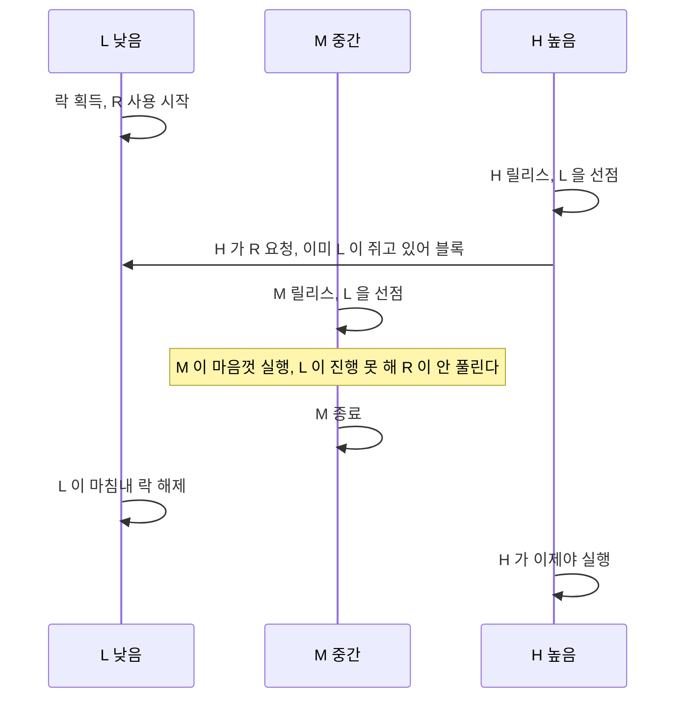
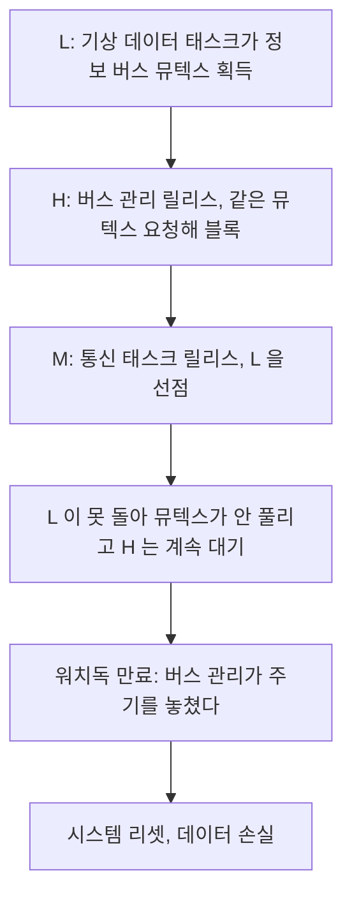

> **기준 출처:** Glenn Reeves (JPL, Mars Pathfinder 비행 소프트웨어 팀장), *What really happened on Mars*, 1997 · Mike Jones, [*What really happened on Mars Rover Pathfinder*](https://catless.ncl.ac.uk/Risks/19.49.html), RISKS Digest 19.49, 1997 · Sha, Rajkumar & Lehoczky, IEEE ToC 39(9), 1990 / 확인일 2026-08-07
> **시리즈:** [목차](/posts/00-rtos-series/) | 이전 → [07. 응답시간 분석](/posts/07-response-time-analysis/) | 다음 → [09. 우선순위 상속과 천장 프로토콜](/posts/09-priority-inheritance-ceiling/)


_Mars Pathfinder 임무의 Sojourner 로버. 아래에서 다룰 소프트웨어 문제는 이 로버가 아니라 착륙선의 비행 컴퓨터에서 일어났다._

## 1. 무슨 일이 있었나

1997년 7월, Mars Pathfinder 착륙선이 화성에 착륙하고 며칠 뒤부터 원인 불명의 시스템 리셋이 반복해서 발생했다. 착륙선은 데이터를 잃고 재부팅했고, 이 일이 며칠에 한 번씩 계속됐다.

지구에서 같은 하드웨어와 같은 소프트웨어로 재현 시험을 반복한 끝에 원인이 밝혀졌다. 우선순위 역전(priority inversion)이었다.

이 사건이 교과서에 남은 이유는 버그가 코드에 있지 않았다는 점이다. 각 태스크는 전부 정상이었고 스케줄러도 정상이었다. 문제는 우선순위가 높으면 먼저 실행된다는 규칙이 공유자원 앞에서 깨진다는 구조적 사실이었고, 그것은 어떤 RTOS를 쓰든 똑같이 일어난다.

## 2. 우선순위 역전의 기본형

등장인물은 셋이다.

| 태스크 | 우선순위 | 하는 일 |
| --- | --- | --- |
| H (High) | 높음 | 급한 일. 공유자원 R이 필요하다 |
| M (Medium) | 중간 | 오래 걸리는 일. R은 필요 없다 |
| L (Low) | 낮음 | 느긋한 일. R을 쓴다 |



```text
 우선순위 역전 - 시간축

 시각  0    2    4    6    8   10   12   14   16
       |----|----|----|----|----|----|----|----|
 H          ^릴리스 x블록==================[실행]
 M                    ^릴리스[==== M 실행 ====]
 L     [락][L실행]x선점================[락해제]
       ^
       락 획득
       +------ H 가 M 보다 낮게 취급된 구간 = 역전 ------+
```

H는 M보다 우선순위가 높은데 M이 다 끝날 때까지 기다렸다. 우선순위 순서가 뒤집힌 것이다. 그리고 M은 R을 쓰지도 않는다. 아무 관계 없는 중간 우선순위 태스크가 H를 막을 수 있다는 것이 이 현상의 성질이다.

M이 하나가 아니라 여러 개이고 계속 릴리스된다면 H의 대기 시간에 상한이 없다. [07편](/posts/07-response-time-analysis/)의 계산에 넣을 수 있는 값이 아니게 된다. 상한을 말할 수 없으면 실시간이 아니다.

정상적인 블로킹과는 구분해야 한다. H가 L이 R을 놓을 때까지 기다리는 것 자체는 정상이고 피할 수 없다. 그 시간은 L의 임계구역 길이만큼으로 유계다. 문제는 M이 끼어들어 그 대기를 무한정 늘리는 쪽이다.

## 3. Pathfinder에서 실제로 벌어진 일

착륙선의 비행 소프트웨어는 VxWorks 위에서 돌았고, 태스크들이 정보 버스(information bus)라는 공유 구조를 통해 데이터를 주고받았다. 이 버스는 뮤텍스로 보호되고 있었다.

| 역할 | 태스크 | 우선순위 |
| --- | --- | --- |
| H | 버스 관리 태스크 | 높음. 정보 버스를 주기적으로 관리한다 |
| M | 통신 태스크 | 중간. 길게 돌 수 있다 |
| L | 기상 데이터 수집 (ASI/MET) | 낮음. 버스에 데이터를 게시한다 |



마지막 단계가 결과를 결정했다. 시스템에는 워치독이 있었고, 버스 관리 태스크가 정해진 시간 안에 돌지 않으면 심각한 이상이라고 판단하도록 설계돼 있었다. 워치독은 설계대로 동작해서 시스템을 리셋했다. 안전장치가 제 일을 했고 그래서 임무는 잃지 않았다.

## 4. 어떻게 고쳤나

VxWorks의 뮤텍스는 우선순위 상속(priority inheritance)을 지원하고 있었다. 다만 생성할 때 그 옵션이 꺼져 있었다.

```c
/* 개념 예시, VxWorks 뮤텍스 생성 옵션 */
semMCreate(SEM_Q_PRIORITY);                        /* 문제가 있던 설정 */
semMCreate(SEM_Q_PRIORITY | SEM_INVERSION_SAFE);   /* 상속 활성화 */
```

JPL 팀은 1억 8천만 km 떨어진 착륙선에 패치를 전송해 이 옵션을 켰다. 리셋은 멈췄다. 이 사건에서 남는 것이 셋이다.

첫째, 기능은 있는데 안 켜져 있었다. 우선순위 상속은 대부분의 RTOS에 있지만 기본값이 꺼짐인 경우가 많다. FreeRTOS도 뮤텍스 종류를 골라야 하고 POSIX도 `PTHREAD_PRIO_INHERIT`를 명시해야 한다. [09편](/posts/09-priority-inheritance-ceiling/)에서 다룬다.

둘째, 지상 시험에서 잡히지 않았다. 발생 조건이 L이 락을 쥔 짧은 순간에 H가 오고 그 사이에 M이 온다는 드문 타이밍 조합이었다. 며칠에 한 번 나오는 문제를 시험으로 잡기는 어렵다. [02편](/posts/02-hard-soft-firm-realtime/)에서 경성 실시간은 측정이 아니라 증명을 요구한다고 한 것이 여기서 실증된다.

셋째, 로그를 남겨 뒀기 때문에 원인을 찾았다. 비행 소프트웨어에 추적 기능이 들어 있었고 지상에서 같은 조건을 재현할 수 있었다. 재현할 수 없는 실시간 버그는 고칠 수 없다.

## 5. 지금도 그대로 일어난다

Pathfinder는 1997년이지만 구조는 바뀌지 않았다. 공유자원과 세 개 이상의 우선순위가 있으면 우선순위 역전이 성립한다.

| 요즘 흔한 형태 | 왜 생기나 |
| --- | --- |
| 제어 루프가 로그 버퍼 락을 기다린다 | 로깅이 락을 쥔 채 선점당한다 |
| 필드버스 송신이 드라이버 락에서 막힌다 | 진단 태스크가 같은 락을 쓴다 |
| 제어 태스크가 `malloc` 내부 락에서 막힌다 | 힙 락은 전역이라 누가 쥐고 있을지 모른다 |
| 실시간 태스크가 `printf`를 호출한다 | stdout이 락으로 보호된다 |

그래서 실시간 루프의 원칙이 이렇게 정리된다. 공유자원을 아예 안 쓰는 쪽이 가장 낫고, 태스크마다 자기 버퍼를 두거나 락프리 큐를 쓴다. 써야 하면 우선순위 상속을 켠다. 임계구역은 최대한 짧게 유지하고, 그 길이가 곧 다른 태스크의 블로킹 시간 $B_i$가 된다. `malloc`과 `printf`와 파일 I/O는 보이지 않는 락을 쥐므로 실시간 루프에서 금지한다.

## 정리

- 우선순위 역전은 높은 태스크가 낮은 태스크의 락을 기다리는 동안 관계 없는 중간 태스크가 낮은 쪽을 선점해 대기가 늘어나는 현상이다.
- 무제한이 되는 것이 문제다. 상한을 말할 수 없으면 실시간이 아니다.
- Pathfinder는 정보 버스 뮤텍스에 기상 태스크와 통신 태스크와 버스 관리가 얽혀 워치독 리셋을 반복했다.
- 고친 방법은 우선순위 상속 옵션을 켜는 것이었다. 기능은 있었는데 꺼져 있었다.
- 남는 것은 셋이다. 기본값이 꺼짐인 경우가 많고, 드문 타이밍은 시험으로 안 잡히고, 추적 기능이 있어야 원인을 찾는다.
- 지금도 로그 버퍼 락, 드라이버 락, `malloc`과 `printf`의 숨은 락에서 똑같이 일어난다.

## 참고

- [Mike Jones — What really happened on Mars Rover Pathfinder (RISKS Digest 19.49)](https://catless.ncl.ac.uk/Risks/19.49.html)
- Sha, L., Rajkumar, R. & Lehoczky, J., *Priority Inheritance Protocols*, IEEE Trans. Computers 39(9), 1990
- 사진: NASA/JPL, PIA01122 (public domain)