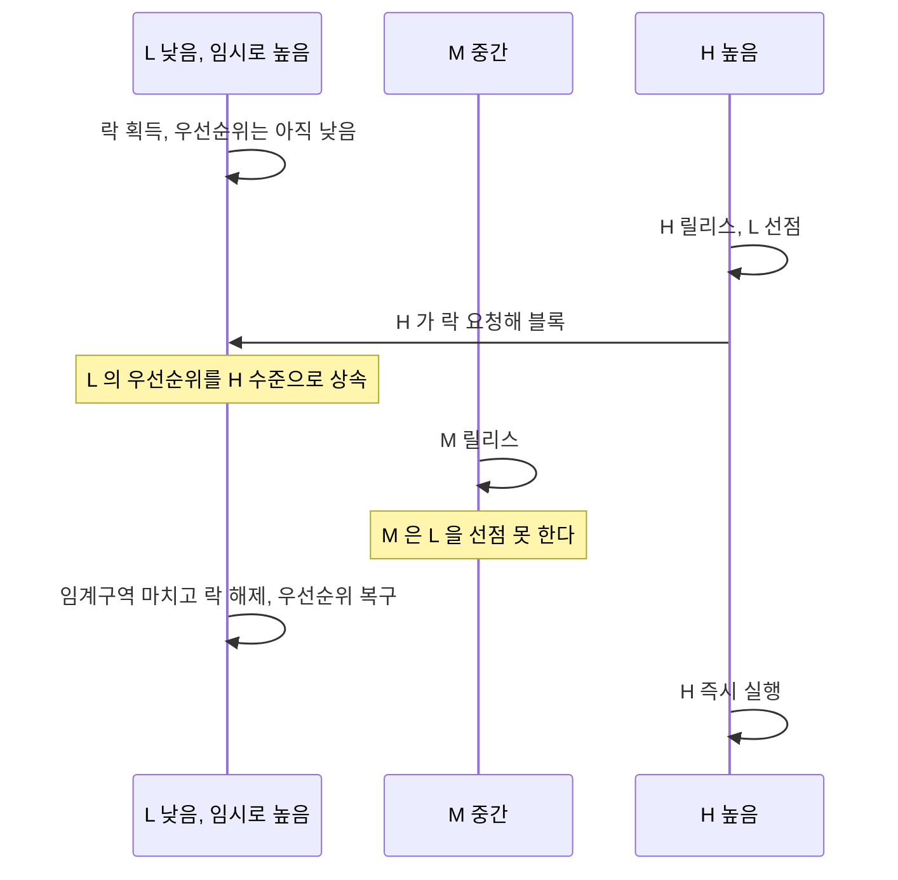
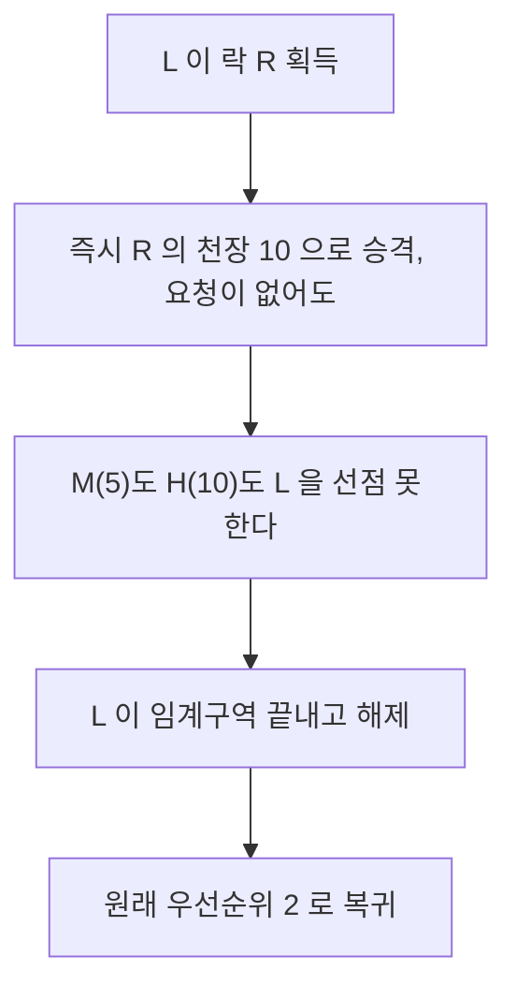
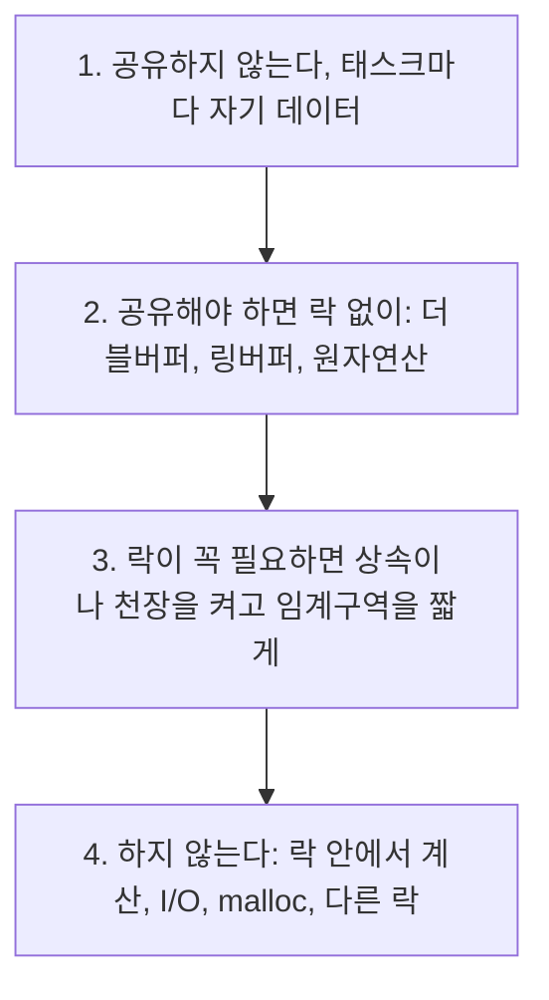

> **기준 출처:** Sha, Rajkumar & Lehoczky, *Priority Inheritance Protocols: An Approach to Real-Time Synchronization*, IEEE Trans. Computers 39(9), 1990 (PIP와 PCP의 원전) · [pthread_mutexattr_setprotocol(3)](https://man7.org/linux/man-pages/man3/pthread_mutexattr_setprotocol.3.html) · [FreeRTOS Mutexes](https://www.freertos.org/Documentation/02-Kernel/02-Kernel-features/02-Queues-mutexes-semaphores/02-Mutexes) / 확인일 2026-08-07
> **시리즈:** [목차](/posts/00-rtos-series/) | 이전 → [08. 우선순위 역전](/posts/08-priority-inversion-mars-pathfinder/) | 다음 → [10. 인터럽트와 태스크의 관계](/posts/10-interrupts-and-tasks/)

## 1. 해결의 발상

[08편](/posts/08-priority-inversion-mars-pathfinder/)의 문제는 L이 락을 쥔 채로 선점당하는 것이었다. 그러면 해결도 그 자리에서 나온다. L이 H가 필요로 하는 락을 쥐고 있는 동안에는 L을 H의 우선순위로 올려 준다.

그러면 M은 L을 선점할 수 없고 L은 빨리 일을 끝내고 락을 놓는다. 락을 놓는 순간 L은 원래 우선순위로 돌아간다.



```text
 우선순위 상속 적용 - 08편과 같은 상황

 시각  0    2    4    6    8   10   12
       |----|----|----|----|----|----|
 H          ^릴리스x블록===[== 실행 ==]
 M                 ^릴리스 ...........[M]
 L     [락][L실행(H급으로 승격)][락해제]

  H 의 블로킹 = L 의 임계구역 길이만큼이라 유계다
  M 은 끼어들지 못한다
```

여기서 얻은 것은 블로킹 시간의 상한이다. H가 기다리는 시간이 L의 임계구역 길이로 유계가 되고, 그 값을 [07편](/posts/07-response-time-analysis/)의 $B_i$ 항에 넣어 계산할 수 있다.

## 2. PIP, 가장 흔한 방식

Priority Inheritance Protocol의 규칙은 이렇다. 태스크가 쥔 락을 더 높은 우선순위 태스크가 요청하면 쥔 쪽의 우선순위를 요청자 수준으로 일시적으로 올리고, 락을 놓으면 되돌린다.

| 장점 | 단점 |
| --- | --- |
| 구현이 단순하고 기존 코드를 안 고쳐도 된다. 뮤텍스 속성만 바꾸면 된다 | 데드락을 막지 못한다 |
| 대부분의 RTOS와 POSIX가 지원한다 | 연쇄 블로킹(chained blocking)이 생긴다 |

연쇄 블로킹은 이렇게 생긴다. H가 락 A와 B를 둘 다 필요로 하는데 L1이 A를, L2가 B를 쥐고 있으면 H는 두 번 연속으로 블록된다. 락이 n개면 최악 n번이다.

$$B_i^{PIP} \le \sum_{k=1}^{n} (\text{임계구역 길이})_k$$

유계이긴 하지만 락이 많아질수록 상한이 커진다.

## 3. 천장 프로토콜

각 락에 숫자를 하나 미리 붙여 둔다. 락 R의 우선순위 천장은 R을 사용하는 태스크들 중 가장 높은 우선순위다.

| 락 | 이 락을 쓰는 태스크 | 천장 |
| --- | --- | --- |
| 정보 버스 뮤텍스 | H(우선순위 10), L(우선순위 2) | 10 |
| 로그 버퍼 뮤텍스 | M(5), L(2) | 5 |

실무에서 쓰는 것은 IPCP(Immediate Priority Ceiling Protocol)다. 락을 잡는 즉시 그 락의 천장 우선순위로 올라간다. 아무도 요청하지 않아도 올라간다.



| 항목 | IPCP |
| --- | --- |
| 승격 시점 | 락을 잡는 순간, 요청이 없어도 |
| 블로킹 횟수 | 최대 1회, 연쇄 블로킹이 없다 |
| 데드락 | 구조적으로 불가능하다 |
| 비용 | 요청이 없었어도 승격하므로 불필요한 승격이 생긴다 |
| 준비 | 천장 값을 미리 정해야 한다. 태스크와 락의 관계를 다 알아야 한다 |

$$B_i^{IPCP} \le \max_k (\text{임계구역 길이})_k$$

IPCP가 나은 이유가 셋이다. 블로킹 상한이 가장 긴 임계구역 하나로 줄어들고(PIP는 합이다), 데드락이 원천적으로 생기지 않으며(락을 잡은 태스크는 천장 이상이므로 그 락을 쓰는 다른 태스크가 끼어들 수 없다), 요청 시점을 추적할 필요가 없어 구현이 오히려 단순하다. 그래서 안전 관련 시스템에서 IPCP나 그 변형을 표준으로 쓴다. AUTOSAR OS와 OSEK의 기본 방식이 IPCP다.

| | 상속 없음 | PIP | IPCP |
| --- | --- | --- | --- |
| 블로킹 상한 | 무제한 | 락 개수만큼 누적 | 가장 긴 것 1회 |
| 데드락 방지 | 안 됨 | 안 됨 | 됨 |
| 사전 준비 | 없음 | 없음 | 천장 값 설정 |
| 어디에 있나 | 기본값인 경우가 많다 | POSIX `PTHREAD_PRIO_INHERIT`, FreeRTOS 뮤텍스 | POSIX `PTHREAD_PRIO_PROTECT`, AUTOSAR와 OSEK |

## 4. 실제로 켜는 법

POSIX에서는 뮤텍스 속성으로 지정한다.

```c
#include <pthread.h>

pthread_mutex_t m;
pthread_mutexattr_t attr;

pthread_mutexattr_init(&attr);

/* 우선순위 상속 (PIP), 실시간 루프의 기본 선택 */
pthread_mutexattr_setprotocol(&attr, PTHREAD_PRIO_INHERIT);

/* 또는 우선순위 천장 (IPCP)
   pthread_mutexattr_setprotocol(&attr, PTHREAD_PRIO_PROTECT);
   pthread_mutexattr_setprioceiling(&attr, 80);   */

pthread_mutex_init(&m, &attr);
pthread_mutexattr_destroy(&attr);
```

기본값은 `PTHREAD_PRIO_NONE`이다. 아무것도 지정하지 않고 만든 뮤텍스는 우선순위 역전 방어가 전혀 없고, Pathfinder와 같은 상태다. 실시간 태스크가 건드리는 뮤텍스는 전부 명시적으로 설정해야 한다.

FreeRTOS에서는 종류 선택이 곧 설정이다.

```c
/* 뮤텍스: 우선순위 상속이 내장돼 있다 */
SemaphoreHandle_t mtx = xSemaphoreCreateMutex();

/* 이진 세마포어: 상속이 없다. 상호배제 용도로 쓰면 안 된다 */
SemaphoreHandle_t sem = xSemaphoreCreateBinary();
```

FreeRTOS에서 흔한 실수가 상호배제에 이진 세마포어를 쓰는 것이다. 겉보기 동작은 같지만 우선순위 상속이 없다. 뮤텍스는 상호배제용이고 소유자 개념이 있어 상속이 되며, 이진 세마포어는 신호용이라 소유자가 없다. ISR에서 태스크에 알릴 때 쓰는 쪽이 세마포어다. `configUSE_MUTEXES`를 1로 켜야 뮤텍스 API가 활성화된다.

## 5. 블로킹 시간을 07편 계산에 넣기

$B_i$는 τi보다 낮은 우선순위 태스크가 τi를 막을 수 있는 최대 시간이다. PIP에서는 τi를 막을 수 있는 모든 임계구역의 합이고, IPCP에서는 그중 가장 긴 것 하나다.

03편의 조인트 제어기에 락을 하나 넣어 본다. τ1(전류 루프)과 τ5(로깅)가 상태 구조체를 공유하고 τ5의 임계구역이 30 µs라고 한다.

| | $B_1$ | $R_1 = C_1 + B_1$ | $D_1$ | 판정 |
| --- | --- | --- | --- | --- |
| 상속 없음 | 무제한 | 계산 불가 | 100 | 증명 불가 |
| PIP 또는 IPCP | 30 µs | 25 + 30 = 55 µs | 100 | 통과, 여유 45 |

상속을 켜는 것만으로 계산할 수 없던 시스템이 계산되는 시스템으로 바뀐다. 성능이 좋아진 것이 아니라 증명 가능해진 것이고, 그것이 실시간 설계에서 상속 프로토콜이 하는 일이다.

여기서 바로 다음 결론이 나온다. 임계구역 길이를 줄이는 것이 곧 성능이다. 30 µs를 5 µs로 줄이면 최고 우선순위 태스크의 응답시간이 그만큼 줄어든다. 락 안에서는 복사만 하고 계산은 밖에서 하는 이유가 여기 있다.

## 6. 그래도 최선은 락을 안 쓰는 것

상속 프로토콜은 피해를 유계로 만드는 장치이고 피해를 없애는 장치가 아니다. 실시간 루프의 선택 순서는 이렇다.



구체적인 락프리 기법은 [14편](/posts/14-task-ipc-synchronization/)에서 다룬다.

## 정리

- 발상은 락을 쥔 동안만 우선순위를 올려 주는 것이다. 그러면 중간 우선순위가 끼어들지 못한다.
- PIP는 요청이 올 때 승격한다. 단순하지만 연쇄 블로킹과 데드락은 못 막는다.
- IPCP는 락 잡는 즉시 천장으로 승격한다. 블로킹 1회에 데드락이 불가능하고 AUTOSAR와 OSEK의 표준이다.
- POSIX 기본값은 `PTHREAD_PRIO_NONE`으로 방어가 전혀 없다. 명시적으로 켜야 한다.
- FreeRTOS는 뮤텍스에 상속이 있고 이진 세마포어에는 없다. 상호배제에 세마포어를 쓰지 않는다.
- 상속을 켜면 $B_i$가 유계가 되어 07편 계산에 들어온다. 증명 가능해진다.
- 임계구역 길이가 곧 다른 태스크의 블로킹 시간이다. 락 안에서는 복사만 한다.
- 최선은 여전히 락을 안 쓰는 것이다.

## 참고

- Sha, L., Rajkumar, R. & Lehoczky, J., *Priority Inheritance Protocols*, IEEE Trans. Computers 39(9), 1990
- [pthread_mutexattr_setprotocol(3)](https://man7.org/linux/man-pages/man3/pthread_mutexattr_setprotocol.3.html)
- [FreeRTOS — Mutexes](https://www.freertos.org/Documentation/02-Kernel/02-Kernel-features/02-Queues-mutexes-semaphores/02-Mutexes)