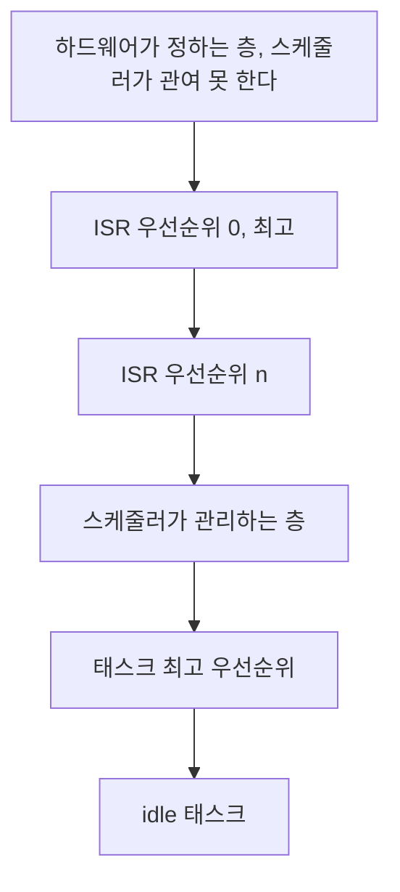

> **기준 출처:** [Linux kernel Generic IRQ handling](https://www.kernel.org/doc/html/latest/core-api/genericirq.html) · [ARM Cortex-M Devices Generic User Guide, NVIC](https://developer.arm.com/documentation/dui0553/latest/) · [FreeRTOS 문서](https://www.freertos.org/Documentation/02-Kernel/02-Kernel-features/03-Software-timers/01-Software-timers) · Buttazzo, *Hard Real-Time Computing Systems*, Springer / 확인일 2026-08-07
> **시리즈:** [목차](/posts/00-rtos-series/) | 이전 → [09. 우선순위 상속](/posts/09-priority-inheritance-ceiling/) | 다음 → [11. 지터](/posts/11-jitter-sources/)

## 1. ISR은 모든 태스크보다 높다

우선순위 99짜리 `SCHED_FIFO` 태스크든 FreeRTOS의 최상위 태스크든 인터럽트가 오면 밀린다. 스케줄러조차 인터럽트를 이기지 못한다. 스케줄러 자체가 타이머 인터럽트로 깨어나기 때문이다.



실무에서 이것이 뜻하는 바는 계산 방법이다. [07편](/posts/07-response-time-analysis/)의 응답시간 계산에서 인터럽트는 모든 태스크보다 높은 태스크로 모델링해 넣어야 한다. 안 넣으면 계산 전체가 낙관적으로 틀린다.

## 2. 인터럽트가 만드는 두 가지 지연


| 구간 | 이름 | 무엇이 늘리나 |
| --- | --- | --- |
| 사건에서 ISR 시작까지 | 인터럽트 지연 | 인터럽트 비활성 구간, 더 높은 ISR이 실행 중, 현재 명령 완료 대기 |
| ISR 진입 | | 레지스터 저장, 벡터 분기 |
| ISR 실행 | | ISR 코드 길이 |
| 태스크 깨우기에서 실행까지 | 스케줄링 지연 | 선점 불가 구간, 컨텍스트 스위치 |

RTOS를 평가하는 두 숫자가 정확히 이 둘이다. RTOS 데이터시트에 interrupt latency 1.2 µs, context switch 0.8 µs 같은 수치가 나오는 이유가 여기 있다. PREEMPT_RT가 하는 일도 이 두 구간을 줄이는 것이다. [리눅스 03편](/posts/03-what-preempt-rt-does/)에서 다룬다.

## 3. 인터럽트를 끄는 구간이 최악 지연을 정한다

인터럽트를 끄는 코드(`cli`, `local_irq_disable()`, `taskENTER_CRITICAL()`)가 있으면 그동안 들어온 인터럽트는 전부 기다린다. 시스템 전체의 최악 인터럽트 지연은 가장 긴 인터럽트 비활성 구간의 길이다.

이건 내 코드뿐 아니라 커널과 드라이버와 라이브러리 전부를 포함한다. 드라이버 하나가 200 µs 동안 인터럽트를 끄면 내가 아무리 잘 짜도 최악 지연은 200 µs다.

```text
 인터럽트 비활성 구간이 지연을 만든다

 시각   0    2    4    6    8   10   12
        |----|----|----|----|----|----|
 IRQ끔  [======= 드라이버 임계구역 =======]
 사건        ^ 엔코더 인터럽트 발생
 ISR                                  [실행]
             +---- 지연 8 -------------+
```

| 실무 지침 | 이유 |
| --- | --- |
| 인터럽트 비활성 구간은 수 µs 이내로 | 이 값이 곧 시스템 최악 지연의 하한이다 |
| 임계구역 안에서 루프를 돌지 않는다 | 길이가 데이터에 따라 변하면 상한을 말할 수 없다 |
| 가능하면 인터럽트 비활성 대신 락을 쓴다 | 락은 특정 자원만 막지만 인터럽트 끄기는 시스템 전체를 막는다 |
| 실제로 측정한다 | 리눅스는 ftrace의 `irqsoff` 트레이서로 잰다. [리눅스 10편](/posts/10-tracing-ftrace-tracecmd/) |

## 4. ISR은 짧게, 두 단계로 나눈다

ISR 안에서 일을 다 하면 안 된다. ISR이 도는 동안은 그보다 낮은 모든 ISR과 모든 태스크가 멈춰 있다.


| 이름 | 리눅스 | FreeRTOS | Zephyr |
| --- | --- | --- | --- |
| 상반부 | hardirq | ISR, `FromISR` API만 사용 | ISR |
| 하반부 | threaded IRQ, softirq, tasklet, workqueue | 전용 태스크, 세마포어나 큐로 깨움 | workqueue |

```c
/* FreeRTOS 상반부와 하반부 분리 */
void EXTI0_IRQHandler(void)          /* 상반부: 짧게 */
{
    BaseType_t woken = pdFALSE;
    uint32_t raw = ENCODER->COUNT;               /* 하드웨어 값만 즉시 확보 */
    xQueueSendFromISR(q_enc, &raw, &woken);      /* 큐에 넣고 */
    portYIELD_FROM_ISR(woken);                   /* 필요하면 즉시 태스크로 전환 */
}

void encoder_task(void *arg)          /* 하반부: 여기서 계산 */
{
    uint32_t raw;
    for (;;) {
        xQueueReceive(q_enc, &raw, portMAX_DELAY);
        /* 스케일링, 필터, 상태 갱신. 선점 가능한 문맥이다 */
    }
}
```

`FromISR` 접미사가 붙은 API만 ISR에서 쓸 수 있다. 일반 API는 블록할 수 있는데 ISR은 블록되면 안 된다. 블록될 태스크 문맥이 없기 때문이다. 이걸 어기면 대개 하드폴트로 나타난다.

리눅스 PREEMPT_RT는 이 분리를 강제로 한다. 거의 모든 인터럽트 핸들러가 커널 스레드로 바뀌고(threaded IRQ), ISR이 태스크가 되므로 우선순위를 매길 수 있고 선점도 된다. RT 커널의 주요 변화 중 하나다.

## 5. 인터럽트 폭풍은 상한이 없는 부하다

[03편](/posts/03-task-model-timing-params/)에서 최소 도착 간격을 보장하지 못하면 분석이 불가능하다고 했다. 인터럽트가 정확히 그 위험을 안고 있다.

| 상황 | 무슨 일이 일어나나 |
| --- | --- |
| 네트워크 패킷 폭주 | 패킷마다 인터럽트가 걸려 CPU가 ISR만 돈다 |
| 센서 배선 불량이나 채터링 | 접점이 떨릴 때마다 인터럽트가 걸린다 |
| 인터럽트 플래그 클리어 실패 | 같은 인터럽트가 무한 반복된다. 가장 흔한 버그다 |

결과는 livelock이다. 시스템이 살아 있는데 태스크가 하나도 진행하지 못하고, 워치독조차 못 돌 수 있다.

| 방어 | 방법 |
| --- | --- |
| 인터럽트 조절 (moderation) | 하드웨어 레벨에서 최소 간격을 강제한다. NIC의 interrupt coalescing |
| 폴링으로 전환 | 부하가 높아지면 인터럽트를 끄고 폴링한다. 리눅스 NAPI가 이 방식이다 |
| 레이트 리미터 | 단위 시간당 처리 횟수를 세고 초과분은 버리거나 지연한다 |
| 코어 분리 | 인터럽트를 실시간 코어에서 다른 코어로 밀어낸다. [리눅스 07편](/posts/07-cpu-isolation-irq-affinity/) |

실시간 제어 시스템에서 가장 확실한 방어는 인터럽트를 안 쓰는 것이다. 주기가 정해진 제어 루프라면 이벤트를 기다릴 이유가 없다. 타이머 하나로 깨어나서 필요한 것을 전부 폴링하면 도착 패턴이 결정적이 된다. 필드버스 마스터가 대개 이 구조다. [리눅스 13편](/posts/13-ethercat-master-on-linux/)에서 다룬다.

## 6. 인터럽트를 07편 계산에 넣는 법

ISR을 주기 T가 최소 도착 간격이고 실행시간 C가 ISR 최악 실행시간인 최상위 태스크로 모델링한다. 03편 예제에 인터럽트 둘을 추가해 본다.

| | 종류 | 최소 간격 T | C | U |
| --- | --- | --- | --- | --- |
| ISR1 | 타이머, 제어 틱 | 100 µs | 3 µs | 0.030 |
| ISR2 | 필드버스 수신 | 1,000 µs | 12 µs | 0.012 |
| | | | ISR 소계 | 0.042 |
| τ1~τ5 | 03편 그대로 | | | 0.740 |
| | | | 전체 U | 0.782 |

U가 0.740에서 0.782로 올랐다. [05편](/posts/05-rate-monotonic-utilization-bound/)의 $n=5$ 한계 0.743은 이미 넘었고, ISR을 넣으면 $n=7$ 한계인 약 0.729는 한참 넘는다. 인터럽트를 빼고 계산하면 여유 있음이 나오고 넣으면 확인 필요가 나온다. 실제 시스템에서 계산과 측정이 안 맞는 원인 대부분이 여기 있다.

계산 방법은 태스크와 같다. ISR을 우선순위 목록 맨 위에 넣고 07편의 반복식을 그대로 돌리면 된다.

## 정리

- ISR은 모든 태스크보다 높다. 우선순위 99 태스크도 인터럽트에 밀린다.
- 지연은 두 가지다. 사건에서 ISR까지의 인터럽트 지연과 ISR에서 태스크까지의 스케줄링 지연이고, RTOS 평가 지표가 정확히 이 둘이다.
- 시스템 최악 인터럽트 지연은 가장 긴 인터럽트 비활성 구간이다. 내 코드가 아니라 드라이버가 정할 수도 있다.
- ISR은 상반부와 하반부로 나눈다. ISR은 값만 확보해 큐에 넣고 끝내고 계산은 태스크에서 한다.
- FreeRTOS는 `FromISR` API만 ISR에서 쓸 수 있다. PREEMPT_RT는 IRQ를 아예 스레드로 바꾼다.
- 인터럽트 폭풍은 상한이 없어 livelock으로 간다. 조절, 폴링 전환, 코어 분리로 막는다.
- 실시간 제어의 가장 확실한 구조는 타이머 하나에 폴링이다. 도착 패턴이 결정적이 된다.
- 07편 계산에 ISR을 최상위 태스크로 넣어야 한다. 안 넣으면 계산이 낙관적으로 틀린다.

## 참고

- [Linux kernel — Generic IRQ handling](https://www.kernel.org/doc/html/latest/core-api/genericirq.html)
- [ARM Cortex-M Devices Generic User Guide](https://developer.arm.com/documentation/dui0553/latest/)
- Buttazzo, G., *Hard Real-Time Computing Systems*, Springer