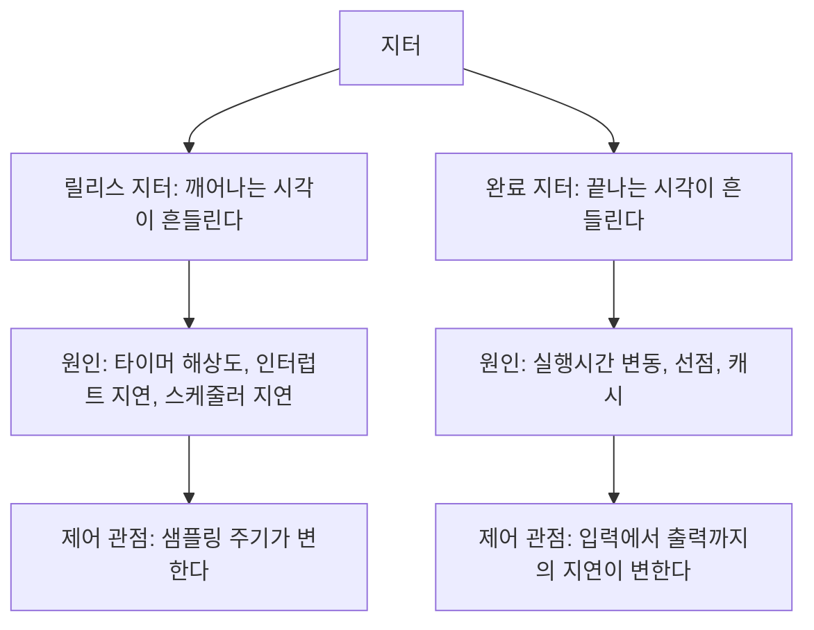

> **기준 출처:** [man 2 clock_nanosleep](https://man7.org/linux/man-pages/man2/clock_nanosleep.2.html) · [cyclictest 문서](https://wiki.linuxfoundation.org/realtime/documentation/howto/tools/cyclictest/start) · Åström & Wittenmark, *Computer-Controlled Systems*, Prentice Hall · [EtherCAT Technology Group, Distributed Clocks](https://www.ethercat.org/en/technology.html) / 확인일 2026-08-07
> **시리즈:** [목차](/posts/00-rtos-series/) | 이전 → [10. 인터럽트와 태스크](/posts/10-interrupts-and-tasks/) | 다음 → [12. 컨텍스트 스위치와 캐시](/posts/12-context-switch-cache-memory/)

## 1. 두 종류를 구분한다

지터는 시간 간격이 매번 얼마나 흔들리는가를 말한다. 실무에서는 두 가지를 섞어 쓰는데 원인도 대책도 다르다.



| | 릴리스 지터 | 완료 지터 |
| --- | --- | --- |
| 무엇 | 태스크가 깨어나는 시각의 흔들림 | 태스크가 끝나는 시각의 흔들림 |
| 07편 식에서 | $J_j$ 항, 간섭 계산에 들어간다 | $R_i$의 변동폭 |
| 제어에서 | 샘플링 주기 $T_s$가 변한다 | 입출력 지연이 변한다 |
| 줄이는 법 | 절대시각 대기, 타이머 해상도, 우선순위 | 실행시간 균일화, 선점 차단 |

## 2. 제어에서 지터는 그냥 외란이다

제어 엔지니어에게 지터는 좀 흔들리는 것 정도가 아니라 직접적인 성능 손실이다. 이유가 셋이다.

첫째, 미분항과 적분항이 틀어진다. 이산 제어기는 주기 $T_s$를 상수로 가정하고 계산한다.

$$\dot e \approx \frac{e_k - e_{k-1}}{T_s}, \qquad \sum e \cdot T_s$$

실제 주기가 $T_s + \Delta$였다면 미분항은 $T_s/(T_s+\Delta)$배만큼 틀린 값이 된다. 1 ms 주기에서 100 µs 지터면 미분 이득이 매 스텝 ±10%씩 흔들리는 것과 같다. D 이득을 크게 쓴 제어기가 지터에 특히 취약한 이유가 여기 있다. 노이즈 증폭에 더해 주기 변동까지 증폭한다.

둘째, 지연 변동이 위상여유를 깎는다. 입력을 읽은 시점부터 출력을 내보내는 시점까지의 지연 $\tau$가 매번 다르면 제어 루프의 위상 지연이 매번 다르다.

$$\text{추가 위상 지연} \approx -\omega \tau \ \text{[rad]}$$

1 kHz 루프에서 대역폭 100 Hz, 지연 변동 200 µs라면 위상여유가 약 7도씩 흔들린다. 위상여유를 30도로 설계했다면 그중 4분의 1이 지터로 사라진다.

셋째, 그래서 평균 지연보다 지연 변동이 나쁘다.


일정하게 느린 편이 불규칙하게 빠른 것보다 낫다. 실시간 설계에서 반복해서 나오는 이 원칙이 제어에서 가장 뚜렷하게 보인다.

그래서 일부 시스템은 일부러 출력을 지연시킨다. 계산이 언제 끝나든 다음 주기 시작 시각에 맞춰 출력을 내보내면 지연이 정확히 한 주기로 고정된다. 평균은 나빠지지만 변동이 0이 된다. 구체적인 형태는 5절에 있다.

## 3. 지터의 출처

| # | 출처 | 전형적 크기 | 대책 |
| --- | --- | --- | --- |
| 1 | 타이머 해상도 | 윈도우 기본 15.6 ms | 해상도 올리기, 하드웨어 타이머 |
| 2 | 인터럽트 지연, 비활성 구간 | µs에서 수백 µs | [10편](/posts/10-interrupts-and-tasks/) |
| 3 | 스케줄러 지연, 선점 불가 구간 | 일반 커널에서 ms 단위 | PREEMPT_RT |
| 4 | 상대시간 대기의 누적 드리프트 | 계속 누적된다 | 절대시각 대기, 5절 |
| 5 | 높은 우선순위의 간섭 | $R_i$ 변동폭만큼 | 우선순위 재배치 |
| 6 | 실행시간 변동, 분기와 데이터 | 코드에 따라 다르다 | 균일화, 최악 경로로 통일 |
| 7 | 캐시와 TLB 미스 | 수 µs에서 수십 µs | [12편](/posts/12-context-switch-cache-memory/) |
| 8 | 전원관리, C-state와 주파수 변동 | 수십에서 수백 µs | C-state 제한, 성능 모드 고정 |
| 9 | SMI와 SMM, 펌웨어 가로채기 | 수백 µs, OS가 못 막는다 | BIOS 설정, 하드웨어 선정 |
| 10 | 페이지 폴트 | ms 단위 | `mlockall`, `VirtualLock` |

8번과 9번이 실무에서 가장 까다롭다. OS 설정을 완벽하게 해도 BIOS나 펌웨어가 CPU를 가로채면(SMI) OS는 그 시간을 알지도 못한다. 리눅스 RT 커널을 깔고 다 설정했는데 200 µs짜리 스파이크가 남는다는 사례 대부분이 이것이다. [리눅스 12편](/posts/12-what-breaks-realtime/)에서 다룬다.

## 4. 실측으로 보는 지터


_실측 환경: Windows 10 Pro 19045, 노트북급 x86-64 4코어 8스레드. 조건마다 3,000 스텝, 측정일 2026-08-07._

| 조건 | 중앙값 | 상위 1% | 최악값 |
| --- | --- | --- | --- |
| A. `Sleep`만 | 172 µs | 898 µs | 1,357 µs |
| B. `Sleep` + 스핀 | 약 0 | 4.8 µs | 1,677 µs |
| C. 순수 스핀 | 약 0 | 8.3 µs | 351 µs |
| D. B + 최고 스레드 우선순위 | 약 0 | 3.6 µs | 605 µs |
| E. C + 최고 스레드 우선순위 | 약 0 | 3.3 µs | 1,142 µs |

읽는 법이 셋이다. `Sleep`만 쓰면 중앙값부터 172 µs이고, 이는 타이머 해상도 1 ms가 만드는 양자화 오차다(출처 1번). 스핀을 섞으면 중앙값과 p99가 µs 단위로 떨어지며 이것이 잘 만든 루프의 전형적 성능이다. 그런데 최악값은 어느 조건에서도 수백 µs가 남고 우선순위를 최고로 올려도 마찬가지다. 이건 출처 3번인 커널 선점 불가, 8번인 전원관리, 9번인 SMI 때문이고 응용 코드로는 없앨 수 없다.

이 표가 윈도우는 경성 실시간이 아니라는 말의 실증이다. 평균 성능은 좋은데 상한을 말할 수 없다. 상세는 [윈도우 03편](/posts/03-thread-priority-in-practice/)에서 다룬다.

## 5. 릴리스 지터를 없애는 법

가장 흔하고 가장 치명적인 실수부터 본다.

```c
/* 상대시간 대기, 오차가 누적된다 */
while (1) {
    do_control();            /* 실행시간이 매번 다르다 */
    usleep(1000);            /* 지금부터 1 ms 라서 실행시간만큼 계속 밀린다 */
}
```

```text
 상대시간 대기의 드리프트

 목표   0ms   1ms   2ms   3ms   4ms
        |     |     |     |     |
 실제   [C=0.2][sleep 1.0]
              1.2ms^     2.4ms^     3.6ms^     매 스텝 0.2 ms 씩 밀린다
        누적 오차는 시간이 갈수록 무한히 커진다
```

```c
/* 절대시각 대기, 오차가 누적되지 않는다 */
struct timespec next;
clock_gettime(CLOCK_MONOTONIC, &next);
while (1) {
    next.tv_nsec += 1000000;                     /* 다음 목표 = 이전 목표 + T */
    if (next.tv_nsec >= 1000000000) { next.tv_nsec -= 1000000000; next.tv_sec++; }

    clock_nanosleep(CLOCK_MONOTONIC, TIMER_ABSTIME, &next, NULL);
    do_control();
}
```

```text
 절대시각 대기

 목표   0ms   1ms   2ms   3ms   4ms
        |     |     |     |     |
 실제   [C ][대기][C][ 대기 ][C]
        ^0.0  ^1.0        ^2.0       목표 시각이 절대값이라 누적되지 않는다
        한 스텝이 늦어도 다음 스텝이 제자리로 돌아온다
```

차이는 다음 목표 시각을 무엇에 더하느냐다. 지금 시각에 T를 더하면 실행시간과 지연이 전부 누적되고, 이전 목표 시각에 T를 더하면 한 번 늦어도 그 스텝만 늦고 복구된다. 이 한 줄 차이가 10분 돌리면 1초 밀리는 루프와 하루 종일 돌려도 안 밀리는 루프를 가른다.

출력 지연까지 고정하려면 순서를 바꾼다.

```c
while (1) {
    clock_nanosleep(CLOCK_MONOTONIC, TIMER_ABSTIME, &next, NULL);

    read_sensors();      /* 항상 주기 시작 시각에 읽는다 */
    write_outputs(u);    /* 지난 주기에 계산해 둔 값을 지금 내보낸다. 지연이 고정된다 */
    u = compute();       /* 계산은 그 다음. 몇 µs 걸리든 출력 시각과 무관하다 */

    advance(&next, PERIOD_NS);
}
```

입력 읽기와 출력 쓰기를 주기 맨 앞에 몰아 두면 계산 시간이 얼마나 흔들리든 입출력 지연이 정확히 한 주기로 고정된다. 2절에서 말한 일부러 지연시키는 방식의 구체적 형태다. EtherCAT의 Distributed Clocks도 같은 발상이고, 모든 슬레이브가 같은 시각에 동시에 출력을 적용한다.

## 6. 지터를 측정하는 법

| 환경 | 도구 | 무엇을 재나 |
| --- | --- | --- |
| 리눅스 | `cyclictest` | 표준 도구. 타이머 깨어남 지연의 분포. [리눅스 09편](/posts/09-latency-measurement-cyclictest/) |
| 리눅스 | `ftrace`의 `irqsoff`, `preemptoff`, `wakeup_rt` | 지터의 원인 구간을 잡는다. [리눅스 10편](/posts/10-tracing-ftrace-tracecmd/) |
| 윈도우 | QPC 기반 자체 측정, LatencyMon | 4절의 방식. [윈도우 04편](/posts/04-timer-resolution-measurement/) |
| MCU | GPIO 토글과 오실로스코프 | 가장 정직하다. OS를 전혀 거치지 않는다 |
| 공통 | 루프 안에서 타임스탬프 기록 후 사후 분석 | 실제 운용 조건에서 잰다 |

MCU에서 GPIO 토글과 오실로스코프가 가장 나은 이유가 있다. 측정 자체가 시스템에 주는 부하가 핀 하나 토글로 거의 0이고, 측정 도구가 OS 안에 없으니 OS가 멈춘 구간도 보인다. 소프트웨어 측정은 OS가 나를 안 깨워 준 시간을 자기가 잴 수 없다는 한계가 있다.

측정 자체가 지터를 만든다는 점도 주의한다. 루프 안에서 `printf`로 찍으면 그것이 가장 큰 지터원이 된다. 링버퍼에 숫자만 쌓고 종료 후에 출력한다.

## 정리

- 지터는 릴리스 지터와 완료 지터 두 종류다. 원인도 대책도 다르다.
- 제어에서 지터는 외란이다. 미분항과 적분항이 틀어지고 지연 변동이 위상여유를 깎는다.
- 일정하게 느린 편이 불규칙하게 빠른 것보다 낫다. 일정한 지연은 보상되고 변동은 보상되지 않는다.
- 출처 열 가지 중 전원관리와 SMI는 OS 밖이라 소프트웨어로 막지 못한다.
- 실측에서 1 kHz 루프의 중앙값은 약 0, p99는 3.3 µs인데 최악값은 어떤 설정으로도 수백 µs가 남는다.
- 절대시각 대기(`TIMER_ABSTIME`)를 쓴다. `usleep` 상대 대기는 오차가 누적된다.
- 입력과 출력을 주기 맨 앞에 몰면 계산 시간이 흔들려도 입출력 지연이 한 주기로 고정된다.
- 측정은 리눅스에서 `cyclictest`, MCU에서 GPIO 토글과 오실로스코프가 가장 정직하다.

## 참고

- [man 2 clock_nanosleep](https://man7.org/linux/man-pages/man2/clock_nanosleep.2.html)
- [cyclictest — Linux Foundation RT wiki](https://wiki.linuxfoundation.org/realtime/documentation/howto/tools/cyclictest/start)
- Åström, K. J. & Wittenmark, B., *Computer-Controlled Systems*, Prentice Hall
- [EtherCAT Technology Group — Technology](https://www.ethercat.org/en/technology.html)