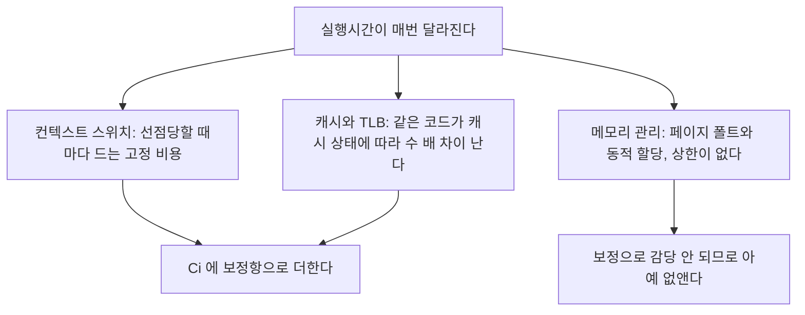

> **기준 출처:** [man 2 mlock](https://man7.org/linux/man-pages/man2/mlock.2.html) · [man 3 mallopt](https://man7.org/linux/man-pages/man3/mallopt.3.html) · [Microsoft Learn VirtualLock](https://learn.microsoft.com/en-us/windows/win32/api/memoryapi/nf-memoryapi-virtuallock) · [Linux Transparent Hugepage](https://www.kernel.org/doc/html/latest/admin-guide/mm/transhuge.html) · Altmeyer & Burguière, *Cache-Related Preemption Delay via Useful Cache Blocks*, RTSS 2009 / 확인일 2026-08-07
> **시리즈:** [목차](/posts/00-rtos-series/) | 이전 → [11. 지터](/posts/11-jitter-sources/) | 다음 → [13. WCET와 실행시간 예산](/posts/13-wcet-execution-budget/)

## 1. 결정성의 적 세 가지

[03편](/posts/03-task-model-timing-params/)에서 모델이 $C_i$는 상수이고 스위치 비용은 0이라고 가정한다고 했다. 실제로 그 가정을 깨는 것이 이 셋이다.



## 2. 컨텍스트 스위치를 세는 법

한 번 선점당하면 스위치는 두 번이다. 나갈 때 한 번, 돌아올 때 한 번이다.


| 저장하고 복원하는 것 | 비용 |
| --- | --- |
| 범용 레지스터 | 수십 사이클 |
| FPU와 SIMD 레지스터 | 훨씬 크다. Cortex-M4F의 FPU 컨텍스트, x86의 AVX 상태 |
| 스택 포인터와 프로그램 카운터 | 작다 |
| MMU가 있으면 페이지 테이블과 TLB 무효화 | 크다 |

| 환경 | 전형적 스위치 비용 |
| --- | --- |
| Cortex-M과 FreeRTOS | 수백 ns에서 수 µs |
| 리눅스, 같은 프로세스 내 스레드 | 1에서 5 µs |
| 리눅스, 프로세스 간이라 TLB 플러시 포함 | 수 µs에서 수십 µs |

실무 지침이 둘이다. 07편 계산에 넣을 때는 $C_i$에 스위치 2회분을 미리 더해 둔다. 태스크가 선점당하는 횟수는 $\lceil R_i/T_j \rceil$로 이미 계산돼 있으므로 그 횟수에 2를 곱하고 스위치 비용을 곱해 더하면 된다. 그리고 FPU를 쓰는 태스크와 안 쓰는 태스크를 섞지 않는다. 일부 RTOS는 FPU를 쓰는 태스크에만 FPU 컨텍스트를 저장하도록 설정할 수 있고(FreeRTOS의 `portTASK_USES_FLOATING_POINT`), 제어 태스크만 float를 쓰면 나머지 스위치가 훨씬 싸진다.

태스크를 잘게 쪼개면 스위치 비용이 늘어난다는 점도 기억한다. 역할별로 스레드를 나누는 것은 일반 소프트웨어의 미덕이지만 실시간에서는 비용이다. 실시간 루프는 하나의 태스크 안에서 순서대로 처리하는 편이 대개 유리하다.

## 3. 캐시는 같은 코드를 몇 배씩 차이 나게 만든다

| 접근 위치 | 전형적 지연 |
| --- | --- |
| L1 캐시 히트 | 1에서 4 사이클 |
| L2 히트 | 10에서 20 사이클 |
| L3 히트 | 30에서 50 사이클 |
| DRAM, 곧 미스 | 100에서 300 사이클 |

같은 함수가 캐시가 따뜻하면 1 µs, 차가우면 5 µs 걸릴 수 있다. 이 변동이 곧 [완료 지터](/posts/11-jitter-sources/)다.

여기에 선점이 겹치면 CRPD(Cache-Related Preemption Delay)가 생긴다. 높은 태스크가 낮은 태스크를 선점하면 높은 쪽이 캐시를 자기 데이터로 채우고, 낮은 쪽이 돌아왔을 때 자기 캐시가 사라져 있다.

```text
 CRPD

 low   [실행, 캐시 따뜻함]----선점----[재개: 캐시 차가움, 느려진다]
 high                     [실행, 캐시를 자기 것으로 덮어쓴다]

  low 의 실제 실행시간 = C_low + 캐시 재적재 비용 (선점 횟수에 비례)
```

이것이 07편 모델이 낙관적인 이유 중 하나다. 선점 횟수가 늘어날수록 낮은 우선순위 태스크의 실효 $C$가 커진다. 계산에서는 $C$를 상수로 뒀는데 실제로는 선점당할수록 늘어난다.

엄밀한 CRPD 분석은 학술적으로 복잡하다. 실무에서는 측정한 $C$에 20에서 50% 여유를 두는 것으로 처리한다. [13편](/posts/13-wcet-execution-budget/)에서 다룬다.

| 캐시를 다스리는 방법 | 내용 |
| --- | --- |
| 캐시 락킹 | 중요한 코드와 데이터를 캐시에 고정한다. 일부 MCU와 프로세서가 지원한다 |
| TCM, 스크래치패드 | Cortex-M7의 ITCM과 DTCM처럼 캐시가 아니라 결정적 온칩 메모리에 배치한다. 가장 확실하다 |
| 캐시 파티셔닝 | 코어나 태스크별로 캐시 way를 나눠 서로 침범하지 못하게 한다. 인텔 CAT 등 |
| 데이터 지역성 | 자주 쓰는 구조체를 한 캐시라인에 모으고 배열 순회 순서를 맞춘다 |
| 캐시 끄기 | 극단적이지만 결정성만 보면 최선이다. 평균은 느려지고 변동은 사라진다 |

캐시를 끄면 느려지지만 예측 가능해진다. [01편](/posts/01-what-is-realtime/)에서 RTOS는 처리량을 포기하고 예측 가능성을 산다고 한 것이 하드웨어 수준에서 그대로 반복된다.

## 4. 메모리, 실시간 루프의 금기 목록

가상 메모리를 쓰는 OS에서 메모리에 처음 접근하면 페이지 폴트가 나고 커널이 물리 페이지를 붙여 준다. 수백 µs에서 ms가 걸릴 수 있고 스왑이 관련되면 훨씬 더 걸린다. 첫 몇 초는 튀는데 그 다음은 괜찮다는 증상이 페이지 폴트의 전형적인 모습이다.

```c
/* 리눅스, 실시간 루프 시작 전에 한 번 */
#include <sys/mman.h>

mlockall(MCL_CURRENT | MCL_FUTURE);   /* 현재와 앞으로의 모든 페이지를 물리메모리에 고정 */

/* 스택도 미리 건드려 둔다 (프리폴트) */
static void prefault_stack(void) {
    unsigned char dummy[64 * 1024];
    memset(dummy, 0, sizeof(dummy));   /* 스택 페이지를 실제로 할당시킨다 */
}

/* 힙도 미리 확보하고 건드려 둔다 */
mallopt(M_TRIM_THRESHOLD, -1);        /* 해제한 메모리를 OS 에 반납하지 않는다 */
mallopt(M_MMAP_MAX, 0);               /* mmap 대신 힙에서만 할당한다 */
```

윈도우는 `VirtualLock`과 `SetProcessWorkingSetSize`로 같은 일을 한다. [윈도우 08편](/posts/08-paging-memory-locking/)에서 다룬다.

동적 할당은 네 가지 문제를 동시에 가진다.

| 문제 | 내용 |
| --- | --- |
| 실행시간 상한이 없다 | 힙 상태에 따라 다르다. 빈 블록을 찾아 헤맬 수 있다 |
| 전역 락을 쓴다 | 다른 태스크와 [우선순위 역전](/posts/08-priority-inversion-mars-pathfinder/)이 생긴다 |
| 단편화 | 장시간 운용 후 할당이 실패할 수 있고 언제 실패할지 예측되지 않는다 |
| 페이지 폴트 유발 | 새 페이지를 요구할 수 있다 |

그래서 규칙은 하나다. 초기화 때 전부 할당하고 루프 안에서는 절대 할당하지 않는다. 고정 크기 메모리 풀이나 정적 배열이나 링버퍼를 쓴다. MISRA C나 항공과 의료 코딩 규칙이 동적 할당을 금지하는 이유가 여기 있다.

| 하지 않는 것 | 왜 |
| --- | --- |
| `printf`와 로그 출력 | 락과 I/O와 내부 버퍼 할당이 겹친다. 최악값 상한이 없다 |
| 파일 I/O와 네트워크 | 블록될 수 있고 상한이 없다 |
| `new`와 STL 컨테이너 삽입 | 내부적으로 할당한다. `std::vector::push_back` 등 |
| C++ 예외 처리 | 언와인딩 시간이 비결정적이다 |
| 재귀 | 스택 사용량 상한을 말할 수 없다 |
| 나눗셈과 `sqrt`와 초월함수 | 하드웨어에 따라 사이클 수가 크게 다르다. 상한은 있지만 큰 편이다 |

판정 기준은 하나다. 이 호출의 최악 실행시간을 숫자로 말할 수 있는가. 말할 수 없으면 실시간 루프 밖으로 뺀다. [01편](/posts/01-what-is-realtime/)의 유계성 요구가 코딩 규칙으로 내려온 것이다.

## 5. 그럼 로그는 어떻게 남기나

실시간 루프에서 `printf`를 못 쓴다면 디버깅을 어떻게 하는가. 링버퍼와 별도 태스크가 표준 답이다.

```c
/* 실시간 루프: 숫자만 쌓는다. 할당도 락도 I/O 도 없다 */
typedef struct { uint64_t t; float u, e; } rec_t;
static rec_t  ring[4096];                 /* 정적 할당 */
static volatile uint32_t head;            /* 단일 생산자 */

static inline void log_push(float u, float e) {
    uint32_t h = head;                     /* 인덱스 증가와 대입만. 상한이 명확하다 */
    ring[h & 4095] = (rec_t){ now_ns(), u, e };
    head = h + 1;                          /* 마지막에 갱신해 발행한다 */
}

/* 낮은 우선순위 태스크: 여유 있을 때 꺼내서 파일이나 네트워크로 */
void logger_task(void) {
    static uint32_t tail;
    while (tail != head) {
        rec_t r = ring[tail & 4095];
        tail++;
        fwrite(&r, sizeof r, 1, fp);       /* 여기서는 블록돼도 된다 */
    }
}
```

락이 없다는 점이 이 구조의 성질이다. 생산자가 하나이고 소비자가 하나면 인덱스만으로 동기화가 되고, 실시간 루프 쪽은 최악 실행시간이 몇 사이클로 명확하다. 자세한 락프리 기법은 [14편](/posts/14-task-ipc-synchronization/)에서 다룬다.

## 정리

- 결정성의 적은 컨텍스트 스위치, 캐시와 TLB, 메모리 관리 셋이다.
- 선점 1회는 스위치 2회다. FPU와 SIMD 컨텍스트가 비싸고, 태스크를 잘게 쪼개면 손해다.
- CRPD 때문에 선점당하면 캐시가 날아가 낮은 태스크의 실효 $C$가 커진다. 07편 모델이 낙관적인 이유다.
- 캐시 대책은 TCM이나 스크래치패드 배치가 가장 확실하다. 극단적으로는 캐시를 끄면 결정적이 된다.
- 페이지 폴트가 처음 몇 초만 튀는 현상의 정체다. `mlockall`과 스택, 힙 프리폴트로 막는다.
- 동적 할당은 상한이 없고 전역 락을 쓰고 단편화된다. 초기화 때 다 할당한다.
- 금기 판정 기준은 이 호출의 최악 실행시간을 숫자로 말할 수 있는가 하나다.
- 로그는 링버퍼에 숫자만 쌓고 낮은 우선순위 태스크가 꺼내 쓴다.

## 참고

- [man 2 mlock](https://man7.org/linux/man-pages/man2/mlock.2.html)
- [Microsoft Learn — VirtualLock](https://learn.microsoft.com/en-us/windows/win32/api/memoryapi/nf-memoryapi-virtuallock)
- Altmeyer, S. & Burguière, C., *Cache-Related Preemption Delay via Useful Cache Blocks*, RTSS 2009