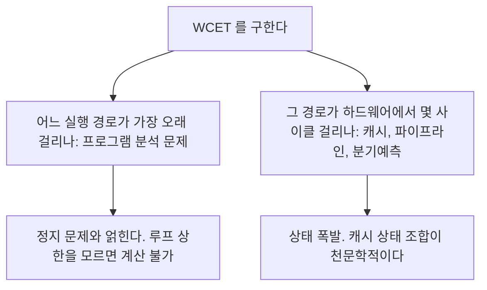
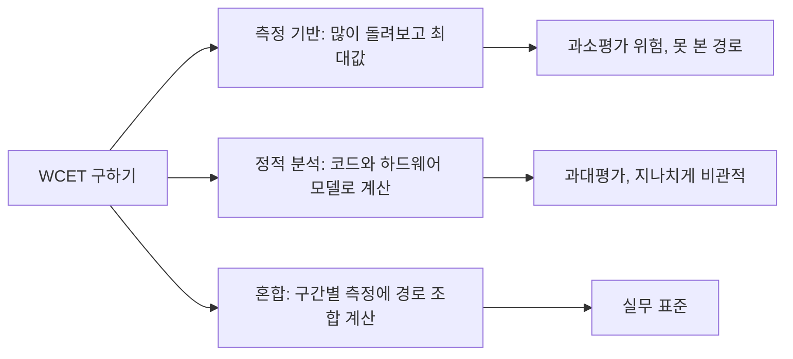
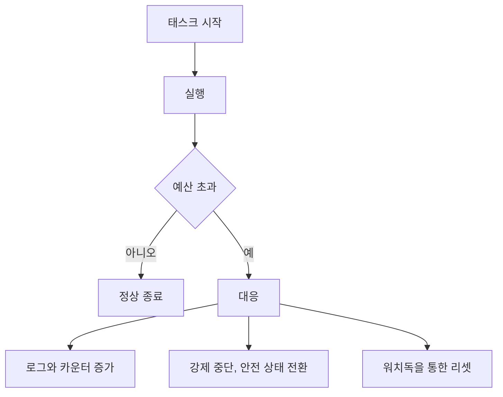
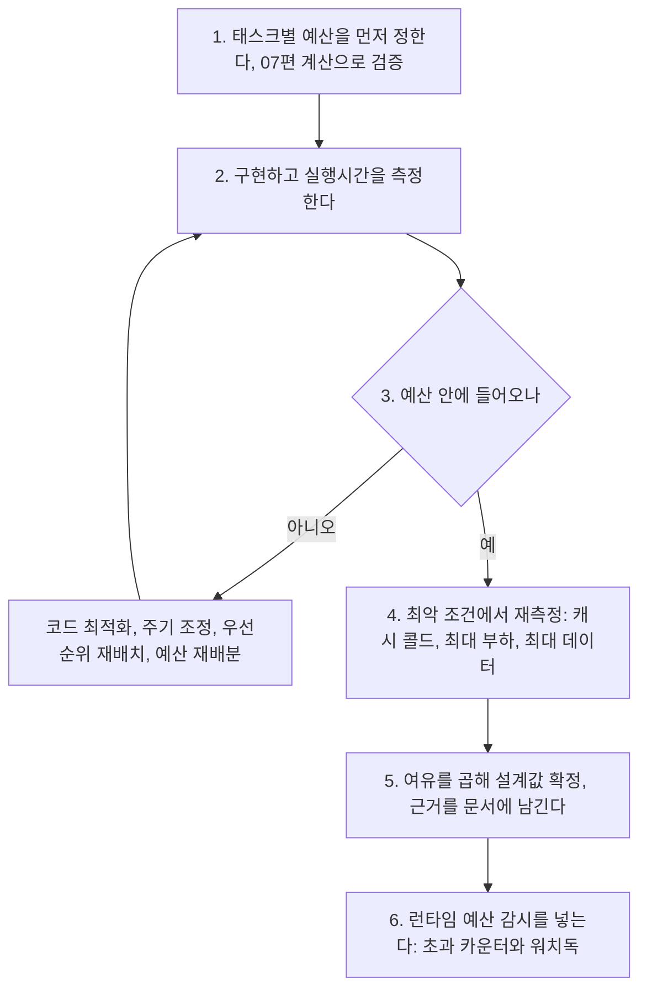

> **기준 출처:** Wilhelm et al., *The Worst-Case Execution-Time Problem: Overview of Methods and Survey of Tools*, ACM TECS 7(3), 2008 (WCET 분야의 표준 서베이) · [Linux SCHED_DEADLINE](https://www.kernel.org/doc/html/latest/scheduler/sched-deadline.html) · [Zephyr Timing functions](https://docs.zephyrproject.org/latest/kernel/services/timing_functions.html) / 확인일 2026-08-07
> **시리즈:** [목차](/posts/00-rtos-series/) | 이전 → [12. 컨텍스트 스위치와 캐시](/posts/12-context-switch-cache-memory/) | 다음 → [14. 태스크 간 통신과 동기화](/posts/14-task-ipc-synchronization/)

## 1. WCET가 어려운 문제인 이유

[03편](/posts/03-task-model-timing-params/)에서 $C_i$를 최악 실행시간이라고 썼다. 그런데 그 값을 실제로 구하는 것은 연구 분야가 따로 있을 정도로 어렵다.



| 어려운 이유 | 내용 |
| --- | --- |
| 실행 경로가 데이터에 따라 다르다 | `if` 하나에 두 배 차이가 날 수 있다 |
| 루프 횟수가 입력에 따라 다르다 | 상한을 모르면 WCET가 무한대가 된다 |
| 하드웨어가 이력에 의존한다 | 캐시, 분기예측, 파이프라인, 메모리 컨트롤러가 직전 실행에 따라 달라진다 |
| 최악 조합이 실제로 일어나는지 모른다 | 모든 미스를 가정하면 지나치게 비관적인 값이 나온다 |

그래서 WCET는 정확한 값이 아니라 안전한 상한을 목표로 한다. 실제 최악보다 크되 너무 크면 쓸모없는 값이 된다.

## 2. 구하는 세 가지 방법



측정 기반은 가장 단순하고 실무에서 제일 많이 쓴다.

```c
static uint64_t wcet_ns;          /* 관측된 최대값 */
static uint64_t hist[64];         /* 히스토그램 버킷 */

uint64_t t0 = now_ns();
do_control();
uint64_t dt = now_ns() - t0;

if (dt > wcet_ns) wcet_ns = dt;   /* 최대값 갱신 */
hist[bucket_of(dt)]++;            /* 분포도 같이 본다 */
```

쉽고 실제 하드웨어에서 실제 값이 나오며 분포를 볼 수 있다는 것이 장점이다. 단점은 못 본 경로가 더 나쁠 수 있다는 것과 캐시가 우연히 따뜻한 조건만 봤을 수 있다는 것이다.

측정만으로는 경성 실시간의 근거가 되지 않는다([02편](/posts/02-hard-soft-firm-realtime/)). 10시간 돌렸다는 것은 10시간 안에는 안 나왔다는 뜻일 뿐이다. Mars Pathfinder의 우선순위 역전도 지상 시험에서 나오지 않았다.

측정을 제대로 하려면 최악 조건을 일부러 만든다. 캐시를 비우고 모든 분기를 최악 방향으로 유도하고 최대 데이터 크기로 돌린다. 입력 공간은 경계값과 최대 반복 횟수를 중심으로 체계적으로 훑고, 실제 부하 상태에서 오랜 시간 측정한다.

정적 분석은 코드를 실행하지 않고 제어흐름 그래프와 하드웨어 모델로 상한을 계산한다. aiT나 OTAWA 같은 도구가 있다. 안전한 상한을 보장하고 DO-178C 같은 인증에서 요구되지만, 하드웨어 모델이 필요하고 결과가 실제보다 몇 배 클 수 있으며 루프 상한을 사람이 주석으로 알려 줘야 한다.

정적 WCET 분석이 실제로 쓰이는 곳은 단순한 프로세서다. 캐시가 없거나 작고 분기 예측이 없고 파이프라인이 얕은 MCU가 대상이다. 아웃오브오더 실행에 3단계 캐시가 달린 x86에서는 의미 있는 상한을 내지 못한다. 고성능 CPU가 경성 실시간에 불리하다는 말의 근거 중 하나다.

혼합 방식이 실무 표준이다. 프로그램을 짧은 구간(basic block)으로 나눠 각 구간은 측정하고 경로 조합은 계산한다.

$$\text{WCET} = \max_{\text{paths}} \sum_k (\text{구간별 측정 최대값})_k$$

## 3. 안전 여유를 얼마나 더할 것인가

측정값에 곱하는 계수는 관례적으로 정해진다.

| 상황 | 여유 |
| --- | --- |
| 단순 MCU, 캐시 없음, 측정이 잘 된 경우 | 1.2배에서 1.5배 |
| 캐시 있음, 선점 가능해 CRPD가 존재 | 1.5배에서 2.0배 |
| 리눅스나 윈도우 등 범용 OS 위 | 2배에서 5배, 그래도 상한 보장은 아니다 |
| 인증 대상 안전 기능 | 정적 분석에 별도 근거를 더한다 |

여유는 근거를 적어 둔다. 2배로 잡았다만 남기면 나중에 누구도 그 값을 못 바꾼다. 측정 최대 340 µs, 캐시 콜드 조건에서 480 µs 관측, CRPD 여유 포함 1.5배로 720 µs 설계처럼 무엇을 근거로 얼마를 더했는지 남긴다.

## 4. 실행시간 예산

WCET를 구하는 것과 별개로 실행시간을 강제하는 장치가 필요하다. 예산을 초과하면 감지하고 대응한다.



| 어디에 있나 | 이름 |
| --- | --- |
| 리눅스 | `SCHED_DEADLINE`의 `sched_runtime`. 초과하면 자동 스로틀된다 ([06편](/posts/06-edf-dynamic-priority/)) |
| 리눅스 | `RLIMIT_RTTIME`. 실시간 태스크가 CPU를 독점하면 시그널을 보낸다 |
| AUTOSAR OS | Execution Budget, timing protection. OS가 강제한다 |
| 직접 구현 | 루프 안에서 경과시간 확인, 워치독 킥 |

```c
/* 직접 구현하는 가장 단순한 형태 */
uint64_t t0 = now_ns();
do_control();
uint64_t dt = now_ns() - t0;

if (dt > BUDGET_NS) {
    budget_overrun_count++;          /* 세어 둔다 */
    log_push_overrun(dt);            /* 링버퍼로 기록한다 */
    if (budget_overrun_count > 3)    /* 연속되면 대응한다 */
        enter_safe_state();
}
watchdog_kick();                     /* 정상일 때만 워치독을 먹인다 */
```

마지막 줄이 중요하다. 워치독은 정상일 때만 먹여야 의미가 있다. 루프 맨 앞에서 무조건 먹이면 루프가 이상해져도 워치독이 걸리지 않는다. Pathfinder에서 워치독이 제 역할을 한 것은 워치독이 버스 관리 태스크가 실제로 돌았는가에 연결돼 있었기 때문이다.

## 5. 예산을 나누는 법

CPU를 100% 다 쓰겠다고 계획하지 않는다. 설계 단계에서 미리 나눈다.

| 항목 | 배분 예 |
| --- | --- |
| 경성 태스크, 제어와 통신 | 50에서 60% |
| 준경성, 보간과 추정 | 10에서 20% |
| 연성, 로깅과 상태 보고 | 5에서 10% |
| 인터럽트 | 5에서 10% ([10편](/posts/10-interrupts-and-tasks/)) |
| 여유 (headroom) | 20에서 30% |

여유를 20에서 30% 남기는 이유가 셋이다. 측정하지 못한 최악 경로가 남아 있고, 나중에 기능이 추가되며(이것은 반드시 일어난다), 하드웨어 노후와 온도에 따라 클럭이 변동한다.

[07편](/posts/07-response-time-analysis/)에서 최고 우선순위 태스크에 15 µs를 더하니 최저 우선순위 응답시간이 7,770 µs 늘었다. 여유 없이 설계하면 작은 변경 하나로 시스템이 넘어간다.

## 6. 실무 절차



6단계를 빼면 안 된다. 개발 중에 잰 값은 운용 조건에서 달라진다. 런타임 감시가 있어야 언제부터 나빠졌는지를 알 수 있고, 초과 카운터 하나만 있어도 현장 디버깅이 완전히 달라진다.

## 정리

- WCET는 정확한 값이 아니라 안전한 상한을 목표로 한다. 어려운 이유는 경로와 하드웨어 이력 의존이다.
- 방법은 셋이다. 측정은 쉽지만 과소평가 위험이 있고, 정적 분석은 안전하지만 단순 CPU에서만 되며, 혼합이 실무 표준이다.
- 측정만으로는 경성 실시간의 근거가 되지 않는다. 안 나왔다는 것은 안 난다는 것과 다르다.
- 정적 분석은 캐시와 분기예측이 단순한 MCU에서만 의미 있다. 고성능 CPU가 경성 실시간에 불리한 이유다.
- 안전 여유는 상황에 따라 1.2배에서 5배다. 왜 그 배수인지 근거를 적어 둔다.
- 예산을 강제하는 장치가 따로 필요하다. `SCHED_DEADLINE`의 runtime, AUTOSAR timing protection, 직접 구현이 있다.
- 워치독은 정상일 때만 먹인다. 무조건 먹이면 워치독이 없는 것과 같다.
- 설계 시 여유 20에서 30%를 남긴다. 기능 추가는 반드시 일어난다.
- 마지막은 런타임 예산 감시와 초과 카운터다. 이것이 있어야 현장에서 원인을 찾는다.

## 참고

- Wilhelm, R. et al., *The Worst-Case Execution-Time Problem*, ACM TECS 7(3), 2008
- [Linux kernel — SCHED_DEADLINE](https://www.kernel.org/doc/html/latest/scheduler/sched-deadline.html)
- [Zephyr — Timing functions](https://docs.zephyrproject.org/latest/kernel/services/timing_functions.html)