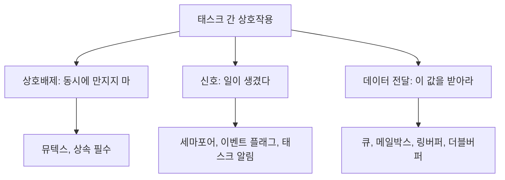
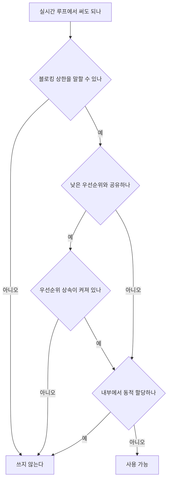
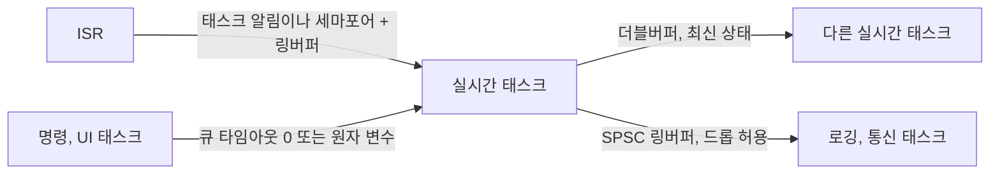

> **기준 출처:** [FreeRTOS Queues](https://www.freertos.org/Documentation/02-Kernel/02-Kernel-features/02-Queues-mutexes-semaphores/01-Queues) · [Zephyr Data Passing](https://docs.zephyrproject.org/latest/kernel/services/data_passing/index.html) · [man 7 mq_overview](https://man7.org/linux/man-pages/man7/mq_overview.7.html) · Herlihy & Shavit, *The Art of Multiprocessor Programming* / 확인일 2026-08-07
> **시리즈:** [목차](/posts/00-rtos-series/) | 이전 → [13. WCET와 실행시간 예산](/posts/13-wcet-execution-budget/) | 다음 → [15. 멀티코어 실시간](/posts/15-multicore-realtime/)

## 1. 먼저 목적을 나눈다

태스크끼리 뭔가 주고받는다는 말에 세 가지 다른 일이 섞여 있다. 도구를 고르기 전에 이것을 나눈다.



| 목적 | 맞는 도구 | 잘못 쓰면 |
| --- | --- | --- |
| 상호배제 | 뮤텍스, 우선순위 상속을 켜고 | 이진 세마포어를 쓰면 [우선순위 역전](/posts/08-priority-inversion-mars-pathfinder/) 방어가 없다 |
| 신호 | 세마포어, 태스크 알림, 이벤트 플래그 | 뮤텍스로 신호를 보내면 안 된다. 소유자가 아닌 태스크가 해제하게 된다 |
| 데이터 전달 | 큐, 링버퍼, 더블버퍼 | 전역변수와 뮤텍스 조합은 동작은 하지만 결합도가 높고 블로킹이 생긴다 |

## 2. 실시간에서의 선택 기준

일반 소프트웨어는 편한 것을 고르지만 실시간은 셋을 본다. 이 호출이 얼마나 오래 막힐 수 있고 그 상한을 말할 수 있는가, 낮은 우선순위와 자원을 공유하며 상속이 켜져 있는가, 내부적으로 동적 할당을 하는가.



## 3. 도구별 정리

뮤텍스는 타임아웃을 반드시 준다.

```c
/* FreeRTOS */
SemaphoreHandle_t mtx = xSemaphoreCreateMutex();          /* 상속 내장 */

if (xSemaphoreTake(mtx, pdMS_TO_TICKS(2)) == pdTRUE) {    /* 타임아웃을 반드시 준다 */
    /* 임계구역은 짧게. 복사만 하고 계산은 밖에서 */
    xSemaphoreGive(mtx);
} else {
    /* 타임아웃 처리를 반드시 쓴다. 여기가 비어 있으면 실시간이 아니다 */
    fault_count++;
}
```

`portMAX_DELAY` 무한 대기를 실시간 태스크에서 쓰지 않는다. 무한 대기는 곧 블로킹 상한이 없다는 뜻이고 [01편](/posts/01-what-is-realtime/)의 유계성 요구를 정면으로 위반한다. 타임아웃을 주고 타임아웃 시 무엇을 할지 코드에 적는다.

세마포어는 신호용이다. 이진 세마포어는 ISR에서 태스크로 알리는 1회성 사건에, 카운팅 세마포어는 자원 개수 관리나 사건 개수 세기에 쓴다.

```c
/* ISR 이 태스크를 깨우는 표준 형태 */
void DMA_IRQHandler(void) {
    BaseType_t woken = pdFALSE;
    xSemaphoreGiveFromISR(sem_dma_done, &woken);
    portYIELD_FROM_ISR(woken);        /* 즉시 태스크로 전환해 지연을 줄인다 */
}
```

FreeRTOS에는 더 가벼운 수단이 있다. 태스크마다 32비트 알림 값을 하나씩 갖고 있어서 별도 객체를 안 만들고 태스크에 직접 신호를 보낼 수 있다.

| | 이진 세마포어 | 태스크 알림 |
| --- | --- | --- |
| 별도 객체 | 필요하다 | 불필요하다. 태스크에 내장돼 있다 |
| RAM | 세마포어 구조체 | 추가 없다 |
| 속도 | 기준 | 더 빠르다. 공식 문서 기준 대략 45% |
| 제약 | 자유롭다 | 수신자가 하나로 정해져 있어야 한다 |

ISR에서 특정 태스크 하나를 깨우는 용도라면 태스크 알림이 거의 항상 맞다. 실시간 루프의 깨우기 경로가 짧아진다.

큐는 값을 복사한다.

```c
/* FreeRTOS, 큐는 포인터가 아니라 값을 복사한다 */
QueueHandle_t q = xQueueCreate(16, sizeof(cmd_t));    /* 초기화 시 1회 할당 */

xQueueSend(q, &cmd, 0);            /* 타임아웃 0 은 절대 블록하지 않는다는 뜻 */
if (xQueueReceive(q, &cmd, 0) == pdTRUE) { /* ... */ }
```

값 복사라 소유권 문제가 없고 생산자와 소비자의 결합도가 낮다. 큰 구조체는 복사 비용이 드니 그럴 때는 풀에서 꺼낸 버퍼의 포인터를 보낸다.

큐가 가득 찼을 때를 반드시 정해야 한다. 실시간 생산자는 블록하면 안 되니 타임아웃 0을 준다. 그러면 그 데이터를 어떻게 할지가 남는다. 오래된 것을 버릴지 새 것을 버릴지 덮어쓸지 카운터만 올릴지 정한다. 이 결정을 안 하면 가끔 데이터가 사라지는데 아무도 모르는 시스템이 된다. 최소한 드롭 카운터는 둔다.

## 4. 락 없이 데이터를 넘기는 법

실시간 루프에서 가장 좋은 것은 블로킹이 없는 방식이다. 상한을 따질 필요조차 없어진다.

생산자 하나에 소비자 하나(SPSC)면 락이 전혀 필요 없다.

```c
#define N 256                     /* 2의 거듭제곱이어야 마스킹이 성립한다 */
typedef struct { float u, e; uint64_t t; } rec_t;

static rec_t   buf[N];
static volatile uint32_t head;    /* 생산자만 쓴다 */
static volatile uint32_t tail;    /* 소비자만 쓴다 */

/* 생산자 (실시간 루프). 블로킹 없고 실행시간 상한이 명확하다 */
static inline int push(const rec_t *r) {
    uint32_t h = head;
    if ((uint32_t)(h - tail) >= N) return 0;   /* 가득 찼으면 드롭 */
    buf[h & (N - 1)] = *r;
    __atomic_store_n(&head, h + 1, __ATOMIC_RELEASE);  /* 데이터 먼저, 인덱스 나중 */
    return 1;
}

/* 소비자 (낮은 우선순위) */
static inline int pop(rec_t *out) {
    uint32_t t = tail;
    if (t == __atomic_load_n(&head, __ATOMIC_ACQUIRE)) return 0;  /* 비었다 */
    *out = buf[t & (N - 1)];
    __atomic_store_n(&tail, t + 1, __ATOMIC_RELEASE);
    return 1;
}
```

메모리 순서가 이 구조의 성립 조건이다. 데이터를 쓴 뒤에 인덱스를 올린다는 순서가 지켜져야 하는데 컴파일러와 CPU가 재배치할 수 있으므로 release와 acquire를 명시한다. 단일 코어 MCU에서는 `volatile`로 넘어가는 경우가 많지만 멀티코어에서는 원자 연산이 필요하다. [15편](/posts/15-multicore-realtime/)에서 다룬다.

최신값 하나만 필요할 때는 더블버퍼가 맞다. 제어에서 가장 흔한 경우다.

```c
typedef struct { float q[6]; float dq[6]; } state_t;

static state_t  slot[2];
static volatile uint32_t idx;          /* 최신 슬롯 번호 */

/* 생산자: 안 쓰는 쪽에 채우고 인덱스를 뒤집는다 */
void publish(const state_t *s) {
    uint32_t next = idx ^ 1;
    slot[next] = *s;
    __atomic_store_n(&idx, next, __ATOMIC_RELEASE);
}

/* 소비자: 지금 최신인 쪽을 읽는다 */
void snapshot(state_t *out) {
    uint32_t i = __atomic_load_n(&idx, __ATOMIC_ACQUIRE);
    *out = slot[i];
}
```

더블버퍼가 제어에 잘 맞는 이유가 있다. 제어 루프는 가장 최근 상태만 필요하고 과거 값의 목록이 필요하지 않다. 큐를 쓰면 오래된 값이 쌓여 오히려 지연이 늘어난다. 놓친 값을 버리는 것이 맞는 경우가 많다.

엄밀하게는 소비자가 읽는 도중 생산자가 두 번 발행하면 값이 찢어질 수 있다. 완전한 안전을 원하면 시퀀스 번호(seqlock)나 3버퍼를 쓴다.

값 하나만 주고받을 때는 원자 변수로 끝난다.

```c
static _Atomic uint32_t mode;                 /* 상태 하나 */
atomic_store_explicit(&mode, MODE_RUN, memory_order_release);
uint32_t m = atomic_load_explicit(&mode, memory_order_acquire);
```

플래그, 모드, 카운터 하나면 락도 큐도 필요 없다.

## 5. 방향별 권장 조합



| 방향 | 권장 | 왜 |
| --- | --- | --- |
| ISR에서 실시간 태스크로 | 태스크 알림과 링버퍼 | 가장 빠르고 블로킹이 없다 |
| 실시간에서 실시간으로 | 더블버퍼 | 최신값만 필요하고 블로킹이 없다 |
| 실시간에서 낮은 우선순위로 | SPSC 링버퍼, 드롭 허용 | 실시간 쪽이 절대 막히지 않는다 |
| 낮은 우선순위에서 실시간으로 | 큐(타임아웃 0)나 원자 변수 | 실시간 쪽이 폴링해서 가져간다 |
| 실시간과 공유 상태 | 뮤텍스, 상속을 켜고 짧게 | 위 방법들이 안 될 때만 |

## 6. 흔한 실수

| 실수 | 왜 문제인가 | 대신 |
| --- | --- | --- |
| `portMAX_DELAY` 무한 대기 | 블로킹 상한이 없다 | 타임아웃과 실패 처리 |
| 상호배제에 이진 세마포어 | 우선순위 상속이 없다 | 뮤텍스 |
| ISR에서 일반 API 호출 | ISR은 블록될 수 없다 | `FromISR` 계열 |
| 임계구역 안에서 계산, 로그, 할당 | 블로킹 시간이 길어진다 | 복사만 하고 나와서 계산 |
| 큐 가득 참을 처리하지 않음 | 소리 없이 데이터가 유실된다 | 드롭 정책과 카운터 |
| 두 락을 서로 다른 순서로 잡음 | 데드락 | 락 순서를 전역으로 하나 정한다 |
| `volatile`만 믿고 멀티코어에서 공유 | `volatile`은 원자성과 순서를 보장하지 않는다 | 원자 연산과 메모리 순서 |
| 제어 루프에 큐를 씀 | 오래된 값이 쌓여 지연이 늘어난다 | 더블버퍼 |

`volatile`에 대한 오해가 특히 많다. C의 `volatile`은 컴파일러가 최적화로 지우지 말라는 뜻일 뿐 원자성도 메모리 순서도 보장하지 않는다. 단일 코어에 인터럽트 정도는 대개 넘어가지만 멀티코어에서는 원자 연산을 쓴다.

## 정리

- 목적을 셋으로 나눈다. 상호배제는 뮤텍스, 신호는 세마포어와 알림, 데이터 전달은 큐와 버퍼다.
- 실시간 선택 기준은 블로킹 상한, 우선순위 역전, 동적 할당 셋이다.
- 무한 대기는 쓰지 않는다. 타임아웃을 주고 타임아웃 처리를 코드에 쓴다.
- FreeRTOS는 수신자가 하나일 때 태스크 알림이 가장 빠르다.
- 락 없는 방법이 최선이다. SPSC 링버퍼, 더블버퍼, 원자 변수를 쓴다.
- 제어 루프에는 큐보다 더블버퍼가 맞다. 최신값만 필요하고 오래된 값은 지연만 늘린다.
- 큐가 가득 찼을 때의 정책을 반드시 정한다. 안 정하면 소리 없이 데이터가 사라진다.
- `volatile`은 원자성과 순서를 보장하지 않는다. 멀티코어면 원자 연산과 release, acquire를 쓴다.

## 참고

- [FreeRTOS — Queues](https://www.freertos.org/Documentation/02-Kernel/02-Kernel-features/02-Queues-mutexes-semaphores/01-Queues)
- [Zephyr — Data Passing](https://docs.zephyrproject.org/latest/kernel/services/data_passing/index.html)
- [man 7 mq_overview](https://man7.org/linux/man-pages/man7/mq_overview.7.html)
- Herlihy, M. & Shavit, N., *The Art of Multiprocessor Programming*