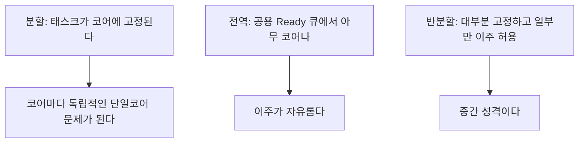
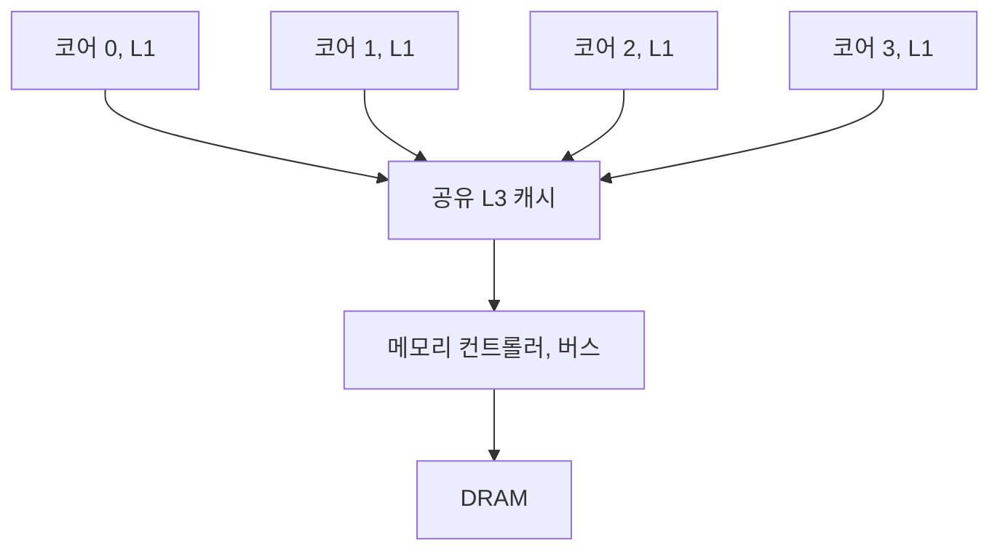

> **기준 출처:** Davis, R. & Burns, A., *A Survey of Hard Real-Time Scheduling for Multiprocessor Systems*, ACM Computing Surveys 43(4), 2011 · [Linux kernel parameters](https://www.kernel.org/doc/html/latest/admin-guide/kernel-parameters.html) · [Zephyr SMP](https://docs.zephyrproject.org/latest/kernel/services/smp/smp.html) · [FreeRTOS SMP](https://www.freertos.org/Documentation/02-Kernel/02-Kernel-features/11-Symmetric-multiprocessing-introduction) / 확인일 2026-08-07
> **시리즈:** [목차](/posts/00-rtos-series/) | 이전 → [14. 태스크 간 통신](/posts/14-task-ipc-synchronization/) | 다음 → [16. RTOS 커널 구조](/posts/16-rtos-kernel-freertos-zephyr/)

## 1. 직관이 틀리는 곳

코어가 4개면 CPU가 4배니까 여유도 4배라는 생각은 실시간에서 성립하지 않는다. 멀티코어에서 실시간 보장은 오히려 어려워지고 이유가 셋이다.


## 2. 이론이 무너진다

단일코어에서 배운 결과들이 멀티코어에서는 대부분 통하지 않는다.

| 단일코어 | 멀티코어 |
| --- | --- |
| RM이 고정 우선순위 중 최적이다 | 최적 배정 규칙이 알려져 있지 않다 |
| $U \le 0.693$이면 RM으로 항상 가능하다 | Dhall 효과 때문에 U가 아주 작아도 실패할 수 있다 |
| EDF는 $U \le 1$이면 항상 가능하다 | 전역 EDF는 $U \le 1$이어도 실패한다 |
| 응답시간 분석이 정확하다 | 근사와 비관적 상한만 가능하다 |

Dhall 효과가 가장 유명한 반례다. 코어 $m$개에 태스크 $m+1$개를 둔다.

| 태스크 | T | C | U |
| --- | --- | --- | --- |
| τ1 ~ τm | 1 | 2ε | 2ε, 거의 0 |
| τ(m+1) | 1+ε | 1 | 약 1 |

전체 이용률은 약 1로 코어 $m$개에 비하면 아주 낮다. $m=4$면 이용률 25%다. 그런데 전역 EDF나 RM으로 스케줄 불가능하다. 짧은 τ1부터 τm이 먼저 실행되고 긴 τ(m+1)은 어느 한 코어에서도 제때 못 끝낸다. 하나의 태스크는 코어 하나에서만 돌 수 있다는 물리적 제약 때문이다.

여기서 얻는 것은 코어를 늘려도 하나의 태스크가 빨라지지는 않는다는 사실이다. 실행시간이 긴 태스크가 하나 있으면 코어 수와 무관하게 그 태스크가 병목이다. 총 이용률만 보고 판단하면 안 된다.

## 3. 배정 방식 세 가지



| | 분할 | 전역 | 반분할 |
| --- | --- | --- | --- |
| 태스크 이주 | 없다 | 자유롭다 | 일부만 |
| 분석 | 단일코어 이론 그대로 | 어렵고 비관적이다 | 중간 |
| 캐시 | 유지된다 | 이주할 때마다 날아간다 | 중간 |
| 부하 균형 | 수동 배정, bin packing | 자동 | 중간 |
| 이용률 | 조각이 남는다 | 높다 | 중간 |
| 실무 선택 | 거의 항상 이것 | 이론 연구와 일반 서버 | 드물다 |

실무의 답은 분할(partitioned)이다. 코어마다 독립적인 단일코어 문제가 되므로 [07편](/posts/07-response-time-analysis/)의 계산을 그대로 쓸 수 있고, 캐시가 유지되며(이주하면 캐시를 통째로 다시 채워야 한다), 이 코어에서 무엇이 무엇을 막았는지만 보면 되니 원인 추적이 쉽다.

대가는 부하 균형을 손으로 맞춰야 한다는 것이다. bin packing 문제라 최적해를 구하기 어렵지만 태스크가 수십 개 수준이면 손으로 충분하다.

## 4. 코어는 독립적이지 않다

코어를 나눠도 아래 층은 공유한다.



결과는 이렇다. 다른 코어에서 무거운 일을 돌리면 내 코어의 실행시간이 늘어난다. 내 코드는 하나도 안 바뀌었는데 $C_i$가 커진다. 이것을 간섭 또는 코런너 효과(co-runner effect)라 하고, 실측으로 2배 이상 차이 나는 경우도 보고돼 있다.

| 방어 | 방법 |
| --- | --- |
| 캐시 파티셔닝 | 인텔 CAT 등으로 way를 코어별로 나눈다 |
| 메모리 대역폭 제한 | 인텔 MBA 등으로 비실시간 코어의 대역폭을 제한한다 |
| 코어 비우기 | 실시간 코어의 이웃 코어를 아예 안 쓴다. 가장 확실하고 가장 비싸다 |
| 하이퍼스레딩 끄기 | 필수에 가깝다. 논리 코어 둘이 물리 코어 하나의 실행 유닛을 공유한다 |

하이퍼스레딩(SMT)은 실시간에서 거의 항상 끈다. 코어 8개로 보이지만 물리 코어는 4개이고 짝을 이루는 논리 코어가 파이프라인을 나눠 쓴다. 옆 스레드가 무엇을 하느냐에 따라 내 실행시간이 크게 흔들리고, 결정성이 무너지는 전형적인 원인이다.

## 5. 동기화가 비싸진다

단일코어에서 인터럽트 끄기로 되던 것이 멀티코어에서는 안 된다. 다른 코어는 계속 돌고 있기 때문이다.

| 단일코어 | 멀티코어 |
| --- | --- |
| 인터럽트 끄기가 완전한 상호배제였다 | 다른 코어를 막지 못한다 |
| `volatile`로 대충 넘어갔다 | 캐시 일관성과 재배치 문제로 원자 연산이 필수다 |
| 락이 스케줄러 조작이었다 | 스핀락이라 다른 코어가 CPU를 태우며 기다린다 |

| 새로 생기는 지연원 | 내용 |
| --- | --- |
| 스핀락 대기 | 다른 코어가 놓을 때까지 CPU를 태운다. 대기 시간이 곧 손실이다 |
| 캐시 라인 핑퐁 | 두 코어가 같은 캐시 라인을 번갈아 쓰면 매번 코어 간 전송이 일어난다 |
| 거짓 공유 (false sharing) | 서로 다른 변수인데 같은 캐시 라인에 있으면 핑퐁이 난다 |
| IPI, 코어 간 인터럽트 | TLB 셧다운 등으로 다른 코어를 강제로 방해한다 |

```c
/* 거짓 공유. 두 코어가 서로 다른 변수를 쓰는데 성능이 무너진다 */
struct { uint32_t a; uint32_t b; } shared;    /* 같은 64B 캐시라인에 들어간다 */

/* 캐시라인 정렬로 분리한다 */
struct {
    _Alignas(64) uint32_t a;    /* 코어 0 전용 */
    _Alignas(64) uint32_t b;    /* 코어 1 전용 */
} shared;
```

거짓 공유는 프로파일러 없이는 거의 찾지 못한다. 코어를 늘렸는데 오히려 느려졌다는 현상의 흔한 원인이다. 코어별 카운터나 통계 변수를 배열로 두면 자동으로 이 문제가 생기므로 코어별 데이터는 캐시라인 단위로 정렬한다.

## 6. 실무의 정석은 코어 분리

이론을 다 따지는 대신 문제를 없애는 방식이 실무의 주류다.


| 설정 | 리눅스에서 |
| --- | --- |
| 실시간 코어를 스케줄러에서 뺀다 | `isolcpus=3` |
| 인터럽트를 다른 코어로 밀어낸다 | `irqaffinity=0-2`와 `/proc/irq/*/smp_affinity` |
| 타이머 틱까지 없앤다 | `nohz_full=3`, 거의 tickless |
| RCU 콜백도 다른 코어로 | `rcu_nocbs=3` |
| 태스크를 그 코어에 고정한다 | `taskset -c 3`, `pthread_setaffinity_np` |

상세는 [리눅스 07편](/posts/07-cpu-isolation-irq-affinity/)에서 다룬다.

이 구조의 장점은 멀티코어 실시간 이론이 필요 없어진다는 것이다. 실시간 코어에 태스크가 하나뿐이면 스케줄링 문제 자체가 사라지고 남는 것은 4절의 하드웨어 간섭뿐이다. 그것도 하이퍼스레딩을 끄고 이웃 코어를 비우면 상당히 줄어든다.

이 발상을 하드웨어로 끝까지 밀면 이종 멀티코어(AMP)가 된다. 응용 프로세서 옆에 Cortex-M 코어가 붙어 있고 실시간 제어는 그 M 코어에서 RTOS로 돌리고 리눅스는 UI와 네트워크만 맡는 구조다. 로봇 컨트롤러에서 흔하다.

## 7. RTOS 쪽의 멀티코어 지원

| | FreeRTOS SMP | Zephyr SMP | PREEMPT_RT 리눅스 |
| --- | --- | --- | --- |
| 방식 | 전역 스케줄링에 코어 고정 옵션 | 전역 스케줄링 | 전역에 affinity |
| 코어 고정 | `vTaskCoreAffinitySet()` | `k_thread_cpu_mask_*()` | `taskset`, `pthread_setaffinity_np` |
| 실무 권장 | 코어를 고정해 분할처럼 쓴다 | 동일 | 동일 |

어느 OS를 쓰든 결론은 같다. 실시간 태스크는 코어에 고정한다. 자동 부하 분산은 처리량에는 좋지만 실시간에는 이주 비용과 캐시 손실과 분석 불가를 가져온다.

## 정리

- 코어를 늘리면 실시간은 더 어려워진다. 이론 붕괴, 자원 공유, 동기화 비용 때문이다.
- Dhall 효과 때문에 총 이용률이 아주 낮아도 스케줄 불가할 수 있다. 긴 태스크 하나가 병목이 된다.
- 배정 방식 셋 중 실무는 분할을 쓴다. 단일코어 이론을 그대로 쓸 수 있고 캐시가 유지된다.
- 코어는 L3와 메모리 대역폭과 버스를 공유한다. 다른 코어의 부하가 내 $C_i$를 늘린다.
- 하이퍼스레딩은 끈다. 논리 코어 짝이 실행 유닛을 공유해 결정성이 무너진다.
- 새 지연원은 스핀락 대기, 캐시 핑퐁, 거짓 공유, IPI다. 코어별 데이터는 캐시라인 정렬을 한다.
- 실무 정석은 코어 격리다. `isolcpus`와 `nohz_full`과 irq affinity를 쓰면 멀티코어 이론이 필요 없어진다.
- 어느 RTOS든 결론은 같다. 실시간 태스크는 코어에 고정한다.

## 참고

- Davis, R. I. & Burns, A., *A Survey of Hard Real-Time Scheduling for Multiprocessor Systems*, ACM Computing Surveys 43(4), 2011
- [Linux kernel — kernel parameters](https://www.kernel.org/doc/html/latest/admin-guide/kernel-parameters.html)
- [Zephyr — SMP](https://docs.zephyrproject.org/latest/kernel/services/smp/smp.html)
- [FreeRTOS — SMP](https://www.freertos.org/Documentation/02-Kernel/02-Kernel-features/11-Symmetric-multiprocessing-introduction)