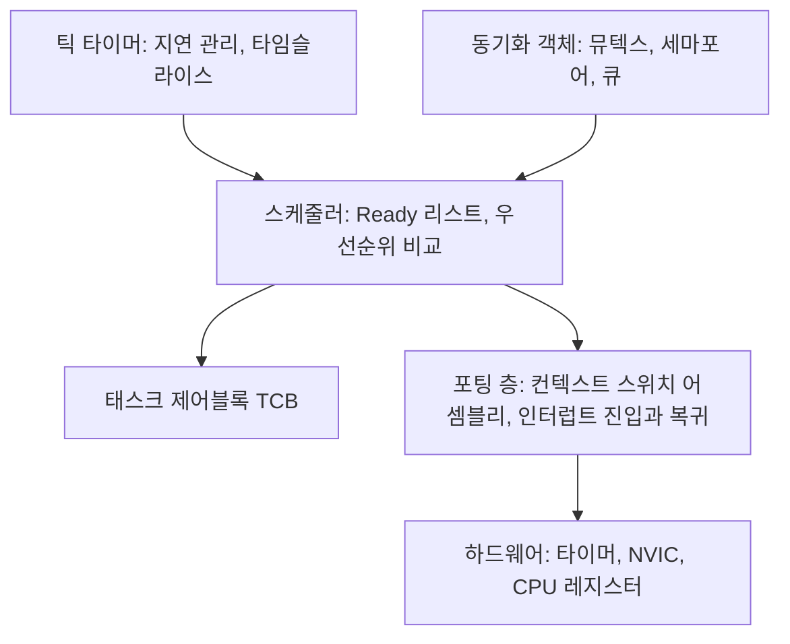

> **기준 출처:** [FreeRTOS 공식 문서](https://www.freertos.org/Documentation/00-Overview) · [FreeRTOS 메모리 관리](https://www.freertos.org/Documentation/02-Kernel/02-Kernel-features/09-Memory-management/01-Memory-management) · [Zephyr Kernel Services](https://docs.zephyrproject.org/latest/kernel/services/index.html) · [Zephyr Kconfig](https://docs.zephyrproject.org/latest/build/kconfig/index.html) / 확인일 2026-08-07
> **시리즈:** [목차](/posts/00-rtos-series/) | 이전 → [15. 멀티코어 실시간](/posts/15-multicore-realtime/) | 다음 → [리눅스 01. 리눅스는 왜 실시간이 아닌가](/posts/01-why-linux-not-realtime/)

## 1. 무엇이 OS를 RTOS로 만드는가

앞의 15편을 지나온 요구가 커널 기능으로 내려오면 이렇게 된다.

| 앞선 편들의 요구 | 커널이 제공해야 하는 것 |
| --- | --- |
| 선점성 ([04편](/posts/04-scheduling-preemption-priority/)) | 완전 선점형 스케줄러. 커널 내부에서도 선점 가능해야 한다 |
| 결정성 ([01편](/posts/01-what-is-realtime/)) | 모든 커널 API가 O(1)이거나 상한이 명시된 실행시간을 가진다 |
| 우선순위 역전 방어 ([09편](/posts/09-priority-inheritance-ceiling/)) | 우선순위 상속이나 천장 뮤텍스 |
| 유계성 | 동적 할당 없이도 동작 가능한 정적 생성 API |
| 짧은 지연 ([10편](/posts/10-interrupts-and-tasks/)) | 인터럽트 비활성 구간과 선점 불가 구간이 짧고 측정돼 문서화돼 있다 |

O(1)이거나 상한이 명시돼 있는가가 RTOS를 가르는 실질적 기준이다. 일반 OS의 API는 대개 보통 빠르다만 보장한다. RTOS는 태스크가 몇 개든 `xQueueSend`의 상한이 얼마인지를 말할 수 있어야 하고, 그래야 [WCET](/posts/13-wcet-execution-budget/) 계산이 성립한다.

## 2. RTOS 커널의 최소 구성



| 구성요소 | 하는 일 |
| --- | --- |
| TCB | 태스크 하나의 모든 상태. 스택 포인터, 우선순위, 대기 이유 |
| Ready 리스트 | 우선순위별 리스트나 비트맵. 최우선 태스크를 O(1)에 찾기 위한 구조 |
| 틱 타이머 | 주기적 인터럽트. 지연 만료 확인과 타임슬라이스 |
| 포팅 층 | CPU마다 다른 부분. 컨텍스트 스위치는 어셈블리로 쓴다 |

FreeRTOS 커널은 C 소스 파일 몇 개에 수천 줄 규모다. 파일 시스템도 네트워크 스택도 메모리 보호도 기본에는 없고 필요한 것만 붙인다. 작다는 것 자체가 실시간 성질이다. 코드가 작으면 최악 경로를 다 볼 수 있다.

주기적 틱 인터럽트는 아무 일이 없어도 계속 CPU를 깨운다. 저전력이 중요하면 틱을 없애고 다음에 깨어날 시각에만 타이머를 거는 틱리스(tickless) 모드를 쓴다.

| | 틱 방식 | 틱리스 |
| --- | --- | --- |
| 시간 해상도 | 틱 주기 단위, 예를 들어 1 ms | 하드웨어 타이머 해상도 |
| 전력 | 계속 깨어난다 | 필요할 때만 깨어난다 |
| 지터 | 틱 경계에 양자화된다 | 더 정밀하다 |
| 복잡도 | 단순하다 | 높다 |

리눅스의 `nohz_full`([15편](/posts/15-multicore-realtime/))도 같은 발상이다. 틱 자체가 지터원이기 때문에 저전력이 아니라 실시간을 위해서도 틱리스가 유리한 경우가 있다.

## 3. FreeRTOS

| 특징 | 내용 |
| --- | --- |
| 규모 | 매우 작다. 커널 코어가 몇 개 파일이다 |
| 라이선스 | MIT |
| 스케줄링 | 고정 우선순위 선점형에 같은 우선순위 라운드로빈 옵션 |
| 우선순위 방향 | 숫자가 클수록 높다. 0이 idle이다 |
| 설정 | `FreeRTOSConfig.h` 하나에 `#define`으로 |

실시간 관점에서 중요한 설정들이다.

```c
/* FreeRTOSConfig.h */
#define configUSE_PREEMPTION              1   /* 선점형, 실시간의 필수 */
#define configUSE_TIME_SLICING            0   /* 같은 우선순위 라운드로빈을 끈다
                                                 불필요한 컨텍스트 스위치가 사라진다 */
#define configUSE_MUTEXES                 1   /* 우선순위 상속 뮤텍스 활성화 */
#define configUSE_TASK_NOTIFICATIONS      1   /* 가장 빠른 신호 수단 */
#define configMAX_PRIORITIES             16   /* 클수록 Ready 리스트 메모리가 늘어난다 */
#define configTICK_RATE_HZ             1000   /* 틱 1 ms */
#define configCHECK_FOR_STACK_OVERFLOW    2   /* 개발 중에는 반드시 켠다 */
#define configSUPPORT_STATIC_ALLOCATION   1   /* 동적 할당 없이 태스크 생성 */
#define configSUPPORT_DYNAMIC_ALLOCATION  0   /* 힙 자체를 빼버릴 수도 있다 */
```

`configSUPPORT_STATIC_ALLOCATION`을 켜고 정적 생성 API를 쓰는 것이 안전 관련 시스템의 표준이다.

```c
static StaticTask_t  tcb;
static StackType_t   stack[512];
xTaskCreateStatic(ctrl_task, "ctrl", 512, NULL, 5, stack, &tcb);
```

힙을 아예 안 쓰면 [12편](/posts/12-context-switch-cache-memory/)의 동적 할당 문제인 상한 없음과 단편화와 전역 락이 통째로 사라진다. MISRA C나 IEC 62304 같은 규칙과도 잘 맞는다.

힙 구현은 다섯 가지가 있고 실시간 적합성이 다르다.

| | 특징 | 실시간 적합성 |
| --- | --- | --- |
| `heap_1` | 할당만 하고 해제가 없다 | 가장 결정적이다. 초기화 때만 할당하면 충분하다 |
| `heap_2` | 해제 가능하나 병합이 없다 | 단편화가 생긴다 |
| `heap_3` | 표준 `malloc`을 래핑한다 | 상한이 없다 |
| `heap_4` | 병합이 있다 | 실무에서 가장 많이 쓴다 |
| `heap_5` | `heap_4`에 분산 메모리 영역 지원 | `heap_4`와 같은 성질이다 |

`heap_1`이 가장 원시적이지만 실시간에는 가장 좋다. 초기화 때 전부 할당하고 루프 안에서는 할당하지 않는다는 원칙을 지킬 거라면 해제 기능 자체가 필요 없다. 기능이 적은 것이 결정성이다.

## 4. Zephyr

| 특징 | 내용 |
| --- | --- |
| 규모 | 훨씬 크다. 드라이버, 네트워크, 파일시스템, 부트로더까지 포함한다 |
| 라이선스 | Apache 2.0 |
| 빌드 | CMake에 Kconfig와 Devicetree. 리눅스 커널 방식이다 |
| 우선순위 방향 | 음수는 협조형이고 양수는 선점형이며 작을수록 높다 |
| 강점 | 하드웨어 추상화, 보드 지원, 보안과 인증 활동 |

```c
/* Zephyr 스레드 생성 */
K_THREAD_STACK_DEFINE(ctrl_stack, 1024);       /* 정적 스택 */
static struct k_thread ctrl_data;

k_thread_create(&ctrl_data, ctrl_stack, K_THREAD_STACK_SIZEOF(ctrl_stack),
                ctrl_entry, NULL, NULL, NULL,
                K_PRIO_PREEMPT(5),             /* 선점형 우선순위 5 */
                0, K_NO_WAIT);

/* 주기 루프, 절대시각 기준 */
int64_t next = k_uptime_ticks();
while (1) {
    next += k_ms_to_ticks_ceil64(1);
    k_sleep(K_TIMEOUT_ABS_TICKS(next));        /* 절대시각 대기 */
    do_control();
}
```

Zephyr의 우선순위가 헷갈리는 이유는 음수 영역의 의미다. 음수는 협조형(cooperative) 스레드이고, 협조형은 스스로 양보할 때까지 선점당하지 않는다. 선점형보다 항상 높고 짧고 급한 일에 쓴다. `K_PRIO_COOP(n)`과 `K_PRIO_PREEMPT(n)` 매크로를 쓰면 헷갈리지 않는다.

## 5. 셋 비교

| | FreeRTOS | Zephyr | PREEMPT_RT 리눅스 |
| --- | --- | --- | --- |
| 대상 | MCU, Cortex-M 등 | MCU에서 중급 MPU까지 | MPU, MMU가 필요하다 |
| RAM | 수 KB | 수십 KB 이상 | 수십 MB 이상 |
| 전형적 지연 | µs 단위 | µs 단위 | 수십에서 수백 µs |
| 파일시스템과 네트워크 | 별도로 추가한다 | 포함돼 있다 | 완비돼 있다 |
| 개발 편의 | 단순하다 | 중간, Kconfig 학습이 필요하다 | 리눅스 도구 전부를 쓴다 |
| 인증 | 상용 파생판이 있다 | 활동 중이다 | 어렵다 |
| 적합한 일 | 전류 루프, 축 제어, 슬레이브 펌웨어 | 센서 노드, 복합 임베디드 | 마스터, 궤적, UI, 네트워크 |


로봇 컨트롤러의 전형적인 층 구조가 이것이다. 하나의 OS로 전부 하려 하지 않고 시간 등급별로 다른 하드웨어와 다른 OS에 나눈다. [02편](/posts/02-hard-soft-firm-realtime/)의 등급 분리를 물리적으로 실행한 형태다.

## 6. RTOS를 고를 때 확인할 것

| 확인 항목 | 왜 |
| --- | --- |
| 최악 인터럽트 지연이 문서에 있나 | 없으면 [WCET](/posts/13-wcet-execution-budget/) 계산을 못 한다 |
| API별 실행시간 상한이 명시돼 있나 | O(1)인지 태스크 수에 비례하는지 알아야 한다 |
| 우선순위 상속 뮤텍스가 있나 | 없으면 [Pathfinder](/posts/08-priority-inversion-mars-pathfinder/)와 같은 상태다 |
| 정적 할당만으로 동작하나 | 힙 없이 쓸 수 있어야 결정적이다 |
| 스택 오버플로 검출 | 임베디드 버그의 상위권이다 |
| 추적 도구 | 없으면 실시간 버그를 못 잡는다. Tracealyzer, SystemView 등 |
| 인증 자료 | 의료나 자동차 분야면 필수다 |
| 커뮤니티와 수명 | 10년 쓸 제품이면 중요하다 |

추적 도구를 과소평가하지 않는다. 실시간 문제는 재현이 어렵고 로그를 남기면 현상이 바뀐다([11편](/posts/11-jitter-sources/)). 커널이 태스크 전환과 인터럽트와 큐 동작을 낮은 오버헤드로 기록해 주는 기능이 있으면 디버깅 시간이 자릿수로 줄어든다. Mars Pathfinder도 추적 기능이 있어서 원인을 찾았다.

## 이론 편을 마치며

16편을 세 줄로 줄이면 이렇게 된다.

1. 실시간은 기한 준수다. 평균이 아니라 최악값을 보고 그 상한을 말할 수 있어야 한다.
2. 상한을 위협하는 것은 선점 구조, 공유자원, 하드웨어 이력 셋이다.
3. 그래서 우선순위를 주기 순으로 배정하고 락을 피하거나 상속을 켜고 동적 동작을 루프에서 뺀 다음 [계산으로 확인한다](/posts/07-response-time-analysis/).

이제 실제 OS에서 어떻게 하는지 본다. 리눅스 편은 리눅스가 왜 기본적으로 실시간이 아니고 PREEMPT_RT가 무엇을 바꾸며 1 kHz 루프를 어떻게 돌리는지 다루고, 윈도우 편은 한계를 실측 숫자로 확인하고 그럼에도 쓸 수 있는 범위를 정한다.

## 정리

- RTOS의 실질적 기준은 모든 커널 API가 O(1)이거나 상한이 명시돼 있는 것이다.
- 최소 구성은 TCB, Ready 리스트, 틱 타이머, 동기화 객체, 어셈블리로 쓴 포팅 층이다.
- 틱 자체가 지터원이다. 틱리스는 저전력뿐 아니라 실시간에도 이점이 있다.
- FreeRTOS는 작고 이식성이 높다. `configSUPPORT_STATIC_ALLOCATION`과 `heap_1`로 힙을 없앤다.
- Zephyr는 크고 완비형이다. 우선순위가 음수면 협조형이고 작을수록 높다.
- 층 구조가 실무의 답이다. MCU와 FreeRTOS가 µs 경성을, 리눅스 RT가 ms를, 일반 OS가 연성을 맡는다.
- 선택 시 최악 지연 문서, API 상한, 상속 뮤텍스, 정적 할당, 추적 도구를 확인한다.

## 참고

- [FreeRTOS 공식 문서](https://www.freertos.org/Documentation/00-Overview)
- [FreeRTOS — Memory management](https://www.freertos.org/Documentation/02-Kernel/02-Kernel-features/09-Memory-management/01-Memory-management)
- [Zephyr — Kernel Services](https://docs.zephyrproject.org/latest/kernel/services/index.html)
- [Zephyr — Kconfig](https://docs.zephyrproject.org/latest/build/kconfig/index.html)