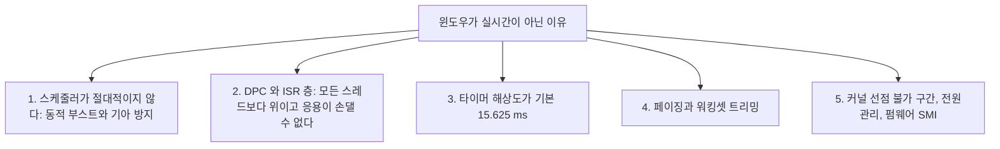
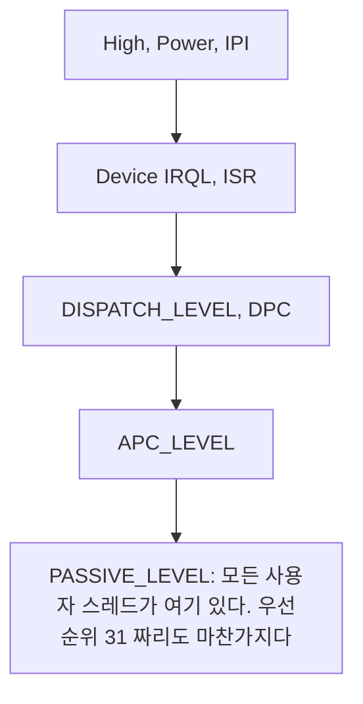
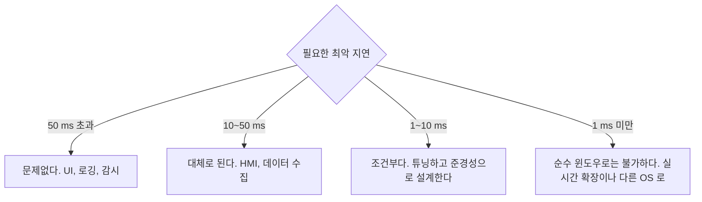

> **기준 출처:** [Microsoft Learn Scheduling](https://learn.microsoft.com/en-us/windows/win32/procthread/scheduling) · [Introduction to DPC Objects](https://learn.microsoft.com/en-us/windows-hardware/drivers/kernel/introduction-to-dpc-objects) · 실측 환경: Windows 10 Pro 19045, 노트북급 x86-64 4코어 8스레드 / 측정일 2026-08-07
> **시리즈:** [목차](/posts/00-rtos-series/) | 이전 → [리눅스 14. Xenomai 듀얼커널](/posts/14-xenomai-dual-kernel/) | 다음 → [02. 윈도우 스케줄러 구조](/posts/02-windows-scheduler-structure/)

## 1. 먼저 숫자부터

말로 설명하기 전에 측정 결과를 본다.


_1 kHz 주기 루프를 다섯 가지 방식으로 3,000 스텝씩 돌린 결과. 단위는 µs이고 목표 시각보다 늦은 정도다._

| 조건 | 중앙값 | 상위 1% | 최악값 |
| --- | --- | --- | --- |
| A. `Sleep`만 | 172 | 898 | 1,357 |
| B. `Sleep`과 스핀 | 약 0 | 4.8 | 1,677 |
| C. 순수 스핀 (busy wait) | 약 0 | 8.3 | 351 |
| D. B에 `TIME_CRITICAL`과 코어 고정 | 약 0 | 3.6 | 605 |
| E. C에 `TIME_CRITICAL`과 코어 고정 | 약 0 | 3.3 | 1,142 |

읽는 법이 셋이다. 중앙값과 p99는 좋다. 최고 설정에서 상위 1%가 3.3 µs이고 1 ms 주기의 0.33%로 웬만한 제어에 충분하다. 그런데 최악값이 어떤 설정에서도 수백 µs에서 1 ms 넘게 남는다. 스레드 우선순위를 최고로 올리고 코어에 고정해도 마찬가지다. 그리고 최악값 1,142 µs는 주기인 1,000 µs보다 크므로 그 스텝은 주기를 통째로 놓친 것이다.

이것이 윈도우는 경성 실시간이 아니라는 말의 실증이다. [이론 01편](/posts/01-what-is-realtime/)의 유계성 요구, 곧 최악값의 상한을 말할 수 있는가를 만족하지 못한다. 3,000번 재서 1,142 µs였다는 것은 다음에 더 큰 값이 안 나온다는 보장이 없다는 뜻이다.

## 2. 구조적 이유 다섯 가지



첫째, 스케줄러의 우선순위가 절대적이지 않다. 리눅스 `SCHED_FIFO`는 높은 게 있으면 낮은 것이 영원히 돌지 않지만 윈도우는 다르다.

| 윈도우가 하는 일 | 실시간에서의 문제 |
| --- | --- |
| 동적 우선순위 부스트 | I/O 완료나 포그라운드 전환 시 우선순위를 임의로 올린다 |
| 기아 방지 | 오래 못 돈 스레드를 강제로 올려 준다 |
| 퀀텀, 곧 타임슬라이스 | 같은 우선순위끼리 번갈아 돈다 |

실시간 우선순위 클래스(`REALTIME_PRIORITY_CLASS`, 16에서 31)에서는 부스트가 적용되지 않아 그 점은 리눅스와 비슷해진다. 그러나 나머지 넷이 그대로 남는다. 상세는 [02편](/posts/02-windows-scheduler-structure/)에서 다룬다.

둘째가 근본 한계다. 윈도우 커널에는 IRQL(Interrupt Request Level)이라는 층이 있고 모든 사용자 스레드는 가장 아래인 PASSIVE_LEVEL에 있다.



우선순위 31짜리 실시간 스레드도 DPC 하나에 밀린다. 드라이버가 DPC에서 오래 걸리면 내 스레드는 그냥 기다리고, 응용 코드로 할 수 있는 일이 없다. 상세는 [05편](/posts/05-dpc-isr-latency/)에서 다룬다.

셋째는 타이머 해상도다. 실측값을 보면 이렇다.


```text
 NtQueryTimerResolution 실측 (2026-08-07)
   최소, 가장 거친 값 : 15,625.0 us    <- 기본값
   최대, 가장 고운 값 :    500.0 us
   현재               :  1,000.0 us    <- 다른 프로세스가 이미 올려 둔 상태
```

아무 조치 없이 `Sleep(1)`을 부르면 실제로는 약 15.6 ms가 걸린다. 1 kHz는커녕 64 Hz다. `timeBeginPeriod(1)`로 해상도를 올려야 하고, 그래도 최대 해상도가 500 µs라 그 이하는 소프트웨어 타이머로 되지 않는다. [04편](/posts/04-timer-resolution-measurement/)에서 다룬다.

넷째는 페이징이다. 윈도우는 메모리가 부족하면 안 쓰는 페이지를 프로세스에서 회수한다(working set trimming). 회수된 페이지를 다시 건드리면 페이지 폴트가 나고 디스크까지 가면 ms 단위다. [08편](/posts/08-paging-memory-locking/)에서 다룬다.

다섯째는 리눅스와 공통이다. 커널 안에 스핀락과 DPC 등 선점 불가 구간이 있고, 전원관리가 지연을 만들고([07편](/posts/07-power-management-core-parking/)), SMI는 OS 밖이라 윈도우도 막지 못한다. 차이는 리눅스에는 PREEMPT_RT가 있고 윈도우에는 없다는 것이다. 윈도우 커널을 실시간으로 고칠 방법이 사용자에게 열려 있지 않다.

## 3. 그래서 어디까지 되나



| 용도 | 윈도우로 |
| --- | --- |
| 운영자 화면과 원격 모니터링 | 적합하다 |
| 데이터 수집과 기록, 10에서 100 ms | 적합하다 |
| 비전 처리와 경로 계획, 연성 | 적합하다 |
| 1 kHz 준경성 제어, 가끔 놓쳐도 되는 경우 | 가능하지만 놓쳤을 때의 처리를 반드시 설계해야 한다 |
| 1 kHz 경성 제어와 안전 기능 | 부적합하다. 상한을 증명할 수 없다 |
| µs급 전류 루프 | 논외다 |

평소에는 잘 된다는 상태가 가장 위험하다. 1절의 실측에서 3,000번 중 2,970번은 완벽했다. 문제는 나머지 30번이고 그 30번이 하필 CPU 부하가 높을 때, 곧 로봇이 빠르게 움직일 때 몰린다. [이론 02편](/posts/02-hard-soft-firm-realtime/)의 등급 구분이 여기서 실무적 의미를 갖는다. 윈도우에 올릴 것은 연성과 준경성뿐이다.

## 4. 그럼에도 윈도우를 쓰는 이유

| 이유 | 내용 |
| --- | --- |
| 개발 생산성 | Visual Studio, .NET, WPF, 상용 라이브러리 |
| HMI | 산업 현장의 운영자 화면은 대부분 윈도우다 |
| 하드웨어 지원 | 프레임그래버와 모션 카드와 계측기 드라이버가 윈도우용으로 나온다 |
| 이미 있는 자산 | 기존 코드와 인력과 인증 |
| 실시간 확장이 있다 | RTX64와 INtime와 TwinCAT이 코어를 윈도우에서 뺏어온다 |

마지막 항목이 실무의 답이다. 윈도우를 실시간으로 만드는 것이 아니라 코어 하나를 윈도우가 못 건드리게 떼어내고 거기에 실시간 커널을 올린다. 리눅스의 [Xenomai 듀얼 커널](/posts/14-xenomai-dual-kernel/)과 같은 발상이고 윈도우 쪽에서는 이것이 주류다. [09편](/posts/09-realtime-extensions-rtx64-intime/)과 [10편](/posts/10-twincat-industrial-control/)에서 다룬다.

## 정리

- 실측에서 1 kHz 루프의 중앙값은 약 0 µs, p99는 3.3 µs인데 최악값은 605에서 1,677 µs다. 우선순위를 올려도 남는다.
- 평균은 고칠 수 있고 최악값은 못 고친다. 이것이 경성 실시간이 아니라는 말의 실증이다.
- 구조적 이유는 부스트와 기아 방지, DPC와 ISR 층, 타이머 해상도 15.6 ms, 워킹셋 트리밍, 커널 선점 불가와 전원관리와 SMI 다섯이다.
- 둘째가 근본 한계다. 우선순위 31짜리 스레드도 PASSIVE_LEVEL이라 DPC 하나에 밀리고 응용이 손댈 수 없다.
- 다섯째는 리눅스와 공통인데 리눅스에는 PREEMPT_RT가 있고 윈도우에는 없다.
- 윈도우에 올릴 것은 연성과, 놓쳤을 때 처리를 설계한 준경성까지다.
- 실무의 답은 윈도우를 고치는 것이 아니라 코어를 윈도우에서 떼어내는 것이다.

## 참고

- [Microsoft Learn — Scheduling](https://learn.microsoft.com/en-us/windows/win32/procthread/scheduling)
- [Microsoft Learn — Introduction to DPC Objects](https://learn.microsoft.com/en-us/windows-hardware/drivers/kernel/introduction-to-dpc-objects)
- [Microsoft Learn — timeBeginPeriod](https://learn.microsoft.com/en-us/windows/win32/api/timeapi/nf-timeapi-timebeginperiod)