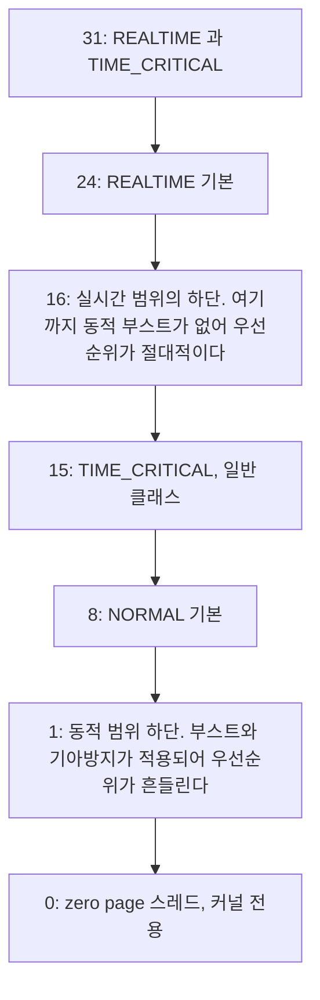

> **기준 출처:** [Microsoft Learn Scheduling Priorities](https://learn.microsoft.com/en-us/windows/win32/procthread/scheduling-priorities) · [Priority Boosts](https://learn.microsoft.com/en-us/windows/win32/procthread/priority-boosts) · 실측 환경: Windows 10 Pro 19045 / 측정일 2026-08-07
> **시리즈:** [목차](/posts/00-rtos-series/) | 이전 → [01. 윈도우는 왜 실시간이 아닌가](/posts/01-why-windows-not-realtime/) | 다음 → [03. 스레드 우선순위 실전](/posts/03-thread-priority-in-practice/)

## 1. 우선순위는 두 값의 조합이다

리눅스는 숫자 하나로 1에서 99를 쓰지만 윈도우는 프로세스 클래스와 스레드 레벨 두 값을 조합해 내부값 0에서 31을 만든다.


| 프로세스 클래스 | 상수 | 기준값 |
| --- | --- | --- |
| IDLE | `IDLE_PRIORITY_CLASS` | 4 |
| BELOW NORMAL | `BELOW_NORMAL_PRIORITY_CLASS` | 6 |
| NORMAL | `NORMAL_PRIORITY_CLASS` | 8 |
| ABOVE NORMAL | `ABOVE_NORMAL_PRIORITY_CLASS` | 10 |
| HIGH | `HIGH_PRIORITY_CLASS` | 13 |
| REALTIME | `REALTIME_PRIORITY_CLASS` | 24 |

| 스레드 레벨 | 상수 | 기준값 대비 |
| --- | --- | --- |
| IDLE | `THREAD_PRIORITY_IDLE` | 특수, 1 또는 16 |
| LOWEST | `THREAD_PRIORITY_LOWEST` | -2 |
| BELOW NORMAL | `THREAD_PRIORITY_BELOW_NORMAL` | -1 |
| NORMAL | `THREAD_PRIORITY_NORMAL` | 0 |
| ABOVE NORMAL | `THREAD_PRIORITY_ABOVE_NORMAL` | +1 |
| HIGHEST | `THREAD_PRIORITY_HIGHEST` | +2 |
| TIME CRITICAL | `THREAD_PRIORITY_TIME_CRITICAL` | 특수, 15 또는 31 |

조합하면 이렇게 된다.

| 프로세스 클래스 | NORMAL 스레드 | HIGHEST 스레드 | TIME_CRITICAL 스레드 |
| --- | --- | --- | --- |
| NORMAL | 8 | 10 | 15 |
| HIGH | 13 | 15 | 15 |
| REALTIME | 24 | 26 | 31, 최고 |

`TIME_CRITICAL`이 특별하다. 일반 클래스에서는 동적 범위인 1에서 15의 최상단인 15가 되고 REALTIME 클래스에서는 31이 된다. 두 값의 의미가 완전히 다르다.

## 2. 15와 16 사이에 경계가 있다

윈도우 우선순위 0에서 31은 두 영역으로 나뉜다.



| | 동적 범위 1~15 | 실시간 범위 16~31 |
| --- | --- | --- |
| 동적 부스트 | 적용된다 | 없다 |
| 기아 방지 | 적용된다 | 없다 |
| 우선순위 | 흔들린다 | 절대적이다 |
| 위험 | 낮다 | 시스템을 굶길 수 있다 |

실시간 제어 루프를 만들려면 16 이상이 필요하다. 15 이하에서는 커널이 우선순위를 임의로 올렸다 내렸다 하므로 예측이 되지 않는다.

그런데 `REALTIME_PRIORITY_CLASS`는 위험하다. 이 클래스 스레드는 디스크 캐시 관리와 입력 처리와 네트워크 같은 시스템 스레드보다 높다. 여기서 CPU를 놓지 않으면 마우스가 안 움직이고 디스크 쓰기가 멈춘다. 리눅스에서 [우선순위 99를 쓰지 않는](/posts/05-priority-design-permissions/) 것과 같은 이유이고, 윈도우는 그보다 더 위험하다. RT throttling 같은 안전장치가 없다.

실무 절충은 `HIGH_PRIORITY_CLASS`와 `TIME_CRITICAL` 조합, 곧 15를 먼저 시도하는 것이다. 이것만으로도 일반 프로세스보다 확실히 앞선다. [03편](/posts/03-thread-priority-in-practice/)의 실측이 이 설정이다.

## 3. 실측으로 본 우선순위 분포

```text
2026-08-07 측정, 읽을 수 있었던 프로세스 358개

  PriorityClass   Count
  -------------   -----
  (읽기 권한 없음)  174
  Normal            165
  Idle                9
  AboveNormal         7
  BelowNormal         2
  High                1
  RealTime            0     <- 아무도 안 쓴다
```

`RealTime` 클래스를 쓰는 프로세스가 하나도 없다. 브라우저와 에디터와 오피스 같은 일반 응용은 전부 `Normal`이고, 반응성이 필요한 몇 개인 브라우저 렌더러와 에디터가 `AboveNormal`을 쓴다. `RealTime`은 위험해서 실제로 거의 쓰이지 않고, 이 분포 자체가 2절의 경고를 뒷받침한다.

```powershell
# 확인 명령
Get-Process | Group-Object PriorityClass | Sort-Object Count -Descending |
    Format-Table @{n='PriorityClass';e={$_.Name}}, Count -AutoSize
```

## 4. 퀀텀

같은 우선순위 스레드가 여럿이면 퀀텀만큼씩 번갈아 돈다.

| 시스템 종류 | 퀀텀, 대략 |
| --- | --- |
| 클라이언트 (Windows 10, 11) | 짧다. 반응성이 우선이고 포그라운드 창은 세 배 길어진다 |
| 서버 | 길다. 처리량이 우선이다 |

설정 위치는 시스템 속성의 고급, 성능 설정의 고급, 프로세서 일정이다. 레지스트리로는 `HKLM\SYSTEM\CurrentControlSet\Control\PriorityControl\Win32PrioritySeparation`이다.

| 선택 | 효과 |
| --- | --- |
| 프로그램 | 포그라운드 창에 긴 퀀텀과 부스트를 준다 |
| 백그라운드 서비스 | 모든 스레드에 동일한 퀀텀을 준다. 제어 응용에는 이쪽이 낫다 |

백그라운드 서비스로 두면 포그라운드 부스트가 사라져 동작이 균일해진다. 화면을 클릭했느냐에 따라 제어 루프 성능이 달라지는 것을 막는다. 다만 실시간 범위인 16에서 31에서는 퀀텀 자체가 큰 의미가 없다. 그 위에 아무도 없으면 계속 돌기 때문이다.

## 5. 동적 부스트

| 부스트 종류 | 언제 | 크기 |
| --- | --- | --- |
| I/O 완료 | 디스크나 네트워크 완료 시 | +1에서 +8, 장치별로 다르다 |
| 포그라운드 전환 | 창이 활성화되면 | 퀀텀 연장과 부스트 |
| 이벤트나 세마포어 대기 해제 | | +1 |
| 기아 방지 | 약 4초 이상 못 돈 스레드 | 임시로 15로 올린다 |


부스트는 반응성 좋은 데스크톱을 위한 장치다. 실시간에서는 방해가 된다. 아무 관계 없는 스레드가 임시로 올라와 내 루프를 밀어낼 수 있기 때문이다. 그래서 실시간 루프는 부스트가 없는 16 이상을 쓰거나, 최소한 그 스레드의 부스트를 끈다.

```c
SetThreadPriorityBoost(GetCurrentThread(), TRUE);   /* TRUE 가 부스트 비활성화다 */
```

인자 이름이 `DisablePriorityBoost`이므로 `TRUE`가 끄기다. 헷갈리기 쉬운 지점이다.

## 6. 리눅스와 나란히 놓으면

| | 윈도우 | 리눅스 |
| --- | --- | --- |
| 우선순위 표현 | 클래스와 레벨의 조합으로 0~31 | 정책과 1~99, 또는 nice |
| 실시간 구간 | 16~31, `REALTIME_PRIORITY_CLASS` | `SCHED_FIFO`와 `SCHED_RR`의 1~99 |
| 부스트 | 동적 범위에서 적용된다 | `SCHED_OTHER`만 적용된다 |
| 폭주 방어 | 없다 | RT throttling, 기본 95% |
| 커널 선점 | 고칠 수 없다 | PREEMPT_RT가 있다 |
| IRQ 우선순위 | IRQL이 고정이라 손댈 수 없다 | IRQ 스레드로 조절할 수 있다 |

우선순위 체계 자체는 윈도우도 충분히 정교하다. 문제는 그 아래인 DPC와 ISR과 커널을 사용자가 건드릴 수 없다는 것이다. 리눅스는 PREEMPT_RT로 커널까지 바꿀 수 있고 IRQ에 우선순위를 매길 수 있다. 이 차이가 최악값에서 자릿수로 나타난다.

## 정리

- 윈도우 우선순위는 프로세스 클래스와 스레드 레벨의 조합으로 내부값 0에서 31이 된다.
- 15와 16 사이에 경계가 있다. 1에서 15는 동적 범위로 부스트와 기아방지가 있고 16에서 31은 없다.
- 실시간 루프는 16 이상이 필요하지만 `REALTIME_PRIORITY_CLASS`는 시스템을 굶길 수 있고 안전장치가 없다.
- 실무 절충은 `HIGH_PRIORITY_CLASS`와 `TIME_CRITICAL` 조합, 곧 15부터 시도하는 것이다.
- 실측에서 358개 프로세스 중 `RealTime`은 0개였다. 실제로 거의 쓰이지 않는다.
- 퀀텀은 백그라운드 서비스로 두면 균일해진다. 포그라운드 부스트가 제거된다.
- 부스트를 끄려면 `SetThreadPriorityBoost(h, TRUE)`를 쓴다. 인자 이름이 `Disable`이라 TRUE가 끄기다.
- 리눅스와의 결정적 차이는 DPC와 ISR 층과 커널을 사용자가 못 건드린다는 점이다.

## 참고

- [Microsoft Learn — Scheduling Priorities](https://learn.microsoft.com/en-us/windows/win32/procthread/scheduling-priorities)
- [Microsoft Learn — Priority Boosts](https://learn.microsoft.com/en-us/windows/win32/procthread/priority-boosts)
- [Microsoft Learn — Scheduling](https://learn.microsoft.com/en-us/windows/win32/procthread/scheduling)