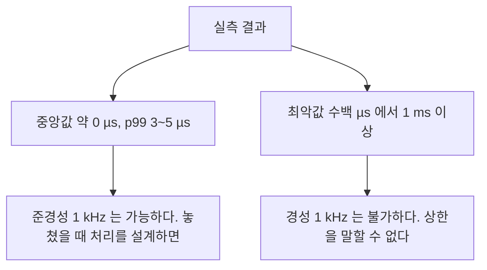

> **기준 출처:** [Microsoft Learn SetThreadPriority](https://learn.microsoft.com/en-us/windows/win32/api/processthreadsapi/nf-processthreadsapi-setthreadpriority) · [SetThreadAffinityMask](https://learn.microsoft.com/en-us/windows/win32/api/winbase/nf-winbase-setthreadaffinitymask) · 실측 환경: Windows 10 Pro 19045, 노트북급 x86-64 4코어 8스레드 / 측정일 2026-08-07
> **시리즈:** [목차](/posts/00-rtos-series/) | 이전 → [02. 윈도우 스케줄러 구조](/posts/02-windows-scheduler-structure/) | 다음 → [04. 타이머 해상도와 시간 측정](/posts/04-timer-resolution-measurement/)

## 1. 측정 방법

1 kHz 주기 루프를 다섯 가지 방식으로 각각 3,000 스텝 돌리고, 매 스텝마다 목표 시각보다 얼마나 늦었는지를 `QueryPerformanceCounter`로 기록했다. 이 환경에서 QPC는 10 MHz이므로 해상도는 0.1 µs다.


```csharp
// 측정 루프의 핵심
long freq   = Stopwatch.Frequency;          // 10,000,000 Hz
double tickMs = 1000.0 / freq;              // 0.0001 ms
long period = (long)(periodMs / tickMs);    // 1 ms 에 해당하는 틱 수

Stopwatch sw = Stopwatch.StartNew();
long next = sw.ElapsedTicks + period;
for (int i = 0; i < n; i++) {
    // 대기 방식, mode 에 따라 셋 중 하나
    if (mode == 0) {                               // A. Sleep 만
        int ms = (int)((next - sw.ElapsedTicks) * tickMs);
        if (ms > 0) Thread.Sleep(ms);
    } else if (mode == 1) {                        // B. Sleep 과 스핀
        int ms = (int)((next - sw.ElapsedTicks) * tickMs) - 1;   // 1 ms 일찍 깨어난다
        if (ms > 0) Thread.Sleep(ms);
        while (sw.ElapsedTicks < next) Thread.SpinWait(1);       // 나머지는 스핀
    } else {                                       // C. 순수 스핀
        while (sw.ElapsedTicks < next) Thread.SpinWait(1);
    }
    long now = sw.ElapsedTicks;
    err[i] = (now - next) * tickMs * 1000.0;       // µs 단위 오차
    next += period;                                 // 절대시각 누적
}
```

D와 E 조건은 위에 다음을 추가했다.

```csharp
[DllImport("kernel32.dll")] static extern bool SetThreadPriority(IntPtr h, int p);
[DllImport("kernel32.dll")] static extern UIntPtr SetThreadAffinityMask(IntPtr h, UIntPtr m);

SetThreadPriority(GetCurrentThread(), 15);         // THREAD_PRIORITY_TIME_CRITICAL
SetThreadAffinityMask(GetCurrentThread(), (UIntPtr)(1UL << 3));   // 논리 코어 3 에 고정
```

프로세스 클래스는 `Normal` 그대로였고 `REALTIME_PRIORITY_CLASS`는 쓰지 않았다. 따라서 `TIME_CRITICAL`은 [02편](/posts/02-windows-scheduler-structure/) 기준으로 내부 우선순위 15, 곧 동적 범위의 최상단이다. 그리고 전 구간에서 `timeBeginPeriod(1)`이 적용된 상태였다.

## 2. 결과


| 조건 | 대기 방식 | 우선순위와 코어 | 중앙값 | 상위 1% | 최악값 |
| --- | --- | --- | --- | --- | --- |
| A | `Sleep`만 | Normal | 172 µs | 898 µs | 1,357 µs |
| B | `Sleep`과 스핀 | Normal | 약 0 | 4.8 µs | 1,677 µs |
| C | 순수 스핀 | Normal | 약 0 | 8.3 µs | 351 µs |
| D | `Sleep`과 스핀 | TIME_CRITICAL, 코어 3 | 약 0 | 3.6 µs | 605 µs |
| E | 순수 스핀 | TIME_CRITICAL, 코어 3 | 약 0 | 3.3 µs | 1,142 µs |

## 3. 읽는 법

첫째, `Sleep`만 쓰면 중앙값부터 172 µs다. `timeBeginPeriod(1)`을 켰어도 `Sleep`의 정밀도는 1 ms 단위다. 1 ms 주기를 1 ms 해상도로 맞추려니 매 스텝 백 µs 단위로 어긋난다. 주기가 타이머 해상도에 가까우면 `Sleep`만으로는 되지 않는다. 10 ms 주기라면 `Sleep`만으로도 충분하지만 1 ms는 해상도와 같은 크기라 양자화 오차가 그대로 드러난다.

둘째, 스핀을 섞으면 중앙값과 p99가 µs로 떨어진다. 거의 다 자고 마지막만 스핀하는 방식(조건 B와 D)이 실무의 표준 형태다. `Sleep`으로 CPU를 양보하다가 목표 직전에 깨어나 스핀으로 정확히 맞춘다.

| | 순수 `Sleep` (A) | 하이브리드 (B, D) | 순수 스핀 (C, E) |
| --- | --- | --- | --- |
| 정밀도 | 나쁘다 | 좋다 | 좋다 |
| CPU 사용 | 거의 0 | 낮다 | 100% |
| 전력 | 낮다 | 낮다 | 발열과 전력이 크다 |

하이브리드가 실무의 선택이다. 순수 스핀은 코어 하나를 100% 태우면서도 아래 셋째에서 보듯 최악값이 더 좋지도 않다.

셋째, 우선순위와 코어 고정은 p99만 고친다.

| | Normal (B) | TIME_CRITICAL과 코어 고정 (D) | 개선 |
| --- | --- | --- | --- |
| 상위 1% | 4.8 µs | 3.6 µs | 25% 개선 |
| 최악값 | 1,677 µs | 605 µs | 개선됐지만 여전히 605 µs |

우선순위를 올리고 코어에 고정해도 최악값이 µs대로 내려가지 않는다. [01편](/posts/01-why-windows-not-realtime/)에서 본 대로 남은 것은 DPC와 ISR, 커널 선점 불가 구간, 전원관리이고 응용 코드가 손댈 수 있는 층이 아니다.

넷째, 최악값은 재현되지 않는다. C(순수 스핀, Normal)의 최악값 351 µs가 E(순수 스핀, TIME_CRITICAL)의 1,142 µs보다 좋다. 우선순위를 올렸는데 최악값이 세 배 나빠진 것이다.

이것은 설정 때문이 아니라 그때 마침 무슨 일이 있었나의 차이다. 최악값은 드문 사건이라 3,000 스텝, 곧 3초로는 안정적으로 재현되지 않는다.

여기서 얻는 것이 크다. 설정을 바꿨더니 최악값이 좋아졌다는 판단을 3초 측정으로 내리면 잘못된 결론에 이른다. [리눅스 09편](/posts/09-latency-measurement-cyclictest/)에서 출하 검증은 24시간 이상이라고 한 이유가 이것이다. 이 글의 최악값들도 그런 의미에서 하한이지 상한이 아니다. 더 오래 재면 더 큰 값이 나올 수 있다.

## 4. 실제로 쓰는 코드 형태

```c
#include <windows.h>
#include <timeapi.h>       /* timeBeginPeriod, winmm.lib 를 링크한다 */

static LARGE_INTEGER g_freq;

static inline LONGLONG qpc(void) {
    LARGE_INTEGER c; QueryPerformanceCounter(&c); return c.QuadPart;
}

void rt_loop_init(int core)
{
    QueryPerformanceFrequency(&g_freq);

    timeBeginPeriod(1);                                  /* 타이머 해상도 */

    HANDLE h = GetCurrentThread();
    SetThreadPriority(h, THREAD_PRIORITY_TIME_CRITICAL); /* 우선순위 */
    SetThreadPriorityBoost(h, TRUE);                     /* 부스트 끄기 */
    SetThreadAffinityMask(h, (DWORD_PTR)1 << core);      /* 코어 고정 */

    /* 프로세스 클래스, 필요하면. REALTIME 은 신중하게 쓴다 */
    SetPriorityClass(GetCurrentProcess(), HIGH_PRIORITY_CLASS);
}

void rt_loop_run(double period_ms)
{
    LONGLONG period = (LONGLONG)(period_ms * g_freq.QuadPart / 1000.0);
    LONGLONG next   = qpc() + period;

    while (running) {
        /* 하이브리드 대기: 1 ms 남을 때까지 자고 나머지는 스핀 */
        for (;;) {
            LONGLONG remain_ticks = next - qpc();
            if (remain_ticks <= 0) break;
            double remain_ms = (double)remain_ticks * 1000.0 / g_freq.QuadPart;
            if (remain_ms > 1.5) Sleep((DWORD)(remain_ms - 1.0));
            else                 YieldProcessor();       /* PAUSE 명령, 스핀 */
        }

        LONGLONG t_wake = qpc();
        double late_us = (double)(t_wake - next) * 1e6 / g_freq.QuadPart;

        do_control();                                    /* 제어 본체 */

        stat_push(late_us);                              /* 링버퍼에 숫자만 */
        next += period;                                  /* 절대시각 누적 */

        /* 밀림 처리, 정책을 반드시 정한다 */
        if (qpc() > next) {
            overrun_count++;
            while (qpc() > next) next += period;         /* 건너뛰기 */
        }
    }
}

void rt_loop_cleanup(void) { timeEndPeriod(1); }
```

| 요소 | 왜 |
| --- | --- |
| `timeBeginPeriod(1)` | `Sleep` 정밀도를 확보한다 |
| `TIME_CRITICAL` | 동적 범위 최상단이다 |
| `SetThreadPriorityBoost(h, TRUE)` | 부스트 끄기다. TRUE가 끄기라는 점을 기억한다 |
| `SetThreadAffinityMask` | 코어 이주를 막아 캐시를 유지한다 |
| `YieldProcessor()` | 스핀 루프에서 `PAUSE` 명령을 낸다 |
| `next += period` | 절대시각 누적으로 드리프트를 막는다 |

스핀 루프에서 `YieldProcessor()`, 곧 x86의 `PAUSE`를 쓰는 것이 빈 `while`보다 낫다. 파이프라인 힌트를 주어 전력을 아끼고 하이퍼스레딩 짝 논리 코어가 실행 유닛을 쓸 수 있게 해 준다. 빈 루프는 짝 코어까지 굶긴다.

## 5. 무엇을 기대할 수 있나



| 목표 | 순수 윈도우로 |
| --- | --- |
| 100 Hz 준경성 | 여유가 있다 |
| 1 kHz 준경성, 가끔 놓쳐도 되는 경우 | 가능하다. 단 밀림 처리와 카운터가 필수다 |
| 1 kHz 경성 | 불가하다 |
| 안전 관련 기능 | 불가하다 |

준경성으로 설계한다는 것이 구체적으로 무엇인지 네 가지로 정리된다. 밀림을 감지하고, 밀렸을 때 무엇을 할지 코드에 쓰고(건너뛰기나 직전 값 유지나 램프 제한), 카운터를 남기고 임계값을 넘으면 알리고, 안전 기능은 이 루프에 두지 않는다. 안전은 하드웨어 인터록이나 워치독이나 별도 MCU가 맡는다.

이 넷이 없으면 가끔 놓치는데 아무도 모르는 시스템이 된다. [이론 02편](/posts/02-hard-soft-firm-realtime/)에서 다룬 내용이다.

## 정리

- 측정은 1 kHz 루프에 다섯 조건, 각 3,000 스텝, QPC 0.1 µs 해상도로 했다.
- `Sleep`만 쓰면 중앙값이 172 µs다. 주기가 타이머 해상도와 같은 크기라 양자화 오차가 그대로 나온다.
- 하이브리드가 실무의 표준이다. 중앙값 약 0, p99 4.8 µs이고 순수 스핀은 CPU 100%를 쓰고도 더 낫지 않다.
- 우선순위와 코어 고정은 p99만 고친다. 최악값은 605 µs로 남고 DPC와 ISR 층은 응용이 못 건드린다.
- 최악값은 3초 측정으로 재현되지 않는다. C가 E보다 좋게 나온 것이 그 증거다.
- 코드는 `timeBeginPeriod(1)`과 `TIME_CRITICAL`과 `SetThreadPriorityBoost(h, TRUE)`와 affinity와 `YieldProcessor()`를 쓴다.
- 결론은 준경성 1 kHz는 가능하되 밀림 감지와 처리와 카운터가 필수이고 경성은 불가하다는 것이다.

## 참고

- [Microsoft Learn — SetThreadPriority](https://learn.microsoft.com/en-us/windows/win32/api/processthreadsapi/nf-processthreadsapi-setthreadpriority)
- [Microsoft Learn — SetThreadAffinityMask](https://learn.microsoft.com/en-us/windows/win32/api/winbase/nf-winbase-setthreadaffinitymask)
- [Microsoft Learn — timeBeginPeriod](https://learn.microsoft.com/en-us/windows/win32/api/timeapi/nf-timeapi-timebeginperiod)