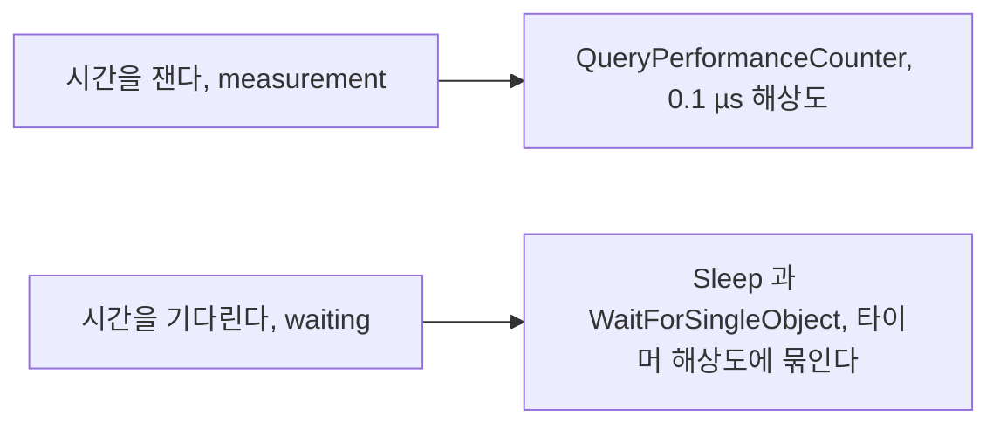
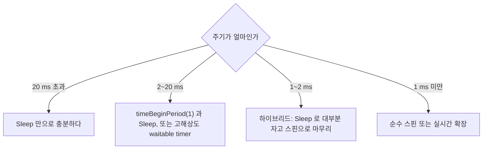

> **기준 출처:** [Microsoft Learn timeBeginPeriod](https://learn.microsoft.com/en-us/windows/win32/api/timeapi/nf-timeapi-timebeginperiod) · [Acquiring high-resolution time stamps](https://learn.microsoft.com/en-us/windows/win32/sysinfo/acquiring-high-resolution-time-stamps) · [High-resolution timers](https://learn.microsoft.com/en-us/windows/win32/sync/high-resolution-timers) · 실측 환경: Windows 10 Pro 19045 / 측정일 2026-08-07
> **시리즈:** [목차](/posts/00-rtos-series/) | 이전 → [03. 스레드 우선순위 실전](/posts/03-thread-priority-in-practice/) | 다음 → [05. DPC와 ISR 지연](/posts/05-dpc-isr-latency/)

## 1. 재는 것과 기다리는 것을 구분한다



윈도우에서 시간 측정은 정밀하고 문제는 대기다. QPC는 이 환경에서 0.1 µs 해상도로 시각을 알려준다. 그런데 `Sleep(1)`은 기본 상태에서 15.6 ms가 걸린다. 두 문제를 섞어 생각하면 원인을 찾지 못한다.

## 2. 시간 측정은 QPC로 충분하다

```text
2026-08-07 실측
  QPC frequency              : 10,000,000 Hz  (10.00 MHz)
  1 틱 = 0.1000 µs
  Stopwatch.IsHighResolution : True
  Stopwatch.Frequency        : 10,000,000 Hz
```

```c
LARGE_INTEGER freq, t0, t1;
QueryPerformanceFrequency(&freq);      /* 부팅 후 변하지 않으므로 한 번만 호출한다 */
QueryPerformanceCounter(&t0);
do_work();
QueryPerformanceCounter(&t1);
double us = (double)(t1.QuadPart - t0.QuadPart) * 1e6 / freq.QuadPart;
```

| 시간 API | 해상도 | 용도 |
| --- | --- | --- |
| `QueryPerformanceCounter` | 0.1 µs | 실시간 측정의 표준 |
| `GetSystemTimePreciseAsFileTime` | 약 1 µs | 벽시계에 고정밀이 필요할 때 |
| `GetTickCount64` | 10에서 16 ms | 대략적인 경과 시간만 |
| `timeGetTime` | 타이머 해상도에 의존한다 | 레거시 |
| `GetSystemTimeAsFileTime` | 10에서 16 ms | 벽시계, 저정밀 |
| `__rdtsc()` | CPU 사이클 | 주파수 변동과 코어 이동에 취약하다 |

QPC는 최신 윈도우에서 안전하다. 예전에는 코어마다 값이 다르다거나 주파수가 변한다는 문제가 있었지만 요즘은 OS가 불변 TSC 등을 이용해 모든 코어에서 일관되고 주파수와 무관한 값을 보장한다. `__rdtsc()`를 직접 쓰지 말고 QPC를 쓴다.

`QueryPerformanceFrequency`는 한 번만 부른다. 부팅 후 변하지 않는데 매 루프마다 부르면 그 자체가 오버헤드다.

## 3. 타이머 해상도 15.625 ms의 정체

```text
2026-08-07 실측 (NtQueryTimerResolution)
  최소, 가장 거친 값 : 15,625.0 µs   <- 기본값
  최대, 가장 고운 값 :    500.0 µs
  현재               :  1,000.0 µs   <- 이 환경에선 이미 누군가 1 ms 로 올려 둔 상태
```

15.625 ms는 64 Hz이고 윈도우 커널의 기본 스케줄러 틱 주기다. `Sleep`과 `WaitForSingleObject`와 waitable timer는 모두 이 틱 경계에서만 깨어난다.


_`Sleep(1)`을 2,000회 반복한 실측._

| | 중앙값 | 상위 1% | 최악값 | 최소값 |
| --- | --- | --- | --- | --- |
| 기본 해상도 | 15.61 ms | 16.73 ms | 48.89 ms | 2.49 ms |
| `timeBeginPeriod(1)` 적용 | 1.99 ms | 2.30 ms | 17.17 ms | 1.01 ms |

`Sleep(1)`이 15.6 ms 걸린다. 1 ms를 요청했는데 15배가 걸린 것이고 이것은 버그가 아니라 설계상 정상이다. 다음 틱까지 기다리기 때문이다.

`timeBeginPeriod(1)`로 중앙값이 1.99 ms로 떨어진다. 그런데 최악값은 17.17 ms로 남는다. 해상도는 평균을 고치고 최악값을 고치지 못한다. [01편](/posts/01-why-windows-not-realtime/)에서 반복한 이야기다.

## 4. timeBeginPeriod를 쓰는 법과 함정

```c
#include <timeapi.h>          /* winmm.lib 를 링크한다 */

timeBeginPeriod(1);           /* 시스템 타이머 해상도를 1 ms 로 요청한다 */
/* ... 실시간 작업 ... */
timeEndPeriod(1);             /* 반드시 짝을 맞춘다 */
```

```c
/* 지원 범위를 먼저 확인한다 */
TIMECAPS tc;
if (timeGetDevCaps(&tc, sizeof(tc)) == TIMERR_NOERROR)
    printf("min=%u ms  max=%u ms\n", tc.wPeriodMin, tc.wPeriodMax);
```

함정이 셋이다.

| # | 함정 | 내용 |
| --- | --- | --- |
| 1 | 전역 영향 | 예전 윈도우에서는 한 프로세스가 올리면 시스템 전체가 올라갔고 전력 소모가 늘었다 |
| 2 | Windows 10 2004 이후 프로세스별 | 부른 프로세스에만 적용된다. 이 변화를 모르면 측정이 맞지 않는다 |
| 3 | 최대 해상도 500 µs | 이 환경 기준이다. 그보다 고운 주기는 이 API로 되지 않는다 |

이번 측정에서 둘째 함정을 직접 관찰했다.

```text
NtQueryTimerResolution 이 보고한 현재 값   : 1,000 µs   (다른 프로세스가 올려 둠)
그런데 timeEndPeriod 후 내 Sleep(1) 중앙값 : 15.61 ms  (= 15,625 µs 해상도)
```

시스템 전체 해상도는 1 ms인데 내 프로세스의 `Sleep`은 15.6 ms였다. Windows 10 2004부터 `timeBeginPeriod`가 프로세스별로 동작하기 때문이다. 남이 올려 둔 해상도는 나에게 적용되지 않는다.

그래서 `NtQueryTimerResolution`의 현재 값을 보고 판단하면 안 된다. 내 프로세스의 실제 동작은 `Sleep`을 직접 재 봐야 안다. 이 함정 때문에 해상도는 1 ms라는데 왜 15 ms나 걸리느냐는 혼란이 생긴다.

## 5. 고해상도 waitable timer

Windows 10 1803부터 `CREATE_WAITABLE_TIMER_HIGH_RESOLUTION` 플래그가 생겼다. `timeBeginPeriod` 없이도 고해상도 대기가 가능하다.

```c
HANDLE t = CreateWaitableTimerExW(NULL, NULL,
              CREATE_WAITABLE_TIMER_HIGH_RESOLUTION, TIMER_ALL_ACCESS);

LARGE_INTEGER due;
due.QuadPart = -10000LL;          /* 음수는 상대시간, 단위 100 ns 라서 1 ms */
SetWaitableTimer(t, &due, 1 /* 주기 1 ms */, NULL, NULL, FALSE);

while (running) {
    WaitForSingleObject(t, INFINITE);
    do_control();
}
CloseHandle(t);
```

| | `Sleep`과 `timeBeginPeriod` | 고해상도 waitable timer |
| --- | --- | --- |
| 해상도 | 1 ms, 또는 500 µs | 더 고운 값이 된다 |
| 시스템 영향 | 프로세스별, 2004 이후 | 이 타이머만 영향을 받는다 |
| 주기 반복 | 직접 계산한다 | 내장돼 있다 |
| 드리프트 | 절대시각 누적이 필요하다 | 주기 모드가 절대시각 기준이라 누적되지 않는다 |

주기 모드를 쓰면 드리프트가 없다. 커널이 첫 만료 시각을 기준으로 주기를 더해 가기 때문이다. [이론 11편](/posts/11-jitter-sources/)의 절대시각 대기가 API 안에 들어 있는 셈이다.

그래도 최악값 문제는 그대로다. 이것은 언제 깨워 달라고 요청하는가의 정밀도이고, 실제로 언제 깨워지는가는 DPC와 스케줄러가 정한다. [05편](/posts/05-dpc-isr-latency/)에서 다룬다.

## 6. 대기 방법 선택표



| 방법 | 정밀도 | CPU | 언제 |
| --- | --- | --- | --- |
| `Sleep` | 1에서 15.6 ms | 거의 0 | 20 ms 이상 주기 |
| `timeBeginPeriod(1)`과 `Sleep` | 약 1 ms | 낮다 | 2에서 20 ms |
| 고해상도 waitable timer | 약 0.5 ms | 낮다 | 2에서 20 ms, 드리프트가 없다 |
| 하이브리드 | µs | 중간이다 | 1에서 2 ms, 실무 표준이다 |
| 순수 스핀 | µs | 100% | 1 ms 미만, 코어 여유가 있을 때 |

어떤 방법을 쓰든 최악값은 고쳐지지 않는다. [03편](/posts/03-thread-priority-in-practice/) 실측에서 하이브리드와 순수 스핀 모두 최악값이 수백 µs 남았다. 이 편의 내용은 중앙값과 p99를 고치는 법이다.

## 정리

- 재는 것과 기다리는 것을 구분한다. 재는 것은 정밀하고 기다리는 것이 문제다.
- QPC는 10 MHz로 0.1 µs 해상도다. 실시간 측정의 표준이고 `__rdtsc()` 대신 쓴다.
- 기본 타이머 해상도는 15,625 µs, 곧 64 Hz다. `Sleep(1)`이 실제로 15.61 ms 걸린다.
- `timeBeginPeriod(1)`로 중앙값이 15.61에서 1.99 ms로 떨어지고 최악값은 17.17 ms로 남는다.
- Windows 10 2004부터 `timeBeginPeriod`는 프로세스별이다. 시스템 현재 해상도가 1 ms여도 내 프로세스는 15.6 ms일 수 있고 이번 측정에서 실제로 관찰했다.
- 고해상도 waitable timer는 `timeBeginPeriod` 없이 더 고운 대기를 제공하고 주기 모드는 드리프트가 없다.
- 1에서 2 ms 주기의 실무 표준은 하이브리드다.
- 이 편은 중앙값과 p99를 고치는 이야기다. 최악값은 다음 편의 영역이다.

## 참고

- [Microsoft Learn — timeBeginPeriod](https://learn.microsoft.com/en-us/windows/win32/api/timeapi/nf-timeapi-timebeginperiod)
- [Microsoft Learn — Acquiring high-resolution time stamps](https://learn.microsoft.com/en-us/windows/win32/sysinfo/acquiring-high-resolution-time-stamps)
- [Microsoft Learn — High-resolution timers](https://learn.microsoft.com/en-us/windows/win32/sync/high-resolution-timers)