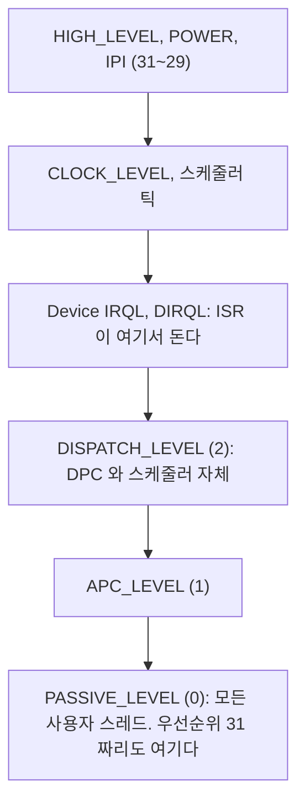
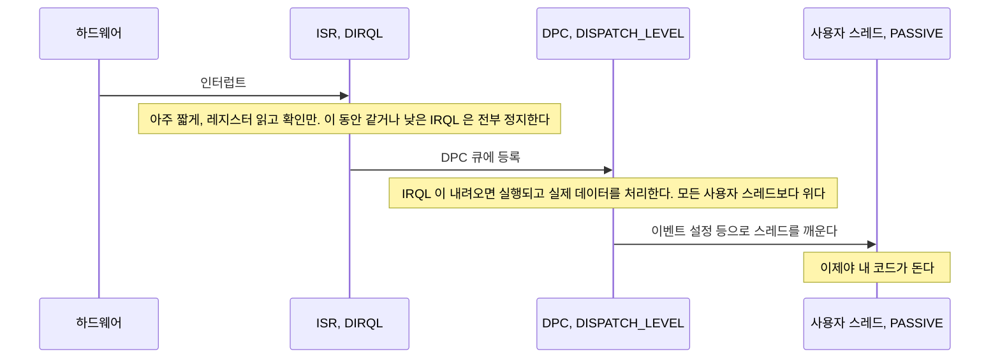
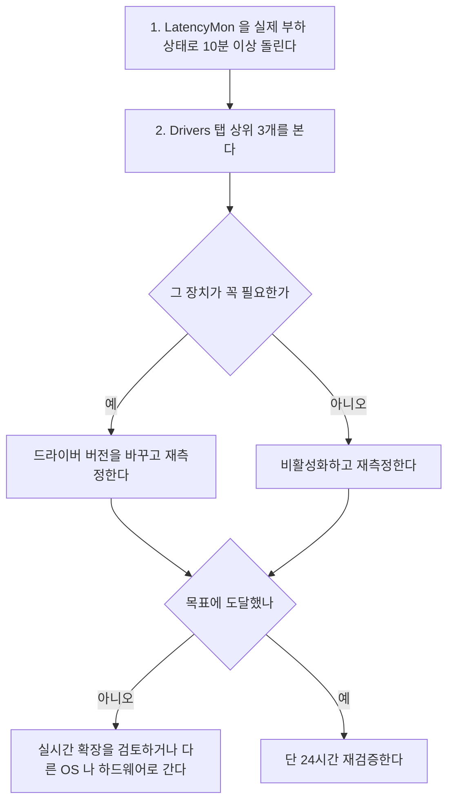
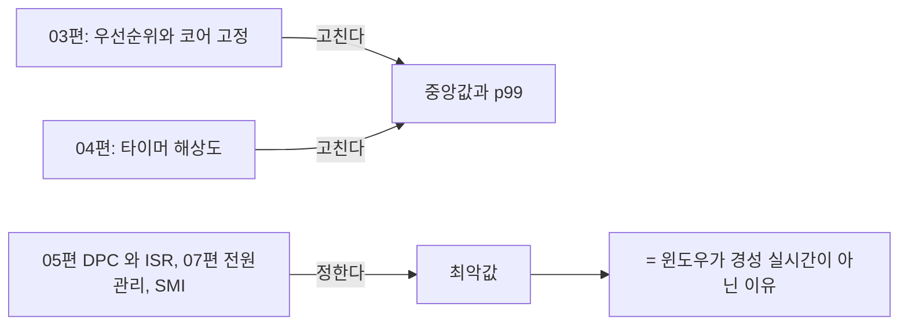

> **기준 출처:** [Microsoft Learn Introduction to DPC Objects](https://learn.microsoft.com/en-us/windows-hardware/drivers/kernel/introduction-to-dpc-objects) · [Managing Hardware Priorities (IRQL)](https://learn.microsoft.com/en-us/windows-hardware/drivers/kernel/managing-hardware-priorities) · [Windows Performance Toolkit](https://learn.microsoft.com/en-us/windows-hardware/test/wpt/) · [DPC and ISR Issues](https://learn.microsoft.com/en-us/windows-hardware/drivers/devtest/dpc-and-isr-issues) / 확인일 2026-08-07
> **시리즈:** [목차](/posts/00-rtos-series/) | 이전 → [04. 타이머 해상도와 시간 측정](/posts/04-timer-resolution-measurement/) | 다음 → [06. MMCSS](/posts/06-mmcss-multimedia-scheduler/)

## 1. IRQL은 스레드 우선순위 위에 있는 층이다

[02편](/posts/02-windows-scheduler-structure/)의 우선순위 0에서 31은 전부 하나의 IRQL 안에서의 이야기다. 그 위에 다른 층이 있다.



우선순위 31짜리 실시간 스레드도 `PASSIVE_LEVEL`이다. `DISPATCH_LEVEL` 이상에서 도는 코드는 모든 사용자 스레드를 무조건 밀어내고 우선순위로는 이길 수 없다.

이것은 [이론 10편](/posts/10-interrupts-and-tasks/)의 ISR은 모든 태스크보다 높다와 같은 원리인데, 윈도우는 그 위에 DPC 층이 하나 더 있다는 점이 다르다.

## 2. ISR과 DPC를 왜 둘로 나눴나

윈도우 드라이버는 인터럽트 처리를 두 단계로 나눈다. 리눅스의 상반부와 하반부와 같은 발상이다.



| 단계 | IRQL | 권장 길이 | 실무의 현실 |
| --- | --- | --- | --- |
| ISR | DIRQL | 수 µs | 대체로 짧다 |
| DPC | DISPATCH_LEVEL | 100 µs 이하 | 긴 드라이버가 실제로 있다 |

DPC가 실무에서 가장 흔한 원인이다. Microsoft는 DPC를 100 µs 이하로 유지하라고 권고하지만 강제되지 않는다. 그래픽과 네트워크와 스토리지와 무선 드라이버 중에 수백 µs에서 ms짜리 DPC를 내는 것들이 있고 응용은 그 시간을 그냥 기다린다.

## 3. 측정하는 법

LatencyMon이 가장 접근하기 쉽다. 무료 도구로 DPC와 ISR 최대 실행시간을 드라이버별로 보여 주고 원인 드라이버 이름이 바로 나온다.

| 화면 항목 | 뜻 |
| --- | --- |
| Highest measured interrupt to process latency | 인터럽트에서 사용자 스레드까지 최악 지연 |
| Highest reported ISR routine execution time | ISR 최대 실행시간 |
| Highest reported DPC routine execution time | DPC 최대 실행시간과 드라이버 파일명 |
| Drivers 탭 | 드라이버별 순위 |

`Drivers` 탭 상위 몇 개가 곧 개선 대상이다. 흔한 원인은 무선 랜(`ndis.sys`와 벤더 드라이버), 그래픽(`dxgkrnl.sys`, `nvlddmkm.sys`), 스토리지, 오디오, 전원관리(`ACPI.sys`, `intelppm.sys`)다.

Microsoft 공식 도구인 `xperf`와 WPA는 더 정밀하고 자동화할 수 있다.

```powershell
# Windows ADK 의 Windows Performance Toolkit 이 필요하다
xperf -on PROC_THREAD+LOADER+DPC+INTERRUPT -stackwalk Profile
# ... 부하를 주고 재현한다 ...
xperf -d C:\temp\trace.etl
wpa C:\temp\trace.etl        # GUI 로 분석한다. DPC/ISR Duration 테이블을 본다
```

성능 카운터로 대략 볼 수도 있다.

```powershell
# DPC 에 쓰인 시간 비율, 코어별
Get-Counter '\Processor(*)\% DPC Time' -SampleInterval 1 -MaxSamples 10

# 초당 인터럽트와 DPC 수
Get-Counter '\Processor(_Total)\Interrupts/sec'
Get-Counter '\Processor(_Total)\DPCs Queued/sec'
```

성능 카운터는 얼마나 자주 그리고 오래 도는가만 알려주고 한 번에 최대 얼마인지는 알려주지 않는다. 실시간에서 중요한 것은 최대값이므로 LatencyMon이나 `xperf`가 필요하다.

## 4. 응용이 할 수 있는 일이 거의 없다


| 대응 | 실효성 |
| --- | --- |
| 문제 드라이버 제거나 비활성 | 무선 랜과 블루투스와 외장 GPU를 안 쓰면 크게 개선되는 경우가 많다 |
| 드라이버 업데이트나 다운그레이드 | 특정 버전에서만 나쁜 경우가 있다 |
| 장치 IRQ affinity 조정 | 레지스트리 `DevicePolicy`와 MSI 설정으로 일부 장치는 가능하다 |
| 전원관리 끄기 | `intelppm.sys` 관련 DPC가 줄어든다. [07편](/posts/07-power-management-core-parking/) |
| 실시간 확장 | 코어를 윈도우 커널에서 아예 떼어낸다. [09편](/posts/09-realtime-extensions-rtx64-intime/) |

이것이 [리눅스 PREEMPT_RT](/posts/03-what-preempt-rt-does/)와의 결정적 차이다. 리눅스는 인터럽트를 커널 스레드로 바꿔서 우선순위를 매길 수 있게 만들었고, 그러면 네트워크 IRQ 스레드를 30으로 눌러 두는 조치가 가능하다. 윈도우는 그 층이 커널 안에 고정돼 있고 사용자가 열 수 없다.

## 5. 실무 체크리스트



| 자주 나오는 원인 | 대응 |
| --- | --- |
| 무선 랜과 블루투스 | 제어 PC에서는 끈다. 유선만 쓴다 |
| 그래픽 드라이버 | 화면 갱신을 줄이거나 헤드리스로 운용하거나 내장 그래픽을 쓴다 |
| 전원관리 (`intelppm.sys`) | 고성능 전원 구성표와 C-state 제한을 쓴다 |
| 오디오 | 불필요하면 비활성화한다 |
| USB 3.0 컨트롤러 | 운용 중 USB 장치를 꽂지 않는다 |
| 가상화 (Hyper-V, WSL2) | 실시간 성능에 불리하다. 제어 PC에서는 끈다 |

제어용 PC는 최소 구성으로 만드는 것이 결론이다. 무선과 그래픽과 오디오와 가상화와 백신 실시간 검사를 다 끄면 DPC 지연이 자릿수로 개선되는 경우가 흔하다. 그리고 그렇게 만든 PC를 사무용으로 겸용하지 않는다. 브라우저 하나가 그래픽 DPC를 만들어 낸다.

## 6. 이 편이 윈도우 편 전체에서 갖는 의미



03편과 04편은 평균을 고치는 이야기였고 이 편이 최악값의 정체다. 그리고 최악값은 응용이 못 고친다. 그래서 윈도우 편 후반이 코어를 윈도우에서 뺏어오거나 다른 곳에 올리는 쪽으로 이어진다.

## 정리

- IRQL은 스레드 우선순위 위의 층이다. 우선순위 31짜리도 `PASSIVE_LEVEL`이라 DPC 하나에 밀린다.
- 인터럽트 처리는 ISR에서 DPC로, 그리고 스레드 깨우기 순으로 진행된다.
- DPC가 가장 흔한 원인이다. 권고는 100 µs 이하인데 강제되지 않아 수백 µs에서 ms짜리 드라이버가 실제로 있다.
- 측정은 LatencyMon이 드라이버 이름까지 알려 주고 `xperf`와 WPA가 더 정밀하다. 성능 카운터로는 최대값을 못 본다.
- 응용이 할 수 있는 일이 거의 없다. 우선순위도 코어 고정도 IRQL을 이기지 못한다.
- 대응은 장치 비활성과 드라이버 교체와 전원관리 정도다. 근본 해결은 실시간 확장이다.
- 리눅스와의 결정적 차이는 PREEMPT_RT가 IRQ를 스레드로 만들어 우선순위를 매길 수 있게 했다는 점이다.
- 제어용 PC는 최소 구성으로 만들고 사무용으로 겸용하지 않는다.
- 03편과 04편이 평균을 고쳤다면 이 편이 최악값의 정체이고 그것은 응용이 못 고친다.

## 참고

- [Microsoft Learn — Introduction to DPC Objects](https://learn.microsoft.com/en-us/windows-hardware/drivers/kernel/introduction-to-dpc-objects)
- [Microsoft Learn — Managing Hardware Priorities](https://learn.microsoft.com/en-us/windows-hardware/drivers/kernel/managing-hardware-priorities)
- [Microsoft Learn — Windows Performance Toolkit](https://learn.microsoft.com/en-us/windows-hardware/test/wpt/)
- [Microsoft Learn — DPC and ISR Issues](https://learn.microsoft.com/en-us/windows-hardware/drivers/devtest/dpc-and-isr-issues)