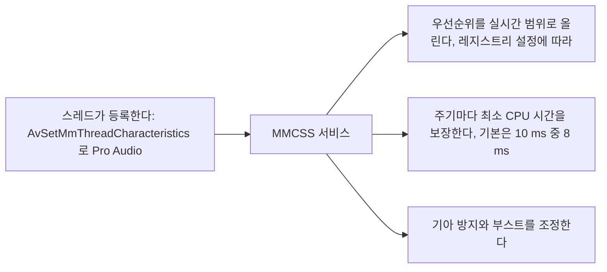
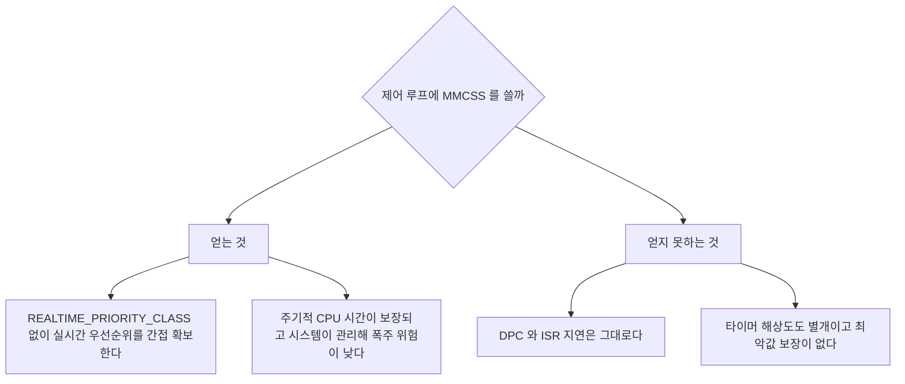

> **기준 출처:** [Microsoft Learn Multimedia Class Scheduler Service](https://learn.microsoft.com/en-us/windows/win32/procthread/multimedia-class-scheduler-service) · [AvSetMmThreadCharacteristics](https://learn.microsoft.com/en-us/windows/win32/api/avrt/nf-avrt-avsetmmthreadcharacteristicsw) · [Audio Glitching Issues](https://learn.microsoft.com/en-us/windows/win32/coreaudio/audio-glitching-issues) / 확인일 2026-08-07
> **시리즈:** [목차](/posts/00-rtos-series/) | 이전 → [05. DPC와 ISR 지연](/posts/05-dpc-isr-latency/) | 다음 → [07. 전원관리와 코어 파킹](/posts/07-power-management-core-parking/)

## 1. 윈도우가 이미 하고 있는 것

오디오와 비디오 재생은 끊기면 바로 티가 나는 준경성 실시간 작업이다. 윈도우는 이것을 위해 MMCSS(Multimedia Class Scheduler Service)라는 장치를 두고 있다. 스레드가 나는 오디오 작업이라고 등록하면 시스템이 그 스레드에 CPU 시간을 보장해 준다.



## 2. 쓰는 법

```c
#include <avrt.h>          /* Avrt.lib 를 링크한다 */

DWORD taskIndex = 0;
HANDLE h = AvSetMmThreadCharacteristicsW(L"Pro Audio", &taskIndex);
if (h == NULL) { /* 실패 처리 */ }

AvSetMmThreadPriority(h, AVRT_PRIORITY_CRITICAL);   /* 그 클래스 안에서 최상위 */

/* ... 주기 작업 ... */

AvRevertMmThreadCharacteristics(h);                 /* 반드시 해제한다 */
```

| 클래스 이름 | 용도 | 기본 우선순위 성향 |
| --- | --- | --- |
| `Pro Audio` | 저지연 오디오 | 가장 높다 |
| `Audio` | 일반 오디오 | 높다 |
| `Capture` | 캡처 | 높다 |
| `Playback` | 재생 | 중간이다 |
| `Games` | 게임 | 중간이다 |
| `Distribution` | 스트리밍 | 낮다 |
| `Window Manager` | 창 관리 | 중간이다 |

레지스트리 위치는 `HKLM\SOFTWARE\Microsoft\Windows NT\CurrentVersion\Multimedia\SystemProfile\Tasks\<클래스>`이고 각 클래스마다 `Priority`와 `Scheduling Category`와 `SFIO Priority`와 `Clock Rate` 등이 정의돼 있다.

## 3. SystemResponsiveness

```text
HKLM\SOFTWARE\Microsoft\Windows NT\CurrentVersion\Multimedia\SystemProfile
    SystemResponsiveness  (REG_DWORD)
```

매 10 ms 중 몇 퍼센트를 멀티미디어가 아닌 일에 남겨 둘 것인가를 정하는 값이다.

| 값 | 멀티미디어에 주는 비율 | 비고 |
| --- | --- | --- |
| 20, 클라이언트 기본값 | 80% | |
| 10 | 90% | |
| 0 | 최대 | 저지연 오디오 쪽에서 흔히 쓰는 설정이다 |
| 100 | 사실상 MMCSS 비활성 | 서버 기본값이다 |

리눅스의 [RT throttling](/posts/05-priority-design-permissions/), 곧 1초 중 0.95초 제한과 같은 발상이다. 실시간 작업이 CPU를 다 먹지 못하게 일정 비율을 남긴다. 값을 0으로 내리면 그 안전장치가 약해지는 대신 지연이 줄어든다.

0으로 두면 시스템 반응성이 나빠질 수 있다. 특히 네트워크와 디스크 처리가 밀린다. 값을 바꾸면 반드시 전체 시스템 동작을 확인한다.

## 4. 제어 응용에 MMCSS를 쓸 수 있나



| | 평가 |
| --- | --- |
| 장점 | `REALTIME_PRIORITY_CLASS`의 위험 없이 우선순위를 올릴 수 있다. 시스템이 예산을 관리해 줘 폭주 위험이 낮다 |
| 한계 | 최악값을 고치지 않는다. DPC와 타이머 해상도와 전원관리는 그대로다 |
| 의도 밖 사용 | 원래 오디오와 비디오용이다. 제어에 쓰는 것은 문서화된 용법이 아니다 |

보조 수단으로는 쓸 만하고 해결책은 아니다. 1에서 10 ms 준경성 루프에서 `Pro Audio`와 `AVRT_PRIORITY_CRITICAL`을 쓰면 [03편](/posts/03-thread-priority-in-practice/)의 `TIME_CRITICAL`과 비슷하거나 조금 나은 효과를 볼 수 있다. 경성 실시간에는 답이 아니다. [05편](/posts/05-dpc-isr-latency/)에서 본 대로 최악값을 정하는 층이 따로 있다.

그리고 실제 효과는 반드시 측정해서 확인한다. MMCSS의 동작은 레지스트리 설정과 윈도우 버전과 다른 MMCSS 사용자에 따라 달라져서 켰으니 좋아졌겠지가 성립하지 않는다. 03편과 같은 방식으로 A/B 측정을 한다.

## 5. 오디오 쪽에서 배울 것

저지연 오디오는 윈도우에서 준경성 실시간을 어떻게 하는가의 가장 성숙한 사례다. 제어 응용이 참고할 만한 패턴이 있다.

| 오디오의 방식 | 제어에 옮기면 |
| --- | --- |
| 버퍼를 둔다. 몇 ms 앞서 계산해 채워 둔다 | 궤적을 미리 계산해 두고 출력만 주기적으로 낸다 |
| 글리치를 세고 보고한다. buffer underrun 카운터 | 밀림 카운터를 둔다 ([이론 13편](/posts/13-wcet-execution-budget/)) |
| 최악을 견디도록 버퍼 크기를 정한다 | 지연을 늘려서 변동을 흡수한다 ([이론 11편](/posts/11-jitter-sources/)) |
| 전용 스레드 하나에서만 처리한다 | 제어 루프도 마찬가지다 |
| 오디오 스레드에서 할당과 락과 I/O를 금지한다 | 완전히 같은 규칙이다 ([이론 12편](/posts/12-context-switch-cache-memory/)) |

버퍼를 둬서 변동을 흡수한다는 것이 오디오의 발상이다. 오디오는 최악값을 못 고치니까 버퍼로 덮는다. 100 µs 튀어도 5 ms 버퍼가 있으면 소리는 끊기지 않는다.

제어에서 이 발상이 통하는 곳과 안 통하는 곳이 갈린다. 궤적 생성처럼 미래를 미리 계산할 수 있는 일은 버퍼로 덮을 수 있다. 반면 피드백 루프는 덮지 못한다. 지금 측정값을 보고 지금 반응해야 하기 때문이다. 그래서 피드백 루프는 윈도우에 두지 않는다.

## 정리

- MMCSS는 오디오와 비디오 스레드에 주기적 CPU 시간을 보장하는 윈도우 내장 장치다.
- `AvSetMmThreadCharacteristics(L"Pro Audio", ...)`와 `AvSetMmThreadPriority(AVRT_PRIORITY_CRITICAL)`로 쓴다.
- `SystemResponsiveness`는 10 ms 중 비멀티미디어에 남길 비율이다. 기본 20이고 0으로 내리면 지연이 줄어든다.
- 리눅스 RT throttling과 같은 발상이고 낮추면 시스템 반응성이라는 같은 위험이 따른다.
- 장점은 `REALTIME_PRIORITY_CLASS`의 위험 없이 우선순위를 확보하고 폭주 위험이 낮다는 것이다.
- 한계는 최악값을 고치지 않는다는 것이다. DPC와 타이머 해상도와 전원관리는 그대로다.
- 제어에 쓰는 것은 문서화된 용법이 아니므로 효과를 반드시 A/B 측정으로 확인한다.
- 오디오에서 배울 패턴은 버퍼로 변동 흡수, 글리치 카운터, 전용 스레드, 할당과 락과 I/O 금지다.
- 버퍼는 미리 계산할 수 있는 일에만 통한다. 피드백 루프는 덮지 못한다.

## 참고

- [Microsoft Learn — Multimedia Class Scheduler Service](https://learn.microsoft.com/en-us/windows/win32/procthread/multimedia-class-scheduler-service)
- [Microsoft Learn — AvSetMmThreadCharacteristics](https://learn.microsoft.com/en-us/windows/win32/api/avrt/nf-avrt-avsetmmthreadcharacteristicsw)
- [Microsoft Learn — Audio Glitching Issues](https://learn.microsoft.com/en-us/windows/win32/coreaudio/audio-glitching-issues)