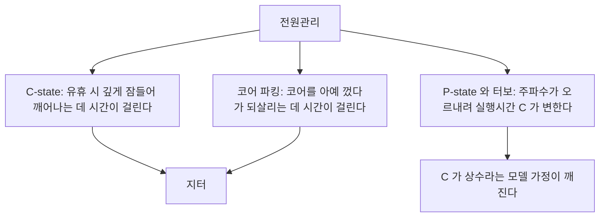
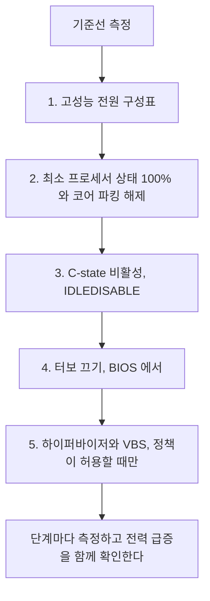

> **기준 출처:** [Microsoft Learn Processor power management options](https://learn.microsoft.com/en-us/windows-hardware/design/device-experiences/processor-power-management-options) · [Configure processor power management](https://learn.microsoft.com/en-us/windows-hardware/customize/power-settings/configure-processor-power-management-options) · 실측 환경: Windows 10 Pro 19045 / 측정일 2026-08-07
> **시리즈:** [목차](/posts/00-rtos-series/) | 이전 → [06. MMCSS](/posts/06-mmcss-multimedia-scheduler/) | 다음 → [08. 페이징과 메모리 잠금](/posts/08-paging-memory-locking/)

## 1. 실측 환경의 상태부터

```text
2026-08-07 실측
  활성 전원 구성표   : 균형 조정 (381b4222-f694-41f0-9685-ff5bb260df2e)
  CPU               : 노트북용 저전력(U) 계열, 물리 4 코어 / 논리 8 스레드
  MaxClockSpeed     : 2,304 MHz
  CurrentClockSpeed : 1,803 MHz     <- 측정 순간 부하 30% 인데 최대치가 아니다
  하이퍼바이저 존재  : True
  VBS 실행 상태     : 2 (실행 중)
```

세 가지가 한눈에 보인다. 전원 구성표가 균형 조정이라 실시간 용도로는 부적합한 기본값이다. 현재 클럭이 최대보다 낮아 주파수가 부하에 따라 오르내리고, 같은 코드의 실행시간이 매번 달라진다는 뜻이다. 그리고 VBS와 하이퍼바이저가 켜져 있다. [05편](/posts/05-dpc-isr-latency/)에서 제어 PC에서는 끈다고 한 항목이다.

일반 업무용 노트북이니 당연한 구성이다. 다만 [03편](/posts/03-thread-priority-in-practice/)의 실측이 이 조건에서 나온 값이라는 점은 기억해야 한다. 제어 전용으로 튜닝한 PC라면 더 좋은 값이 나올 것이다.

## 2. 전원관리가 실시간에 주는 세 가지 피해



| 항목 | 전형적 지연 크기 |
| --- | --- |
| C1 복귀 | 약 1 µs |
| C3 복귀 | 수십 µs |
| C6 이상 복귀 | 수백 µs |
| P-state 전환 | 수십 µs |
| 코어 언파킹 | 수백 µs에서 ms |

코어 파킹이 특히 까다롭다. 부하가 낮으면 윈도우가 코어를 통째로 재워 두고 갑자기 일이 생기면 깨운다. 1 kHz 루프가 코어 하나만 쓰고 있으면 나머지 코어가 파킹되고, 어떤 이벤트로 그 코어들이 깨어날 때 시스템 전체가 흔들린다.

## 3. 무엇을 어떻게 바꾸나

전원 구성표를 고성능으로 바꾸는 것이 첫 단계다.

```powershell
# 사용 가능한 구성표
powercfg /list

# 고성능으로 전환
powercfg /setactive SCHEME_MIN          # 고성능
# 또는 궁극의 성능, 있는 경우
powercfg /setactive e9a42b02-d5df-448d-aa00-03f14749eb61

# 최고 성능 구성표를 만든다, 없으면
powercfg -duplicatescheme e9a42b02-d5df-448d-aa00-03f14749eb61
```

다음으로 프로세서 상태를 고정한다.

```powershell
# 최소 프로세서 상태를 100% 로, 곧 항상 최대 주파수
powercfg /setacvalueindex SCHEME_CURRENT SUB_PROCESSOR PROCTHROTTLEMIN 100
powercfg /setacvalueindex SCHEME_CURRENT SUB_PROCESSOR PROCTHROTTLEMAX 100

# 코어 파킹 비활성, 최소 파킹 코어 100%
powercfg /setacvalueindex SCHEME_CURRENT SUB_PROCESSOR CPMINCORES 100

# 유휴 상태(C-state) 비활성
powercfg /setacvalueindex SCHEME_CURRENT SUB_PROCESSOR IDLEDISABLE 1

powercfg /setactive SCHEME_CURRENT       # 적용하려면 이 줄이 필요하다
```

`powercfg /setactive SCHEME_CURRENT`를 빼먹는 실수가 흔하다. `setacvalueindex`는 설정만 바꾸고 적용하지 않는다. 마지막에 활성화를 다시 해야 반영된다.

| 설정 | 효과 | 대가 |
| --- | --- | --- |
| `PROCTHROTTLEMIN 100` | 주파수를 고정한다 | 전력과 발열이 늘어난다 |
| `CPMINCORES 100` | 코어 파킹이 없어진다 | 전력이 늘어난다 |
| `IDLEDISABLE 1` | C-state 진입을 금지한다 | 전력이 크게 늘어난다. 리눅스 `idle=poll`과 같다 |

터보 부스트는 일부 시스템에서 `PERFBOOSTMODE`로 제어할 수 있고 안 되면 BIOS에서 끈다. 터보를 끄는 것이 반직관적이지만 옳다. 터보는 온도와 전력 여유에 따라 주파수를 바꾸므로 장비가 데워지면 같은 코드가 느려진다. [WCET](/posts/13-wcet-execution-budget/) 측정을 차가운 상태에서 하고 뜨거운 상태에서 운용하면 예산을 넘긴다. 최고 성능보다 일정한 성능이 중요하다.

하이퍼바이저와 VBS도 항목에 든다. 실측 환경에서 켜져 있던 것들이다.

```powershell
# 확인
Get-CimInstance -Namespace root\Microsoft\Windows\DeviceGuard -ClassName Win32_DeviceGuard |
    Select-Object VirtualizationBasedSecurityStatus     # 2 는 실행 중이다
(Get-ComputerInfo -Property HyperVisorPresent).HyperVisorPresent

# 하이퍼바이저 끄기, 재부팅이 필요하다
bcdedit /set hypervisorlaunchtype off

# 메모리 무결성(HVCI) 은 설정 앱에서 끈다
#   Windows 보안, 장치 보안, 코어 격리, 메모리 무결성
```

가상화가 켜져 있으면 모든 것이 한 겹 아래에서 돈다. 인터럽트와 메모리 접근이 하이퍼바이저를 거치고 VM exit가 예측 불가한 지연을 만들어 실시간 성능에 명확히 불리하다.

그런데 이것은 보안 기능이다. 회사 정책으로 강제되는 경우가 많고 함부로 끄면 안 된다. 실시간이 필요한 PC는 처음부터 그 목적으로 별도 구성하고 보안 요구와의 조정은 담당자와 상의한다. 일반 업무 PC에서는 끄지 않는다.

## 4. 실제로 적용됐는지 확인한다

```powershell
# 현재 구성표와 프로세서 설정 덤프
powercfg /getactivescheme
powercfg /q SCHEME_CURRENT SUB_PROCESSOR

# 실제 클럭이 최대에 붙어 있는지, 부하 없이 측정한다
1..5 | ForEach-Object {
    (Get-CimInstance Win32_Processor | Select-Object -ExpandProperty CurrentClockSpeed)
    Start-Sleep -Milliseconds 500
}

# 파킹된 코어가 있는지는 리소스 모니터의 CPU 그래프에서 주차됨 표시로 확인한다
powercfg /energy /duration 60      # 60초 분석 후 HTML 보고서
```

`powercfg /energy`가 유용하다. 60초 동안 시스템을 관찰해 전원관리 관련 문제를 HTML 보고서로 정리해 준다. 이 장치가 절전을 방해한다거나 타이머 해상도가 올라가 있다는 항목이 나오는데, 실시간 관점에서는 그 경고들이 오히려 원하는 상태인 경우가 많다.

## 5. 노트북에서 특히 조심할 것

실측 환경도 노트북용 저전력 계열이다.

| 항목 | 문제 |
| --- | --- |
| U나 Y 계열 CPU | 기본 클럭이 낮고 터보 의존도가 커서 주파수 변동 폭이 크다 |
| 발열 제한 (thermal throttling) | 오래 돌리면 주파수가 떨어져 측정 초반과 후반이 다르다 |
| 배터리 모드 | 전원 구성표가 자동으로 바뀐다 |
| 팬 제어 SMI | [SMI](/posts/11-jitter-sources/)의 흔한 원인이다 |

노트북에서 잰 실시간 성능은 데스크톱이나 산업용 PC와 다르다. [03편](/posts/03-thread-priority-in-practice/)의 실측도 이 한계를 안고 있다. 실제 장비 선정은 그 장비에서 재야 한다. [리눅스 09편](/posts/09-latency-measurement-cyclictest/)에서도 반복한 말이다.

그리고 오래 재야 한다. 발열 제한은 장비가 데워진 뒤에 나타나므로 3분 측정과 3시간 측정이 다르다.

## 6. 튜닝 순서와 대가



| 설정 | 얻는 것 | 잃는 것 |
| --- | --- | --- |
| 고성능 구성표 | 주파수가 안정된다 | 전력 |
| 코어 파킹 해제 | 언파킹 지연이 사라진다 | 전력 |
| C-state 비활성 | 복귀 지연이 사라진다 | 전력과 발열이 크게 늘어난다 |
| 터보 끄기 | 실행시간이 일정해진다 | 최대 성능이 줄어든다 |
| 하이퍼바이저 끄기 | 가상화 오버헤드가 사라진다 | 보안 기능을 잃는다 |

[리눅스 12편](/posts/12-what-breaks-realtime/)과 같은 원칙이다. 한 번에 하나씩 바꾸고 매번 측정하고 효과 없으면 되돌리고 무엇을 왜 켰는지 기록한다. 특히 여기서는 대가가 전력과 발열과 보안으로 눈에 보인다. 근거 없이 다 꺼 두면 나중에 아무도 되돌릴 판단을 하지 못한다.

## 정리

- 실측 환경은 균형 조정 구성표에 현재 클럭 1,803 대 최대 2,304 MHz, VBS 실행 중, 하이퍼바이저 존재였다.
- 전원관리의 세 가지 피해는 C-state 복귀, 주파수 변동으로 $C$가 변하는 것, 코어 언파킹이다.
- 대응 순서는 고성능 구성표, 최소 프로세서 상태 100%, 코어 파킹 해제, `IDLEDISABLE`, 터보 끄기다.
- `powercfg /setactive SCHEME_CURRENT`를 빼먹으면 설정이 적용되지 않는다.
- 하이퍼바이저와 VBS는 실시간에 불리하지만 보안 기능이다. 일반 업무 PC에서 끄지 않는다.
- 터보를 끄는 것이 옳다. 최고 성능보다 일정한 성능이고 발열에 따라 WCET가 변하는 것을 막는다.
- 노트북용 저전력 계열은 주파수 변동 폭이 크고 발열 제한이 있다. 실제 장비에서 오래 재야 한다.
- 각 설정의 대가가 전력과 성능과 보안으로 명확하다. 한 번에 하나씩 바꾸고 매번 측정하고 기록을 남긴다.

## 참고

- [Microsoft Learn — Processor power management options](https://learn.microsoft.com/en-us/windows-hardware/design/device-experiences/processor-power-management-options)
- [Microsoft Learn — Configure processor power management](https://learn.microsoft.com/en-us/windows-hardware/customize/power-settings/configure-processor-power-management-options)
- [Microsoft Learn — Virtualization-based protection of code integrity](https://learn.microsoft.com/en-us/windows/security/hardware-security/enable-virtualization-based-protection-of-code-integrity)