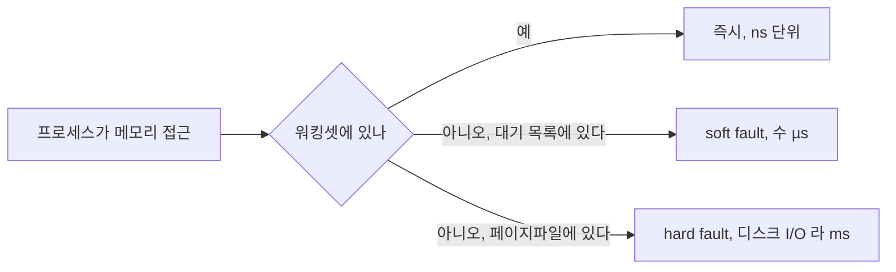
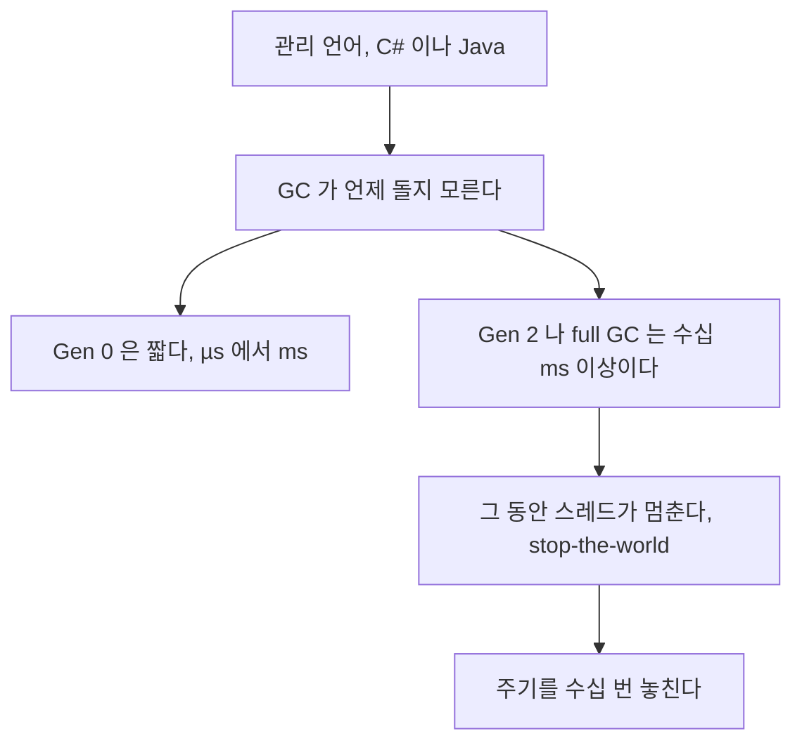

> **기준 출처:** [Microsoft Learn VirtualLock](https://learn.microsoft.com/en-us/windows/win32/api/memoryapi/nf-memoryapi-virtuallock) · [SetProcessWorkingSetSize](https://learn.microsoft.com/en-us/windows/win32/api/memoryapi/nf-memoryapi-setprocessworkingsetsize) · [Working Set](https://learn.microsoft.com/en-us/windows/win32/memory/working-set) · [.NET GC latency modes](https://learn.microsoft.com/en-us/dotnet/standard/garbage-collection/latency) / 확인일 2026-08-07
> **시리즈:** [목차](/posts/00-rtos-series/) | 이전 → [07. 전원관리와 코어 파킹](/posts/07-power-management-core-parking/) | 다음 → [09. 실시간 확장 RTX64와 INtime](/posts/09-realtime-extensions-rtx64-intime/)

## 1. 워킹셋 트리밍

[리눅스 06편](/posts/06-lock-memory-mlockall/)과 같은 문제가 윈도우에도 있고 이름만 다르다. 워킹셋은 프로세스가 지금 물리 메모리에 갖고 있는 페이지들이고, 트리밍은 메모리가 부족하거나 프로세스가 한동안 놀면 윈도우가 그 페이지를 회수하는 것이다.



| 증상 | 원인 |
| --- | --- |
| 처음 몇 초만 튄다 | 첫 접근 시 페이지를 붙인다 |
| 한동안 안 쓰다가 다시 쓰면 튄다 | 워킹셋 트리밍으로 회수됐다 |
| 메모리 부족할 때만 튄다 | 시스템 전체가 압박을 받는다 |

## 2. 대응 세 가지

`VirtualLock`으로 페이지를 물리 메모리에 고정한다.

```c
#include <windows.h>

/* 잠글 수 있는 최대 크기를 먼저 늘린다. 기본값이 작다 */
SIZE_T minWS = 64 * 1024 * 1024;      /* 64 MB */
SIZE_T maxWS = 256 * 1024 * 1024;
SetProcessWorkingSetSize(GetCurrentProcess(), minWS, maxWS);

/* 실제로 잠근다 */
void *buf = VirtualAlloc(NULL, SIZE, MEM_COMMIT | MEM_RESERVE, PAGE_READWRITE);
if (!VirtualLock(buf, SIZE)) {
    printf("VirtualLock 실패: %lu\n", GetLastError());   /* 실패 확인이 필수다 */
}
memset(buf, 0, SIZE);                  /* 실제로 건드려 페이지를 붙인다 */
```

`VirtualLock`은 리눅스 `mlockall`보다 제약이 많다. 전체를 한 번에 잠그는 API가 없어서 `mlockall(MCL_FUTURE)` 같은 것을 쓸 수 없고 영역마다 불러야 한다. 잠글 수 있는 양이 워킹셋 최대치에 묶여 있어 `SetProcessWorkingSetSize`로 먼저 올려야 한다. 그리고 스택과 힙과 코드 영역을 다 잠그려면 손이 많이 간다.

그래서 실무에서는 필요한 버퍼를 미리 할당하고 건드려 두는 것만으로 대부분 해결하고 `VirtualLock`은 특히 중요한 버퍼에만 쓴다.

워킹셋 최소 크기를 확보하는 방법도 있다.

```c
/* 최소 워킹셋을 크게 잡으면 트리밍 대상에서 어느 정도 보호된다 */
SetProcessWorkingSetSizeEx(GetCurrentProcess(),
                           64 * 1024 * 1024,     /* min */
                           256 * 1024 * 1024,    /* max */
                           QUOTA_LIMITS_HARDWS_MIN_ENABLE);  /* min 을 강제한다 */
```

그리고 프리폴트로 미리 건드려 둔다.

```c
/* 루프에 들어가기 전에 쓸 메모리를 전부 한 번씩 만진다 */
static void prefault(void *p, size_t n)
{
    volatile unsigned char *q = (volatile unsigned char *)p;
    for (size_t i = 0; i < n; i += 4096)   /* 페이지 단위 */
        q[i] = q[i];
}

/* 스택도 마찬가지다 */
static void prefault_stack(void)
{
    volatile unsigned char dummy[512 * 1024];
    memset((void *)dummy, 0, sizeof(dummy));
}
```

페이지파일 쪽은 리눅스와 판단이 다르다.

```powershell
# 페이지파일 위치와 크기 확인
Get-CimInstance Win32_PageFileUsage | Select-Object Name, AllocatedBaseSize, CurrentUsage
```

리눅스에서 스왑을 끄는 것과 달리 윈도우에서 페이지파일을 끄는 것은 권장되지 않는다. 일부 기능이 페이지파일을 전제로 하고 메모리 부족 시 복구 여지가 사라진다. 메모리를 넉넉히 확보해서 쓸 일이 없게 만드는 쪽이 낫다.

## 3. 폴트가 실제로 0인지 확인한다

```c
#include <psapi.h>          /* psapi.lib */

void print_faults(const char *tag)
{
    PROCESS_MEMORY_COUNTERS pmc;
    GetProcessMemoryInfo(GetCurrentProcess(), &pmc, sizeof(pmc));
    printf("%s: PageFaultCount=%lu  WorkingSet=%zu KB\n",
           tag, pmc.PageFaultCount, pmc.WorkingSetSize / 1024);
}

/* 루프 전후로 비교한다. 두 값이 같아야 한다 */
```

```powershell
# 명령줄로도 볼 수 있다
Get-Counter '\Process(control_app)\Page Faults/sec' -SampleInterval 1 -MaxSamples 10
# 루프 중에 0 이어야 한다
```

리눅스 06편과 판정 기준이 같다. 루프 중 페이지 폴트 증가가 0이어야 하고, 이것만 확인해도 초반 스파이크와 가끔 크게 튀는 현상의 상당 부분이 사라진다.

## 4. C#과 .NET으로 실시간을 하면

윈도우에서 제어 응용을 C#으로 짜는 경우가 많다. GC가 새로운 문제를 만든다.



| 대응 | 방법 |
| --- | --- |
| 할당을 없앤다 | 루프 안에서 `new`를 하지 않는다. 객체 풀과 `Span<T>`와 `stackalloc`을 쓴다 |
| GC 지연 모드 | `GCSettings.LatencyMode = GCLatencyMode.SustainedLowLatency` |
| `TryStartNoGCRegion` | 지정한 크기만큼은 GC 없이 실행을 보장한다 |
| 서버 GC와 백그라운드 GC 설정 | `<gcServer>`와 `<gcConcurrent>`를 조정한다 |
| 아예 안 쓴다 | 실시간 루프는 C나 C++로, C#은 UI와 통신만 맡는다 |

```csharp
// GC 를 잠시 막는다. 그 안에서 할당한 총량이 넘으면 예외가 난다
if (GCSettings.LatencyMode != GCLatencyMode.NoGCRegion) {
    try {
        GC.TryStartNoGCRegion(64 * 1024 * 1024);   // 64 MB 한도
        RunControlLoop();
    } finally {
        if (GCSettings.LatencyMode == GCLatencyMode.NoGCRegion)
            GC.EndNoGCRegion();
    }
}
```

가장 확실한 답은 실시간 루프를 관리 언어로 짜지 않는 것이다. C#은 HMI와 통신과 기록에 쓰고 제어 루프는 C나 C++ 네이티브 DLL로 분리한다. GC를 억지로 막는 것은 할당 한도를 넘는 순간 원래대로 돌아가므로 근본 해결이 아니다.

그리고 `TryStartNoGCRegion`이 성공했다고 안심하면 안 된다. 한도를 넘으면 조용히 GC가 돌아오므로 할당량을 직접 감시해야 한다.

## 5. 그 밖의 메모리 관련 함정

| 함정 | 내용 |
| --- | --- |
| `malloc`이나 `new`를 루프에서 부른다 | [이론 12편](/posts/12-context-switch-cache-memory/)과 같다. 힙 락에 상한이 없다 |
| 로그 문자열 조합 | `sprintf`와 `std::string`이 할당한다 |
| STL 컨테이너 삽입 | `push_back`이 재할당한다. `reserve`를 미리 한다 |
| 대용량 페이지 | TLB 미스를 줄이지만 `SeLockMemoryPrivilege` 권한이 필요하다 |
| 메모리 압축 (Windows 10 이후) | 압축과 해제가 지연을 만든다. 메모리 여유 확보로 회피한다 |
| 백신 실시간 검사 | 파일 접근마다 개입한다. 제어 PC에서는 예외 처리하거나 비활성화한다 |

## 6. 리눅스와 비교

| | 리눅스 | 윈도우 |
| --- | --- | --- |
| 전체 잠금 | `mlockall(MCL_CURRENT\|MCL_FUTURE)` 한 줄 | 없다. 영역마다 `VirtualLock`을 부른다 |
| 권한 | `RLIMIT_MEMLOCK`이나 `CAP_IPC_LOCK` | 워킹셋 최대치와 `SeLockMemoryPrivilege` |
| 스왑 | `swapoff -a`로 간단히 끈다 | 페이지파일 끄기는 권장되지 않는다 |
| 힙 반납 제어 | `mallopt(M_TRIM_THRESHOLD, -1)` | 표준 방법이 없다 |
| 확인 | `getrusage`의 `minflt`와 `majflt` | `GetProcessMemoryInfo`의 `PageFaultCount` |

리눅스 쪽이 도구가 깔끔하다. 윈도우에서는 미리 할당하고 미리 건드려 둔다는 원칙을 손으로 더 꼼꼼히 지켜야 한다. 대신 원칙 자체는 완전히 같다.

## 정리

- 윈도우판 페이지 폴트 문제는 워킹셋 트리밍이다. 안 쓰는 페이지를 회수한다.
- 대응은 `VirtualLock`과 `SetProcessWorkingSetSizeEx`로 min을 강제하는 것과 프리폴트 셋이다.
- `VirtualLock`은 `mlockall`보다 제약이 많다. 전체 잠금 API가 없고 영역마다 불러야 한다.
- 페이지파일을 끄는 것은 권장되지 않는다. 메모리를 넉넉히 확보해 쓸 일이 없게 만든다.
- 확인은 `GetProcessMemoryInfo`의 `PageFaultCount`가 루프 중에 늘지 않는지로 한다.
- C#과 .NET은 GC가 새 문제를 만든다. full GC는 수십 ms라 주기를 수십 번 놓친다.
- 가장 확실한 답은 실시간 루프를 관리 언어로 짜지 않는 것이다. C#은 HMI와 통신에 쓴다.
- `TryStartNoGCRegion`은 한도를 넘으면 조용히 원래대로 돌아가므로 감시가 필요하다.
- 함정은 로그 문자열 조합, STL 재할당, 메모리 압축, 백신 실시간 검사다.
- 리눅스보다 도구가 불편하지만 원칙은 같다. 미리 할당하고 미리 건드려 둔다.

## 참고

- [Microsoft Learn — VirtualLock](https://learn.microsoft.com/en-us/windows/win32/api/memoryapi/nf-memoryapi-virtuallock)
- [Microsoft Learn — SetProcessWorkingSetSize](https://learn.microsoft.com/en-us/windows/win32/api/memoryapi/nf-memoryapi-setprocessworkingsetsize)
- [Microsoft Learn — Working Set](https://learn.microsoft.com/en-us/windows/win32/memory/working-set)
- [Microsoft Learn — .NET GC latency modes](https://learn.microsoft.com/en-us/dotnet/standard/garbage-collection/latency)