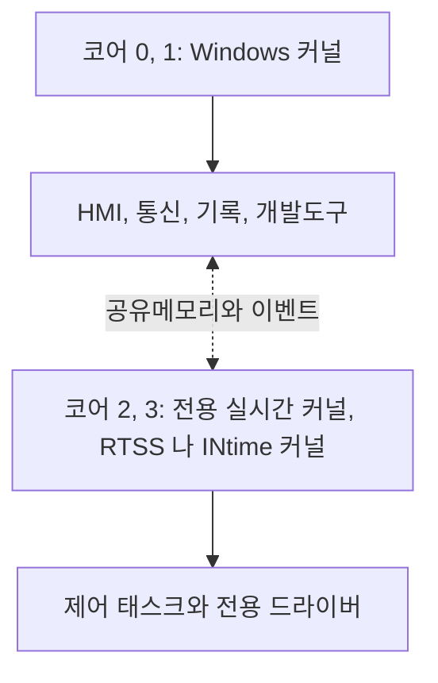
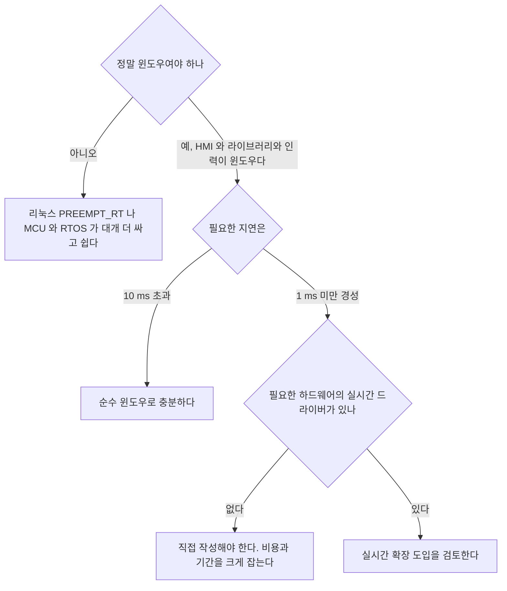

> **기준 출처:** [IntervalZero RTX64](https://www.intervalzero.com/products/rtx64/) · [TenAsys INtime](https://www.tenasys.com/intime/) · [Kithara RealTime Suite](https://kithara.com/en/products/realtime-suite) / 확인일 2026-08-07
> **시리즈:** [목차](/posts/00-rtos-series/) | 이전 → [08. 페이징과 메모리 잠금](/posts/08-paging-memory-locking/) | 다음 → [10. TwinCAT](/posts/10-twincat-industrial-control/)

상용 제품이라 세부 사양은 벤더 문서를 확인해야 한다. 여기서는 공통된 구조와 발상만 정리한다. 구체적 성능 수치는 벤더가 자사 조건에서 낸 값이므로 인용하지 않는다.

## 1. 윈도우를 고치지 않고 코어를 뺏는다

[05편](/posts/05-dpc-isr-latency/)의 결론은 응용이 할 수 있는 일이 없다는 것이었다. DPC와 ISR 층은 커널 안에 있고 사용자에게 닫혀 있다. 그러면 커널 밖에서 해결한다. 코어 하나를 윈도우 커널이 못 건드리게 떼어내고 거기에 별도의 실시간 커널을 올린다.

| | 윈도우 쪽 | 실시간 쪽 |
| --- | --- | --- |
| 스케줄러 | 윈도우 | 전용 실시간 스케줄러 |
| 인터럽트 | 윈도우가 처리한다 | 실시간 커널이 직접 받는다 |
| 드라이버 | 윈도우 드라이버 | 전용 드라이버를 따로 써야 한다 |
| 지연 | 수백 µs에서 ms | µs급 |

[리눅스의 Xenomai 듀얼 커널](/posts/14-xenomai-dual-kernel/)과 정확히 같은 발상이다. 차이는 리눅스에는 PREEMPT_RT라는 단일 커널 대안이 있고 윈도우에는 없다는 것이다. 그래서 윈도우 쪽에서는 이 방식이 선택이 아니라 사실상 유일한 답이다.

## 2. 제품별 성격

| | RTX64 (IntervalZero) | INtime (TenAsys) | Kithara RealTime Suite |
| --- | --- | --- | --- |
| 방식 | 코어 분리와 RTSS 서브시스템 | 코어 분리와 INtime 커널 | 커널 드라이버 기반 |
| 프로그래밍 | Win32 유사 API (RTAPI) | 자체 API와 Win32 유사 API | 일반 윈도우 앱에서 호출한다 |
| 개발 환경 | Visual Studio | Visual Studio | Visual Studio |
| 필드버스 | EtherCAT 마스터 옵션 | EtherCAT 등 | EtherCAT 등 |
| 특징 | 다코어 할당, 64비트 | 실시간 커널이 독립적이다 | 도입이 상대적으로 가볍다 |

공통점이 더 중요하다. 코어를 윈도우에서 빼거나 인터럽트를 가로채고, 전용 API로 실시간 태스크를 만들고, 하드웨어 접근에 전용 드라이버가 필요해 윈도우 드라이버를 못 쓰고, 윈도우 쪽과는 공유메모리와 이벤트로 통신하고, 상용 라이선스라 개발과 런타임 비용이 든다.

## 3. 코드가 어떻게 갈리나

설계 원칙은 [이론 02편](/posts/02-hard-soft-firm-realtime/)의 등급 분리와 정확히 같다.

| 무엇 | 어디에 |
| --- | --- |
| 주기 제어 루프, 필드버스 사이클, 안전 감시 | 실시간 쪽 |
| HMI, 로깅, 파일 저장, 네트워크, 데이터베이스 | 윈도우 쪽 |
| 궤적 계획, 파라미터 계산 | 주기와 데드라인에 따라 판단한다 |

실시간 쪽에서 윈도우 API를 부르면 안 된다. `printf`와 파일 I/O와 `malloc`은 물론이고 윈도우 커널을 거치는 모든 호출이 실시간성을 깨뜨린다. Xenomai의 [모드 전환 함정](/posts/14-xenomai-dual-kernel/)과 같은 문제이고 제품마다 이를 감지하는 수단을 제공한다. 그 감지 기능을 반드시 켜고 개발한다.

## 4. 도입을 검토할 때 확인할 것

| 확인 항목 | 왜 |
| --- | --- |
| 필요한 I/O 카드와 NIC의 실시간 드라이버 유무 | 없으면 직접 만들어야 한다. 가장 큰 위험 요소다 |
| 라이선스 비용, 개발과 런타임을 대수만큼 | 대량 생산이면 대당 비용이 누적된다 |
| 윈도우 버전 지원 범위 | OS 업그레이드 시 재검증이 필요하다 |
| 코어 배분 | 실시간에 몇 코어를 줄 것인가. 윈도우 쪽이 느려진다 |
| 디버깅 도구 | 실시간 쪽 디버깅이 어렵다 |
| 인력과 학습 곡선 | 전용 API를 배워야 한다 |

가장 자주 발목을 잡는 것은 드라이버다. 쓰는 프레임그래버와 모션카드와 NIC이 실시간 쪽에서 지원되는지를 도입 전에 확인해야 한다. 지원 목록에 없으면 직접 작성해야 하고 그것은 별도의 프로젝트다.

## 5. 대안과 비교

| 방법 | 지연 | 비용 | 난이도 | 언제 |
| --- | --- | --- | --- | --- |
| 순수 윈도우 튜닝 | 수백 µs에서 ms | 0 | 낮다 | 준경성 10 ms 이상 |
| 실시간 확장 | µs | 높다 | 중간이다 | 윈도우가 필수이고 경성이 필요할 때 |
| 리눅스 PREEMPT_RT | 수십 µs | 0 | 중간이다 | 윈도우가 필수가 아닐 때 |
| MCU와 RTOS로 분리 | µs | 하드웨어 비용 | 중간이다 | µs급이 필요할 때 |
| 산업용 컨트롤러, PLC나 모션 | 보장된다 | 높다 | 낮다 | 표준 응용 |

가장 먼저 물어야 할 질문은 이 일을 정말 이 PC에서 해야 하는가다. µs급 제어를 PC에서 하려고 상용 실시간 확장을 사는 것보다 그 일을 MCU나 전용 모션 컨트롤러로 내리고 PC는 상위 지령만 담당하게 하는 편이 대개 더 싸고 안전하고 검증하기 쉽다.

실시간 확장이 정당화되는 것은 PC의 연산 능력과 라이브러리가 실시간 경로에 반드시 필요한 경우다. 실시간 루프 안에서 무거운 최적화나 비전 처리를 해야 하는 경우가 그렇다.

## 정리

- 발상은 윈도우를 고치는 대신 코어를 윈도우 커널에서 떼어내고 전용 실시간 커널을 올리는 것이다.
- 리눅스 Xenomai와 같은 듀얼 커널 구조다. 차이는 윈도우에 PREEMPT_RT 같은 단일 커널 대안이 없다는 점이고 그래서 사실상 유일한 답이다.
- 제품은 RTX64와 INtime과 Kithara다. 세부는 다르지만 구조는 같다.
- 공통 특징은 코어 분리, 전용 API, 전용 드라이버 필요, 공유메모리 통신, 상용 라이선스 다섯이다.
- 코드 분리 원칙은 이론 02편의 등급 분리와 같다. 제어와 필드버스는 실시간 쪽, HMI와 로깅은 윈도우 쪽이다.
- 실시간 쪽에서 윈도우 API를 부르면 실시간성이 깨진다. 감지 기능을 켜고 개발한다.
- 도입 시 가장 큰 위험은 드라이버다. 쓰는 하드웨어가 지원 목록에 있는지 먼저 확인한다.
- 먼저 물을 것은 이 일을 정말 이 PC에서 해야 하는가다. MCU로 내리는 편이 대개 더 싸고 안전하다.

## 참고

- [IntervalZero — RTX64](https://www.intervalzero.com/products/rtx64/)
- [TenAsys — INtime](https://www.tenasys.com/intime/)
- [Kithara — RealTime Suite](https://kithara.com/en/products/realtime-suite)
- [Microsoft Learn — Managing Hardware Priorities](https://learn.microsoft.com/en-us/windows-hardware/drivers/kernel/managing-hardware-priorities)