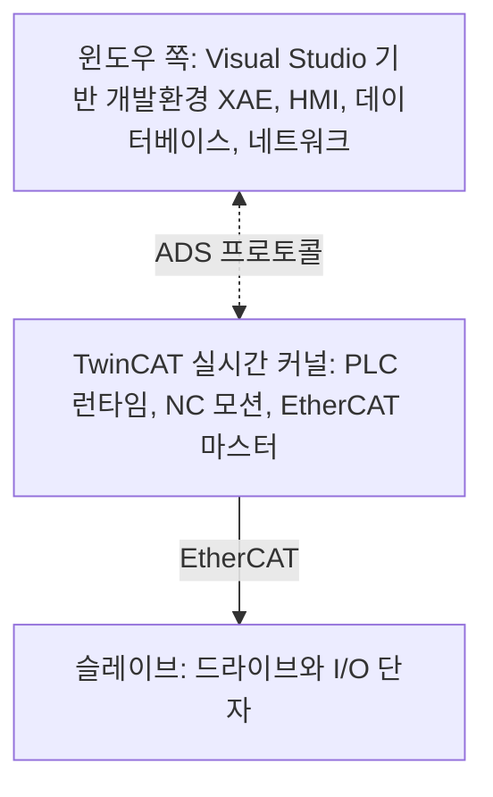
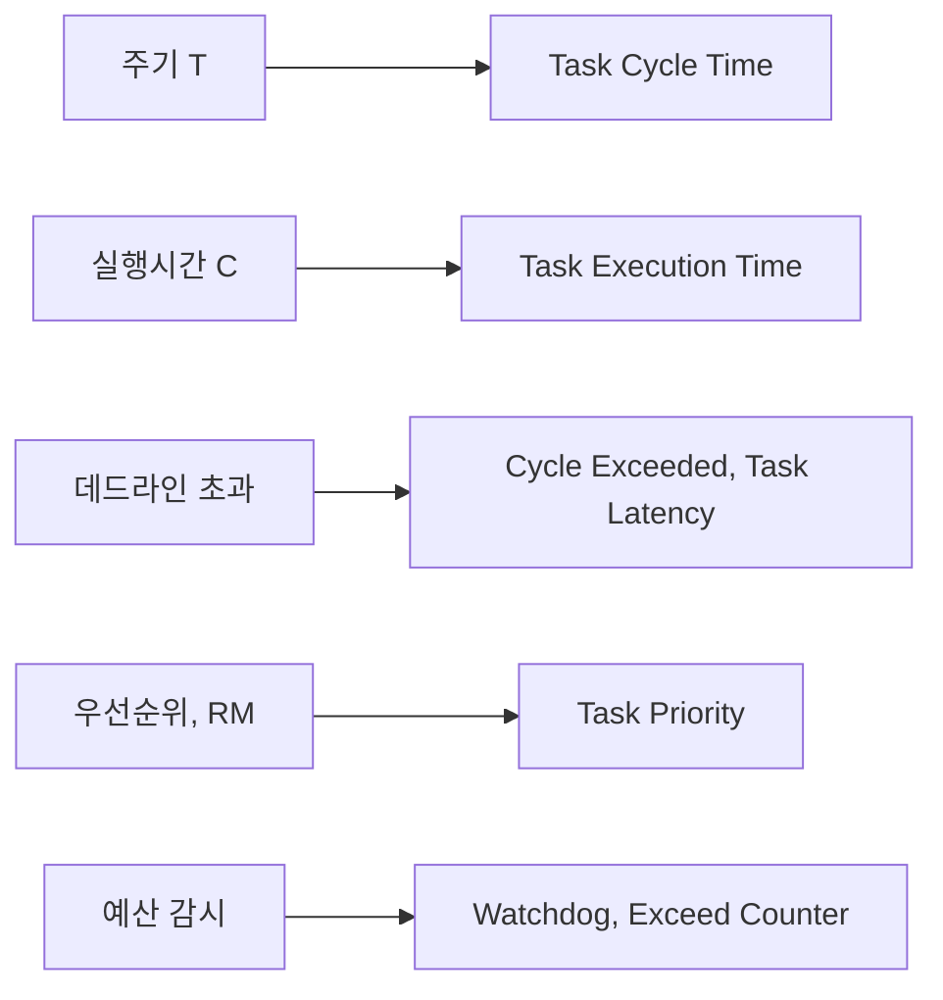

> **기준 출처:** [Beckhoff TwinCAT 제품 페이지](https://www.beckhoff.com/en-en/products/automation/twincat/) · [Beckhoff Information System](https://infosys.beckhoff.com/) · [ETG EtherCAT Technology](https://www.ethercat.org/en/technology.html) · IEC 61131-3 / 확인일 2026-08-07
> **시리즈:** [목차](/posts/00-rtos-series/) | 이전 → [09. 실시간 확장](/posts/09-realtime-extensions-rtx64-intime/) | 다음 → [11. 윈도우, 리눅스, MCU 선택 기준](/posts/11-windows-linux-mcu-selection/)

상용 제품이라 여기서는 공개 문서로 확인되는 구조와 개념만 정리한다.

## 1. 이 제품이 여기 나오는 이유

[09편](/posts/09-realtime-extensions-rtx64-intime/)의 코어를 뺏는다는 발상을 산업 자동화 전체 스택으로 완성한 것이 TwinCAT이고, 실제 현장에서 가장 널리 쓰이는 형태이기도 하다.

| 층 | 무엇 |
| --- | --- |
| 실시간 커널 | 코어를 분리해 그 위에서 PLC와 모션과 필드버스를 돌린다 |
| PLC 런타임 | IEC 61131-3, 곧 ST와 LD와 FBD 등, 또는 C++ |
| NC와 모션 | 축 제어와 보간과 캠 |
| EtherCAT 마스터 | 사이클 통신 |
| XAE 개발환경 | Visual Studio 안에서 전부 개발하고 디버깅한다 |
| ADS | 윈도우 쪽 응용과 실시간 쪽 사이의 통신 프로토콜 |

## 2. 무엇이 잘 풀렸나

| | 내용 |
| --- | --- |
| 개발환경 통합 | Visual Studio 안에서 PLC와 모션과 C++을 같이 개발하고 디버깅한다 |
| 드라이버 문제가 없다 | [09편](/posts/09-realtime-extensions-rtx64-intime/)의 최대 위험인 전용 드라이버가 EtherCAT으로 해결된다 |
| 표준 언어 | IEC 61131-3은 자동화 인력이 이미 아는 언어다 |
| 모션 라이브러리 | 보간과 캠과 기어링이 검증된 형태로 제공된다 |
| 진단 | 사이클 시간과 지터와 EtherCAT 상태를 도구가 보여 준다 |

두 번째 항목이 구조적으로 중요하다. RTX64와 INtime 도입의 최대 난관은 우리 I/O 카드의 실시간 드라이버가 없다는 것이었다. TwinCAT은 I/O를 PC 슬롯이 아니라 EtherCAT 슬레이브로 밀어냄으로써 그 문제 자체를 없앴다. PC 안에 있는 실시간 하드웨어는 랜카드 하나뿐이면 된다.

이 발상은 TwinCAT이 아니어도 쓸 수 있다. 리눅스와 SOEM 구성도 같은 구조다([리눅스 13편](/posts/13-ethercat-master-on-linux/)). I/O를 필드버스 너머로 밀어내면 실시간 드라이버 문제가 대부분 사라진다.

## 3. 실시간 관점에서 읽으면

| 이론 개념 | 자동화 도구에서 |
| --- | --- |
| [주기 T](/posts/03-task-model-timing-params/) | 태스크마다 사이클 타임을 설정한다. 1 ms, 2 ms, 10 ms 등 |
| [RM 우선순위](/posts/05-rate-monotonic-utilization-bound/) | 주기가 짧은 태스크에 높은 우선순위. 도구가 권장하는 방식이 RM 그대로다 |
| [실행시간 예산](/posts/13-wcet-execution-budget/) | 사이클 사용률 표시와 초과 카운터 |
| [지터](/posts/11-jitter-sources/) | 사이클 지터 표시 |
| [등급 분리](/posts/02-hard-soft-firm-realtime/) | 실시간 태스크와 윈도우 프로세스의 구분 |

자동화 도구를 쓰면 이 개념들이 설정 항목으로 나타난다. 그래서 개념을 모르고도 동작은 시킬 수 있다. 문제는 동작하지 않을 때다. 사이클 초과가 뜬다거나 지터가 크다는 상황을 만났을 때 이론 편의 개념 없이는 원인을 좁힐 수 없다.

이것이 이 연재 전체의 실용적 가치다. 도구가 숫자를 보여 주는데 그 숫자가 무슨 뜻인지 아는 것이다.

## 4. 그래도 남는 제약

| 제약 | 내용 |
| --- | --- |
| 벤더 종속 | 하드웨어와 소프트웨어와 도구가 한 생태계에 묶인다 |
| 라이선스 | 개발과 런타임 비용이 든다 |
| 윈도우 위 | 구성에 따라 윈도우 쪽이 죽으면 실시간 쪽도 영향을 받는다 |
| µs급 한계 | 필드버스 사이클보다 빠른 전류 루프는 여전히 슬레이브 쪽 MCU가 한다 |
| 커스터마이징 | 표준 밖의 요구는 오히려 더 어렵다 |

네 번째가 짚어 둘 만하다. TwinCAT이든 무엇이든 PC 기반 마스터는 필드버스 사이클 단위로 움직이고 그 값은 보통 0.25에서 4 ms다. 그보다 빠른 전류 루프인 10에서 20 kHz는 드라이브 안의 MCU가 한다. [이론 16편](/posts/16-rtos-kernel-freertos-zephyr/)의 층 구조가 산업 표준 제품에서도 그대로 나타난다.

PC로 로봇을 제어한다는 말이 실제로 뜻하는 것이 이 그림이다. PC는 ms급 지령을 내리고 µs급 제어는 각 축의 드라이브가 한다. PC를 µs급으로 만들 필요가 애초에 없도록 시스템이 설계돼 있다.

## 5. 비슷한 계열

| 제품이나 방식 | 성격 |
| --- | --- |
| TwinCAT (Beckhoff) | 윈도우에 실시간 커널과 EtherCAT을 얹었다 |
| CODESYS | IEC 61131-3 런타임이다. 윈도우와 리눅스와 MCU 등 여러 플랫폼을 지원한다 |
| Simulink Real-Time (MathWorks) | 모델에서 바로 실시간 타깃으로 간다. 전용 부팅 커널을 쓴다 |
| LinuxCNC | 리눅스와 RT 커널 기반 오픈소스 모션 제어다 |
| ROS 2와 real-time | 미들웨어 층이고 실시간성은 아래 OS가 정한다 |

Simulink Real-Time은 특히 눈여겨볼 만하다. Simulink 모델을 그대로 실시간 타깃에서 돌리는 방식이고 모델 기반 설계의 검증 단계에 해당한다. MATLAB과 Simulink 도구를 다루는 쪽과 이 연재가 만나는 지점이다.

## 정리

- TwinCAT은 윈도우에 실시간 커널과 PLC 및 모션 런타임과 EtherCAT 마스터를 하나로 묶은 것이다.
- 개발환경 통합과 IEC 61131-3 표준 언어가 강점이다.
- 드라이버 문제를 구조적으로 해결했다. I/O를 PC 슬롯이 아니라 EtherCAT 너머로 밀어냈다.
- 이 발상은 리눅스와 SOEM 구성에도 그대로 적용된다.
- 이론 개념들이 설정 항목으로 나타난다. 사이클 타임, 실행시간, 우선순위, 초과 카운터가 그렇다.
- 도구를 쓰면 개념 없이 동작은 시킬 수 있고 문제가 생겼을 때 개념이 필요해진다.
- 제약은 벤더 종속과 라이선스와 윈도우 의존이고, µs급은 여전히 슬레이브 MCU의 몫이다.
- PC로 로봇을 제어한다는 것은 PC가 ms급 지령을 내리고 드라이브 MCU가 µs급 전류 루프를 도는 구조다.

## 참고

- [Beckhoff — TwinCAT](https://www.beckhoff.com/en-en/products/automation/twincat/)
- [Beckhoff Information System](https://infosys.beckhoff.com/)
- [ETG — EtherCAT Technology](https://www.ethercat.org/en/technology.html)