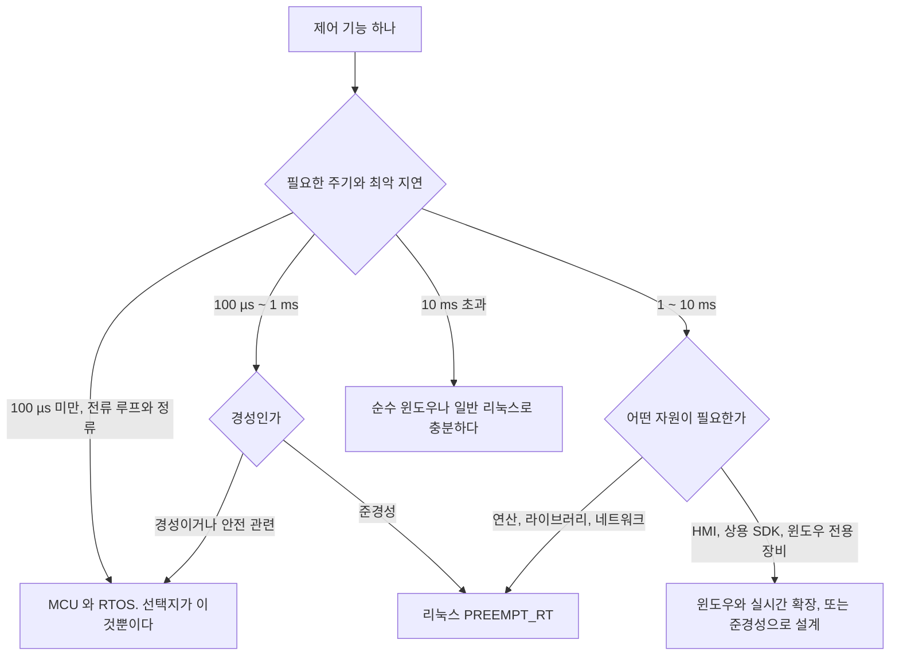
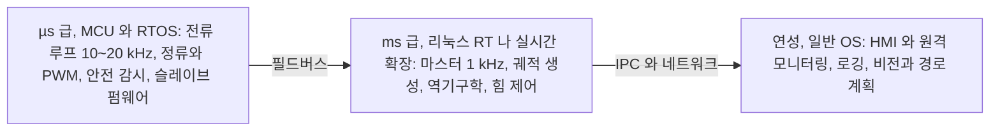
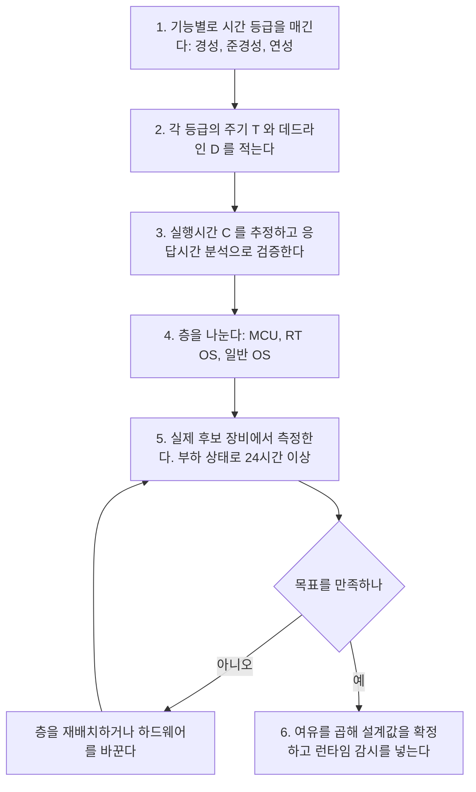

> **기준 출처:** 이 연재 전체의 종합이고 개별 근거는 각 편의 출처를 따른다. 윈도우 수치는 실측(2026-08-07)이고 리눅스 수치는 공개 문서 기준의 일반적 목표치이며 실측이 아니다.
> **시리즈:** [목차](/posts/00-rtos-series/) | 이전 → [10. TwinCAT](/posts/10-twincat-industrial-control/)

## 1. 세 환경 비교

| | 윈도우 (순수) | 윈도우와 실시간 확장 | 리눅스 PREEMPT_RT | MCU와 RTOS |
| --- | --- | --- | --- | --- |
| 최악 지연 | 수백 µs에서 ms | µs급 | 수십 µs, 목표치 | µs 이하 |
| 결정성 증명 | 불가하다 | 벤더 사양에 따른다 | 측정과 분석으로 한다 | 가능하다 |
| 커널 제어 | 불가하다 | 별도 커널을 쓴다 | 소스까지 손댈 수 있다 | 전부 손댈 수 있다 |
| 개발 편의 | 최고다 | 전용 API를 배워야 한다 | 좋다 | 낮다 |
| 라이브러리와 생태계 | 최고다 | 제한적이다 | 좋다 | 제한적이다 |
| 연산 능력 | 높다 | 높다 | 높다 | 낮다 |
| 비용 | 낮다 | 라이선스가 든다 | 0 | 하드웨어 비용이 든다 |
| 인증 | 어렵다 | 가능하다 | 어렵다 | 유리하다 |
| 부팅 시간 | 수십 초 | 수십 초 | 수 초 | ms |

## 2. 결정 흐름

## 3. 실무의 답은 고르는 것이 아니라 나누는 것

세 갈래를 지나온 결론이다.

이 시스템에 어떤 OS를 쓸까는 잘못된 질문이다. 맞는 질문은 이 기능을 어느 층에 둘까다. 그리고 [이론 02편](/posts/02-hard-soft-firm-realtime/)에서 배운 대로 하나의 시스템 안에 세 등급이 다 있다. 등급을 나누는 순간 OS 선택은 거의 자동으로 정해진다.

나눌 때의 실전 규칙이 다섯 있다.

| 규칙 | 왜 |
| --- | --- |
| 안전 기능은 가장 아래 층에 둔다 | 상위 층이 죽어도 동작해야 한다. 하드웨어 인터록이면 더 좋다 |
| 피드백 루프는 지연을 나눠 갖지 않는다 | 측정과 계산과 출력이 한 층 안에서 끝나야 한다 |
| I/O를 필드버스 너머로 밀어낸다 | 실시간 드라이버 문제가 사라진다 ([10편](/posts/10-twincat-industrial-control/)) |
| 층 간 통신은 느슨하게 한다 | 상위가 늦어도 하위가 안전하게 동작하도록 타임아웃과 마지막 값 유지를 둔다 |
| 각 층에 워치독을 둔다 | 위 층이 멈춘 것을 아래 층이 감지해야 한다 |

## 4. 상황별 권장

| 상황 | 권장 | 이유 |
| --- | --- | --- |
| 로봇 조인트 전류 제어 | MCU와 RTOS | µs급이라 선택지가 없다 |
| 필드버스 마스터 1 kHz | 리눅스 PREEMPT_RT | 무료이고 표준 API와 드라이버를 쓴다 |
| 산업 자동화 표준 응용 | TwinCAT이나 CODESYS | 검증된 스택이고 인력 확보가 쉽다 |
| 운영자 화면과 원격 | 일반 윈도우 | 개발 생산성이 높다 |
| 비전과 경로 계획 | 일반 OS, GPU 포함 | 연성이고 연산 자원이 중요하다 |
| 의료기기 안전 기능 | MCU와 인증 가능한 RTOS | 검증과 문서화가 현실적이다 |
| 연구와 프로토타이핑 | 리눅스 RT | 도구가 다 있고 비용이 0이다 |
| 이미 윈도우 자산이 많은 경우 | 실시간 확장 검토 | 재작성 비용을 비교한다 |

## 5. 판단할 때 자주 하는 실수

| 실수 | 왜 문제인가 |
| --- | --- |
| 평균으로 판단한다 | 실측에서 중앙값 0 µs, p99 3.3 µs, 최악 1,142 µs였다. 평균만 보면 좋아 보인다 |
| 짧게 측정하고 결론 낸다 | 3초 측정에서 설정이 더 좋은 조건의 최악값이 더 나쁘게 나왔다 ([03편](/posts/03-thread-priority-in-practice/)) |
| 무부하로 측정한다 | RT 커널의 가치는 부하 상태에서 나온다 ([리눅스 09편](/posts/09-latency-measurement-cyclictest/)) |
| 되더라를 근거로 삼는다 | [경성 실시간은 측정이 아니라 증명](/posts/02-hard-soft-firm-realtime/)을 요구한다 |
| 전부 경성으로 취급한다 | 개발이 끝나지 않는다 |
| 전부 연성으로 취급한다 | 언젠가 사고가 난다 |
| 개발 PC에서 잰 값을 쓴다 | 노트북과 산업용 PC는 다르다 ([07편](/posts/07-power-management-core-parking/)) |

## 6. 도입 전 체크리스트

5번을 건너뛰는 것이 가장 흔한 실패다. 벤더 자료나 남의 벤치마크로 결정하고 실제 장비에서는 다른 값이 나온다. 후보 장비를 빌려서 재 보는 비용이 나중에 시스템을 다시 만드는 비용보다 훨씬 싸다.

## 연재 전체를 마치며

41편을 세 문장으로 줄이면 이렇게 된다.

1. 실시간은 빠름이 아니라 기한 준수이고 평가하는 값은 평균이 아니라 최악값이다. 그리고 최악값은 상한을 말할 수 있어야 의미가 있다.
2. 리눅스는 그 상한을 만들 수 있다. PREEMPT_RT와 `SCHED_FIFO`와 `mlockall`과 코어 격리와 전원관리를 순서대로 하고 매번 측정하면 된다.
3. 윈도우는 평균은 좋지만 상한을 만들 수 없다. 우선순위를 최고로 올려도 최악값이 수백 µs 남고 그 층은 응용에 닫혀 있다. 그래서 코어를 뺏거나 일을 다른 층으로 내린다.

셋을 관통하는 하나는 이것이다. 시스템을 시간 등급으로 나누면 OS 선택은 거의 자동으로 정해진다.

## 정리

- 세 환경의 최악 지연은 윈도우가 수백 µs에서 ms, 리눅스 RT가 수십 µs 목표, MCU가 µs 이하다.
- 결정 흐름은 주기와 경성 여부 두 축으로 갈린다.
- 실무의 답은 고르는 것이 아니라 나누는 것이다. 어떤 OS를 쓸까가 아니라 이 기능을 어느 층에 둘까다.
- 나눌 때의 규칙은 안전은 가장 아래, 피드백 루프는 한 층 안에서, I/O는 필드버스 너머로, 각 층에 워치독이다.
- 흔한 실수는 평균으로 판단, 짧게 측정, 무부하 측정, 되더라를 근거로 삼기, 개발 PC에서 측정이다.
- 후보 장비에서 부하 상태로 24시간 이상 재 본다. 이 비용이 시스템을 다시 만드는 비용보다 싸다.

## 참고

- [Linux Foundation — Real-Time Linux](https://wiki.linuxfoundation.org/realtime/start)
- [Microsoft Learn — Scheduling](https://learn.microsoft.com/en-us/windows/win32/procthread/scheduling)
- [FreeRTOS 공식 문서](https://www.freertos.org/Documentation/00-Overview)