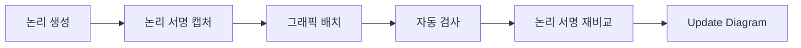
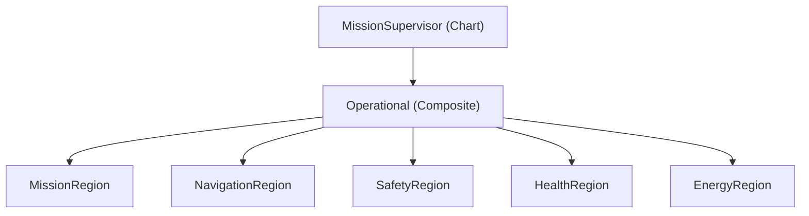

> **기준:** MATLAB R2025b / [genie4youu/amr_robot_planning](https://github.com/genie4youu/amr_robot_planning) / 확인일 2026-07-31

---

## 0. 이 연재가 다루는 문제

Stateflow 차트는 논리가 맞아도 완성이 아니다. State 계층, 정상 흐름, 예외 흐름, Transition 우선순위를 **사람이 화면에서 검토할 수 있어야** 검토가 성립한다. 배치가 엉키면 리뷰어는 차트를 읽는 대신 그림을 해독하게 된다.

[AMR 연재](/posts/00-amr-series/)에서 만든 Mission Supervisor는 State 37개, Transition 67개다. 논리를 다 짠 시점에 자동 배치된 좌표를 그대로 두었더니 검사기가 hard violation 32건을 냈다. 이 연재는 그것을 0으로 만들면서 확인한 내용을 정리한다.

| 편 | 내용 |
| --- | --- |
| [01](/posts/01-sflayout-why-graphics/) | 논리는 맞는데 못 읽는 차트 — 무엇이 위반인가 |
| [02](/posts/02-sflayout-api-coupling/) | Transition 그래픽 속성은 서로 독립이 아니다 |
| [03](/posts/03-sflayout-recursive-hierarchy/) | Region 이름을 하드코딩하지 않고 계층을 훑는 법 |
| [04](/posts/04-sflayout-page-vs-layout/) | `subviewS.pos` 는 배치 영역이 아니라 Space/Fit 페이지다 |
| [05](/posts/05-sflayout-inspector-idempotence/) | 검사기가 통과시킨 것 — 실측과 멱등성 |

## 1. 왜 API로 하는가

GUI로 드래그해서 맞출 수도 있다. 그러나 다음이 안 된다.

| 요구 | GUI | API |
| --- | --- | --- |
| 같은 규칙을 37개 State에 일관 적용 | 손으로 반복 | 한 번 정의 |
| 배치 결과를 자동 검사 | 눈으로 | 좌표를 읽어 판정 |
| State 추가 시 규칙 재적용 | 다시 손으로 | 재실행 |
| 배치 변경이 논리를 안 건드렸음을 증명 | 불가 | 논리 서명 비교 |

마지막 항목이 결정적이다. **레이아웃 작업이 실행 의미를 바꾸지 않았다는 것을 증명해야 한다.** Transition 포트 위치를 바꾸면 암시적 평가 순서가 달라질 수 있어서, Transition 개수가 같다는 것만으로는 동등성 증거가 되지 않는다.

## 2. 완료의 정의

모델 파일 하나로는 끝나지 않는다. 세 산출물이 함께 있어야 재현이 된다.

| 산출물 | 역할 |
| --- | --- |
| 레이아웃 스크립트 | 모든 State와 Transition의 그래픽 속성을 선언적으로 배치 |
| 검사기 | 겹침, 간격, 경로 교차, 페이지 활용률 판정 |
| 단위 테스트 | 재실행 가능성과 논리 보존 검증 |

레이아웃 스크립트가 그래픽 객체를 전부 다루는지 검사하고, 빠진 객체가 있으면 실패시킨다. 그러지 않으면 새로 추가한 State가 임의 좌표를 가진 채 통과한다.

## 3. 다룰 대상

Mission Supervisor의 계층은 다음과 같다. 03편에서 이 목록을 하드코딩 없이 찾아내는 방법을 다룬다.

| 경로 | 종류 | 깊이 | State | Transition |
| --- | --- | ---: | ---: | ---: |
| `MissionSupervisor` | Chart | 0 | 6 | 15 |
| `.../Operational` | Composite State | 1 | 5 | 0 |
| `.../Operational/MissionRegion` | Subchart | 2 | 9 | 18 |
| `.../Operational/NavigationRegion` | Subchart | 2 | 6 | 14 |
| `.../Operational/SafetyRegion` | Subchart | 2 | 3 | 6 |
| `.../Operational/HealthRegion` | Subchart | 2 | 3 | 6 |
| `.../Operational/EnergyRegion` | Subchart | 2 | 5 | 8 |

## ⚠️ 주의

- **이 연재는 R2025b 기준 실측이다.** Stateflow API의 그래픽 속성 동작은 릴리스마다 달라질 수 있다. 공식 문서에 명시되지 않은 결합 동작은 특히 그렇다.
- 레이아웃 규칙 자체(간격, 활용률 임계값)는 **이 프로젝트의 선택**이지 표준이 아니다. 규칙을 정하는 방법과 검증하는 방법이 옮길 만한 부분이다.

## 📌 정리

- 차트는 논리가 맞는 것만으로 완료가 아니다. 사람이 읽을 수 있어야 검토가 된다.
- API로 하는 이유는 반복 적용, 자동 검사, **논리 보존 증명** 때문이다.
- 모델 파일 하나가 아니라 레이아웃 스크립트, 검사기, 테스트 세 개가 산출물이다.

---

**시리즈:** 다음 → [01. 논리는 맞는데 못 읽는 차트](/posts/01-sflayout-why-graphics/)

## 참고

- [Overview of the Stateflow API](https://www.mathworks.com/help/stateflow/api/overview-of-the-stateflow-api.html)
- [Stateflow.Transition](https://www.mathworks.com/help/stateflow/api/stateflow.transition.html), [Stateflow.State](https://www.mathworks.com/help/stateflow/api/stateflow.state.html)
- [Refactor Charts Programmatically](https://www.mathworks.com/help/stateflow/api/refactor-stateflowcharts-using-the-api.html)
- 프로젝트 저장소 — [genie4youu/amr_robot_planning](https://github.com/genie4youu/amr_robot_planning)
