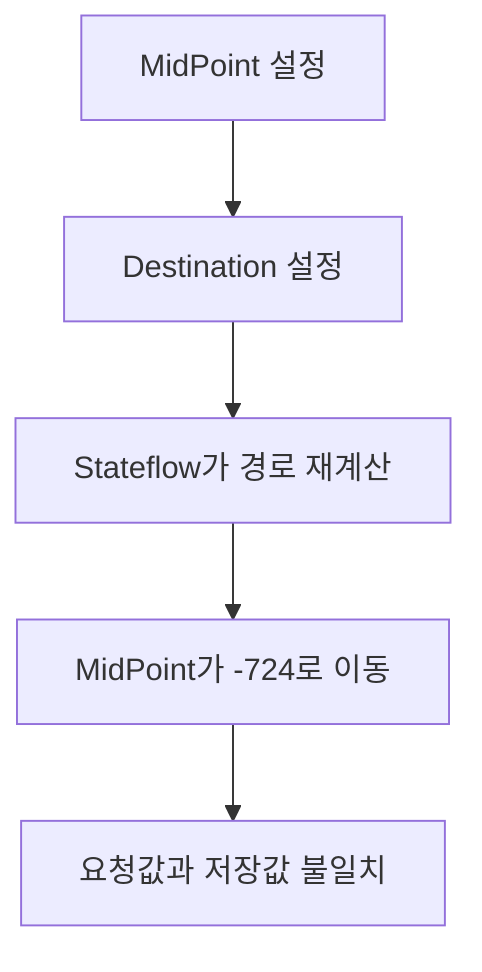
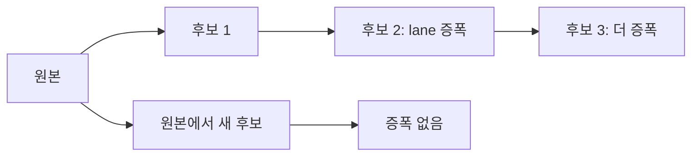

> **기준:** MATLAB R2025b 실측 / [genie4youu/amr_robot_planning](https://github.com/genie4youu/amr_robot_planning) / 확인일 2026-07-31
> **시리즈:** [목차](/posts/00-sflayout-series/) | 이전 → [01. 못 읽는 차트](/posts/01-sflayout-why-graphics/) | 다음 → [03. 재귀 계층 탐색](/posts/03-sflayout-recursive-hierarchy/)

---

## 1. 관련 속성

`Stateflow.Transition` 의 그래픽 속성은 다음과 같다.

| 속성 | 뜻 |
| --- | --- |
| `SourceOClock` | 출발 State에서 선이 나가는 지점. 0~12 시계 위치 |
| `DestinationOClock` | 도착 State로 선이 들어가는 지점. 0~12 시계 위치 |
| `SourceEndpoint` / `DestinationEndpoint` | 실제 끝점 좌표 `[x y]` |
| `MidPoint` | 경로 중간 경유점 `[x y]` |
| `LabelPosition` | 라벨 위치와 크기 `[left top width height]` |

문서에는 각 속성이 개별적으로 기술돼 있다. 그래서 순서에 상관없이 넣으면 될 것처럼 보인다.

## 2. 실제로는 결합돼 있다

**하나를 설정하면 Stateflow가 나머지 접점과 경유점을 다시 계산한다.** 시계 위치를 바꾸면 끝점 좌표가 이동하고, 끝점이 이동하면 midpoint가 재배치된다.

관측된 사례다. T59 라는 Transition에서 `MidPoint` 를 먼저 넣고 뒤이어 Destination을 설정했더니, **midpoint가 약 -724 까지 밀려났다.** 요청한 값과 전혀 다른 좌표가 저장된다.



에러가 나지 않는다는 점이 문제다. 스크립트는 정상 종료하고 모델도 열린다. 차트를 눈으로 봐야 이상한 곡선이 보인다.

> **속성 대입이 성공했다는 것과 그 값이 남았다는 것은 다른 명제다.** 대입 직후 다시 읽어보지 않으면 알 수 없다.
{: .prompt-danger }

## 3. 기본 적용 순서

실측으로 정한 기본 순서다.

```
DestinationOClock -> SourceOClock -> MidPoint -> LabelPosition
```

도착 포트를 먼저 확정하면 그 뒤 설정이 도착점을 덜 흔든다. 반대로 **출발 포트가 더 중요한 Transition은** 순서를 뒤집는다.

```
SourceOClock -> DestinationOClock -> MidPoint
```

어느 쪽이 중요한지는 경로마다 다르다. 그래서 순서를 전역 상수로 두지 않고 **Transition 행마다 `GeometryApplyOrder` 를 명시**했다. T59 는 기본 `DSM` 순서를 유지하도록 고정했다.

| 방식 | 문제 |
| --- | --- |
| 전역 고정 순서 | 일부 Transition에서 midpoint가 튄다 |
| **행별 명시** | 예외를 데이터로 기록할 수 있다 |

예외를 코드 분기가 아니라 테이블 값으로 두면, 나중에 왜 그렇게 했는지가 그 행에 남는다.

## 4. 요청값을 믿지 않는다

대응은 단순하다. **설정한 뒤 다시 읽는다.**

```matlab
t.DestinationOClock = doc;
t.SourceOClock      = soc;
t.MidPoint          = mid;

% 요청값이 아니라 실제 값을 읽어 검사한다
actualSrc  = t.SourceEndpoint;
actualDst  = t.DestinationEndpoint;
actualMid  = t.MidPoint;
```

여기서 끝나지 않는다. **저장하고 다시 연 뒤에도 확인해야 한다.** Stateflow가 저장 과정에서 Subviewer 좌표를 평행이동시킬 수 있기 때문이다.

| 확인 시점 | 잡히는 것 |
| --- | --- |
| 속성 대입 직후 | 결합에 의한 재계산 |
| 저장 후 재열기 | 저장 시 평행이동 |

두 시점을 다 봐야 실제 좌표를 안다.

## 5. 누적 적용을 하지 않는다

전체 배치를 여러 번 반복해야 할 때가 있다. 이때 **이미 좌표가 바뀐 후보 파일에 계속 덧씌우면 안 된다.**

저장 시 평행이동이 매번 조금씩 쌓여서 외곽 lane이 증폭된다. 반복할 때마다 곡선이 조금씩 더 밖으로 나간다.



그래서 반복이 필요하면 **원본에서 새 후보를 다시 만든다.** 검증이 끝난 원본에는 레이아웃 스크립트를 직접 실행하지 않고, 별도 후보 파일로 복사한 뒤 `ModelPath` 를 명시해 배치한다.

## 6. 라벨 문자열 보존

배치 과정에서 `LabelString` 을 건드리면 논리가 바뀐다. Transition 라벨은 Event, Condition, Action을 담고 있다.

**공백과 줄바꿈까지 정확히 보존한다.** 라벨을 정규화하거나 다시 조립하지 않는다. 눈에 안 보이는 문자 하나가 조건식 해석을 바꿀 수 있다.

## ⚠️ 주의

- **속성 결합 동작은 공식 문서에 명시돼 있지 않다.** R2025b 실측 결과이고 릴리스가 바뀌면 달라질 수 있다. 그래서 더더욱 "설정 후 재확인"이 필요하다.
- `-724` 는 T59 라는 특정 Transition의 값이다. 다른 Transition에서 같은 숫자가 나온다는 뜻이 아니다. 요점은 **크게 튈 수 있다**는 것이다.
- `fitToView` 는 저장과 검증이 끝난 뒤 마지막 화면 확인 단계에서만 호출한다. 중간에 부르면 좌표 판단이 흐려진다.

## 📌 정리

- `SourceOClock`, `DestinationOClock`, `MidPoint` 는 **서로 독립이 아니다.** 하나를 설정하면 나머지가 재계산된다.
- 기본 순서는 `Destination -> Source -> MidPoint -> Label` 이고, 예외는 **행별로 명시**한다.
- **요청값을 믿지 않는다.** 대입 직후와 저장 후 재열기 두 시점에서 실측한다.
- 전체 배치를 반복할 때는 **원본에서 새 후보를 만든다.** 누적 적용은 외곽 lane을 증폭시킨다.
- `LabelString` 은 공백과 줄바꿈까지 그대로 둔다.

---

**시리즈:** [목차](/posts/00-sflayout-series/) | 이전 → [01. 논리는 맞는데 못 읽는 차트](/posts/01-sflayout-why-graphics/) | 다음 → [03. 계층을 재귀로 훑는다](/posts/03-sflayout-recursive-hierarchy/)

## 참고

- [Stateflow.Transition](https://www.mathworks.com/help/stateflow/api/stateflow.transition.html)
- [Create Charts by Using the Stateflow API](https://www.mathworks.com/help/stateflow/api/quick-start-for-the-stateflow-api.html)
- [Overview of the Stateflow API](https://www.mathworks.com/help/stateflow/api/overview-of-the-stateflow-api.html)
- [Refactor Charts Programmatically](https://www.mathworks.com/help/stateflow/api/refactor-stateflowcharts-using-the-api.html)
