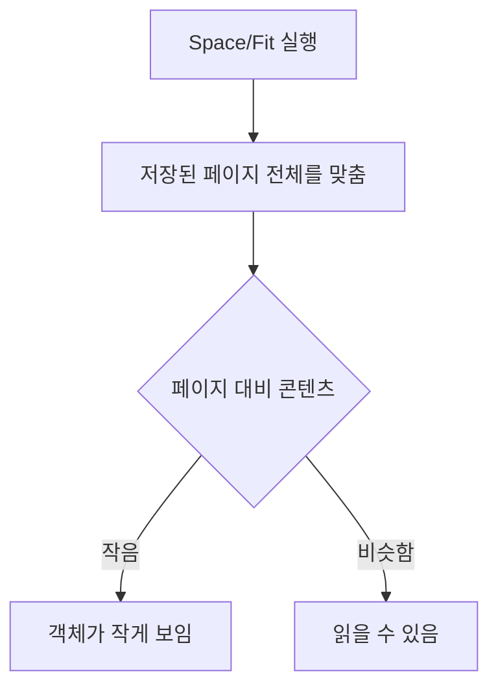
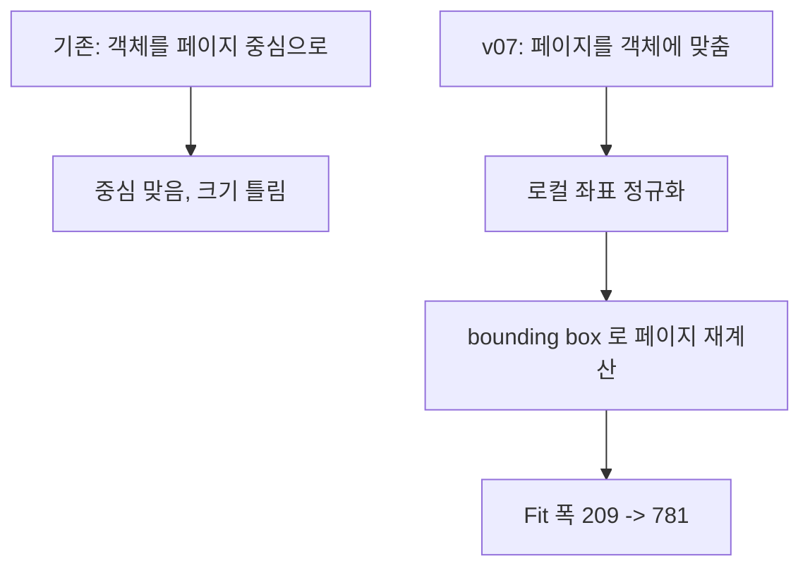

> **기준:** MATLAB R2025b 실측 / [genie4youu/amr_robot_planning](https://github.com/genie4youu/amr_robot_planning) / 확인일 2026-07-31
> **시리즈:** [목차](/posts/00-sflayout-series/) | 이전 → [03. 재귀 계층 탐색](/posts/03-sflayout-recursive-hierarchy/) | 다음 → [05. 검사기와 멱등성](/posts/05-sflayout-inspector-idempotence/)

---

## 1. 증상

Subchart 안의 State와 Transition을 규칙대로 배치했다. 검사기도 통과했다. 그런데 차트를 열고 Space 또는 Fit을 누르면 **객체 묶음이 화면 한쪽에 작게 뭉쳐서 나온다.**

저장된 배율로 열면 커 보이기도 한다. 그래서 배율 문제로 착각하기 쉽다. 배율을 손으로 고쳐도 Fit을 누르는 순간 되돌아간다.

## 2. 두 개의 사각형을 구분해야 한다

Subchart에는 성격이 다른 두 사각형이 있다.

| 이름 | 무엇 | 누가 쓰나 |
| --- | --- | --- |
| 부모의 State `Position` | 부모 Chart 화면에서 그 Subchart 상자가 차지하는 자리 | 부모 화면 |
| **`subviewS.pos`** | Subchart 내부의 **저장된 페이지 사각형** | **Space/Fit** |

`fitToView(subchart)` 는 객체 bounding box가 아니라 **저장된 페이지 전체를 화면에 맞춘다.** 그래서 페이지가 콘텐츠보다 훨씬 크면, 아무리 배치를 잘해도 객체가 작게 보인다.

## 3. 잘못 든 길

중간 버전에서 직접 자식 State를 **저장된 `subviewS.pos` 중심으로 옮겼다.** 그 사각형을 배치 영역으로 취급한 것이다.

중심은 맞았다. 크기 문제는 그대로 남았다.

| Subchart | 콘텐츠 대 페이지 |
| --- | --- |
| MissionRegion | graphical 높이가 페이지 높이의 약 16% |
| NavigationRegion | graphical 너비가 페이지 너비의 약 35% |

중심 정렬만 검사하는 판정 기준으로는 이것이 통과한다. State와 Transition이 함께 페이지 가운데 있으면 조건을 만족하기 때문이다. **중심은 맞고 크기는 틀린 상태**가 통과했다.

NavigationRegion 실측이다. 1420 × 620 짜리 그래픽이 4134 × 3279 페이지 안에 놓여 있었고, Fit 표시 폭이 약 **209 px** 로 줄었다.

## 4. 페이지를 콘텐츠에 맞춘다

방향을 뒤집었다. 객체를 페이지에 맞추는 대신 **페이지를 객체에 맞춘다.**

두 단계다.

**첫째, 로컬 좌표를 정규화한다.** 모든 Subchart State를 로컬 `x=100`, `y=120` 에서 시작하도록 옮긴다. 위쪽 복귀 lane이 저장 시 spline 보정을 일으키는 MissionRegion과 EnergyRegion은 `y=200` 을 쓴다.

**둘째, 배치가 끝난 뒤 페이지를 다시 계산한다.** 기준은 전체 그래픽 bounding box에 다음을 적용한 값이다.

| 기준 | 값 |
| --- | --- |
| 가로 활용률 | 0.90 |
| 세로 활용률 | 0.82 |
| 최소 여백 | 60 px |

결과다.

| Subchart | State min | 이전 페이지 | 이후 페이지 | 이전 Fit 폭 | 이후 Fit 폭 |
| --- | ---: | ---: | ---: | ---: | ---: |
| MissionRegion | 100, 200 | 4642×2975 | 3184×590 | 452 | **781** |
| NavigationRegion | 100, 120 | 4134×3279 | 1578×757 | 209 | **781** |
| SafetyRegion | 100, 120 | 2966×1279 | 932×671 | 235 | **600** |
| HealthRegion | 100, 120 | 2432×1292 | 970×671 | 303 | **628** |
| EnergyRegion | 100, 200 | 2845×1850 | 1356×753 | 327 | **704** |

NavigationRegion이 209에서 781로 올랐다. 객체 좌표는 바뀌었지만 논리는 그대로다.

## 5. 페이지는 API로 못 바꾼다

여기에 제약이 하나 있다. **R2025b에서 `subviewS.pos` 는 읽기 전용이다.** pan과 내부 zoom 메타데이터도 마찬가지다. `Stateflow.Editor.ZoomFactor` 는 공개돼 있어 저장 배율은 조정할 수 있지만, 페이지 사각형 자체는 API로 못 쓴다.

먼저 시도한 우회다.

| 방법 | 결과 |
| --- | --- |
| `ZoomFactor` 로 확대율 보정 | 저장 화면은 나아지지만 Fit을 누르면 되돌아감 |
| Subchart를 일반 Composite State로 전환해 캔버스 초기화 | 자식 Subviewer 계층이 바뀔 수 있어 제외 |

최종적으로 택한 방법은 **모델이 닫힌 상태에서 SLX 안의 Stateflow XML을 직접 고치는 것**이다. SLX는 zip이므로 풀어서 `simulink/stateflow/chart_*.xml` 의 페이지 사각형만 바꾸고 다시 묶는다. State, Transition, Junction, SSID, ExecutionOrder, 라벨, 계층, geometry는 건드리지 않는다.

> **이것은 공식 지원 경로가 아니다.** 파일 포맷 내부를 건드리는 방식이라 릴리스가 바뀌면 깨질 수 있다. 모델이 열려 있으면 실패하도록 막고, 바꾸는 값의 범위를 검사하고, 실행 후 전체 논리 서명과 Update Diagram을 다시 확인하는 것을 전제로만 쓸 수 있다.
{: .prompt-danger }

## 6. 이 문제가 오래 안 잡힌 이유

원인이 하나 더 있었다. 그래픽 단위검사가 **파일명에 `layout_v` 가 들어간 후보 파일에만** 엄격하게 적용되고 있었다.

즉 후보 파일은 검사받고 정식 모델은 안 받는 상태였다. 개선된 후보가 정식 모델로 승격되지 않은 채 남아 있어도 아무도 알려주지 않았다. 정식 모델의 다섯 Subchart는 저장된 편집 화면 중심에서 35.9%에서 43.2%까지 벗어나 있었다.

재발 방지로 고정한 세 가지다.

1. 정식 모델과 모든 후보에 **동일한** 중심과 크기 검사를 적용한다.
2. 저장하고 닫고 다시 연 뒤에도 저장 배율이 유지되는지 검사한다.
3. `max(graphicWidth, graphicHeight) × ZoomFactor` 가 400 px 미만이면 생성과 테스트를 실패시킨다.

## ⚠️ 주의

- **활용률 0.90과 0.82, 여백 60 px 는 이 차트에서 정한 값이다.** 라벨이 긴 차트는 여백을 더 줘야 한다.
- `y=200` 예외는 MissionRegion과 EnergyRegion에서 위쪽 복귀 lane이 저장 시 spline 보정을 유발했기 때문이다. **일반 규칙이 아니라 이 두 Region의 실측 대응이다.**
- SLX XML 직접 편집은 R2025b 실측이다. 다른 릴리스에서 같은 경로가 유효한지 확인하지 않았다.
- Fit 표시 폭 숫자는 특정 창 크기 기준 측정값이다. 절대값보다 **개선 비율**을 보는 편이 맞다.

## 📌 정리

- **부모의 State `Position` 과 Subchart 내부 페이지 `subviewS.pos` 는 다른 사각형이다.**
- `fitToView` 는 콘텐츠가 아니라 **저장된 페이지**를 화면에 맞춘다.
- 페이지가 크면 배치가 옳아도 객체가 작게 나온다. NavigationRegion은 Fit 폭 209 px 였다.
- **중심 정렬만 검사하면 "중심은 맞고 크기는 틀린" 상태가 통과한다.**
- 해법은 객체를 페이지에 맞추는 것이 아니라 **페이지를 객체에 맞추는 것**이다. 209에서 781로 회복했다.
- 페이지 사각형은 API로 못 쓴다. 파일 내부를 고치는 방법은 **공식 경로가 아니므로** 검증 절차를 붙여야 한다.
- 검사가 **후보 파일에만** 걸려 있으면 정식 모델은 계속 통과한다.

---

**시리즈:** [목차](/posts/00-sflayout-series/) | 이전 → [03. 계층을 재귀로 훑는다](/posts/03-sflayout-recursive-hierarchy/) | 다음 → [05. 검사기가 통과시킨 것](/posts/05-sflayout-inspector-idempotence/)

## 참고

- [Stateflow.State](https://www.mathworks.com/help/stateflow/api/stateflow.state.html)
- [Stateflow.Editor](https://www.mathworks.com/help/stateflow/api/stateflow.editor.html)
- [Overview of the Stateflow API](https://www.mathworks.com/help/stateflow/api/overview-of-the-stateflow-api.html)
- [Simulink File Format (SLX)](https://www.mathworks.com/help/simulink/slref/simulink-file-format.html)
