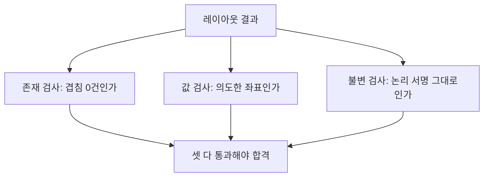
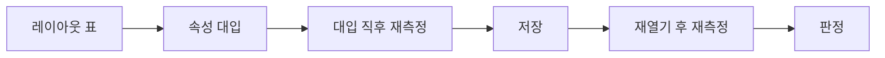

> **기준:** MATLAB R2025b 실측 / [genie4youu/amr_robot_planning](https://github.com/genie4youu/amr_robot_planning) / 확인일 2026-07-31
> **시리즈:** [목차](/posts/00-sflayout-series/) | 이전 → [04. 페이지와 배치 영역](/posts/04-sflayout-page-vs-layout/)

---

## 1. 이 연재에서 검사기가 세 번 틀렸다

정리하면 이렇다.

| 편 | 검사기가 통과시킨 것 | 왜 |
| --- | --- | --- |
| [01](/posts/01-sflayout-why-graphics/) | 과도한 외곽 우회 | **최소 간격만** 검사했다. 멀리 보낼수록 통과 |
| [04](/posts/04-sflayout-page-vs-layout/) | 중심은 맞고 크기는 틀린 배치 | **중심 정렬만** 검사했다 |
| [04](/posts/04-sflayout-page-vs-layout/) | 정식 모델의 위반 | 파일명에 `layout_v` 가 든 **후보에만** 검사가 걸려 있었다 |

세 번 다 리포트는 통과였다. 검사기가 거짓말을 한 것이 아니라 **묻지 않은 것에 답하지 않았을 뿐**이다.

> **통과 리포트는 무엇이 맞았는지를 알려주지 않는다. 무엇을 봤는지를 알려준다.** 두 문장의 차이가 이 글의 전부다.
{: .prompt-warning }

## 2. 존재 검사로는 값 검사를 못 한다

*"무엇이 없어야 하나"* 를 묻는 검사와 *"바뀐 것이 맞는가"* 를 묻는 검사는 다르다.

| 종류 | 질문 | 잡는 것 | 못 잡는 것 |
| --- | --- | --- | --- |
| 존재 검사 | 겹침이 0건인가 | 명백한 충돌 | 값이 엉뚱한 경우 |
| 값 검사 | 이 좌표가 의도한 값인가 | 요청과 결과의 불일치 | 의도 자체가 틀린 경우 |
| 불변 검사 | 논리 서명이 그대로인가 | 부작용 | 배치 품질 |

세 층을 다 두어야 한다. 겹침 0건은 배치가 좋다는 뜻이 아니라 겹치지 않았다는 뜻뿐이다.

## 3. 요청값이 아니라 실측값으로 판정한다

[02편](/posts/02-sflayout-api-coupling/)에서 본 대로 Stateflow는 속성을 넣으면 경로를 다시 계산한다. 그래서 판정 대상은 **스크립트가 넣으려 한 값이 아니라 모델에 남은 값**이다.

두 번 측정하는 이유는 실패 지점이 둘이기 때문이다. 대입 직후 값이 틀리면 속성 결합 문제이고, 대입 직후는 맞는데 재열기 후 틀리면 저장 시 평행이동 문제다. 한 번만 재면 어느 쪽인지 모른다.

## 4. 편집 카메라를 합격 기준으로 쓰지 않는다

중간 버전에서 "편집기 화면 중심에 맞는가"를 합격 기준으로 썼다. 이것이 [04편](/posts/04-sflayout-page-vs-layout/)의 오판을 낳았다.

화면 중심은 저장된 페이지, 배율, 창 크기가 함께 만드는 값이다. **모델의 속성이 아니라 보는 방식의 결과**다. 그런 값을 합격 기준으로 삼으면 창 크기가 바뀔 때 판정이 흔들린다.

바꾼 기준은 다음과 같다.

- 실제로 `fitToView(subchart)` 를 **실행한다.**
- 그래픽이 페이지의 **어느 한 축을 최소 70% 사용**하는지 본다.
- 동시에 가로 93%, 세로 82%를 넘지 않는지 본다.
- 창 크기와 무관하게 판정한다.

하한과 상한을 같이 둔 것이 요점이다. 하한만 두면 [01편](/posts/01-sflayout-why-graphics/)처럼 극단으로 밀어붙이는 해가 통과한다.

## 5. 멱등성을 합격 기준에 넣는다

가장 값싼 검사이면서 가장 많이 잡아준다. **레이아웃 스크립트를 두 번 돌리고 결과가 같은지 본다.**

v7 결과에서 두 번째 실행의 변화량이다.

| 대상 | 변화 |
| --- | --- |
| State Position | 0 |
| Transition Endpoint | 0 |
| Transition MidPoint | 0 |
| LabelPosition | 0 |
| ZoomFactor | 0 |
| page rectangle | 0 |

변화가 0이 아니면 배치가 **입력이 아니라 이전 상태에 의존**하고 있다는 뜻이다. [02편](/posts/02-sflayout-api-coupling/)에서 본 누적 적용 시 외곽 lane 증폭이 정확히 이 증상이었다. 멱등하지 않은 배치기는 돌릴 때마다 결과가 달라지므로 재현이 안 되고, 검사 결과도 신뢰할 수 없다.

## 6. 논리 보존은 개수로 증명되지 않는다

배치를 바꾸면 그래픽 포트 위치가 바뀌고, 포트 위치가 바뀌면 **암시적 Transition 평가 순서가 달라질 수 있다.**

따라서 다음은 증거가 아니다.

- Transition 개수가 같다
- State 개수가 같다
- 시뮬레이션이 돈다

증거로 쓰는 것은 다음이다.

| 항목 | 확인 |
| --- | --- |
| State/Transition SSID | 동일 |
| 이름과 LabelString | 공백과 줄바꿈까지 동일 |
| Source/Destination | 동일 |
| 계층과 decomposition, State type | 동일 |
| **모든 ExecutionOrder와 outgoing 순서** | 동일 |
| Data/Event/Message/Function 서명 | 동일 |

v3와 v7 모두 State 37개, Transition 67개와 위 서명 전체를 저장과 재열기 전후로 보존했고, Model check healthy와 Update Diagram PASS를 확인했다.

## 7. 예외는 없애지 말고 기록한다

v3에 남은 경고가 하나 있다. T60과 T54 사이 path 대 path 경고인데, Stateflow spline을 두 선분으로 근사할 때만 보이고 Junction 없이는 제거할 수 없다.

선택지는 둘이었다.

| 선택 | 결과 |
| --- | --- |
| 검사기를 느슨하게 고친다 | 이 경고는 사라진다. **같은 종류의 진짜 문제도 사라진다** |
| 검토 예외로 고정한다 | 리포트에 남는다. 왜 남았는지도 남는다 |

후자를 택했다. 검사기를 완화해서 통과시키면 그 검사 항목 전체가 무력해진다.

## ⚠️ 주의

- **임계값(70%, 93%, 82%, 400 px)은 이 프로젝트의 선택이다.** 그대로 옮길 값이 아니라 하한과 상한을 함께 두라는 원칙이 옮길 부분이다.
- 멱등성 확인은 **같은 입력, 같은 원본** 기준이다. 원본이 다르면 결과가 다른 것이 정상이다.
- Model check healthy와 Update Diagram PASS는 **모델이 성립한다**는 확인이지 요구사항 충족이 아니다. 기능 검증은 시나리오 회귀가 따로 한다.

## 📌 정리

- **통과 리포트는 무엇을 봤는지만 알려준다.** 안 본 것은 항상 통과한다.
- 최소 간격만 보면 과도한 우회가, 중심만 보면 크기 오류가 통과한다. **하한과 상한을 같이 둔다.**
- 검사를 후보 파일에만 걸면 정식 모델은 영원히 통과한다.
- 판정은 요청값이 아니라 **대입 직후와 재열기 후 두 번 실측한 값**으로 한다.
- 편집 카메라 중심처럼 **보는 방식이 만드는 값**을 합격 기준으로 쓰지 않는다.
- **멱등성은 값싸고 잘 잡는다.** 두 번 돌려 변화 0이 아니면 이전 상태에 의존하고 있다.
- 논리 보존은 개수가 아니라 **ExecutionOrder와 outgoing 순서**로 증명한다.
- 못 없애는 예외는 검사기를 완화하지 말고 **예외로 기록**한다.

---

**시리즈:** [목차](/posts/00-sflayout-series/) | 이전 → [04. `subviewS.pos` 는 배치 영역이 아니다](/posts/04-sflayout-page-vs-layout/)

## 참고

- [Stateflow.Transition](https://www.mathworks.com/help/stateflow/api/stateflow.transition.html)
- [Overview of the Stateflow API](https://www.mathworks.com/help/stateflow/api/overview-of-the-stateflow-api.html)
- [MATLAB Unit Test Framework](https://www.mathworks.com/help/matlab/matlab-unit-test-framework.html)
- [Simulink Model Advisor](https://www.mathworks.com/help/simulink/slref/simulink-model-advisor.html)
