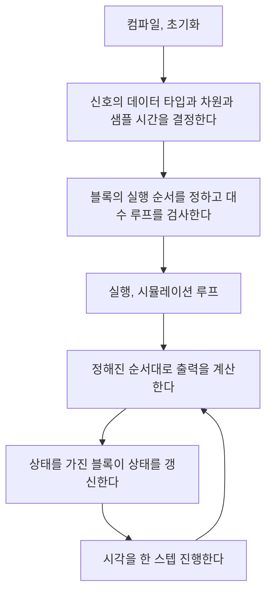
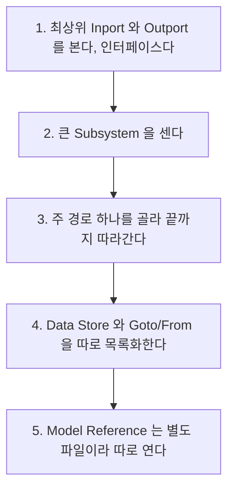

> **기준 출처:** [MathWorks Simulink Block Diagrams](https://www.mathworks.com/help/simulink/ug/what-is-a-block-diagram.html) · How Simulink Works와 Simulation Phases · Signal Basics와 Port and Signal Attributes / 확인일 2026-08-07
> **시리즈:** [목차](/posts/00-mp-series/) | 이전 → [MATLAB 06. 자주 쓰는 내장 함수](/posts/06-builtin-functions/) | 다음 → [02. 소스와 수학 연산](/posts/02-source-math-blocks/)

대상은 Simulink 화면을 처음 보는 독자다. 예제는 모두 이 글에서 새로 만든 것이다.

## 1. Simulink는 무엇인가

Simulink는 블록 다이어그램으로 시스템을 표현하고 시뮬레이션하는 도구다. 코드를 텍스트로 쓰는 대신 계산을 수행하는 블록을 놓고 값이 흐르는 선으로 연결한다.

| 텍스트 코드 | Simulink |
| --- | --- |
| 함수 호출 | 블록 |
| 변수 | 선, 곧 신호 |
| 함수의 인수 | 입력 포트 |
| 함수의 반환값 | 출력 포트 |
| 함수 정의 | Subsystem |
| 별도 파일의 모듈 | Model Reference |
| 전역 변수 | Data Store Memory |

이 대응을 머리에 두면 다이어그램을 그림이 아니라 실행되는 프로그램으로 읽을 수 있다.

## 2. 화면의 구성 요소

사각형 하나가 하나의 연산이다. 블록 안의 기호나 이름이 어떤 연산인지 나타낸다. 왼쪽에 붙은 화살표가 입력 포트이고 오른쪽에 붙은 화살표가 출력 포트다. 블록 아래의 글자는 사용자가 붙인 블록 이름이라 같은 종류라도 이름은 제각각이다.

블록의 종류(BlockType)와 이름(Name)은 다른 개념이다. 종류가 `Sum`인 블록의 이름이 `Add1`일 수 있으므로 모델을 분석할 때는 이름이 아니라 종류를 봐야 한다.

선은 블록의 출력 포트에서 다른 블록의 입력 포트로 이어지는 화살표이고 그 위를 흐르는 것을 신호라고 한다. 신호는 단순한 숫자가 아니라 다음 속성을 함께 가진다.

| 속성 | 의미 |
| --- | --- |
| 데이터 타입 | `double`이나 `single`이나 `uint16` 등 |
| 차원 | 스칼라인가 벡터인가 행렬인가 |
| 샘플 시간 | 얼마나 자주 갱신되는가 |
| 실수와 복소 | 대부분 실수다 |

선의 굵기와 모양이 이 속성을 반영하도록 표시 설정을 켤 수 있다. 굵은 선은 벡터, 겹선은 버스이고 색은 샘플 시간이나 데이터 타입을 나타낸다.

블록이 아니면서 캔버스에 놓인 글자나 영역도 있다. 특히 영역 주석(area annotation)은 여러 블록을 묶어 이름표를 붙인 것으로 화면에서 사람이 실제로 읽는 이름은 그쪽인 경우가 많다. 블록 목록에는 나타나지 않지만 모델의 일부다.

## 3. 실행이란 무엇인가

Simulink의 시뮬레이션은 두 단계로 나뉜다.



컴파일 단계에서 발생하는 오류가 타입이 맞지 않는다거나 차원이 맞지 않는다는 메시지다. 이산 시간 모델의 한 스텝은 이렇게 진행된다.

```text
1) 현재 시각 t 에서 실행 순서에 따라 각 블록의 출력을 계산한다
2) 상태를 가진 블록들이 다음 스텝을 위한 상태를 갱신한다
3) t = t + Ts 로 시각을 진행한다
```

이 구조 때문에 Unit Delay 같은 블록이 이전 값을 제공할 수 있다. 1단계에서 내보내는 값은 2단계에서 저장해 둔 값, 곧 한 스텝 전의 입력이다. [07편](/posts/07-stateful-blocks-datastore/)에서 다룬다.

실행 순서는 배치가 아니라 의존성이 정한다. 블록이 화면에서 왼쪽에 있다고 먼저 실행되는 것이 아니고, 어떤 블록의 출력이 다른 블록의 입력이면 앞의 것이 먼저 실행된다.

의존 관계가 순환하면 대수 루프(algebraic loop)가 되어 오류나 경고가 발생한다. 순환 경로에 Unit Delay를 넣어 한 스텝의 지연을 주는 것이 표준적인 해결이다.

중요한 예외가 있다. Goto와 From, Data Store Read와 Write로 연결된 관계는 선이 없으므로 이 의존성 판정에 포함되지 않는다. 쓰기 전에 읽는 순서가 될 수 있다는 뜻이다. [07편](/posts/07-stateful-blocks-datastore/)에서 다시 다룬다.

## 4. 모델을 처음 열었을 때의 읽기 순서



3번에서 모든 가지를 동시에 보지 않는 것이 중요하다. 4번의 두 종류는 선이 없으므로 다이어그램만 봐서는 연결이 보이지 않는다.

한 신호가 어디서 왔는지 확인할 때 화면의 선 모양으로 추정하지 않는다. 선은 겹치거나 분기하므로 눈으로 따라가면 틀린다. 프로그래밍 방식으로 조회할 때는 블록의 포트 핸들에서 선을 얻고 그 선의 소스 포트를 따라 올라간다.

```matlab
ph  = get_param(blk, 'PortHandles');
lh  = get_param(ph.Inport(1), 'Line');
src = get_param(lh, 'SrcBlockHandle');
```

## 5. 블록을 프로그래밍 방식으로 조회하기

분석 작업에서는 화면을 보는 대신 명령으로 목록을 얻는 편이 정확하다.

```matlab
blks = find_system(mdl, ...
    'LookUnderMasks', 'all', ...
    'FollowLinks', 'on', ...
    'IncludeCommented', 'on', ...
    'MatchFilter', @Simulink.match.allVariants, ...
    'BlockType', 'Sum');
```

네 개의 옵션은 각각 다음을 포함시킨다.

| 옵션 | 없으면 빠지는 것 |
| --- | --- |
| `LookUnderMasks`를 `all`로 | 마스크 아래에 감춰진 블록 |
| `FollowLinks`를 `on`으로 | 라이브러리 링크 너머의 블록 |
| `IncludeCommented`를 `on`으로 | 주석 처리된 블록 |
| `MatchFilter`에 `allVariants` | 현재 비활성인 Variant 안의 블록 |

기본값은 이들을 조용히 제외한다. 오류 메시지가 나오지 않으므로 개수가 적게 나온 것을 없다고 오해하기 쉽다. 0건은 없다는 뜻이 아니라 이 조회 방법으로는 못 찾았다는 뜻이다.

블록의 종류와 이름을 확인하는 명령은 이렇다.

```matlab
get_param(blk, 'BlockType')     % 종류
get_param(blk, 'Name')          % 이름
get_param(blk, 'Parent')        % 상위 경로
```

## 6. 용어

| 용어 | 의미 |
| --- | --- |
| 블록 다이어그램 | 모델 전체의 그림 |
| 블록 | 하나의 연산 단위 |
| 포트 | 블록의 입출력 지점 |
| 신호 | 선을 따라 흐르는 값과 그 속성 |
| 샘플 시간 | 신호가 갱신되는 주기 |
| Subsystem | 블록들을 묶은 계층 |
| Model Reference | 별도 `.slx` 파일을 블록처럼 참조한 것 |
| 대수 루프 | 지연 없이 순환하는 의존 관계 |
| 마스크 | 서브시스템에 사용자 인터페이스를 씌운 것 |
| 주석 처리 | 블록을 실행에서 제외한 상태이고 삭제가 아니다 |

## 정리

- 블록은 연산이고 선은 값의 흐름이다. 텍스트 코드의 함수와 변수에 대응한다.
- 신호는 값뿐 아니라 타입과 차원과 샘플 시간을 함께 가진다.
- 시뮬레이션은 컴파일과 실행 두 단계다. 컴파일이 속성과 순서를 정하고 실행이 출력 계산과 상태 갱신을 반복한다.
- 실행 순서는 화면 배치가 아니라 의존 관계가 정한다.
- Goto와 From과 Data Store는 선이 없어 의존 관계에 잡히지 않으므로 별도로 추적한다.
- `find_system`은 기본값에서 마스크와 링크와 주석 블록과 비활성 Variant를 조용히 제외한다.

## 확인 문제

1. 블록의 종류와 이름이 다른 개념인 이유를 예를 들어 설명하라.
2. 대수 루프가 무엇이며 어떻게 해소하는지 쓰라.
3. `find_system`으로 블록을 셌는데 실제보다 적게 나올 수 있는 네 가지 원인을 쓰라.

## 참고

- [MathWorks — What Is a Block Diagram](https://www.mathworks.com/help/simulink/ug/what-is-a-block-diagram.html)
- MathWorks Simulink — How Simulink Works, Signal Basics