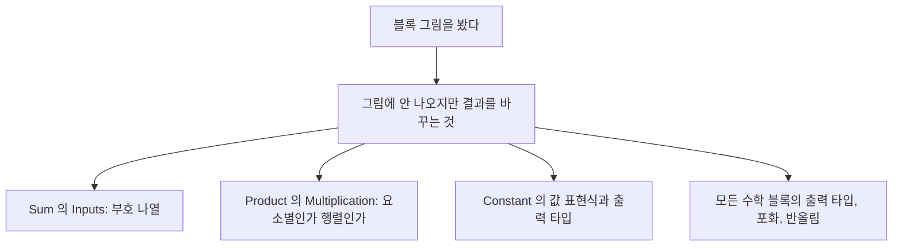

> **기준 출처:** [MathWorks Sum 블록 레퍼런스](https://www.mathworks.com/help/simulink/slref/sum.html) · Product, Gain, Constant, Inport, Outport, Terminator, Ground 레퍼런스 · Sources and Sinks 문서 / 확인일 2026-08-07
> **시리즈:** [목차](/posts/00-mp-series/) | 이전 → [01. 모델을 읽는 법](/posts/01-reading-simulink-models/) | 다음 → [03. 비교와 논리 블록](/posts/03-compare-logic-blocks/)

이 글의 그림은 모두 Simulink 표준 라이브러리로 최소 예제 모델을 만들어 찍은 것이다.

## 1. 소스와 싱크

Inport는 바깥에서 값을 받아들이는 입구이고 놓인 위치에 따라 의미가 다르다.

| 위치 | 의미 |
| --- | --- |
| 최상위 모델 | 시뮬레이션 입력이나 생성 코드의 함수 인수 |
| Subsystem 안 | 그 서브시스템 블록의 입력 포트 |
| Model Reference 대상 모델 안 | 그 참조 블록의 입력 포트 |

포트 번호 파라미터가 블록 바깥에서 몇 번째 포트로 보이는지를 정한다. 번호를 바꾸면 상위 계층의 연결이 달라지므로 주의한다.

Outport는 Inport의 대칭이며 출구를 만든다. 조건부 실행 서브시스템 안에 있을 때는 실행되지 않는 동안 무엇을 내보낼 것인가를 정하는 파라미터가 중요해진다. [08편](/posts/08-hierarchy-conditional-execution/)에서 다룬다.

Constant는 고정된 값을 만든다. 값 칸에는 숫자뿐 아니라 MATLAB 표현식을 쓸 수 있다.

```text
Constant value : uint16(0)
Constant value : Param_Limit          % 워크스페이스 변수
```

`Output data type` 파라미터가 값 표현식에서 상속하도록 설정돼 있으면 표현식의 타입이 그대로 신호 타입이 된다. `0`이라고 쓰면 `double`이고 `uint16(0)`이라고 쓰면 `uint16`이다. 임베디드 모델에서 이 차이가 타입 오류의 흔한 원인이다.

| 블록 | 붙이는 곳 | 이유 |
| --- | --- | --- |
| Terminator | 연결되지 않은 출력 포트 | 쓰지 않는 출력임을 명시한다. 없으면 경고가 발생한다 |
| Ground | 연결되지 않은 입력 포트 | 0을 공급한다. 없으면 오류가 발생한다 |

둘 다 계산에는 관여하지 않지만 연결을 깜빡한 것과 의도적으로 쓰지 않는 것을 구별해 주는 문서화 장치다.


_위는 Inport에서 Outport로, 가운데는 Constant에서 Terminator로, 아래는 Ground에서 Gain을 거쳐 Terminator로 간다. Constant 블록에 표시되는 것은 값이 아니라 값 표현식이다. `uint16(0)`이라고 적었기 때문에 그대로 보인다._

## 2. Sum

가장 자주 보이는 블록이고 겉모습만으로는 부호를 알 수 없어 오독하기 쉽다. 볼 파라미터는 List of signs다.

| 설정 | 결과 |
| --- | --- |
| `++` | 입력 2개를 둘 다 더한다 |
| `+-` | 입력 2개, 첫 번째에서 두 번째를 뺀다 |
| `+++-` | 입력 4개, 앞 셋을 더하고 마지막을 뺀다 |
| 세로 막대 기호 | 포트 사이의 빈 자리를 뜻한다. 배치를 위한 것이고 연산에는 영향이 없다 |

블록 그림만 보고 덧셈이라고 단정하면 안 된다. 뺄셈일 수 있으므로 분석 시 반드시 `Inputs` 파라미터를 확인한다.


_같은 입력 10과 3인데 결과가 13과 7로 다르다. 위는 `Inputs`가 `++`이고 아래는 `+-`다. 두 블록의 그림은 사실상 구별되지 않는다. 포트 옆의 작은 부호 기호가 유일한 단서이고 축소된 다이어그램에서는 보이지 않는다._

```matlab
get_param(blk, 'Inputs')     % 예: '+-'
```

부호를 `+` 하나만 주면 통과이고 `-` 하나만 주면 부호 반전이 된다. 입력이 벡터인 경우 Sum을 벡터 요소의 총합 모드로 쓸 수도 있다.

`Icon shape` 파라미터가 사각형과 원형 중 하나이고 계산은 같으며 표시만 다르다. `Output data type`과 `Saturate on integer overflow` 파라미터가 결과 타입과 넘침 처리를 정하는데, 정수 타입에서 이 설정이 실제 값에 직접 영향을 주므로 반드시 확인한다. [06편](/posts/06-data-type-saturation/)에서 다룬다.

## 3. Product

Sum과 같은 구조로 Number of inputs 파라미터에 곱셈과 나눗셈 기호를 나열한다.

| 설정 | 결과 |
| --- | --- |
| `**` | 두 입력을 곱한다 |
| `*/` | 첫 입력을 두 번째로 나눈다 |
| 숫자 2 | 입력 2개를 모두 곱한다 |

Multiplication 파라미터가 요소별인지 행렬인지를 정한다. 벡터 신호를 다룰 때 이 설정에 따라 결과가 완전히 달라지므로 확인이 필요하다. [MATLAB 01편](/posts/01-matlab-variables-arrays/)에서 다뤘다.

정수 타입에서 0으로 나누면 결과가 정의되지 않는다. Simulink는 진단 설정에 따라 오류를 내거나 특정 값을 반환한다. 분모가 0이 되지 않도록 앞단에서 보호하는 것이 원칙이고 이 보호가 없는 나눗셈은 리뷰에서 지적 대상이다.

## 4. Gain

입력에 고정된 값을 곱한다. Product로도 같은 일을 할 수 있지만 곱하는 값이 파라미터로 고정된다는 점이 다르다. 삼각형 안에 표시되는 숫자가 곱하는 값이고, 값 칸에 워크스페이스 변수 이름을 쓰면 튜닝 가능한 파라미터가 되어 생성 코드에서 상수가 아니라 조정 가능한 변수로 만들 수 있다.

| | Gain | Product |
| --- | --- | --- |
| 곱하는 값 | 파라미터라 설계 시 고정된다 | 신호라 실행 중 변한다 |
| 화면 | 값이 그림에 보인다 | 보이지 않는다 |
| 용도 | 스케일링, 단위 변환, 제어 이득 | 신호끼리의 곱 |


_위는 Product `**`로 12 곱하기 4가 48이다. 가운데는 Product `*/`로 12 나누기 4가 3이다. Sum과 마찬가지로 그림이 아니라 파라미터가 연산을 정한다. 아래는 Gain 4로 12 곱하기 4가 48인데, 가운데 Product와 결과는 같지만 곱하는 값이 삼각형 안에 보인다는 점이 다르다._

## 5. 그 밖의 수학 블록

| 블록 | 하는 일 | 비고 |
| --- | --- | --- |
| Abs | 절댓값 | 정수 최솟값에서 포화 설정에 주의한다 |
| MinMax | 여러 입력 중 최소나 최대 | 소프트웨어 리미터에 쓴다 |
| Sign | 부호를 -1, 0, +1로 낸다 | |
| Math Function | `exp`와 `log`와 `sqrt`와 `square`와 `reciprocal` 등 | 함수 선택이 파라미터다 |
| Trigonometric Function | `sin`과 `cos`와 `atan2` 등 | 실시간 코드에서는 실행 시간에 주의한다 |
| Sqrt | 제곱근 | 음수 입력 처리 방식이 파라미터다 |
| Rounding Function | `floor`와 `ceil`과 `round`와 `fix` | [MATLAB 06편](/posts/06-builtin-functions/)에서 다뤘다 |

## 6. 읽을 때 반드시 확인할 파라미터

블록 그림만으로는 동작이 결정되지 않는다. 아래 항목은 그림에 드러나지 않으면서 결과를 바꾼다.



| 블록 | 확인할 파라미터 |
| --- | --- |
| Sum | `Inputs`, 곧 부호 나열 |
| Product | `Inputs`와 `Multiplication` |
| Gain | `Gain`과 `Multiplication` |
| Constant | `Value`와 `OutDataTypeStr` |
| 모든 수학 블록 | `OutDataTypeStr`, `SaturateOnIntegerOverflow`, `RndMeth` |

```matlab
get_param(blk, 'OutDataTypeStr')
get_param(blk, 'SaturateOnIntegerOverflow')
get_param(blk, 'RndMeth')
```

## 정리

- Inport와 Outport는 놓인 계층에 따라 시뮬레이션 입출력이 되기도 서브시스템의 포트가 되기도 한다.
- Constant의 값 칸에 `0`이라고 쓰면 `double`이고 `uint16(0)`이라고 써야 `uint16`이다.
- Terminator는 남는 출력에 붙이고 Ground는 남는 입력에 붙인다.
- Sum은 그림만 보고 덧셈이라고 단정할 수 없다. `Inputs` 파라미터의 부호 나열을 확인한다.
- Product는 요소별과 행렬 곱 설정에 따라 결과가 달라진다.
- Gain은 곱하는 값이 파라미터이고 Product는 신호다.
- 수학 블록은 출력 타입과 포화와 반올림 설정이 실제 값을 바꾼다.

## 확인 문제

1. Sum 블록의 `Inputs`가 `+-+`일 때 입력 포트는 몇 개이며 어떤 연산이 수행되는가.
2. Constant 블록으로 `uint16` 신호를 만들려면 값 칸에 무엇을 써야 하는가.
3. Terminator와 Ground를 각각 어디에 붙이며 붙이지 않으면 어떤 일이 생기는가.

## 참고

- [MathWorks — Sum](https://www.mathworks.com/help/simulink/slref/sum.html)
- MathWorks Simulink 블록 레퍼런스 — Product, Gain, Constant, Terminator, Ground