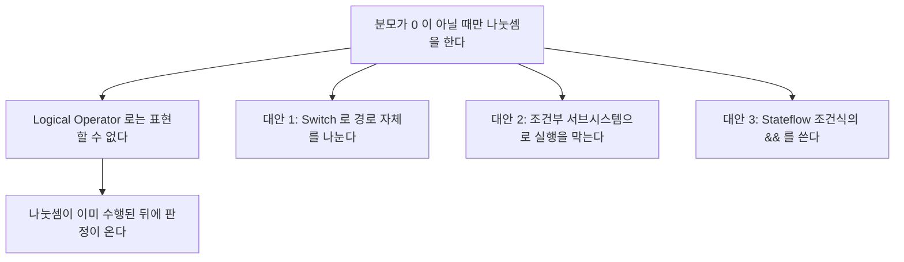

> **기준 출처:** [MathWorks Relational Operator](https://www.mathworks.com/help/simulink/slref/relationaloperator.html) · [Logical Operator](https://www.mathworks.com/help/simulink/slref/logicaloperator.html) · Switch, Multiport Switch, Compare To Constant, Detect Change 레퍼런스 / 확인일 2026-08-07
> **시리즈:** [목차](/posts/00-mp-series/) | 이전 → [02. 소스와 수학 연산](/posts/02-source-math-blocks/) | 다음 → [04. 비트와 시프트 블록](/posts/04-bitwise-shift-blocks/)

## 1. 이 글의 범위

판정과 분기를 만드는 블록을 다룬다. 안전 관련 로직은 대부분 이 블록들의 조합으로 표현되고, 결과가 `boolean` 신호로 흘러 Stateflow 차트의 입력이 되거나 Switch의 제어 신호가 된다.

## 2. Relational Operator

두 입력을 비교해 `boolean` 출력을 낸다. Operator 파라미터로 다음 중 하나를 고른다.

| 설정 | 의미 |
| --- | --- |
| `==` | 같다 |
| `~=` | 같지 않다 |
| `<`, `<=`, `>`, `>=` | 대소 비교 |
| `isInf`, `isNaN`, `isFinite` | 입력이 하나다. 특수값 판정이다 |

블록 그림에 연산자가 표시되므로 그림만으로 판독할 수 있는 몇 안 되는 블록이다. 다만 `isNaN` 계열을 고르면 입력 포트가 하나로 줄어든다.

Output data type은 기본이 `boolean`이다. `uint8` 등으로 바꿀 수 있으나 논리값을 숫자 타입으로 내보내면 이후 논리 블록에서 타입 불일치가 생길 수 있으므로 기본값을 유지하는 편이 낫다.

`==`로 `single`이나 `double` 신호를 비교하는 구성은 위험하다. 부동소수는 정확히 같아지지 않는 경우가 많기 때문이다. 허용 오차를 두려면 두 값의 차의 절댓값을 tolerance와 비교하는 구조를 쓴다. [MATLAB 02편](/posts/02-data-types-int-float/)에서 다뤘다.

## 3. Logical Operator

블록 종류 이름은 `Logic`이다. Operator 파라미터로 고른다.

| 설정 | 의미 | 입력 포트 |
| --- | --- | --- |
| `AND` | 전부 참일 때 참 | 2개 이상, 설정 가능 |
| `OR` | 하나라도 참이면 참 | 2개 이상 |
| `NAND` | AND의 부정 | 2개 이상 |
| `NOR` | OR의 부정 | 2개 이상 |
| `XOR` | 참인 입력이 홀수 개면 참 | 2개 이상 |
| `NXOR` | XOR의 부정 | 2개 이상 |
| `NOT` | 부정 | 1개 |

Number of input ports로 입력 개수를 늘릴 수 있다. 세 개 이상의 조건을 AND로 묶을 때 블록을 여러 개 연결하는 대신 포트 수를 늘리는 편이 읽기 쉽다.

_위는 Relational Operator `>`로 7 > 5를 판정해 1이 나온다. 출력 타입은 `boolean`이고 화면에는 1과 0으로 표시된다. 가운데는 Logical Operator `AND`를 3입력으로 설정한 것이고, 참과 참과 거짓이라 0이 나온다. 블록을 두 개 잇지 않고 포트만 늘렸다. 아래는 `NOT`이고 입력 포트가 하나로 줄어든다._

MATLAB의 `&&`와 달리 Logical Operator 블록에는 단락 평가가 없고 모든 입력이 항상 계산된다.

| | Logical Operator 블록 | MATLAB `&&`나 Stateflow 조건 |
| --- | --- | --- |
| 평가 | 모든 입력을 항상 계산한다 | 왼쪽으로 결론이 나면 오른쪽을 건너뛴다 |
| 보호 조건 표현 | 불가하다 | 가능하다 |
| 실행 시간 | 일정하다 | 조건에 따라 변한다 |

기본 설정에서는 `boolean` 입력을 요구한다. 숫자 신호를 직접 꽂으면 설정에 따라 오류가 나거나 0이 아닌 값을 참으로 해석한다. 비트 연산 결과처럼 정수인 신호는 Relational Operator로 0과 비교해 `boolean`으로 바꾼 뒤 넣는 것이 명확하다. [04편](/posts/04-bitwise-shift-blocks/)에서 다룬다.

## 4. Compare To Constant와 Compare To Zero

Relational Operator와 Constant를 하나로 묶은 라이브러리 마스크 블록이다.

| 블록 | 내용 |
| --- | --- |
| Compare To Constant | 입력을 지정한 상수와 비교한다 |
| Compare To Zero | 입력을 0과 비교한다 |

내부는 Relational Operator와 Constant 두 블록이고 마스크로 감싸져 하나처럼 보인다. 분석 시 마스크 아래를 열면 블록 수가 늘어난다는 점을 인지해야 한다. `find_system`에 `LookUnderMasks`를 `all`로 주면 안쪽 블록까지 세어진다. [01편](/posts/01-reading-simulink-models/)에서 다뤘다.

읽는 쪽에서는 이 블록을 하나의 판정으로 취급하면 충분하다.

## 5. Switch

입력이 세 개이고 가운데 입력인 제어 신호의 값에 따라 첫 번째나 세 번째를 통과시킨다.

Criteria for passing first input으로 판정 기준을 고른다.

| 설정 | 의미 |
| --- | --- |
| `u2 >= Threshold` | 기본값이다 |
| `u2 > Threshold` | |
| `u2 ~= 0` | 제어 신호가 `boolean`일 때 자연스러운 선택이다 |

Threshold 파라미터가 임계값이다. 제어 신호가 `boolean`이면 0과 비교하는 기준을 쓰는 것이 의도가 분명하다.

_제어 신호인 가운데 포트가 참이므로 첫 번째 입력 100이 통과했다. 거짓이었다면 세 번째 입력 -100이 나온다. 블록 안에 표시된 조건식이 Criteria 설정이다. 선택되지 않은 -100 쪽 경로도 계산은 수행되므로, 계산 자체를 막으려면 조건부 서브시스템이 필요하다._

Switch는 결과를 고를 뿐 선택되지 않은 쪽의 앞단 계산이 생략되지는 않는다. 시뮬레이션에서는 양쪽 경로가 모두 실행된다. 다만 생성 코드에서는 최적화로 분기가 만들어질 수 있고, 조건부 실행 서브시스템을 쓰면 실행 자체를 막을 수 있다. 계산 자체를 피해야 한다면 Switch가 아니라 Enabled Subsystem을 쓴다. [08편](/posts/08-hierarchy-conditional-execution/)에서 다룬다.

Multiport Switch는 제어 신호가 정수 인덱스일 때 여러 입력 중 하나를 고른다. 모드 번호로 기준 경로를 선택하는 구조에 쓰인다. Data port order 파라미터가 인덱스를 0-기반으로 볼지 1-기반으로 볼지를 정하고, 이 설정을 확인하지 않으면 한 칸씩 어긋난 해석을 하게 된다. 범위를 벗어난 인덱스에 대한 처리도 파라미터로 정해진다.

_맨 위 포트가 인덱스이고 아래 세 포트가 후보 값 11과 22와 33이다. 결과는 22, 곧 두 번째 값이다. 블록 안의 포트 라벨이 인덱스 대응을 드러내며 여기서는 1-기반이다. 별표는 범위를 벗어난 인덱스가 그 포트로 간다는 표시다. 0-기반으로 설정하면 라벨이 바뀌고 같은 인덱스에서 33이 나온다._

## 6. Detect 계열

| 블록 | 참이 되는 조건 |
| --- | --- |
| Detect Increase | 값이 이전 스텝보다 커졌다 |
| Detect Decrease | 작아졌다 |
| Detect Change | 달라졌다 |
| Detect Rise Positive | 음수나 0에서 양수로 올라갔다 |
| Detect Fall Negative | 양수나 0에서 음수로 내려갔다 |

모두 내부에 이전 값 저장을 포함하므로 상태를 가진다. 초기 스텝의 동작이 초기값 파라미터에 좌우된다. [07편](/posts/07-stateful-blocks-datastore/)에서 다룬다.

엣지를 잡는 로직은 이 블록으로 표현하거나 Unit Delay와 Logical Operator를 조합해 직접 구성한다. 현재값을 그대로 한 갈래로, Unit Delay를 거친 값을 `NOT`으로 뒤집어 다른 갈래로 두고 `AND`로 묶으면 상승 엣지가 된다.

## 7. 읽을 때 확인할 파라미터

| 블록 | 확인할 파라미터 | 이유 |
| --- | --- | --- |
| Relational Operator | `Operator` | 그림에 보이지만 `isNaN` 계열은 포트 수가 다르다 |
| Logical Operator | `Operator`와 `Inputs` | 포트 수가 설정에 따라 다르다 |
| Switch | `Criteria`와 `Threshold` | 기본값이 의도와 다를 수 있다 |
| Multiport Switch | `DataPortOrder` | 0-기반인지 1-기반인지가 여기서 결정된다 |
| Compare To Constant | `relop`과 `const` | 마스크 아래에 실제 값이 있다 |

## 정리

- Relational Operator는 두 값을 비교해 `boolean`을 낸다. 부동소수 `==` 비교는 피한다.
- Logical Operator는 포트 수를 늘려 여러 조건을 한 블록으로 묶을 수 있다.
- Logical Operator에는 단락 평가가 없다. 보호 조건은 Switch나 조건부 서브시스템이나 Stateflow로 표현한다.
- Compare To Constant는 마스크 블록이고 안에 두 블록이 들어 있다.
- Switch는 결과를 고를 뿐 양쪽 경로가 모두 계산된다.
- Multiport Switch는 인덱스 기준 설정을 반드시 확인한다.
- Detect 계열은 내부에 이전 값 저장을 포함하므로 상태를 가진다.

## 확인 문제

1. Logical Operator 블록으로 분모가 0이 아닐 때만 나눗셈이라는 보호를 만들 수 없는 이유를 설명하라.
2. Switch 블록의 제어 신호가 `boolean`일 때 Criteria를 무엇으로 두는 것이 적절한가.
3. 상승 엣지를 검출하는 구조를 Unit Delay와 논리 블록으로 그려 설명하라.

## 참고

- [MathWorks — Relational Operator](https://www.mathworks.com/help/simulink/slref/relationaloperator.html)
- [MathWorks — Logical Operator](https://www.mathworks.com/help/simulink/slref/logicaloperator.html)