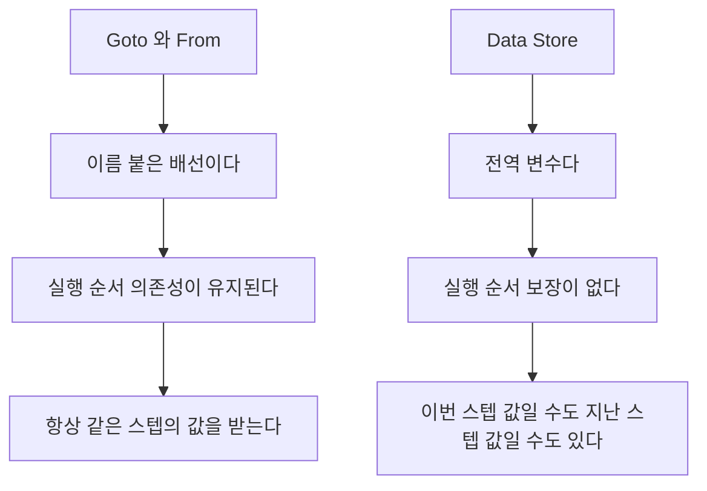

> **기준 출처:** [MathWorks Mux와 Demux](https://www.mathworks.com/help/simulink/slref/mux.html) · Bus Creator와 Bus Selector와 Bus Assignment 레퍼런스 · Goto와 From과 Merge와 Selector 레퍼런스 · Composite Interfaces 문서 / 확인일 2026-08-07
> **시리즈:** [목차](/posts/00-mp-series/) | 이전 → [04. 비트와 시프트 블록](/posts/04-bitwise-shift-blocks/) | 다음 → [06. 데이터 타입과 포화](/posts/06-data-type-saturation/)

## 1. 이 글의 범위

계산하지 않고 옮기기만 하는 블록을 다룬다. 값을 바꾸지 않으므로 알고리즘 관점에서는 부수적으로 보이지만 모델의 가독성과 인터페이스 설계를 결정하는 층이다. 특히 Goto와 From은 다이어그램에 선이 나타나지 않으므로 이 블록을 모르면 신호의 출처를 추적할 수 없다.

## 2. Mux와 Demux

Mux는 여러 신호를 하나의 벡터로 묶는다. 묶이는 신호들은 같은 데이터 타입이어야 하고 결과는 단순한 배열이라 각 원소에 이름이 없다.

Demux는 벡터를 다시 여러 신호로 나눈다. Number of outputs로 개수를 지정하고 벡터 크기가 나누어떨어지지 않으면 오류가 발생한다.

Mux로 묶은 신호는 원소의 순서로만 구별된다. 나중에 원소를 하나 추가하면 그 뒤의 인덱스가 전부 밀려서, Demux 쪽을 함께 고치지 않으면 조용히 잘못된 신호가 연결된다. 서로 성격이 다른 값을 묶을 때는 Mux가 아니라 버스를 쓴다.


_1과 2와 3을 Mux로 묶고 Demux로 다시 풀었다. 나온 순서가 들어간 순서와 같다. 묶인 뒤에는 이름이 없고 순서만 남으므로, 네 번째 신호를 두 번째 자리에 끼워 넣으면 Demux 쪽 뒤쪽 연결이 전부 한 칸씩 밀린다. 오류는 나지 않는다._

## 3. 버스

| | Mux, 벡터 | 버스, 구조체 |
| --- | --- | --- |
| 구별 방법 | 인덱스, 곧 순서 | 이름 |
| 데이터 타입 | 전부 같아야 한다 | 원소마다 다를 수 있다 |
| 크기 | 원소마다 스칼라거나 동일하다 | 원소마다 다를 수 있다 |
| 대응하는 개념 | C의 배열 | C의 구조체 |
| 요소 추가 시 | 인덱스가 밀린다 | 다른 요소에 영향이 없다 |

포트가 여러 개로 늘어나는 인터페이스에서는 버스를 쓰는 것이 표준이다.

| 블록 | 하는 일 |
| --- | --- |
| Bus Creator | 여러 신호를 하나의 버스로 묶는다 |
| Bus Selector | 버스에서 원하는 요소를 이름으로 꺼낸다 |
| Bus Assignment | 버스의 일부 요소만 교체하고 나머지는 통과시킨다 |

Bus Selector는 요소 이름 목록을 파라미터로 가진다. 상위 신호 이름이 바뀌면 이 목록이 깨지므로 신호 이름 변경 시 함께 확인해야 한다.


_`single`인 speed와 `uint16`인 status를 하나로 묶었다. Mux와 달리 타입이 서로 달라도 된다. Bus Selector 쪽은 인덱스가 아니라 이름으로 꺼내므로 요소를 추가해도 기존 선택은 영향받지 않는다. Bus Creator와 Bus Selector는 굵은 세로 막대로 그려지고, Selector의 출력 옆에 꺾쇠로 감싼 이름이 붙어 어느 요소를 꺼냈는지가 다이어그램에 드러난다._

버스에는 가상과 비가상 두 종류가 있다.

| | 가상(virtual) | 비가상(non-virtual) |
| --- | --- | --- |
| 메모리 | 실제로 묶이지 않고 표시상의 묶음이다 | 하나의 구조체로 실제 존재한다 |
| 생성 코드 | 개별 변수로 흩어질 수 있다 | `struct`로 생성된다 |
| 필요 조건 | 없다 | `Simulink.Bus` 객체로 타입을 정의해야 한다 |
| 쓰는 곳 | 다이어그램 정리 | Model Reference 인터페이스, Stateflow 입출력, 코드 인터페이스 |

Stateflow 차트가 버스를 입출력으로 받으려면 비가상 버스여야 한다. 이 조건 때문에 데이터 딕셔너리에 `Simulink.Bus` 객체가 등장한다.

## 4. Goto와 From

Goto에 신호를 넣고 태그를 붙이면 같은 태그를 가진 From이 그 신호를 받는다. 화면에 선이 그려지지 않고, 긴 배선을 없애 다이어그램을 정리하는 것이 목적이다.


_위와 아래 사이에 선이 하나도 없는데 값이 아래쪽 Display에 도착했다. 두 블록에 적힌 태그가 유일한 연결 근거다. 다이어그램을 눈으로 따라가면 이 연결은 보이지 않는다. 모델을 분석할 때 Goto와 From 태그 목록을 따로 만들어야 하는 이유가 이것이다._

Goto의 Tag visibility 파라미터가 어디까지 그 태그가 보이는지를 정한다.

| 설정 | 범위 |
| --- | --- |
| `local` | 같은 서브시스템 안에서만 |
| `scoped` | Goto Tag Visibility 블록이 놓인 계층 아래에서 |
| `global` | 모델 전체 |

`global`은 편리하지만 어디서든 받을 수 있어 추적이 어려워지므로 가능하면 `local`이나 `scoped`를 쓴다.

모델을 분석할 때는 태그 목록을 따로 만들어 대응 관계를 표로 정리해야 한다.

```matlab
gotos = find_system(mdl, 'LookUnderMasks','all', 'FollowLinks','on', ...
                         'BlockType', 'Goto');
tags  = get_param(gotos, 'GotoTag');
```

Goto와 From은 값을 지연 없이 전달한다. 같은 스텝 안에서 전달되고 실행 순서 의존성도 유지된다. 이 점이 Data Store와 다르다.

## 5. Data Store

Data Store Memory가 선언이고 Data Store Write가 쓰기, Data Store Read가 읽기로 세 블록이 한 조다. 자세한 내용은 [07편](/posts/07-stateful-blocks-datastore/)에서 다룬다. 여기서는 라우팅 관점의 차이만 정리한다.



| | Goto와 From | Data Store |
| --- | --- | --- |
| 대응 개념 | 이름 붙은 배선 | 전역 변수 |
| 실행 순서 | 의존성이 유지된다 | 유지되지 않는다 |
| 값의 시점 | 같은 스텝의 값이다 | 읽는 시점에 따라 이번 스텝 값일 수도 지난 스텝 값일 수도 있다 |
| 쓰는 곳 | 하나다 | 여러 곳일 수 있다 |

Data Store는 실행 순서 보장이 없다는 점이 결정적이다. 같은 스텝 안에서 Read가 Write보다 먼저 실행되면 지난 스텝의 값을 읽는다. 이 순서는 모델 구조와 최적화에 따라 달라질 수 있어 진단 옵션을 켜서 확인해야 한다.

## 6. 그 밖의 라우팅 블록

| 블록 | 하는 일 | 주의 |
| --- | --- | --- |
| Selector | 벡터나 행렬에서 일부 요소를 뽑는다 | 인덱스 기준 파라미터를 확인한다 |
| Assignment | 배열의 일부 요소만 바꾼다 | 나머지는 통과한다 |
| Merge | 여러 조건부 서브시스템의 출력을 하나로 합친다 | 동시에 두 곳이 실행되면 안 된다 |
| Reshape | 차원을 바꾼다 | 총 원소 수는 유지된다 |
| Vector Concatenate | 여러 신호를 이어 붙인다 | Mux와 유사하나 차원 규칙이 명시적이다 |
| Signal Specification | 신호 속성을 명시해 검사한다 | 인터페이스 계약 문서화에 유용하다 |
| Width | 신호의 폭을 값으로 낸다 | |

Merge는 여러 경로 중 한 번에 하나만 실행된다는 전제에서 동작한다. 두 개 이상의 조건부 서브시스템이 동시에 실행되어 같은 Merge에 쓰면 결과가 정의되지 않는다. 상호 배타적인 조건인지 설계에서 보장해야 하고, 이 조건이 깨지는 것은 정적 분석으로 잡기 어렵다.

## 7. 신호 이름과 라벨

선에 이름을 붙일 수 있고 이름은 다이어그램 가독성과 Bus Selector에서 요소를 지목하는 키와 로깅 대상 지정과 생성 코드의 변수 이름 후보로 쓰인다.

이름을 바꾸면 Bus Selector의 요소 목록과 로깅 설정이 함께 깨질 수 있다. 신호 이름 변경은 단순한 표기 변경이 아니다.

## 정리

- Mux는 같은 타입의 신호를 인덱스로 구별되는 벡터로 묶는다. 요소가 늘면 인덱스가 밀린다.
- 버스는 이름으로 구별되는 구조체이고 타입이 다른 요소를 담을 수 있다.
- Stateflow 입출력과 코드 인터페이스에는 비가상 버스를 쓰고 `Simulink.Bus` 객체가 필요하다.
- Goto와 From은 선 없는 배선이고 태그 가시성을 확인한다.
- Data Store는 전역 변수이고 실행 순서 보장이 없다. Goto와 From과 근본적으로 다르다.
- Merge는 경로들이 상호 배타적이라는 전제를 요구한다.
- 신호 이름은 표기뿐 아니라 Bus Selector와 로깅과 코드 생성에 연결돼 있다.

## 확인 문제

1. Mux 대신 버스를 써야 하는 상황을 두 가지 쓰라.
2. Goto와 From과 Data Store의 가장 중요한 차이는 무엇이며 그것이 왜 위험한가.
3. Goto의 Tag visibility를 `global`로 두는 것이 권장되지 않는 이유를 쓰라.
4. Merge 블록이 올바르게 동작하기 위한 전제 조건은 무엇인가.

## 참고

- [MathWorks — Mux, Demux](https://www.mathworks.com/help/simulink/slref/mux.html)
- MathWorks Simulink — Bus Creator, Bus Selector, Goto, From, Merge 레퍼런스