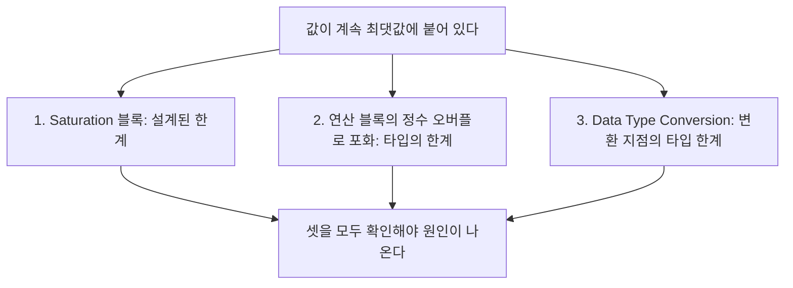

> **기준 출처:** [MathWorks Data Type Conversion](https://www.mathworks.com/help/simulink/slref/datatypeconversion.html) · Saturation과 Saturation Dynamic과 Data Type Duplicate 레퍼런스 · About Data Types in Simulink 문서 · Fixed-Point Designer의 Rounding Modes와 Overflow Handling / 확인일 2026-08-07
> **시리즈:** [목차](/posts/00-mp-series/) | 이전 → [05. 신호 라우팅과 버스](/posts/05-signal-routing-bus/) | 다음 → [07. 상태를 가진 블록과 Data Store](/posts/07-stateful-blocks-datastore/)

선행으로 [MATLAB 03편](/posts/03-cast-overflow-saturation/)을 보면 개념 쪽이 정리돼 있다.

## 1. 신호 타입은 어떻게 정해지는가

대부분의 블록은 출력 타입 파라미터가 상속으로 되어 있다. 입력이나 문맥에서 타입을 받아온다는 뜻이다.

| 설정 | 의미 |
| --- | --- |
| Same as input | 입력과 같은 타입 |
| Inherit via internal rule | Simulink가 연산 특성과 설정을 보고 정한다 |
| Inherit via back propagation | 뒤쪽, 곧 출력이 연결된 곳에서 역전파로 받아온다 |
| Inherit from Constant value | Constant 블록에서 값 표현식의 타입을 쓴다 |
| `single`이나 `uint16` 등 | 명시적으로 고정한다 |

상속은 편리하지만 모델의 어느 한 곳을 바꾸면 멀리 떨어진 신호의 타입이 조용히 따라 바뀐다. 포트나 저장소나 통신 값처럼 인터페이스에 해당하는 신호는 타입을 명시적으로 고정하는 편이 안전하다.

타입은 컴파일 단계에서 결정된다. 시뮬레이션을 시작하면 먼저 컴파일 단계가 돌면서 전체 신호의 타입을 확정하고, 그래서 타입이 맞지 않는다는 오류가 실행 전에 나온다. 확정된 타입은 모델에서 데이터 타입 표시 옵션을 켜서 보거나 프로그래밍 방식으로 조회한다.

```matlab
get_param(blk, 'CompiledPortDataTypes')     % 컴파일된 상태에서만 유효하다
```

## 2. Data Type Conversion

타입을 명시적으로 바꾸는 블록이고 파라미터가 세 개인데 셋 다 결과를 바꾼다.

Output data type이 목표 타입이다. `uint16`이나 `single`이나 `boolean`이나 `fixdt(...)` 등을 지정한다.

Input and output to have equal이 가장 중요한 파라미터다.

| 설정 | 보존하는 것 | 대응하는 MATLAB |
| --- | --- | --- |
| Real World Value | 값, 곧 크기 | `cast` |
| Stored Integer | 저장된 정수 패턴 | `typecast`에 가깝다 |

정수 타입끼리만 다룰 때는 두 설정의 차이가 잘 드러나지 않지만 고정소수점 신호에서는 결과가 완전히 달라진다. Real World Value는 스케일을 반영해 실제 값을 유지하고 Stored Integer는 스케일을 무시하고 비트만 옮긴다. 기본값은 Real World Value이고 일반적인 신호 변환은 이쪽이다.

Integer rounding mode는 실수를 정수로 바꿀 때의 반올림 방식이다.

| 설정 | 동작 | 대응 |
| --- | --- | --- |
| `Floor` | 아래로, 음의 무한 방향 | `floor`이고 생성 코드에서 가장 효율적이다 |
| `Ceiling` | 위로, 양의 무한 방향 | `ceil` |
| `Round` | 가장 가까운 정수, 0.5는 0에서 먼 쪽 | `round` |
| `Nearest` | 가장 가까운 정수, 0.5는 양의 무한 쪽 | |
| `Zero` | 0 방향 버림 | `fix`이고 C의 캐스트와 같다 |
| `Simplest` | 코드가 가장 단순해지는 방식을 자동 선택한다 | |

설정에 따라 결과가 1씩 달라진다. 특히 `Zero`와 `Floor`는 음수에서만 갈리므로 양수 테스트만으로는 차이가 드러나지 않는다.


_세 줄 모두 입력이 -2.5로 같고 블록 아이콘도 똑같이 보이는데 결과는 -3과 -2와 -3이다. 위가 `Floor`로 -3, 가운데가 `Zero`로 -2이며 이것이 C의 캐스트와 같은 값이고, 아래가 `Round`로 -3이다. 그림에 드러나지 않는 파라미터 하나가 값을 바꾼다. 입력이 +2.0이었다면 셋이 모두 같아 차이가 숨는다._

Saturate on integer overflow 체크박스가 범위를 넘을 때의 동작을 정한다.

| 체크 | 범위를 넘으면 |
| --- | --- |
| 체크함 | 포화한다. 최댓값이나 최솟값에 고정된다 |
| 체크 안 함 | 순환한다. 비트가 잘려 반대편으로 넘어간다 |

제어 시스템에서는 대체로 포화가 안전하다. 순환은 큰 양수가 갑자기 0 근처로 떨어져 지령이 급변하기 때문이다.

다만 포화 처리는 생성 코드에 비교와 분기를 추가하므로 실행 시간과 코드 크기가 늘어난다. 값이 범위를 넘지 않음을 설계로 보장할 수 있는 자리에서는 해제하기도 하는데, 그 보장이 문서로 남아 있어야 한다는 것이 조건이다.


_입력은 둘 다 300이고 출력 타입도 둘 다 `uint8`이며 블록 아이콘도 똑같은데 결과는 255와 44다. 위는 포화가 체크돼 최댓값 255에 고정되고 아래는 해제돼 순환하여 300에서 256을 뺀 44가 된다. 300이라는 큰 값이 44라는 작은 값으로 떨어진 것이 순환의 위험이다. 두 블록을 그림으로 구별할 방법이 없고 파라미터를 조회해야 안다._

## 3. Saturation

Data Type Conversion의 포화가 타입의 한계에서 일어나는 것이라면 Saturation 블록은 설계자가 정한 한계를 적용한다.

| 파라미터 | 의미 |
| --- | --- |
| Upper limit | 상한 |
| Lower limit | 하한 |
| Treat as gain when linearizing | 선형화 시 처리 방식 |

MATLAB으로 쓰면 `y = min(max(u, lower), upper);`다.

Saturation Dynamic은 상한과 하한을 파라미터가 아니라 신호로 받아서 입력이 세 개가 된다. 운전 조건에 따라 한계가 달라지는 경우에 쓴다.


_위는 Saturation 블록이고 입력 150이 상한 100에 걸려 100이 나온다. 블록 아이콘의 꺾인 선이 포화 특성을 나타낸다. 아래는 Saturation Dynamic이고 입력이 세 개로 위에서부터 상한과 신호와 하한 순서이며 결과는 50이다. 두 블록 모두 MATLAB의 `min(max(u, lo), hi)`와 같은 일을 하고 차이는 한계가 고정인가 신호인가뿐이다._

같은 모델 안에서 값이 잘리는 지점이 여러 곳일 수 있다.



Saturation 블록만 확인하고 원인을 못 찾는 경우가 여기서 나온다.

## 4. Data Type Duplicate

입력들이 모두 같은 타입인지 검사하는 블록이다. 출력 포트가 없어서 값을 만들지 않고, 타입이 다르면 컴파일 단계에서 오류를 낸다. 어느 하나의 타입이 정해지면 나머지도 그 타입으로 전파된다.

이 신호들의 타입은 서로 같아야 한다는 설계 의도를 모델에 명시하는 장치다. 실행에 관여하지 않으므로 처음 보면 용도를 알기 어렵지만, 상속 설정이 많은 모델에서 타입이 조용히 갈라지는 것을 막는 안전장치 역할을 한다.

관련 블록으로 Data Type Propagation이 있고 참조 신호들의 타입에서 규칙에 따라 타입을 계산해 전파한다.

## 5. boolean 신호

Simulink의 `boolean`은 MATLAB의 `logical`에 대응한다. Relational Operator와 Logical Operator의 기본 출력 타입이고, 모델 설정에서 `double`로 취급하도록 바꿀 수 있으나 임베디드 모델에서는 `boolean`을 유지하는 것이 메모리와 코드 측면에서 유리하다. 정수 신호를 `boolean`으로 변환하면 0은 거짓이고 그 외는 참이 된다.

## 6. 읽을 때 확인할 파라미터

```matlab
get_param(blk, 'OutDataTypeStr')                % 출력 타입 설정
get_param(blk, 'RndMeth')                       % 반올림 방식
get_param(blk, 'SaturateOnIntegerOverflow')     % 포화 여부
get_param(blk, 'ConvertRealWorld')              % RWV 인가 SI 인가
get_param(blk, 'LockScale')                     % 스케일 고정 여부
```

이 다섯 항목은 블록 그림에 나타나지 않으면서 값을 바꾼다. 모델 분석 문서에는 반드시 기재한다.

## 7. 자주 발생하는 문제

| 증상 | 확인 순서 |
| --- | --- |
| 값이 최댓값에 붙어 있다 | Saturation 블록, 연산 블록 포화 설정, Data Type Conversion 순으로 본다 |
| C로 옮겼더니 1씩 다르다 | `RndMeth`가 `Zero`인지 `Floor`나 `Round`인지 확인한다 |
| 음수에서만 결과가 다르다 | 반올림 방식이 `Floor`와 `Zero` 중 무엇인가 |
| 큰 값이 갑자기 작아진다 | 포화가 아니라 순환이 일어났다. 오버플로 포화가 해제돼 있다 |
| 어디선가 `double`로 승격된다 | Constant 값 표현식에 타입이 없거나 상속 규칙이 internal rule이다 |
| 고정소수점 값이 이상하다 | Data Type Conversion이 SI 모드인가 RWV 모드인가 |

## 정리

- Simulink 신호 타입은 대부분 상속으로 정해지고 컴파일 단계에서 확정된다.
- 인터페이스 신호는 타입을 명시적으로 고정하는 편이 안전하다.
- Data Type Conversion의 RWV와 SI 설정은 값 보존과 비트 보존을 가른다.
- 반올림 방식이 결과를 1씩 바꾼다. C의 캐스트에 해당하는 것은 `Zero`다.
- 오버플로 포화 해제는 순환을 뜻하고 제어에서는 대체로 위험하다.
- 값이 잘리는 지점은 Saturation 블록과 연산 포화와 타입 변환 셋이다.
- Data Type Duplicate는 값을 만들지 않고 타입이 같아야 함을 강제한다.

## 확인 문제

1. Inherit via back propagation이 무엇을 뜻하며 왜 추적이 어려운지 설명하라.
2. Data Type Conversion의 RWV와 SI를 각각 MATLAB 함수에 대응시켜라.
3. 값이 계속 최댓값에 붙어 있다는 증상에서 확인해야 할 세 지점을 쓰라.
4. Data Type Duplicate 블록에 출력 포트가 없는 이유를 설명하라.

## 참고

- [MathWorks — Data Type Conversion](https://www.mathworks.com/help/simulink/slref/datatypeconversion.html)
- MathWorks Simulink — Saturation, Data Type Duplicate 레퍼런스