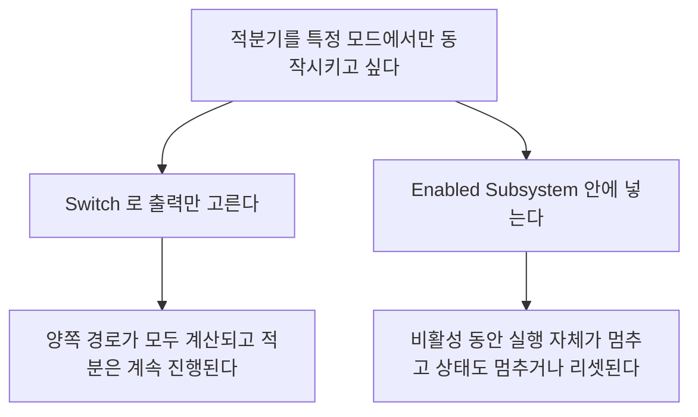

> **기준 출처:** [MathWorks Subsystems](https://www.mathworks.com/help/simulink/subsystems.html) · Conditionally Executed Subsystems and Models · Model References와 Variant Systems와 Subsystem Reference · S-Function Basics / 확인일 2026-08-07
> **시리즈:** [목차](/posts/00-mp-series/) | 이전 → [07. 상태를 가진 블록과 Data Store](/posts/07-stateful-blocks-datastore/) | 다음 → [09. 샘플 시간과 솔버](/posts/09-sample-time-solver/)

## 1. 이 글의 범위

모델을 계층으로 나누는 수단과 특정 조건에서만 실행되는 계층을 다룬다. 큰 모델에서 무엇이 언제 실행되는가를 결정하는 층이다.

## 2. Subsystem

여러 블록을 하나로 묶어 계층을 만들고 안쪽의 Inport와 Outport가 바깥에서 보이는 포트가 된다.

중요한 성질이 있다. 기본 Subsystem은 가상이다. 실행 관점에서는 계층이 없는 것과 같고 안쪽 블록들이 바깥 블록들과 섞여 실행 순서가 정해진다. 묶음은 보기 좋게 정리하는 수단일 뿐이다.

`Treat as atomic unit`을 체크하면 원자적 서브시스템이 된다.

| | 가상 Subsystem | Atomic Subsystem |
| --- | --- | --- |
| 실행 | 안쪽 블록이 바깥과 섞여 실행된다 | 한 덩어리로 실행된다 |
| 생성 코드 | 흩어질 수 있다 | 하나의 함수로 만들 수 있다 |
| 샘플 시간 | 블록마다 다를 수 있다 | 하나로 지정할 수 있다 |
| 조건부 실행 | 불가하다 | 가능하다 |

조건부 실행은 원자적이어야만 성립한다. 이 덩어리를 실행하거나 말거나를 정하려면 덩어리의 경계가 실행상 의미를 가져야 하기 때문이다.

Subsystem Reference는 서브시스템을 별도 `.slx` 파일로 저장해 여러 곳에서 재사용하는 방식이다. 파일 하나를 고치면 참조하는 모든 자리에 반영된다. Model Reference와 달리 별도로 컴파일되지 않고 상위 모델에 인라인된 것처럼 동작한다.

## 3. 조건부 실행 서브시스템

Enabled Subsystem은 Enable 포트가 추가되고 그 신호가 참인 동안에만 안쪽이 실행된다. Enable 포트 블록의 파라미터는 States when enabling이다.

| 설정 | 다시 활성화될 때 |
| --- | --- |
| `held` | 상태를 그대로 유지한다 |
| `reset` | 상태를 초기값으로 되돌린다 |

이 설정이 안쪽의 Unit Delay나 적분기 등 상태 블록의 동작을 결정한다. 두 설정은 완전히 다른 시스템을 만든다. 비활성 동안의 출력은 Outport 블록의 Output when disabled 파라미터로 정하고 마지막 값을 유지하거나 초기값으로 되돌린다.

Triggered Subsystem은 Trigger 포트가 추가되고 트리거 신호에 엣지가 발생한 순간에만 한 번 실행된다.

| Trigger type | 실행 시점 |
| --- | --- |
| `rising` | 상승 엣지 |
| `falling` | 하강 엣지 |
| `either` | 양쪽 엣지 |
| `function-call` | 함수 호출 신호를 받았을 때 |

`function-call`은 Stateflow 차트나 Function-Call Generator나 S-Function 등 다른 블록이 명시적으로 호출할 때 실행된다. 실행 시점을 로직이 직접 지정할 수 있어 이벤트 구동 구조를 만들 때 쓴다.


_위에서부터 Subsystem과 Enabled Subsystem과 Triggered Subsystem과 Model Reference다. 차이는 블록 위에 붙은 작은 기호로 드러난다. Enabled는 위쪽에 갈고리 모양의 enable 포트가, Triggered는 엣지 모양의 trigger 포트가 붙고 기본 Subsystem에는 아무것도 없다. Model Reference는 안쪽이 별도 파일이므로 블록을 열면 새 창에서 다른 모델이 뜬다._

두 조건을 모두 만족할 때 실행되는 Enabled and Triggered Subsystem도 있다.

Switch와의 차이가 중요하다.



| | Switch | 조건부 서브시스템 |
| --- | --- | --- |
| 계산 | 양쪽 경로가 모두 계산된다 | 선택되지 않은 쪽은 실행되지 않는다 |
| 상태 | 양쪽 상태가 모두 갱신된다 | 비활성 쪽 상태는 멈추거나 리셋된다 |
| 실행 시간 | 일정하다 | 조건에 따라 달라진다 |

상태를 가진 로직을 조건에 따라 멈추려면 Switch로는 되지 않고 조건부 서브시스템이 필요하다.

여러 조건부 서브시스템의 출력을 하나로 합칠 때는 Merge를 쓰고, 동시에 두 개 이상이 실행되면 안 된다는 전제가 있다. [05편](/posts/05-signal-routing-bus/)에서 다뤘다.

## 4. Model Reference

별도의 `.slx` 모델을 블록처럼 참조한다. 블록 종류 이름은 `ModelReference`다.

| | Subsystem | Model Reference |
| --- | --- | --- |
| 파일 | 상위 모델 안에 있다 | 별도 `.slx` 파일이다 |
| 컴파일 | 상위와 함께 한다 | 독립적으로 컴파일되어 캐시된다 |
| 재사용 | 복사하거나 라이브러리로 쓴다 | 참조한다 |
| 인터페이스 | 느슨하다 | 엄격하다. 포트 타입과 차원과 샘플 시간이 확정돼야 한다 |
| 팀 작업 | 파일 충돌이 발생한다 | 파일이 분리되어 병렬 작업이 가능하다 |

Model Reference를 쓰면 시뮬레이션 캐시(`.slxc`)와 시뮬레이션 타깃과 `slprj/` 중간 산출물 폴더가 만들어진다. 이 파일들은 생성물이므로 지워도 다시 만들어지지만 재생성에 시간이 걸린다.

분석할 때 주의할 점이 있다. Model Reference 안의 블록은 별도 모델이라 상위 모델의 블록 목록에 나오지 않는다. 모델 전체를 세려면 참조 트리를 먼저 확정해야 한다.

```matlab
[refs, ~] = find_mdlrefs(topModel);     % 참조 트리에 속한 모델 목록
```

현재 열려 있는 모델을 기준으로 세면 안 된다. 열려 있는 모델은 작업 상황에 따라 달라지므로 같은 대상을 세어도 회차마다 개수가 달라진다. 참조 트리로 대상을 고정해야 재현된다.

## 5. Variant Subsystem

하나의 자리에 여러 구현을 두고 조건에 따라 하나만 활성화하는 구조다. 활성 선택은 변형 조건으로 정해지고 컴파일 시점이나 실행 시점에 결정된다.

비활성 변형의 블록은 일반적인 조회에서 제외된다. `find_system`에 `MatchFilter`로 `allVariants`를 줘야 전부 보인다. [01편](/posts/01-reading-simulink-models/)에서 다뤘다.

조건부 실행과 목적이 다르다. 조건부 실행은 실행 시점의 켜고 끄기이고 Variant는 구성 선택이다.

## 6. 주석 처리

블록을 삭제하지 않고 실행에서 제외한 상태다.

| 상태 | 의미 |
| --- | --- |
| Commented through | 입력을 출력으로 통과시키며 블록 자체는 실행하지 않는다 |
| Commented out | 완전히 제외한다 |

주석 처리된 블록도 모델의 일부다. 삭제된 것이 아니므로 파일 안에 남아 있고 나중에 되살아날 수 있다. 그런데 `find_system`의 기본값은 이들을 조용히 제외한다.

주석 처리된 컨테이너 하나를 빠뜨리면 그 아래의 모든 하위 블록이 통째로 보이지 않게 된다. 조회 시 `IncludeCommented`를 `on`으로 반드시 준다.

## 7. S-Function

C나 C++나 MATLAB으로 직접 작성한 블록이다. 표준 블록으로 표현하기 어려운 하드웨어 드라이버나 외부 라이브러리 호출이나 특수 알고리즘에 쓴다.

내부 동작이 다이어그램에 드러나지 않으므로 소스 코드나 문서를 봐야 한다. 모델을 분석할 때는 S-Function을 경계로 취급하고 그 입출력 계약, 곧 포트 개수와 타입과 샘플 시간만 기록하는 것이 현실적이다.

## 정리

- 기본 Subsystem은 가상이며 실행 관점에서는 계층이 없는 것과 같다.
- 조건부 실행은 Atomic Subsystem에서만 성립한다.
- Enabled Subsystem의 States when enabling 설정이 상태 블록의 동작을 결정한다.
- Switch는 계산을 막지 못한다. 상태를 멈추려면 조건부 서브시스템을 쓴다.
- Model Reference는 별도 파일이며 독립 컴파일된다. 내부 블록은 상위 목록에 나오지 않는다.
- 참조 트리는 `find_mdlrefs`로 고정한다. 열려 있는 모델을 기준으로 세지 않는다.
- Variant의 비활성 분기와 주석 처리된 블록은 기본 조회에서 조용히 빠진다.
- S-Function은 분석의 경계이고 입출력 계약만 기록한다.

## 확인 문제

1. 가상 Subsystem과 Atomic Subsystem의 실행상 차이를 설명하라.
2. 적분기를 특정 모드에서만 동작시키려 할 때 Switch로는 안 되는 이유를 쓰라.
3. Enabled Subsystem의 States when enabling이 `held`일 때와 `reset`일 때 동작이 어떻게 달라지는가.
4. 모델 전체의 블록 수를 셀 때 열려 있는 모델을 기준으로 삼으면 안 되는 이유를 쓰라.

## 참고

- [MathWorks — Subsystems](https://www.mathworks.com/help/simulink/subsystems.html)
- MathWorks Simulink — Conditionally Executed Subsystems, Model References, Variant Systems